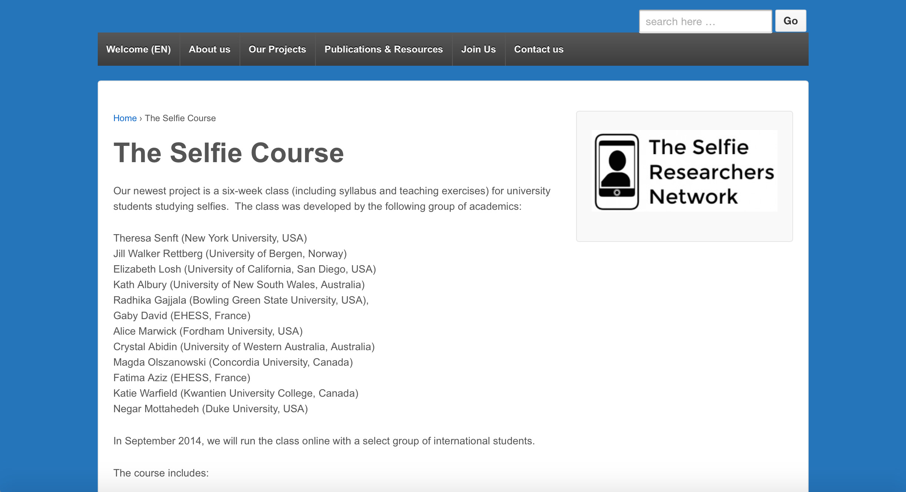
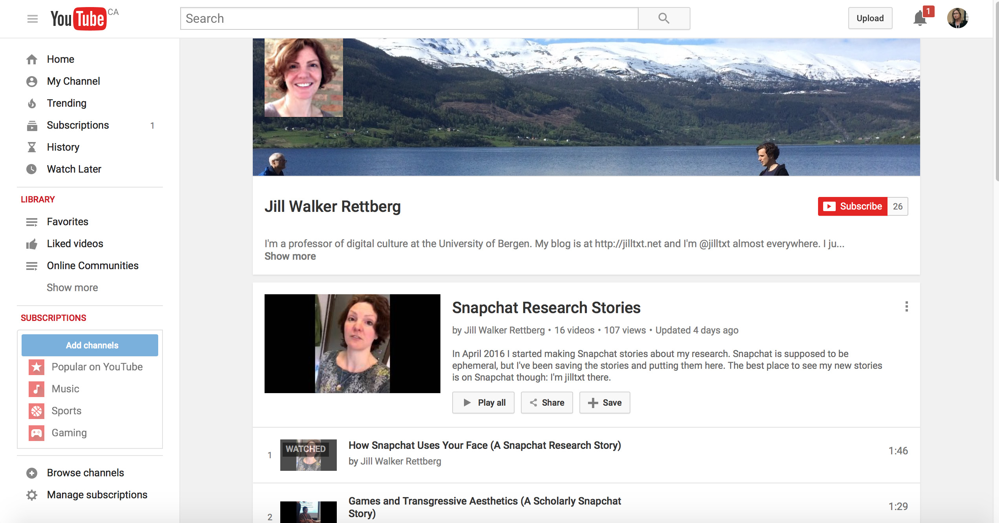
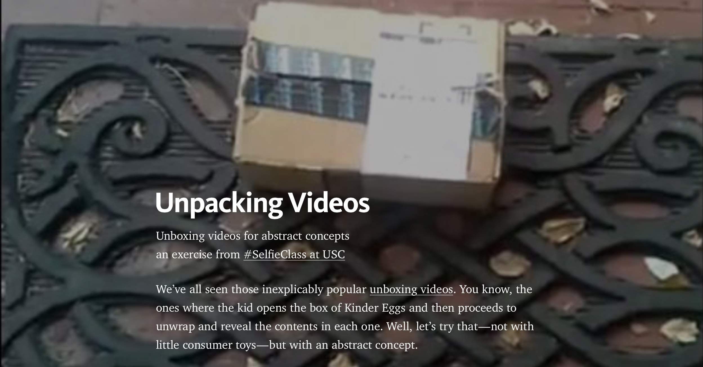
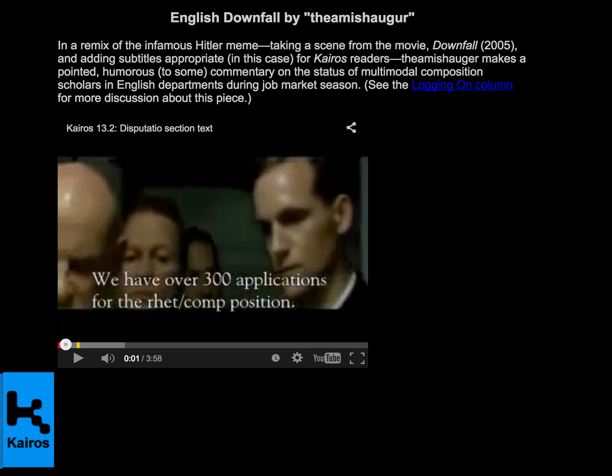
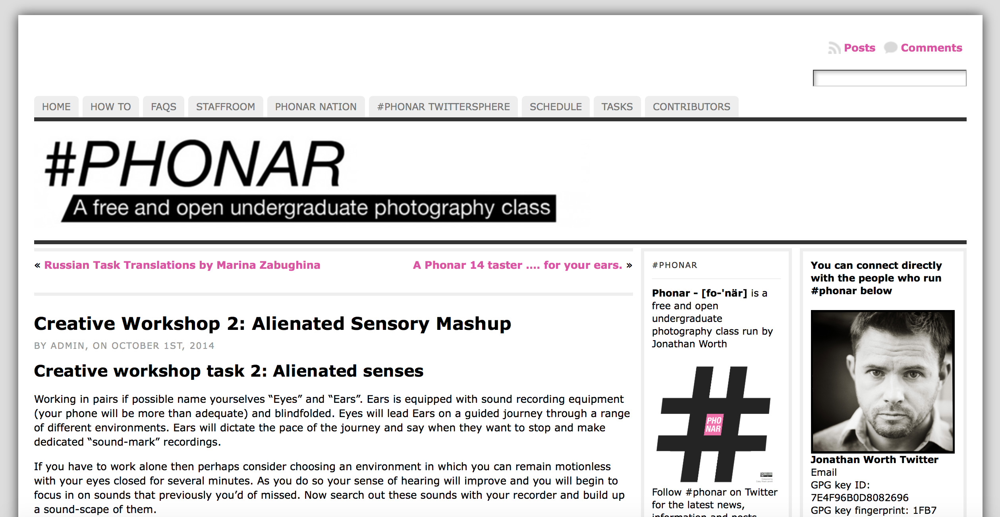
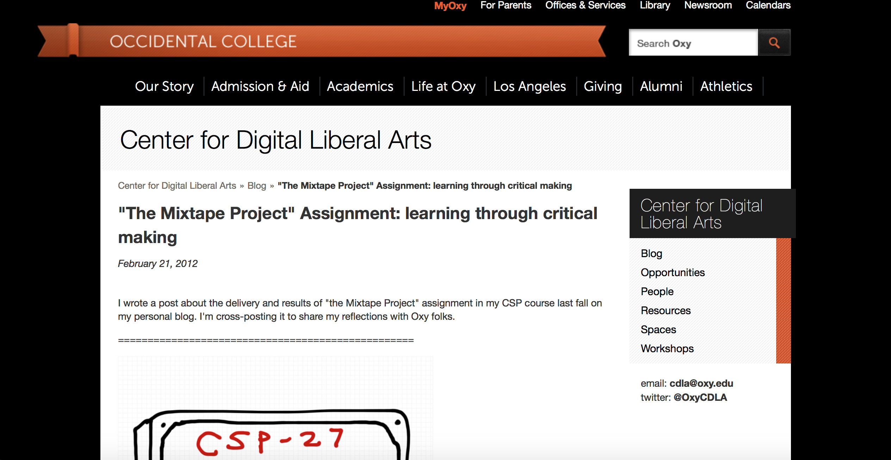
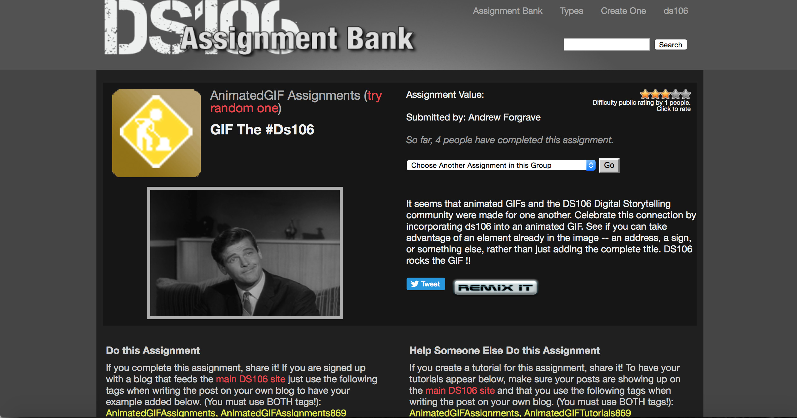
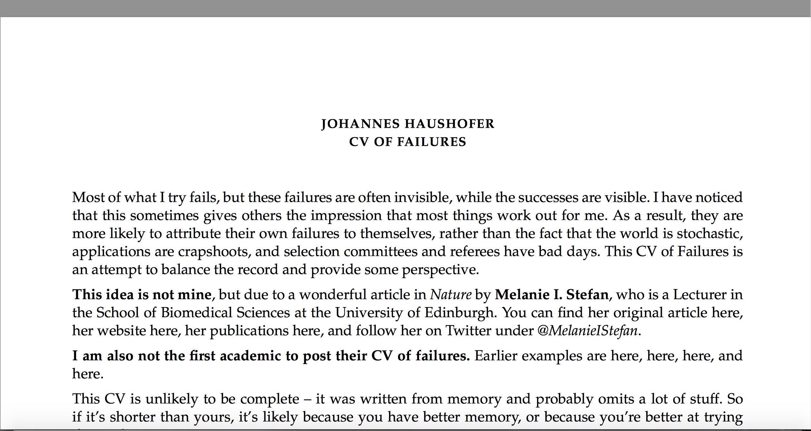
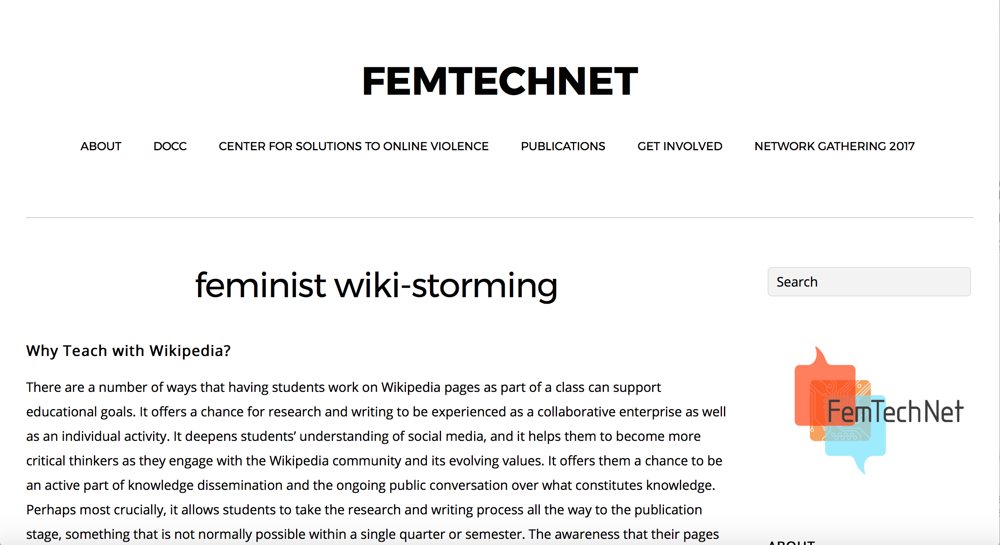

# AFFECT (Draft)

## Elizabeth Losh
William and Mary | [Website](http://lizlosh.com)

---
### Publication Status:

* unreviewed draft
* **draft version undergoing editorial review**
* draft version undergoing peer-to-peer review 
* published 

--- 

## CURATORIAL STATEMENT 
Many scholars now use the word "affect" to describe feelings of attraction or revulsion rather than the word "emotion." In the context of face-to-face pedagogy, teachers are supposed to be attuned to the "mood" of the classroom or to the campus "climate." However, affect may often seem to float free from the control of the supposedly autonomous liberal subject, far away from the manageable dictates of individual agency or grasp. Although digital learning environments are supposed to be rationalized spaces, where the tools of data analytics should allow instructors and administrators to assess, track, and manage students more objectively, in practice they are often sites of heightened feelings.    

Among affect theorists, attention to the scene of learning is growing. For example, Lauren Berlant's Cruel Optimism observes that the substitute teacher is a key character of affective investment.  In "Desiring Recognition, Accumulating Affect," educational researcher Megan Watkins observes that while “recognition” is often associated with “’a positive process with the elicitation of positive affects," it "can also function in a negative way, carrying the resultant force of negative affects" (273). 

How can instructors meaningfully engage with exploring questions of affect while still maintaining their positions of authority, fairness, and expertise? Obviously no one wants a student crying in office hours or a lecture hall audience laughing at the unintended humor of a faculty performance. Yet work with affect in student-teacher relations is obviously important. Researchers who study embodied cognition see affect as central to how students may perceive their educational experiences. Studies of the limbic system in the brain indicate that there may be complex and powerful interactions that could be better capitalized upon by instructors of literature and language to recognize how fight-or-flight responses, emotion, learning, and memory may be interrelated. Traditionalists in the profession who are wary of the scientism of neurobiology may be nonetheless mindful that considerations of "sensibility" have long been extremely important in the English literary tradition, beginning with eighteenth-century theories of sense perception and sentiment. Humanists have good reasons to be cautious about embracing explanations that biologize cultural expression, but affect should be seen as central to interpreting language and literature. After all, the genres of melodrama, suspense, or erotica are intertwined with attitudes about bodily response.

For example, students could be invited to use Facebook's recent expansion of the "like" button to include a range of emoticons -- including "love," "haha," "wow," "sad," and "angry" "to comment on how their learning situation is designed. Do they like the windows in the classroom?  Do they like the clock? Do they like the whiteboard or would they prefer a blackboard (or vice versa)? An instructor could hand out sticky notes to be affixed to objects in the classroom for this purpose.   

In analyzing literary or philosophical texts, the assigned reading could be annotated in the margin for its emotional valences.  Students could design additional emoticons that might be more appropriate for the tasks of scholarly interpretation.  For example, a face with a raised eyebrow might convey skepticism, or a face with a barely perceptible smile might convey appreciation of subtle wit.  

Exercises like these are simple to implement, but pedagogical labor around affect entails risk, particularly when feelings about feelings on campus are running high. Videos on YouTube tagged with affective terms like "angry student" or "angry professor" may receive hundreds of thousands of views. There are robust discussions about providing "trigger warnings" for content that might unleash uncontrollable grief within vulnerable students and about avoiding "microagressions" that might slight students from underrepresented groups.  Managing unmanageable emotions can be tricky, particularly for those without adequate training, compensation, or administrative support to invest in their interpersonal relationships in students. 

An influential 2014 Gallup poll of over 30,000 college graduates indicates that affective engagements are extremely important for how former students gauge the value of their undergraduate experiences in later life.  In reflecting on what made attending college worthwhile, having a professor "who made me excited about learning," "who cared about me as a person," or "who encouraged me to pursue my goals and dreams" were all seen as critical indicators of support. Stock photos of college enrollees intended for brochures and websites inevitably show smiling and attentive faces as the ideal, but unfortunately many instructors don't see enough evidence that their motivating, caring, and mentoring matters. Instructors talk about the "flat affect" of students who seem unable or unwilling to engage.  Of course, these students may be like Mike Rose's classroom stoics who "just wanna be average" to avoid unwanted attention and are laying emotionally low for the class hour because they have trained themselves not to feel invested.  To get students to have feelings can be hard -- and to get them to have the "right" kind of feelings can be harder. 

Affect has become an increasingly important keyword in the field of computation as well.  User testing of new technologies to promote computer-mediated communication often focuses on refining "gut reactions" of consumers to a product, as the non-cognitive aspects of positive appeals for seemingly intuitive or attractive interfaces take priority.  Frustration with the failed promises of technology can provoke particularly heightened states of negative affect, as the famous viral video of the "Angry German Kid," who is violently exasperated with his game system, demonstrates.  Rosalind Picard is frequently credited with launching the field of affective computing at MIT, although Don Norman's work on emotional design is also seen as a seminal precursor.  

Digital pedagogy must answer the call of affect, because technophilia and technophobia frequently have strong affective components. Technology is supposed to have a rationalizing influence by offering learner analytics and classroom management that quantify complex interactions, but detached logic doesn't describe how people respond to the presence of technology as an actor.  Debates about whether or not laptops should be allowed in the classroom, "Flipped classroom hate tweets," and videos in which professors destroy the laptops and mobile phones of their students -- when used improperly in class -- show deep resentments can run high.  Although campus initiatives may require that laptops or other mobile devices be distributed to first-year students, faculty frequently prohibit the uses of these very same technologies in class. As practitioners of the learning arts know, experiments with instructional technology may be either loved or hated with a passion. 

Teaching writing may require particularly intense attention to the affects of our students.  As Daniel Gross and Jonathan Alexander argue, "frameworks for success" often ignore the importance of negative emotions and the fact that many approach writing from a framework of failure.  For example, in describing the self-loathing processes of writers, Anne Lamott's lauded embracing "shitty first drafts"  in her memoir about writing Bird by Bird, and writers have encouraged other writers to kill their "darlings" for generations, starting with Arthur Quiller-Couch a century ago. 

This connection between composition and intense affects may be part of the reason that instructors of writing have a prominent position in this curated collection of digital objects about affect.  Teachers of multimodal composition may be more likely to incorporate new media platforms that solicit less filtered rapid responses -- including Snapchat, Yik Yak, and Vine -- and they may assign genres in which students attend to the nuances of facial performance and microexpressions, such as selfies. Aimée Morrison argues that digital self-portraiture can attempt to capture "the ineffable" in documenting everyday affects; her examples of online photography provide an overview of common mobile practices and genres.  She notes that Snapchat illustrates how fleeting affect offers many possible moods, while a more composed Facebook profile pictures presents more affective stability. 

Teachers offend and comfort, solicit shame and pride about student performance, worry about being liked or disliked, and manage hilarity and solemnity in the rhythms of interaction.  They also tell students to maintain neutral dispositions as scholars and writers, much as Wikipedia demands a neutral point of view from participating editors of content.  This collection offers another way to speak about the passions of reading, research, and reflection to situate the call for objectivity that instructors often require of students producing academic discourse.   

## CURATED ARTIFACTS

## ## The Selfie Course

* Artifact Type:
* Source: http://www.selfieresearchers.com/week-one-identity-and-interpellation/
* Copy of Artifact:
* Creators: 

The Selfie Course is an open access curriculum designed by a world-wide collective of a dozen scholars of Internet research.  The first unit on the syllabus, which was created by Terri Senft and Gaby David,focuses on the topic of "Identity and interpellation" and has a particularly useful ice-breaker excersive about creating self-portraits for particular audiences (dating website, corporate website, etc.) under the "Image Production Assignment" heading, which can personalize large lecture courses and make it easier to learn student names.  This unit also has a number of examples of selfie campaigns for discussion that are directly relevant to the topic of affect, such as the "Woman Laughing Selfie" meme.  It may be productive to look at other selfie memes about affect or solicit student suggestions.  As the selfie courses suggests, instructors can also discuss how affect and class or affect and race are read as interacting in the case of the #iftheygunnedmedown hashtag campaign.  Why are particular poses read as evidence of hardened affect?  

## Snapchat Research Stories

* Artifact Type:
* Source: https://www.youtube.com/playlist?list=PL46Xs2itPIMlDBL0tPfg-2WzXwZrnTePh
* Copy of Artifact:
* Creators: 

Snapchat is a mobile application that is currently used by young people for irreverant documentation of their daily lives, because the photos and videos quickly disappear and lack the gravitas of permanence.  Given its ephemerality, Snapchat may seem a strange platfom for research projects, but many Snapchat pedagogues find the spontaneity liberating and a good way for students to temporarily archive and comment on the mundane.  Jill Walker Rettberg has created a series of "Snapchat Research Stories" that can serve as models for students for how to present research using informal discourse and spontaneous reactions to unfamiliar scholarly ideas. What would it mean for students to record a Snapchat story like Rettberg's after visiting an archive, listening to a lecture, or viewing a film?  Unlike other fast-format assignments, like the Ignite-style speech, preparation can be minimal and even done as an in-class exercise. In the sample videos Rettberg jogs, walks, drinks coffee, and chats with friends while discussing theoretical concepts.  Instructors can ask students to deconstruct Rettberg's various moods in the videos as well and to consider how she uses paralinguistic communication and facial expressions as part of how she makes scholarly arguments.

## Unpacking Videos

* Artifact Type: 
* Source: https://medium.com/@markcmarino/unpacking-videos-6d86eb3b4ad0#.yi8p9l3uh
* Copy of Artifact:
* Creators:

Mark Marino is another prominent selfie pedagogue who has developed an assignment about unpacking videos that asks students to open up an abstract concept, such as "double consciousness" or "symbolic ethnicity."  He deploys the popular and banal genre of the unboxing video in which people open packages and react to the acquisition of new consumer items. In his sample Vine video Marino reacts to the arrival of "white privilege" on his doorstep.  Marino provides a synopsis of the wordless plot: "It shows up at my door even though I didn't order (or pay for) it. When I open the box, I can’t see it but put it on anyway, but when someone tries to take it, I get angry."  Here Marino shows how someone could react emotionally to a seemingly intellectual concept.  This offers an opportunity to invite students to explore their affective responses to challenging material that may destabilize their confidence in their own privilege or expertise.

## English Downfall 

* Artifact Type:
* Source: http://kairos.technorhetoric.net/13.2/disputatio/theamishaugur/index.html
* Copy of Artifact:
* Creators:

Hyperbolic emotions can also be rich material for the classroom, particularly as a way to discuss strong reactions to ideas or concepts.  "The Downfall Meme" was a popular genre of remix videos that used source material from a biopic of Hitler that showed the dictator breaking down in his bunker as he feels abandoned by military leaders.  Although the topic of the film is serious, the meltdown into rage is so dramatic that without context this German-language scene is difficult to take seriously.  Downfall meme videos cover a wide variety of subjects, ranging from Hitler responding to the subprime mortgage crisis to Hitler criticizing xBox Live.  This version of the Downfall meme depicts Hitler defending traditional English departments and was published in the peer-reviewed online journal *Kairos*.  In the case of the "Downfall" video, academic culture is parodied as irrational, because it rejects sensible contingency plans to adapt to change.  Instructors may wish to ask students how they see people in power at their campuses as emotionally invested in particular traditions.    

## Alienated Sensory Mashup

* Artifact Type:
* Source: https://phonar.org/2014/10/creative-workshop-2-alienated-sensory-mashup/
* Copy of Artifact:
* Creators:

Separating out the senses can be one way to emphasize differences of affect to enrich classroom discussion.  This creative workshop from #PHONAR, a free and open undergraduate course designed by Jonathan Worth, asks students to create both a "landscape story" and a "soundscape story."  By generating two different kinds of narratives, you can ask students how different sensory information might produce different affects.  To demonstrate this point before completing the assignment, instructors can screen a scene in a film and ask students to attend to differences between the visual and the aural messages.

## "The Mixtape Project" Assignment: Learning through Critical Making

* Artifact Type:
* Source: http://www.oxy.edu/center-digital-liberal-arts/blog/mixtape-project-assignment-learning-through-critical-making
* Copy of Artifact:
* Creators:

Music can be a good way to present the modulation of affect to students and even to create a special temporal occasion in the classroom.  For example, playing music appropriate to the theme of a lecture can be a good way to set the mood in the room.  Or it can be useful to ask students to create playlists as a way to summarize course materials.  This explanation of a mixtape assignment from Occidental's Center for Digital Arts asks students to "define a theme" that is "related to genre, canon, place, time period, and/or the social contexts (race, ethnicity, gender, sexuality) in which musical events take place."  Students must produce carefully crafted "liner notes" in lieu of a research paper in a rigorously scaffolded project that includes an abstract and an oral presentation.  Students can create similar playlists of short works that are already prized by cultural creators (poems, paintings, etc.).  Why to curators structure the rhythm of affect so intentionally? 

## GIF Assignment for DS 106

* Artifact Type:
* Source: http://assignments.ds106.us/assignments/gif-the-ds106/
* Copy of Artifact:
* Creators:

Like mixtapes or remix videos, gifs are a popular format for disseminating particular stances or attitudes around affect, although the format depends on looping rather than sequencing (or repetition rather than rhythm).  Often gifs are used for focusing on making faces and may feature eye-rolling, double takes, and other emotional reactions.  This exercise from the popular xMOOC Digital Storytelling 106 asks students to remix an animated course number with a gif, which can be a good way for students to identify what they see as salient about a course and how others might react to it. (DS 106 was part of the Connected Courses initiative, which is another useful place to think about digital pedagogy.)  

## Lemonade Syllabus  

* Artifact Type:
* Source: http://candicebenbow.com/lemonadesyllabus/
* Copy of Artifact:
* Creators: 

A syllabus is generally seen as a bureaucratic cut-and-dried legalistic document that is intended to establish course expectations.  In contrast, music videos  incorporate sound and imagery and use rhetorical power to tug at the audience's heartstrings.  The Lemonade Syllabus combines material relevant to the album released by popular singer Beyonce with a demanding reading list on intersectional black feminism, next to which the student is encouraged to take notes.  This syllabus is a particularly fitting choice for affect studies, given sections devoted to inspiration and religion and readings covering "pain," "joy," and "depression" in a section on "Historical & Cultural Studies." However, Lemonade pedagogy is not without controversy, as bell hooks critique of the commodification of black pain indicates.

## [CV of Failure

* Artifact Type:
* Source: https://www.princeton.edu/~joha/Johannes_Haushofer_CV_of_Failures.pdf
* Copy of Artifact:
* Creators: 

This document created by a successful Princeton professor also mixes neutral and emotional genres.  The topic of failure is often an important one in digital pedagogy, and more attention to failure or encouragement to explore failure has been advocated for by Mark Sample, David Parry, and others.  Instead of asking students to complete a CV of failure, it may be more useful to assign a resume of failure, where you ask them to list all the things they applied for in areas normally alloted for "education," "work experience," and "activities."

## Wikistorming

* Artifact Type:
* Source: http://femtechnet.newschool.edu/wikistorming/
* Copy of Artifact:
* Creators:

Although challenging, editing Wikipedia can provide a very rewarding class assignment.  This group of pedagogical online materials about editing Wikipedia as a class project includes sample assignments, instructional videos, and many other resources.  The challenge to students accustomed to the genre of the five-paragraph theme is to adapt to Wikipedia's policies about avoiding individual research or expressing a point of view.  As students work on their Wikipedia editing projects, you can direct discussion about the value presenting Wikipedia as an affect-free space and point to where "Talk" pages allow for more uninhibited venting.    

## RELATED MATERIALS

Burvall, Amy.  "Flat Iron Pedagogy: Affective Data Meets Differentiation." AmusED. N.p., 10 Apr. 2014. Web. 16 May 2016. 

Behrens, M. M. "Swipe "˜I Like': Location Based Digital Narrative through Embedding the "˜Like' Button in the Real World." 5th International Conference on Communities & Technologies - Digital Cities 7. Brisbane, Australia. 2011. Conference item. 

Losh, Elizabeth. "Selfies, Snapchat and Distance Learning." DMLcentral. 28 Apr. 2014. Web. 22 June 2014. 

Taylor, Jessica. "New Media Studies: Losh's Selfie Pedagogy I-IV." New Media Studies. 2 Mar. 2016. Web. 16 May 2016. 

Wargo, Jon M. "Spatial Stories with Nomadic Narrators: Affect, Snapchat, and Feeling Embodiment in Youth Mobile Composing." Journal of Language and Literacy Education 11.1 (2015): 47"“64. 

## WORKS CITED

"Great Jobs Great Lives: The 2014 Gallup-Purdue Index Report," Web.

"`Hate This Flipped Class' -- a Collection of Tweets Collated 8 September 2013 by @attackcomplex." Web.

Berlant, Lauren Gail. Cruel Optimism. Durham: Duke University Press, 2011. 

Damasio, Antonio.  Descartes' Error: Emotion, Reason and the Human Brain.  Putnam, 1994.

Gross, Daniel M., and Jonathan Alexander. "Frameworks for Failure." Pedagogy 16.2 (2016): 273"“295. 

Halberstam, Jack. "You Are Triggering Me! The Neo-Liberal Rhetoric of Harm, Danger and Trauma." Bully Bloggers. 5 July 2014.  Web. 

hooks, bell.  "Moving Beyond Pain."  bell hooks Institute. 9 May 2016.  Web.

Lamott, Anne. Bird by Bird: Some Instructions on Writing and Life. New York: Anchor, 1995. 

Morrison, Aimee. "Digiwonk: Selfies." digiwonk. N.p., 29 May 2014. Web. 16 May 2016.

Norman, Donald A. Emotional Design: Why We Love (or Hate) Everyday Things. New York: Basic Books, 2004. 

Picard, Rosalind W. Affective Computing. Cambridge, Mass.: MIT Press, 1997. 

Quiller-Couch, Arthur, "On Style," On the Art of Writing. Web. 

Rose, Mike. Lives on the Boundary: The Struggles and Achievements of America's Underprepared. New York; London: Free Press"¯; Collier Macmillan, 1989. 

Sedgwick, Eve Kosofsky, and Adam Frank. "Shame in the Cybernetic Fold: Reading Silvan Tomkins." Critical Inquiry 21.2 (1995): 496"“522. 

Watkins, Megan. "Desiring Recognition, Accumulating Affect." The Affect Theory Reader. Ed. Melissa Gregg and Gregory J Seigworth. Durham, NC: Duke University Press, 2010. 

Williams, Linda. "Film Bodies: Gender, Genre, and Excess."  Film Quarterly 44.4 (1991): 2-13

