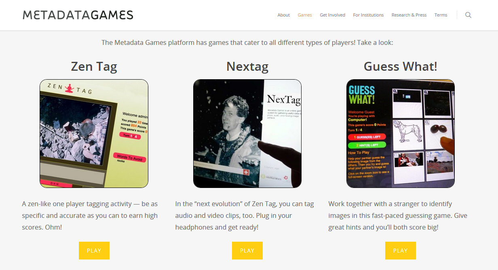
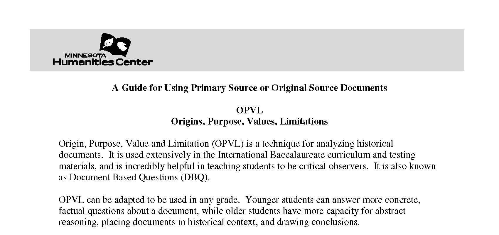
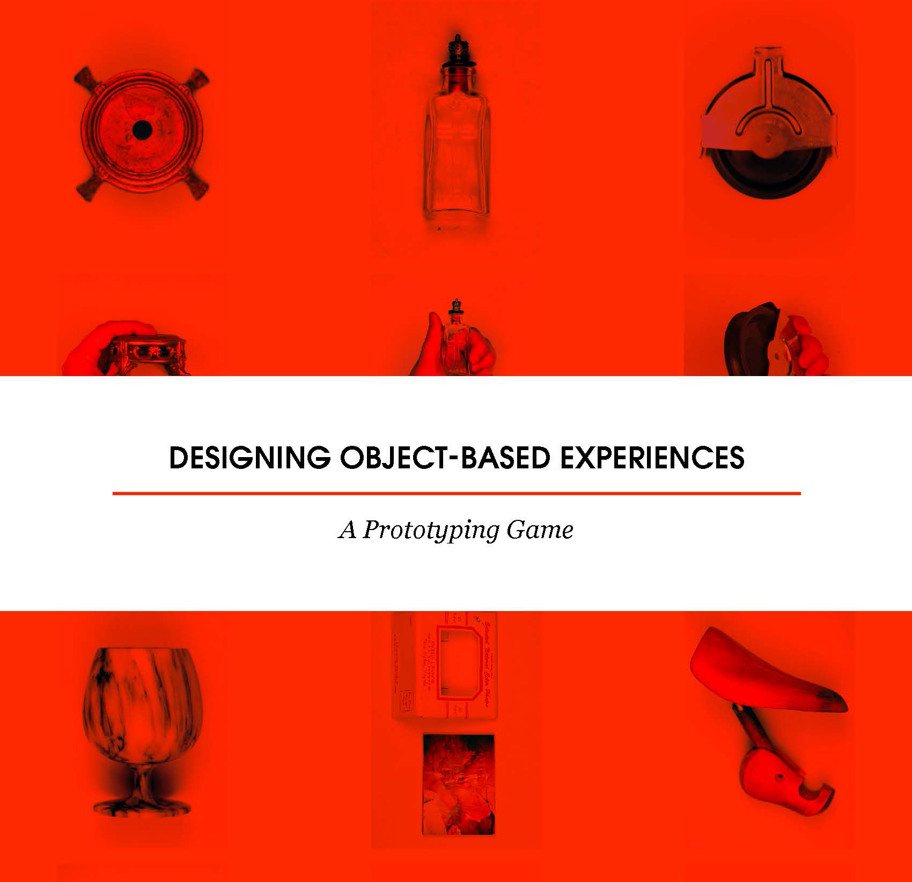
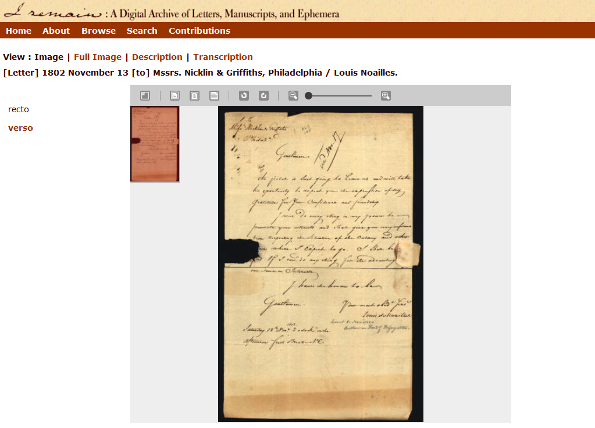
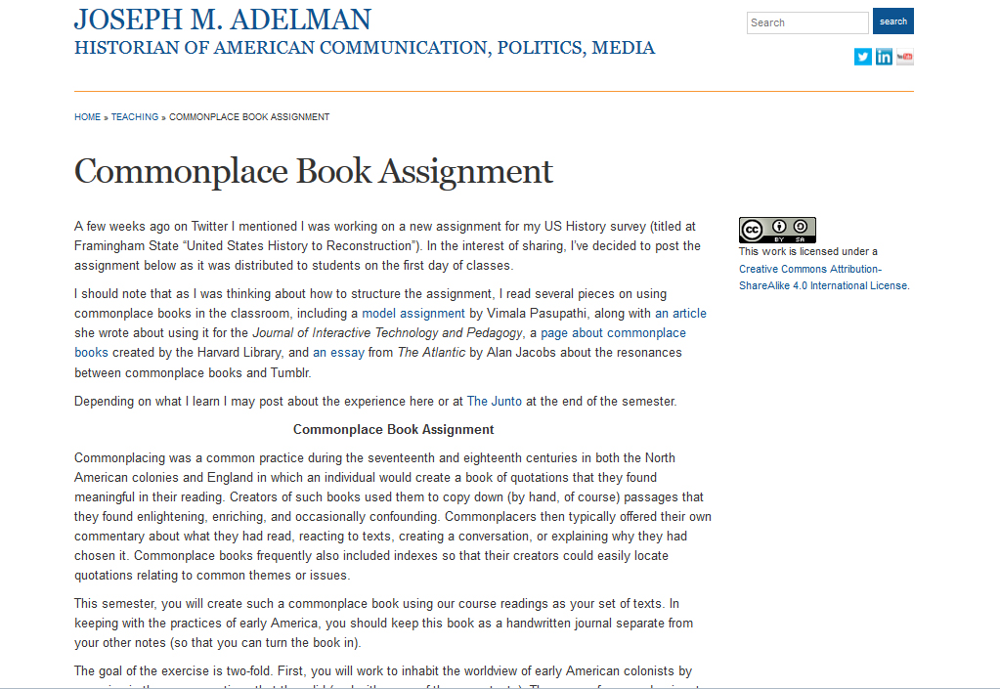
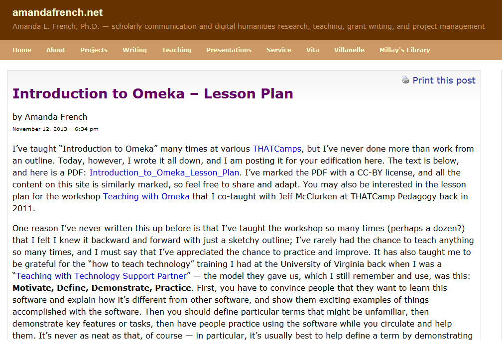
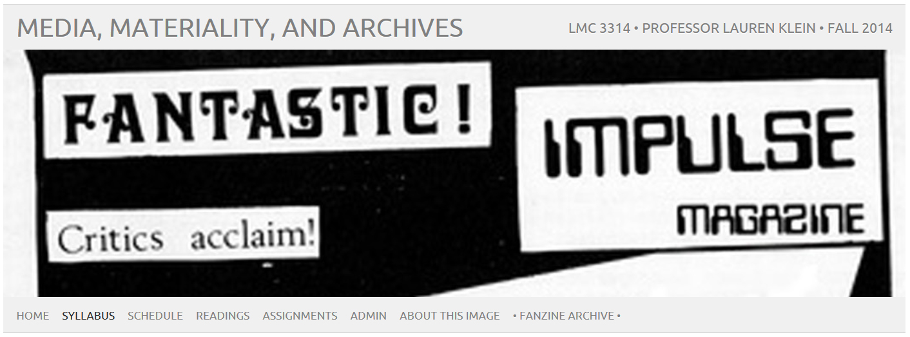
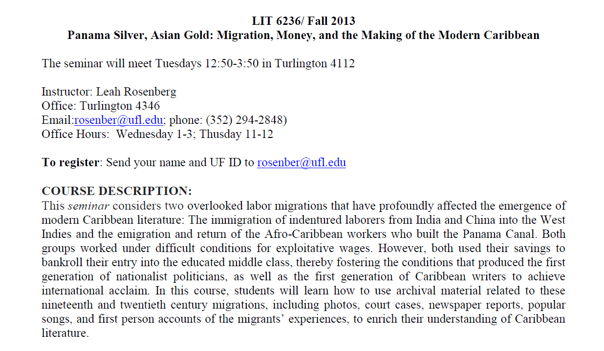

# ARCHIVE 

### Lauren Coats (LSU) and Gabrielle Dean (Johns Hopkins University)

---

##### Publication Status:
* unreviewed draft
* draft version undergoing editorial review
* draft version undergoing peer-to-peer review
* **draft version undergoing MLA copyediting**
* awaiting pre-print copy
* published  

---

### Cross-Reference Keywords: annotation, curation, labor, race, remix

--- 

## CURATORIAL STATEMENT

##### Wonder
We begin with wonder, because it is often a student’s first response to a densely annotated manuscript, a stunning comic book from a digital collection, or an early edition of a beloved novel. Such wonder is powerful, and can catalyze pedagogical engagements with the archive—a term used here in the vernacular sense, to include materials in various formats collected as traces of the present or past, rather than stricter [professional](http://journalofdigitalhumanities.org/1-2/archives-in-context-and-as-context-by-kate-theimer/) (Theimer, “Archives in Context”) or [technical](https://blogs.loc.gov/digitalpreservation/2014/02/what-do-you-mean-by-archive-genres-of-usage-for-digital-preservers/) (Owens) definitions. When students are encouraged to explore the archive, wonder propels a fundamental scholarly process: discovery. When a student is moved by an object from the archive—finding it perplexing or momentous, frightening or beautiful, marvelous or offensive—the experience itself is an eloquent indicator of the vitality of artifacts and the pull of history.

##### Mediation
Sometimes wonder is an end in itself. A more sustained classroom engagement can open up key questions about the play of cultural power that shapes individual archival materials as well as whole collections: about what gets created and preserved, by whom, and for what purposes. (See Coats and Dean, Mitchell et al, and Theimer, *Educational Programs*, for scholarship on archive- and special-collections based pedagogy.) Attending to the materiality that is at the heart of archival pedagogy highlights the construction of the cultural record. Working directly with analog and/or digital objects—manuscripts, ephemera, books, periodicals, photographs, films, tapes, digital surrogates, born-digital entities—students can attend to the ways that different mediums and technologies shape meaning, and probe the continuities and discontinuities between digital forms and their antecedents. Grappling with the relationship of form to content, students discover that the digital archive does not entail a loss of materiality but instead puts it in relief, making mediation more visible. Comparing a digitized version of an abolitionist newspaper to the print original, for example, students might assess the different material properties and conditions of each instantiation.

Such material considerations can ground further investigations of cultural formation and function: How and why was each version of the newspaper produced? Who had or has access to them, in terms of literacy and geography? What about each artifact indicates its social uses, political possibilities, or cultural values? Whether it involves analog or digital materials or both, archive-focused pedagogy fundamentally enables an analysis of media and its relation to culture.

 
##### Curation
An archive is the physical trace of value-laden actions. It represents a chain of selection decisions, policy implementations, and stewardship procedures, undertaken over and over again, in order to save particular materials from the past or present and offer them to an imagined future—or not. These processes are what make an archive; and they make an archive far from neutral. Archives, both official and lay, are assembled and arranged in ways that embody values. These values—beliefs, norms, cultural assumptions—may be explicit (as in the Society of American Archivists’ [Code of Ethics](http://www2.archivists.org/statements/saa-core-values-statement-and-code-of-ethics) (“SAA Core Values”) or implicit (as when the topical focus of a digital collection challenges or reinforces literary canons). Moreover, the values that shape an archive inflect its future use by forming points of access and interest.

Teaching with archival materials can make legible an archive’s foundational values and constituent processes. Collaborations between classroom instructors, archivists, and librarians—whether the setting is a special collections single session, a survey course, or an advanced seminar—are essential to this goal. Archivists and librarians bring a double knowledge to archive-focused pedagogy: a deep understanding of the collections they steward and expertise in the theories, systems, and techniques of archival labor. What students learn about archival principles and methods can be applied to activities in which they “practice” as archivists—performing the repertoire of actions that produce, structure, preserve, and open up a set of materials.

This practice requires them to think about the range of values archives express and contend with the ethics of curation. In constructing their own digital collections, for example, students must navigate the politics of inclusion and exclusion; they must determine what principles will guide their selections, consider how best to present and share materials, and confront practical limitations that have ethical dimensions. (See French and Marsh on digital exhibition projects and their pedagogical challenges.) From this vantage-point, they are also better equipped to analyze the selection and presentation choices others have made—how a metadata framework or digital display, for example, is informed by ideas about what or who the archive is for. Practicing as archivists, students enter into long-standing critical debates—about canonicity, for example—as participants, not simply as observers. More broadly, archival practice gives students a compelling introduction to the intellectual consequences of curation, the many choices about an object’s archival fate that determine if and how future users will see and use it.

The resources collected here exploit the affordances of digital technology to enrich teaching and learning with analog and digital archives. Organized by class-time commitment, from in-class activities to short assignments to major projects and whole classes, they facilitate critical engagement with archival materials via wonder, mediation, and curation, as described above--participatory modes that involve students in the social stakes and power dynamics of cultural heritage stewardship. Above all, we have selected teaching objects that help students enter the archive as critical thinkers, users, and makers.

## CURATED ARTIFACTS

## CURATED ARTIFACTS

### *Metadata Games*

* Artifact Type: game
* Source URL: [http://www.metadatagames.org/#games ](http://www.metadatagames.org/#games )
* Creator: Mary Flanagan (Tiltfactor Laboratory Dartmouth College), Peter Carini (Rauner Library Dartmouth College), et al
* Copy of Artifact: [files/archive-archive-metadatagames.jpg)](files/archive-metadatagames.jpg)
* Permissions: "Metadata Games is a free and open source software (FOSS) online game system"

It can be difficult to suture the sense of wonder that archives can produce to pedagogical and scholarly practice. This resource, a suite of metadata games, literally turns archival work into play. Players are asked to tag items with descriptive words or phrases; their tags feed back into the participating archives to become part of the objects’ descriptions. It’s a fun and easy way to introduce the role of metadata in digital discovery: How do you identify things in archives so that researchers can find relevant sources, and what happens to objects that lack descriptors? Follow-up conversations might address the differences between folksonomies (like the students’ tags) and controlled vocabularies, or the consequences of mistaken or false tags. An advanced version of this exercise might ask students to create their own archive games, for instance to [program a twitterbot](http://f14tot.ryancordell.org/2014/11/12/lab-12-scripting/) to remix content from a student-created or university archive.

### *A Guide for Using Primary Source or Original Source Documents: Origins, Purpose, Values, Limitations (OPVL)*

 
* Artifact Type: teaching guidelines
* Source URL: [https://www.scribd.com/document/82886994/OPVL-Minnesota-Humanities](https://www.scribd.com/document/82886994/OPVL-Minnesota-Humanities)
* Copy of Artifact: [files/archive-guideusingprimarysources.pdf)](files/archive-guideusingprimarysources.pdf)
* Creator: Minnesota Humanities Center
* Permissions: CC-BY-NC

A basic object analysis exercise can turn a student's initial wonder about an object—"what is it?"—into a foundation for further research by providing a scaffolding for observation and the pursuit of evidence. The resource models how much students can learn about an object through careful examination of its paratexts and bibliographic information. Although the "original source document" is presumed to be paper-based, the OPVL exercise is easily adapted to digital materials, just as the analog exercise can be extended by digital means, such as a class blog or online annotation tool. In our own classes, we have supplemented the exercise with specific questions about a textual object’s materiality: packaging, design, evidence of use. Teachers can find similar pedagogical resources within some digital collections, such as the [National Archives Docs Teach](http://docsteach.org/) that offers a suite of educational activities.

### *Designing Object-Based Experiences: A Prototyping Game*

* Artifact Type: game
* Source URL: [https://issuu.com/metalab4/docs/bd_game_cards](https://issuu.com/metalab4/docs/bd_game_cards)
* Copy of Artifact: [files/archive-designingobjectbasedexperiences.pdf](files/archive-designingobjectbasedexperiences.pdf)
* Creator: Ebru Boyaci, Tim Maly, Laura Mitchell, Jessica Yurkofsky, plus the entire metaLAB (at) Harvard team​ (Harvard University)
* Permissions: CC-BY-NC

What kinds of experiences can archival materials generate?  Students get to play with this question in this game, in which players stage a range of archival encounters. The game includes "object histories," with detailed information about six specific objects, and three sets of playing cards: one set that describes possible audiences (e.g., "a college student who is deaf"), one set devoted to presentation formats (e.g., "mobile app"), and one to presentation values (e.g., "shareability"). Participants draw one of each card, then "prototype an experience" with the selected object that fits the parameters. Teachers could develop their own object histories and cards to fit their course themes and media; the game could also help students brainstorm possibilities at the start of an archive- or exhibit-building assignment. The game helps students experiment with the variety of meanings artifacts can accrue through different kinds of mediation and curation.

### "Archive Project"

* Artifact Type: assignment and student work
* Source URL: [http://digital.lib.lehigh.edu/remain/con/lit376_over.html](http://digital.lib.lehigh.edu/remain/con/lit376_over.html)
* Copy of Artifact: [files/archive-archive-archiveproject.jpg](files/archive-archiveproject.jpg)
* Creator: Ed Gallagher (Lehigh University) and Meg Norcia (State University of New York - Brockport)
* Permissions:  CC-BY-NC

In this transcription exercise, students both use and build archives, which has several pedagogical outcomes. As students transcribe digital surrogates of manuscript letters, they engage in the process of remediation that raises questions about what is lost and gained when information is moved from one medium to another. As students annotate significant features of their letters, they learn how to develop a larger research project or question from a single object. Because student transcriptions are incorporated into the institutional archive, the exercise opens up issues of access, use, and public scholarship. Adaptations of this exercise as a stand-alone course transcription project might take advantage of open-source transcription tools (such as [Scripto](http://scripto.org/) or [From the Page](http://beta.fromthepage.com/)). Or, students could contribute to an extant crowdsourcing transcription project, such as University of Iowa’s [DIY History](http://diyhistory.lib.uiowa.edu/) or the [National Archives’ Transcription Challenge](http://www.archives.gov/citizen-archivist/transcribe/).

### Commonplace Book Assignment

* Artifact Type: assignment
* Source URL: [https://josephadelman.com/2014/09/04/commonplace-book-assignment/](https://josephadelman.com/2014/09/04/commonplace-book-assignment/l)
* Copy of Artifact: [files/archive-archive-commonplacebookassignment.jpg]([files/archive-archive-commonplacebookassignment.jpg)
* Creator: Joseph M. Adelman (Framingham University)
* Permissions: CC-BY-SA 4.0 

A commonplace book is a form of personal archive, a means of recording and arranging textual passages of particular value to the collector for future use. This exercise, which has students create a traditional, analog version of the commonplace book, can be productively adapted to digital platforms.  Andrew Goldstone, for instance, has a [blog-based version](http://www.rci.rutgers.edu/~ag978/355/commonplace/single.html.), and Alan Jacobs has [written](https://www.theatlantic.com/technology/archive/2012/01/commonplace-books-the-tumblrs-of-an-earlier-era/251811/) provocatively of the similarities between the commonplace book and microblogging platforms like Tumblr (Goldstone, Jacobs). Valuable as a stand-alone exercise, as a way to support attentive reading and textual analysis, it can also serve as a springboard for other activities: collection-building projects that develop principles of selection and organization, discussions of the subjective and affective aspects of archiving (Benjamin), or essay assignments that address the selected passages.

### "Introduction to Omeka: Lesson Plan"

* Artifact Type: lesson plan
* Source URL: [http://amandafrench.net/2013/11/12/introduction-to-omeka-lesson-plan](http://amandafrench.net/2013/11/12/introduction-to-omeka-lesson-plan)
* Copy of Artifact: [files/archive-introductiontoomeka.pdf](files/archive-introductiontoomeka.pdf)
* Creator: Amanda French (Virginia Tech)
* Permissions: Creative Commons Attribution 3.0 Unported

A student-curated digital exhibit is a foundational and flexible archival exercise. This lesson plan introduces one digital exhibition platform, Omeka.  The lesson provides useful background information, such as definitions of key terms in digital content management and links to Omeka projects and resources. It takes students through the different stages of building an exhibit, from selecting items to identifying them to arranging them—what French describes as a "multimedia essay" that intimately links the exhibition narrative and display to the archival collection.  It thus serves as a general introduction to the storytelling and argumentation skills that students develop through the exhibition curation process.

### "Your House or School in 100 Years"

* Artifact Type: Assignment
* Source URL: [https://docs.google.com/document/d/13Ay2Dzx1AnnOMlfbr12qMblO24eJdvETIrLw1hKu6Vk/edit](https://docs.google.com/document/d/13Ay2Dzx1AnnOMlfbr12qMblO24eJdvETIrLw1hKu6Vk/edit)
* Copy of Artifact: [files/archive-yourhouseorschool.pdf](files/archive-yourhouseorschool.pdf)
* Creator: Kari Kraus (University of Maryland)
* Permissions: CC-BY-NC

Will the future care, or not, about the things the present holds dear? What objects will be preserved? This [“long-term thinking"](http://www.karikraus.com/?p=340) activity makes the stakes of these archival preservation questions immediately apparent and personal. In this exercise, students imagine how a familiar "physical structure [might] change, decay, age, and adapt" over the course of a century and represent its future state in a drawing, model, or description. The activity is part of [DUST](https://fallingdust.com/), an online educational Alternate Reality Game in which teen participants imagine the future and build research and analytic skills. The exercise could be adapted to focus on various materials. For example, students could explore [One Terabyte of Kilobyte Age](http://contemporary-home-computing.org/1tb/), a blog that resurrects and remixes old GeoCities websites from the 1990s, and then imagine the fate of their own born-digital materials.

### "Composing Digital Media: Citizen Archives"

* Artifact Type: syllabus
* Source URL: [http://www.digitaltrishacampbell.com/cdm_citizen.html](http://www.digitaltrishacampbell.com/cdm_citizen.html)
* Copy of Artifact: [files/archive-composingdigitalmedia.jpg](files/archive-composingdigitalmedia.jpg)
* Creator: Trisha Campbell (Salisbury University)
* Permissions: CC-BY-NC

This course demonstrates one way to focus students’ attention on what is left out, by teaching students to recognize and redress the gaps that exist in all archives. Building on the National Archives’ call for "citizen archivists" to contribute to its collections, Campbell’s readings and assignments help students develop digital media skills by composing narratives and artifacts for  "locally made, citizen composed archives."  The assignments, such as creating a photographic "Recovery Story" of a person or thing, encourage students to consider the historical importance and the ephemerality of individual perspectives and the everyday.  This course models how digital literacy or composition courses can productively engage with archival practices and theories.

### "Media, Materiality, and Archives" Syllabus

* Artifact Type: syllabus
* Source URL: [http://blogs.iac.gatech.edu/archives14/syllabus/ ](http://blogs.iac.gatech.edu/archives14/syllabus/ )
* Copy of Artifact: [files/archive-mediamaterialityarchives.jpg](files/archive-mediamaterialityarchives.jpg)
* Creator: Lauren Klein (Georgia Tech)
* Permissions: CC-BY-NC

This course integrates literary study of contemporary texts with archival theory and practice. The course texts include a pulp thriller, a work of "serious" literary fiction, a graphic novel, and an ephemeral electronic book; embodying a variety of forms, they address and enact the "concept of 'the archive.'" As students interrogate the relationship between archival formations and textual materiality, they gain fluency in a set of questions which they then transfer to digital projects: a class blog and a digital archive of sci-fi fanzines made from a library collection. Students thus engage with the challenges of mediation and curation both as consumers of literature and as producers of literary history.

### "Panama Silver, Asian Gold: Migration, Money, and the Making of Modern Caribbean Literature" Syllabus

* Artifact Type: syllabus and related assignments
* Source URL: [http://ufdc.ufl.edu/AA00013935/00001](http://ufdc.ufl.edu/AA00013935/00001)
* Copy of Artifact: [files/archive-panamasilver.pdf](files/archive-panamasilver.pdf)
* Creator : Leah Rosenberg (University of Florida), in collaboration with Rhonda Cobham Sander (Amherst College) and Donette Francis (University of Miami)
* Permissions:  CC-BY-NC-SA 3.0 Unported

In this class, students read early twentieth-century and contemporary Caribbean novels and short stories in tandem with archival materials in the Digital Library of the Caribbean (www.dloc.com). The course positions the archive both as a means of historical and cultural recovery and as a symptom of colonial power that frustrates the act of recovery. Students [create](http://ufdc.ufl.edu/AA00021230/00001) collections of textual annotations, reading guidelines, explanations of historical references, and digitized primary sources on their own homepages and in a class wiki; successful projects may be added to the Digital Library of the Caribbean. But these projects also probe archival distortions and absences. Rather than "reinforc[e] the damaging notion that… [some] voices… are silent, and irretrievably lost" (Klein 665), this class trains students to scrutinize and counter "the colonial structure of existing historical archival materials."

## RELATED MATERIALS

Coats, Lauren and Gabrielle Dean, eds. *Undergraduates in the Archive*. Spec. issue of *Archive Journal*. Fall 2012. [http://www.archivejournal.net/issue/2/](http://www.archivejournal.net/issue/2/)

Marsh, Allison C. "Omeka in the Classroom: The Challenges of Teaching Material Culture in a Digital World." *Literary and Linguistic Computing* 28.2 (2013): 279-282. [http://llc.oxfordjournals.org/content/early/2013/01/08/llc.fqs068](http://llc.oxfordjournals.org/content/early/2013/01/08/llc.fqs068)

Mitchell, Eleanor, Peggy Seiden, and Suzy Taraba, eds. *Past or Portal? Enhancing Undergraduate Learning through Special Collections and Archives*. Chicago: Association of College & Research Libraries, 2012.

Stallybrass, Peter. "Against Thinking." *PMLA* 122.5 (2007): 1580-1587.

Theimer, Kate, ed. *Educational Programs: Innovative Practices for Archives and Special Collections*. Lanham: Rowman & Littlefield, 2015.

## WORKS CITED

Adelman, Joseph M. “Commonplace Book Assignment.” 4 September 2014. Web. 29 September 2017. [https://josephadelman.com/2014/09/04/commonplace-book-assignment/] (https://josephadelman.com/2014/09/04/commonplace-book-assignment/)

Benjamin, Walter. "Unpacking My Library: A Talk about Book Collecting." *Illuminations: Essays and Reflections*. Trans. Harry Zohn. Ed. Hannah Arendt. New York: Schocken Books, 1968. 59-67.

Campbell, Trisha. "Composing Digital Media: Citizen Archives" syllabus. [Spring 2014]. Web. 15 August 2015. [http://www.digitaltrishacampbell.com/cdm_citizen.html](http://www.digitaltrishacampbell.com/cdm_citizen.html)

Coats, Lauren and Gabrielle Dean, eds. *Undergraduates in the Archive*. Spec. issue of *Archive Journal*. Fall 2012. Web. 15 August 2015. [http://www.archivejournal.net/issue/2/ ](http://www.archivejournal.net/issue/2/)

Cordell, Ryan. "Lab #12: Script(ing)." 12 November 2014. Web. 15 August 2015. [http://f14tot.ryancordell.org/2014/11/12/lab-12-scripting/](http://f14tot.ryancordell.org/2014/11/12/lab-12-scripting/)

*Designing Object-Based Experiences: A Prototyping Game*. metaLab, Berkman Center for Internet and Society, Harvard University. [2014]. Web. 15 August 2015. [http://beautifuldata.metalab.harvard.edu/wp-content/uploads/2014/09/BD_Game_Cards.pdf](http://beautifuldata.metalab.harvard.edu/wp-content/uploads/2014/09/BD_Game_Cards.pdf)

*Digital Library of the Caribbean*. [2004- ]. Web. 15 August 2015. www.dloc.com

*DIY History*. University of Iowa. Web. 15 August 2015. [http://diyhistory.lib.uiowa.edu/](http://diyhistory.lib.uiowa.edu/)

*Docs Teach*. National Archives. Web. 15 August 2015. [http://docsteach.org/](http://docsteach.org/)

Espenschied, Dragan, Olia Lialina et al. *One Terabyte of Kilobyte Age: Digging through the Geocities Torrent*. August 2011- . Web. 15 August 2015.

Flanagan, Mary, Peter Carini et al. *Metadata Games*. Web. 15 August 2015. [http://www.metadatagames.org/#games ](http://www.metadatagames.org/#games )

French, Amanda. "Introduction to Omeka: Lesson Plan." 12 November 2013. Web. 15 August 2015. [http://amandafrench.net/2013/11/12/introduction-to-omeka-lesson-plan](http://amandafrench.net/2013/11/12/introduction-to-omeka-lesson-plan)

FromThePage.  Web. 15 August 2015. [http://beta.fromthepage.com/](http://beta.fromthepage.com/)

Gallagher, Ed and Meg Norcia. "Archive Project." [2005]. Web. 15 August 2015. [http://digital.lib.lehigh.edu/remain/con/lit376_over.html](http://digital.lib.lehigh.edu/remain/con/lit376_over.html)

Goldstone, Andrew. [Commonplacing Assignment]. [Fall 2012]. Web. 15 August 2015. [http://www.rci.rutgers.edu/~ag978/355/commonplace/single.html.](http://www.rci.rutgers.edu/~ag978/355/commonplace/single.html.)

*A Guide for Using Primary Source or Original Source Documents: Origins, Purpose, Values, Limitations (OPVL)*. Minnesota Humanities Center. Web. 15 August 2015. [http://www.minnesotahumanities.org/Resources/A%20Guide%20for%20Using%20Primary%20Source%20Documents.pdf](http://www.minnesotahumanities.org/Resources/A%20Guide%20for%20Using%20Primary%20Source%20Documents.pdf)

Hansen, Derek and Kari Kraus. *DUST*. Winter 2015. Web. 15 August 2015. [https://fallingdust.com/](https://fallingdust.com/)

Jacobs, Alan. “‘Commonplace Books’: The Tumblrs of an Earlier Era.”  *The Atlantic*, 23 January 2012. Web. [https://www.theatlantic.com/technology/archive/2012/01/commonplace-books-the-tumblrs-of-an-earlier-era/251811/](https://www.theatlantic.com/technology/archive/2012/01/commonplace-books-the-tumblrs-of-an-earlier-era/251811/)

Klein, Lauren F. "The Image of Absence: Archival Silence, Data Visualization, and James Hemings." *American Literature* 85.4 (2013): 661-688.

Klein, Lauren F. "Media, Materiality, and Archives" syllabus. Fall 2014. Web. 15 August 2015. [http://blogs.iac.gatech.edu/archives14/syllabus/](http://blogs.iac.gatech.edu/archives14/syllabus/)

Kraus, Kari. "DUST: Long-Term Thinking Activities." Kari M. Krauss. February 25, 2015. Web. 15 August 2015. [http://www.karikraus.com/?p=340)]

Kraus, Kari. "Your House or School in 100 Years." [2015]. Web. 15 August 2015. [https://docs.google.com/document/d/13Ay2Dzx1AnnOMlfbr12qMblO24eJdvETIrLw1hKu6Vk/edit](https://docs.google.com/document/d/13Ay2Dzx1AnnOMlfbr12qMblO24eJdvETIrLw1hKu6Vk/edit)

Marsh, Allison C. "Omeka in the Classroom: The Challenges of Teaching Material Culture in a Digital World." *Literary and Linguistic Computing* 28.2 (2013): 279-282.
[http://llc.oxfordjournals.org/content/early/2013/01/08/llc.fqs068](http://llc.oxfordjournals.org/content/early/2013/01/08/llc.fqs068)

Mitchell, Eleanor, Peggy Seiden, and Suzy Taraba, eds. *Past or Portal? Enhancing Undergraduate Learning through Special Collections and Archives*. Chicago: Association of College & Research Libraries, 2012.

Owens, Trevor.  "What Do You Mean by Archive? Genres of Usage for Digital Preservers."  *The Signal: Digital Preservation.* Library of Congress. 27 February 2014. Web. 10 May 2016. [https://blogs.loc.gov/digitalpreservation/2014/02/what-do-you-mean-by-archive-genres-of-usage-for-digital-preservers/]

Rosenberg, Leah. "Panama Silver, Asian Gold: Migration, Money, and the Making of Modern Caribbean Literature" syllabus. Fall 2014. Web. 15 August 2015. [http://ufdc.ufl.edu/AA00013935/00001](http://ufdc.ufl.edu/AA00013935/00001)

"SAA Core Values Statement and Code of Ethics." Society of American Archivists. May 2011. Web. 15 August 2015. [http://www2.archivists.org/statements/saa-core-values-statement-and-code-of-ethics](http://www2.archivists.org/statements/saa-core-values-statement-and-code-of-ethics)
 
Scripto: A Community Transcription Tool. Roy Rosenzweig Center for History and New Media, George Mason University. Web. 15 August 2015. [http://scripto.org/](http://scripto.org/)

Stallybrass, Peter. "Against Thinking." *PMLA* 122.5 (2007): 1580-1587.

Theimer, Kate, ed. *Educational Programs: Innovative Practices for Archives and Special Collections*. Lanham: Rowman & Littlefield, 2015.

Theimer, Kate. "Archives in Context and as Context." *Journal of Digital Humanities* 1.2 (Spring 2012). Web. 10 May 2016. [http://www.archivesnext.com/?p=3683](http://www.archivesnext.com/?p=3683)

*Transcription Challenge*. Citizen Archivist Dashboard, National Archives. Web. 15 August 2015. [http://www.archives.gov/citizen-archivist/transcribe/](http://www.archives.gov/citizen-archivist/transcribe/)
