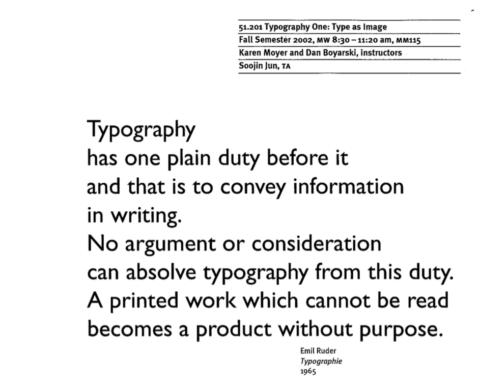
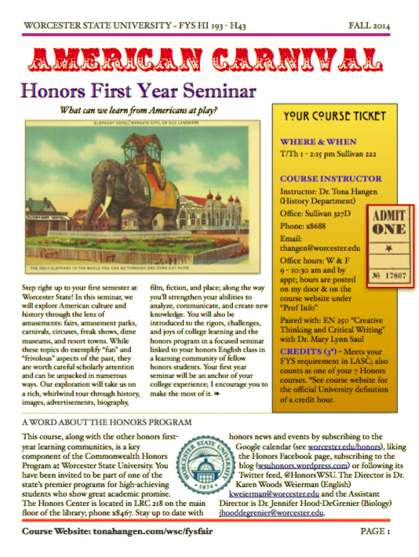
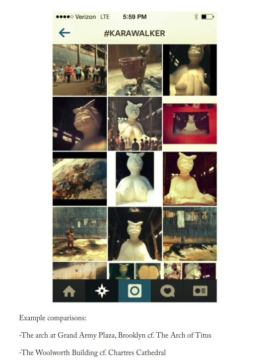
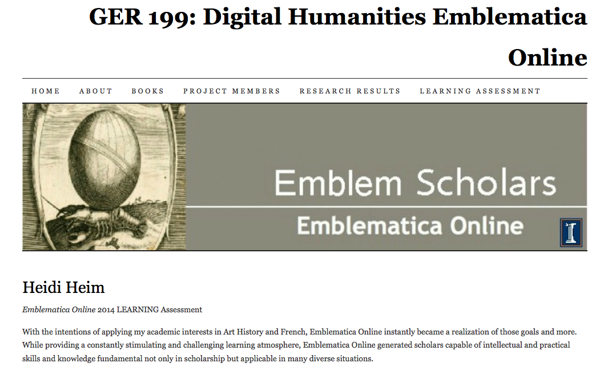
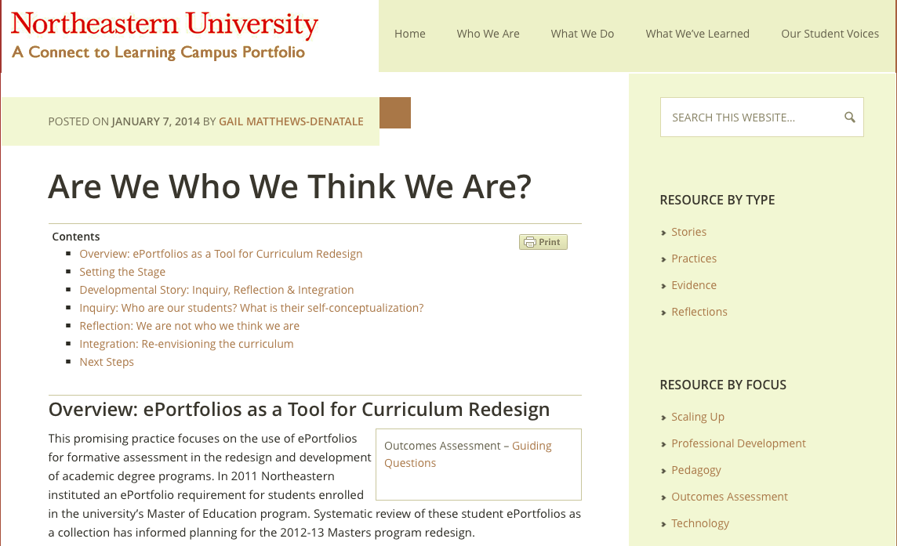
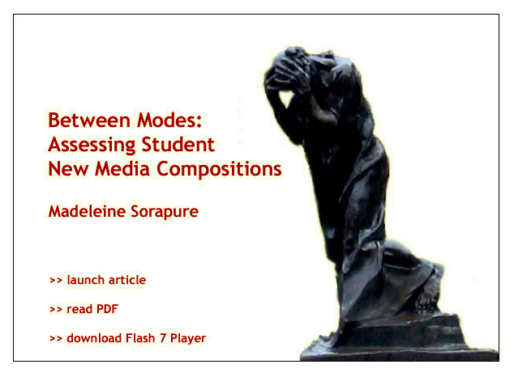
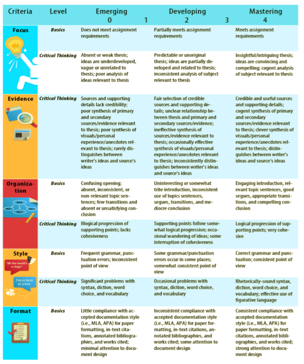

# Assessment
 
### J. Elizabeth Clark
LaGuardia Community College, CUNY

---

##### Publication Status:
* unreviewed draft
* draft version undergoing editorial review
* **draft version undergoing peer-to-peer review**
* published 

--- 

## CURATORIAL STATEMENT

The modern assessment movement beginning in 1985 has its roots in differing practice traditions. Peter Ewell notes that the “values and methodological traditions” between these practices “are frequently contradictory, revealing conceptual tensions that have fueled assessment discussions ever since” (6). The central tension is between quantitative and qualitative data.

While there is no universal agreement or measure on understanding what students learn, Thomas Angelo defines assessment as an “ongoing process aimed at understanding and improving student learning. It involves making our expectations explicit and public; setting appropriate criteria and high standards for learning quality; systematically gathering, analyzing, and interpreting evidence to determine how well performance matches those expectations and standards; and using the resulting information to document, explain, and improve performance” (7). All assessment practices involves the collection and analysis of student work against a set of standards.

### The Assessment Gestalt

Assessment connects the classroom to the institution in a set of shared learning goals representative of the institution as a whole, the assessment gestalt. Angelo explains, “When it is embedded effectively within larger institutional systems, assessment can help us focus our collective attention, examine our assumptions, and create a shared academic culture dedicated to assuring and improving the quality of higher education” (7). Classroom assessment is intimately related to the work of the institution as a key constituent element. The assessment gestalt seeks to define student learning both incrementally and longitudinally over the course of a college career finding the connections between learning in an individual course, a major, and at the culmination of receiving a degree.

### Categories of Assessment

While programmatic, institutional, and cross-institutional assessment are key pieces of the assessment gestalt, this discussion is focused on the classroom and three key categories of assessment. 

- *Formative assessments* provide gradual, developmental feedback. For example, John Bean’s *Engaging Ideas* offers a thorough overview of low-stakes assignments such as scaffolding, reflective writing, surveys, and minute papers.

- *Summative assessments* represent the culminating judgment of a student’s work on high-stakes assignments such as exams, final papers (without staging or drafts), and portfolios. 

- *Self-assessments* are assessments provided by the learner in dialogue with a faculty member. 

### Practices of Assessment

Practices of assessment demonstrate an intentional way of thinking, demonstrating, and understanding learning as a dynamic, integrative process. 

- *Design*: Assessment design does not focus on a single product but the relationship between all of the learning in a course. Linda Suskie recommends beginning with student learning outcomes when designing a course (117). Intentional course design asks what skills and knowledge a student will need to demonstrate learning experiences (sometimes known as backwards design) and embeds these strategically throughout the course.

- *Communication*: Student learning outcomes, rubrics, and other clearly formulated articulations of faculty expectations are a key to effective assessment. Students need to know what they are working toward.

- *Process*: Peggy Maki also refers to assessment as a process which provides the opportunity for students to build on prior learning (33).

- *Participation*: Learner-centered assessments shift teaching from lecture to inquiry modes where students are guided through the curriculum. Brian Huot calls this “instructive evaluation” which “requires that we involve the student in all phases of the assessment of her work” (69). This participatory process helps students master the skill of self-evaluation. 

- *Inquiry and Professional Development*: Asking what student work shows is an important part of understanding learning. Assessment supports evidence-based changes to improve teaching.

- *Integration*: The Association of American Colleges and Universities advocates for integrative learning that culminates in “signature work,” independent, integrative projects that allow students to examine real world issues with guidance from faculty members (Peden n. pag.). These projects document a range of skills and knowledge across the curriculum.

- *Technology*: Digital tools have encouraged the development of new ways for students to receive, perform, produce, and share knowledge. As faculty members consider student production of multimodal projects, videos, archival projects, tagging, and code, among others, they often wonder, what is the best way to assess this work? 

Assessment is particularly important in discussions of digital pedagogy because there are two competing ideologies. One is the fear that technology can automate assessment which is often seen as a direct attack on faculty autonomy (Perelman). Conversely, emerging digital tools can assist with new modes of assessment. 

Each artifact below captures a category and particular practice of assessment: design, communication, process, participation, inquiry and professional development, integration, and technology. 

## CURATED ARTIFACTS 

#### Typography One: Type as Image

* Artifact Type: Syllabus
* Source: [http://www.cmu.edu/teaching/designteach/design/syllabus/samples-creative/TypographySyllabus.pdf](http://www.cmu.edu/teaching/designteach/design/syllabus/samples-creative/TypographySyllabus.pdf)
* Creators: Karen Moyer and Dan Boyarski, Carnegie Mellon University
* Category: Formative Assessment
* Practices: Design, Communication

This syllabus serves as an introduction to both the work of the course and its philosophy. It provides clear expectations and goals for students including the mid-term and final evaluations and the major project. The goals, procedures, and course calendar work together to provide an overview of the course progression. This syllabus fully articulates the work, expectations, and criteria for the course. 

#### American Carnival

* Artifact Type: Syllabus
* Source: [http://www.tonahangen.com/wp-content/uploads/2010/06/193.Fall14.pdf](http://www.tonahangen.com/wp-content/uploads/2010/06/193.Fall14.pdf)
* Creator: Tona Hangen, Worcester State University
* Category: Formative Assessment
* Practices: Design, Communication, Integration

Tona Hangen’s “[Writing Syllabi Worth Reading](http://www.tonahangen.com/courses/syllabusdesign/)” challenges the notion of traditional syllabi by suggesting that in giving her syllabi “extreme makeovers” she discovered she “also framed the class to give students more responsibility for the learning, including punching some holes in the semester to be filled with student-chosen content later. It was a course redesign on many levels, and the eye-catching syllabus that resulted was the culmination of a deeper rethinking of what I was teaching and what I wanted my students to learn” (n. pag.). This first year seminar syllabus on the American Carnival incorporates student learning outcomes shared by all first year seminars at Worcester State University and Hangen’s commentary on those outcomes. As with the previous syllabus, work, expectations, and criteria for the course are fully articulated here providing groundwork for meaningful assessments later in the course. 

#### Evaluating Digital Humanities Projects: Collaborative Course Assessment

* Artifact Type: Assignment
* Source: [http://sites.duke.edu/lit80s_01_f2014/evaluating-digital-humanities-projects-collaborative-course-assessment/](http://sites.duke.edu/lit80s_01_f2014/evaluating-digital-humanities-projects-collaborative-course-assessment/)
* Creator: Amanda Starling Gould, Duke University
* Category: Formative Assessment
* Practices: Communication, Professional Development, Technology

This assignment includes multiple measures, collaboration, integration of concepts outside of the classroom, and modeling professional expectations. Students evaluate digital humanities projects and use digital markup tools to learn how to collaboratively evaluate and respond to digital work. This is an example of learning by doing: the form and content of the assignment and the assessment work together seamlessly. Students are assessed on how they mark up the digital work, how they work in a group collaboratively, and how they respond to digital work. The task models how they will be evaluated, and it is a precursor to how students will work and engage on a professional level after this course.

#### #arthistory: Instagram and the Intro to Art History Course

* Artifact Type: Assignment
* Source: [http://arthistoryteachingresources.org/2014/06/arthistory-instagram-and-the-intro-to-art-history-course/](http://arthistoryteachingresources.org/2014/06/arthistory-instagram-and-the-intro-to-art-history-course/) 
* Creator: Hallie Scott, CUNY Graduate Center
* Category: Formative Assessment
* Practices: Process, Communication, Integration, Technology

Students curate a series of images on Instagram and connect them to key course concepts. Then, they write a short comparative paper based on the class Instagram images. These short papers culminate in a final paper. Scott says, “By requiring students to build on their Instagram posts through written analyses, Parts 2 and 3 of the assignment reinforce the connections made in Part 1 and further encourage original analysis (as well as discourage plagiarism.) They also strengthen visual and contextual analytic skills while directly demonstrating how these skills apply to the contemporary environment” (n. pag.). This assignment demonstrates scaffolding as low-stakes assignments lead to a high-stakes assignment. The faculty member has the opportunity to assess student learning periodically prior to the final high stakes assignment, allowing for faculty feedback and guidance in the process. The assignment also integrates a variety of skills. 

#### Mentira

* Artifact Type: Assignment
* Source: [http://www.mentira.org/](http://www.mentira.org)
* Creators: Chris Holden and Julie Sykes, University of New Mexico, Lead Designers; Linda Lemus, Aaron Salinger, Derek Roff, University of New Mexico, Game Designers
* Category: Formative Assessment
* Practices: Process, Participation, Inquiry, Integration, Technology

While games cannot replace the experience of travel in a foreign country, they can provide students with an immersive environment that offers a vehicle for practicing language acquisition skills, history, and culture in an interactive digital environment. The creators of La Mentira explain, “The backbone of this project is a focus on a natural context, outside the classroom, for the study of Spanish, and the development of materials for use in that context. We chose the Los Griegos neighborhood in Albuquerque/Los Ranchos for its connection to the Spanish language, documented history, diverse use and architecture, and walkability” (n. pag.). Students are assessed on their language skills as they navigate the challenges presented by the game in a real life context. As a low-stakes assessment, like most games, students have the opportunity practice and improve by repeating episodes in the game. 

#### Structuring Reflection

* Artifact Type: Assignment
* Source: [https://www.hastac.org/blogs/taxomania/2014/01/28/02-using-zines-classroom](https://www.hastac.org/blogs/taxomania/2014/01/28/02-using-zines-classroom)
* Creator: Jason Luther, Syracuse University
* Category: Self-Assessment, Summative Assessment
* Practices: Communication, Process, Participation, Inquiry

Staging meaningful reflection can be difficult. Luther’s course relied on the use of student grading contracts for summative assessment. At the end of the course, students returned to those contracts, along with a set of prompts provided by the instructor. Students answered questions such as: “What goals did you have for this zine and did you meet them?” and “What was your vision and how was it compromised by these tool and technologies?” (n. pag.). These reflective questions engage students in a conversation about their own expectations and the results they achieved with their zines in a helpful analysis of the end product. Luther’s assignment demonstrates the intentional use of guided questions to prompt self-assessment.

#### Reflection from Emblematica Online

* Artifact Type: Student Work
* Source: [https://emblematicaonlineuiuc.wordpress.com/heidi-heim/](https://emblematicaonlineuiuc.wordpress.com/heidi-heim/)
* Creator: Heidi Heim, University of Illinois at Urbana-Champaign
* Category: Self-Assessment, Summative Assessment
* Practices: Participation, Inquiry and Professional Development

Heim participated  in an undergraduate digital humanities research team that created metadata for Renaissance Emblem books. Heim’s personal narrative provides a self-assessment of key skills and concepts learned in the context of this collaborative research project. Reflection is a key element in participatory assessment. Students are able to articulate their understanding of a project, course, or learning objective and then provide evidence for how they have achieved those goals. Heim discusses the skills she has learned and how she has showcased them in this project, and she also points to future skills that she now knows she needs to learn. Further, Heim and her Emblem Scholars cohort worked alongside faculty as participatory researchers, which provides a model of professional expectations.

#### Are We Who We Think We Are

* Artifact Type: Student Work and Assessment Narrative
* Source: [http://neu.mcnrc.org/oa-story/](http://neu.mcnrc.org/oa-story/)
* Creators: Gail Matthews-Denatale, Northeastern University
* Category: Self-Assessment, Summative Assessment
* Practices: Professional Development, Integration, Technology

“Are We Who We Think We Are” is an assessment narrative about Northeastern University’s use of ePortfolios as a formative assessment tool. Matthews-Denatale explains the systematic review of portfolios in the Master of Education program that led to curriculum redesign. Student examples are also available as a link on the site. This assessment narrative is part of the larger Catalyst for Learning site. The result of a three-year research project, key campuses using ePortfolios studied their own practices and documented them on the site. The student work, coupled with the metacognitive aspects of reflection, provide a powerful multimodal transcript of student development, integration, and learning across the curriculum. 

#### Between Modes: Assessing Students’ New Media Compositions

* Artifact Type: Assignment Assessment
* Source: [http://technorhetoric.net/10.2/coverweb/sorapure/betweenmodes.html](http://technorhetoric.net/10.2/coverweb/sorapure/betweenmodes.html)
* Creators: Madeleine Sorapure, UC Santa Barbara
* Category: Self-Assessment, Summative Assessment
* Practices: Professional Development, Integration, Technology

This multimodal article examines the disconnect between new media assignments and traditional forms of assessment. Sorapure writes, “Examining how student work in new media is currently assessed, it is clear that we are at a transitional stage in the process of incorporating new media into our composition courses. As [Kathleen Blake] Yancey notes, we give multimodal assignments but often draw on what we are far more familiar with—that is, print—to assess student work” (n. pag.). The article provides both an overview of assignments and a critique of the assessments. 

#### Big Data, Learning Analytics, and Social Assessment

* Artifact Type: Assignment Assessment
* Source: [http://journalofwritingassessment.org/article.php?article=68](http://journalofwritingassessment.org/article.php?article=68)
* Creator: Joe Moxley, University of South Florida 
* Category: Formative Assessment, Summative Assessment
* Practices: Design, Communication, Process 

This article analyzes an example of course-based and program-based assessment. Instructors who teach the first-year composition program at the University of South Florida use a common rubric to assess student work. The article explains the collaborative development of the rubric and the My Reviewers program that incorporates peer review, developmental feedback, and summative assessment. The article also provides an assessment of the overall program including statistics and usage data. Although this is a program-wide rubric, the article provides both a process for responding to student writing in stages and an example of an effective writing rubric for summative assessment. 

## RELATED MATERIALS 

Eynon, Bret, Laura Gambino, Randy Bass, and Helen Chen. [*Catalyst for Learning ePortfolio Site*.](http://c2l.mcnrc.org) Making Connections National Resource Center. 2014. Web. 14 May 2016.

JISC. [*Effective Assessment in a Digital Age: A Guide to Technology-Enhanced Assessment and Feedback*](http://repository.jisc.ac.uk/5995/1/digiassass_eada.pdf). JISC. 2009. Web. 14 May 2016. 

Kuh, George D., Natasha Jankowski, Stanley O. Ikenberry, and Jillian Kinzie. [*Knowing What Students Know and Can Do: The Current State of Student Learning Outcomes Assessment in U.S. Colleges and Universities*](http://www.learningoutcomeassessment.org/knowingwhatstudentsknowandcando.html). National Institute for Learning Outcomes Assessment. 2013. Web. 14 May 2016.

Losh, Elizabeth. _The War on Learning: Gaining Ground in the Digital University._  Cambridge, MA: The MIT Press, 2014. Print. 

McKee, Heidi A. and Danielle Nicole DeVoss, Eds. [*Digital Writing: Assessment and Evaluation*](http://ccdigitalpress.org/dwae/intro.html). Logan, UT: Computers and Composition Digital Press/Utah State University Press, 2013. Web. 14 May 2016.

## WORKS CITED 

Angelo, Thomas A. “Reassessing (and Defining) Assessment.” *AAHEA Bulletin*. 48.3 (Nov. 1995): 7. Print.

Bean, John C., and Maryellen Weimer. *Engaging Ideas: The Professor’s Guide to Integrating Writing, Critical Thinking, and Active Learning in the Classroom* (2nd Edition). N.p.: Jossey-Bass, 2011. Print.

Ewell, Peter T. “An Emerging Scholarship: A Brief History of Assessment.” *Building a Scholarship of Assessment*. Ed. Trudy W. Banta. San Francisco, CA: Jossey-Bass. 2002. 3-25. Print.

———. “[Assessment, Accountability, and Improvement: Revisiting the Tension](http://www.learningoutcomeassessment.org/documents/PeterEwell_005.pdf)” (NILOA Occasional Paper No. 1). National Institute for Learning Outcomes Assessment. November 2009. Web. 14 May 2016.

Eynon, Bret, Laura Gambino, Randy Bass, and Helen Chen. *Catalyst for Learning ePortfolio [Site*.](http://c2l.mcnrc.org) Making Connections National Resource Center. 2014. Web. 14 May 2016.

Gould, Amanda Starling. “[Evaluating Digital Humanities Projects: Collaborative Course Assessment](http://sites.duke.edu/lit80s_01_f2014/evaluating-digital-humanities-projects-collaborative-course-assessment/).” Duke University. 2013. Web. 14 May 2016.

Hangen, Tona. “[American Carnival Syllabus](http://www.tonahangen.com/wp-content/uploads/2010/06/193.Fall14.pdf).” Tonahangen.com. Fall 2014. Web. 14 May 2016. 

———. “[Writing Syllabi Worth Reading.](http://www.tonahangen.com/courses/syllabusdesign/)” Tonahangen.com. 22 August 2012. Web. 14 May 2016. 

Heim, Heidi. “[Emblematica Online 2014 LEARNING Assessment](https://emblematicaonlineuiuc.wordpress.com/heidi-heim/).” GER 199: Digital Humanities Emblematica Online. University of Illinois at Urbana-Champaign. 2014. Web. 14 May 2016. 

Holden, Chris, Julie Sykes, Linda Lemus, Aaron Salinger, Derek Roff. “[Mentira](http://www.mentira.org/the-game).” University of New Mexico. 2009. Web. 14 May 2016. 

Huot, Brian. [*(Re)Articulating Writing Assessment for Teaching and Learning*](http://digitalcommons.usu.edu/usupress_pubs/137/). USU Digital Commons. Logan, Utah State UP: 2002. Web. 14 May 2016.

JISC. [*Effective Assessment in a Digital Age: A Guide to Technology-Enhanced Assessment and Feedback*](http://repository.jisc.ac.uk/5995/1/digiassass_eada.pdf). JISC. 2009. Web. 14 May 2016.

Kuh, George D., Natasha Jankowski, Stanley O. Ikenberry, and Jillian Kinzie. [*Knowing What Students Know and Can Do: The Current State of Student Learning Outcomes Assessment in U.S. Colleges and Universities*](http://www.learningoutcomeassessment.org/knowingwhatstudentsknowandcando.html). National Institute for Learning Outcomes Assessment. 2013. Web. 14 May 2016.

Losh, Elizabeth. *The War on Learning: Gaining Ground in the Digital University.* Cambridge, MA: The MIT Press, 2014. Print. 

Luther, Jason. “[Using Zines in the Classroom](https://www.hastac.org/blogs/taxomania/2014/01/28/02-using-zines-classroom).” HASTAC. 28 Jan. 2014. Web. 14 May 2016.

Maki, Peggy L. *Assessing for Learning: Building a Sustainable Commitment Across the Institution*. 2nd ed. Sterling: Stylus, 2010. Print.

Matthews-Denatale. “[Are We Who We Think We Are](http://neu.mcnrc.org/oa-story/).” Making Connections National Resource Center. 7 January 2014. Web. 14 May 2016.

McKee, Heidi A. and Danielle Nicole DeVoss, Eds. [*Digital Writing: Assessment and Evaluation*](http://ccdigitalpress.org/dwae/intro.html). Logan, UT: Computers and Composition Digital Press/Utah State University Press, 2013. Web. 14 May 2016.

Moxley, Joe. “[Big Data, Learning Analytics, and Social Assessment](http://journalofwritingassessment.org/archives.php?issue=14).” The Journal of Writing Assessment* 6.1 (2013): n. pag. The Journal of Writing Assessment. Journal of Writing Assessment. Web. 14 May 2016.

Moyer, Karen and Dan Boyarski. “[Typography Syllabus](https://www.cmu.edu/teaching/designteach/design/syllabus/samples-creative/TypographySyllabus.pdf).” Carnegie Mellon University. 2002. Web. 14 May 2016.

Peden, Wilson. “[Signature Work: A Survey of Current Practices](https://www.aacu.org/liberaleducation/2015/winter-spring/peden).” Association of American Colleges & Universities. AAC&U, 24 June 2015. Web. 14 May 2016.

Perelman, Les C. “[Critique of Mark D. Shermis & Ben Hamner, ‘Contrasting State-of-the-Art Automated Scoring of Essays: Analysis](http://journalofwritingassessment.org/article.php?article=69)’” *The Journal of Writing Assessment* 6.1 (2013): n. pag. The Journal of Writing Assessment. Journal of Writing Assessment. Web. 14 May 2016.

Scott, Hallie. [“#arthistory: Instagram and the Intro to Art History Course.”](http://arthistoryteachingresources.org/2014/06/arthistory-instagram-and-the-intro-to-art-history-course/) Art History Teaching Resources. 25 June 2014. Web. 14 May 2016.

Sorapure, Madeleine. “[Between Modes: Assessing Students’ New Media Compositions](http://technorhetoric.net/10.2/coverweb/sorapure/betweenmodes.html).” *Kairos* 10:2 (2005). Web. 14 May 2016.

Suskie, Linda. *Assessing Student Learning: A Common Sense Guide*, 2nd edition. San Francisco: Jossey-Bass, 2009. Print. 

