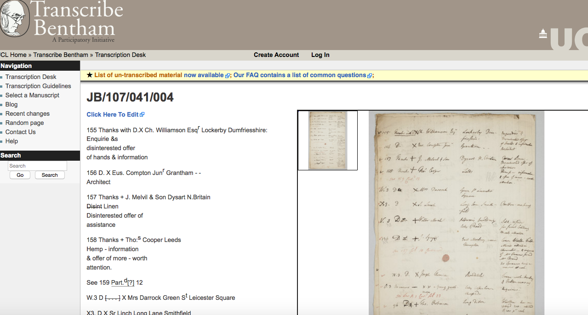
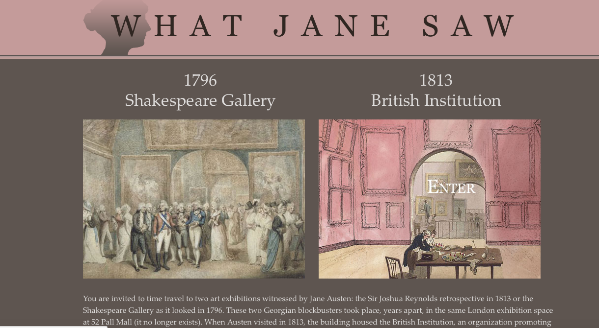
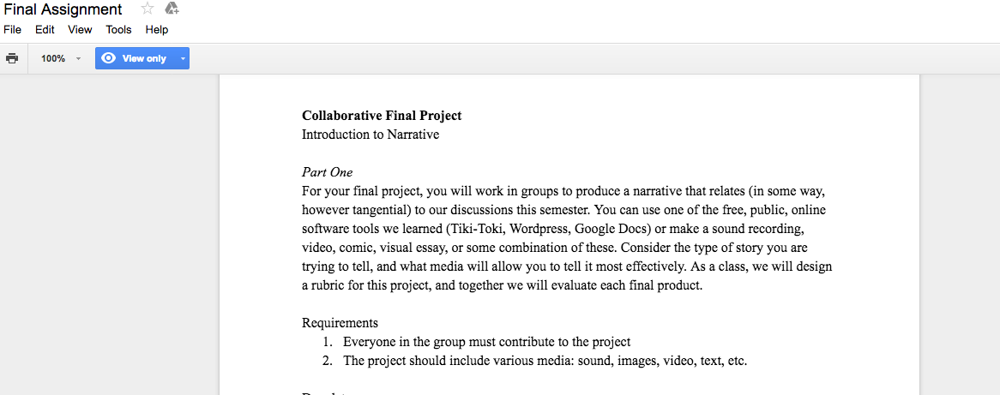
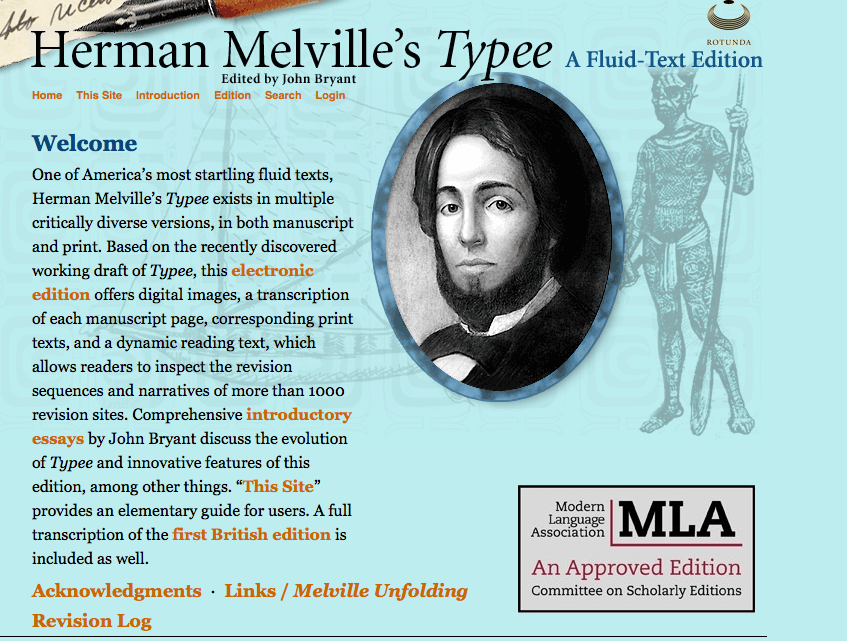
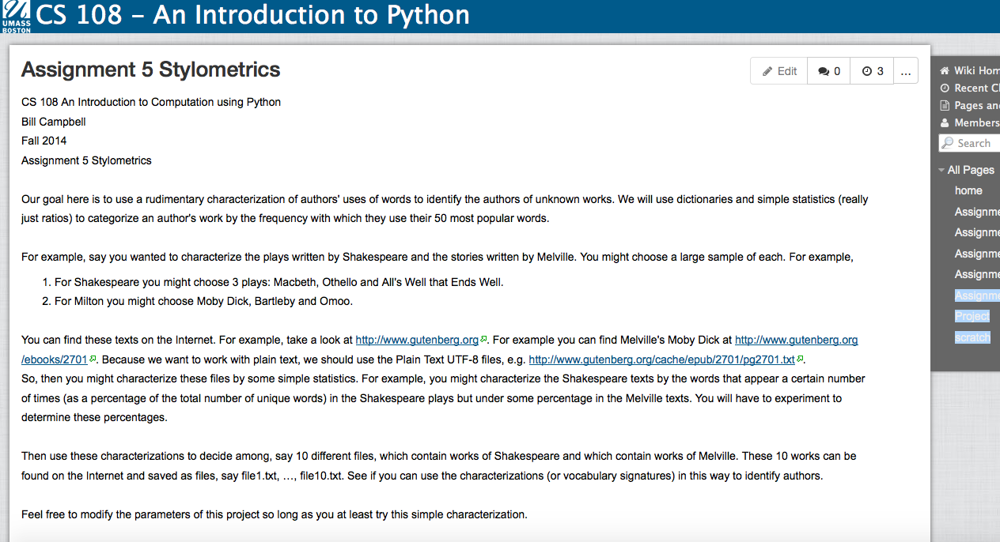
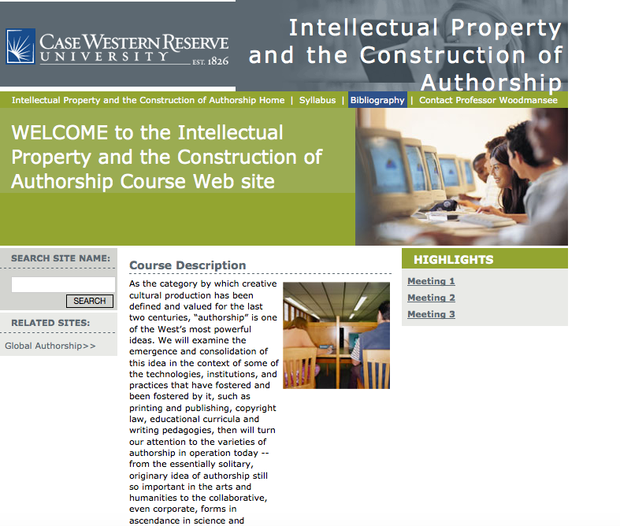
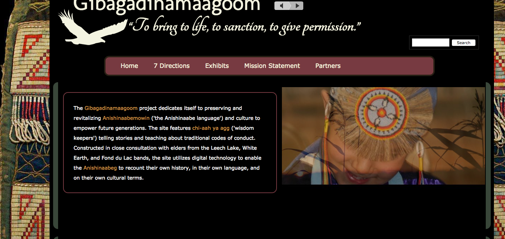
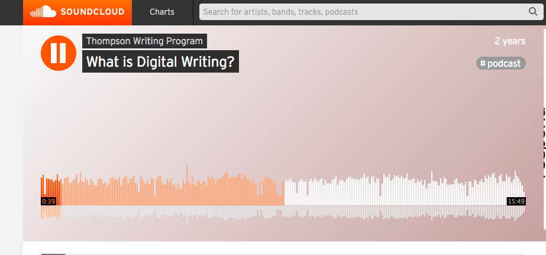

# Authorship (Draft)

## Augusta Rohrbach
Tufts University

---

##### Publication Status:
* unreviewed draft
* draft version undergoing editorial review
* **draft version undergoing peer-to-peer review**
* published 

--- 

## CURATORIAL STATEMENT 

Though anyone can be an author by producing text, since the 18th century, we have attached a particular cache to publication, making it the sine qua non of authorship.  Today the dissemination of text for a public is just a tweet away, thus authorship is available to an unprecedented number of people. Indeed, the lack of barriers to publication made possible by Web 2.0 technologies might tempt today’s students to think of this new era as one of “post-authorism.” Yet, few in the academy would be willing to let go of the author concept, if only for the way it has been formative—for better or for worse—in the history of human culture.  Because anyone is just a click away from contributing to the production of a public text, and are at least slated to join the ranks of authors archived in the US Library of Congress (McGill), finding ways to illuminate—and appreciate—not just the obstacles to publication but also the elements of textual production will be an important part of the work we do in a literature classroom enabled by digital tools.  Just as important will also be the need to understand that norms—then and now—pervade how we read and think about authors.

Part of the challenge of this key word entry is to unpack what authorship meant before the 18th century consolidated author/authorship under a name to the production of an identifiable, unique agent with the legal codification of copyright. For those who make literature and writing an object of professional study, it’s been a very long time since the term “author” referred to a neat singularity, an individual and discreet agent producing an original text, regardless of any legal apparatus. A history of 20th century critical approaches— from New Criticism’s distancing of the author in order to foreground the aesthetic logic of the work itself to New Historicism’s emphasis on how the social, political and material context bears on a work and its meaning—shows how author—and the idea of authorship—has migrated from its early days of collective transcription and anonymous publication, the cult of personality, the notion that an author and the work are embedded in a complex web of social forces, and more recently, theories that show how texts can be analyzed through computational and algorithmic study made possible by machine learning (Moretti).  

Scholars and teachers understand that authorship is an arena that is as politically fraught as any other human endeavor.  Indeed, countless examples might be called upon to tell stories as troubled and complex as culture itself.  For instance, we might turn to Phyllis Wheatley, whose work was questioned as an impossible production given her racial status, to tell the story of civil rights. Or, we could use Mary Ann Evans, who took the pen name, George Elliot, so that readers would not dismiss her work as feminine dribble to discern the gendered limits of cultural legitimacy.   And there are other examples of how authorial attribution or contribution is hidden or muffled as writing enters the public domain through publication.

Take, for instance, Jane Johnson Schoolcraft, whose writing was frequently absorbed into the ethnographic research of her spouse John Rowe Schoolcraft, or Hannah Bond, who might not have published simply to protect her freedom (Gates; Rohrbach), or Zelda Fitzgerald, wife and muse to F. Scott, whose brave explorations into the web of social interactions became grist for the famous scenes transcribed in her husband’s best-selling novels.   What these examples highlight is that though the idea of the author seems as elemental as air itself, it has a history of conflict built into its very core. Many can write, but far fewer can and do publish. 

However, to the typical reader, the term evokes a set of values that seem to pre-exist such 18th century conceptual and legal approaches.  For these readers, the “author” invokes a sense of genius, originality, ownership, (and maybe social responsibility) as the originator of a collection of distinctive ideas.  Thus the goal for this keyword entry is to help tease out these historically conditioned ideas about authorship, while also denaturalizing the idea of the author.  Sensitizing readers to how and why an author identifies as such, for instance, can illuminate the ways in which authors might be more or less reluctant depending on how they—and we—see what’s at stake when claiming the identity as an author and the authority that comes with it.  This may be an increasingly difficult idea to develop in classrooms as Web 2.0 options seem to eliminate the social, political, financial, and technical barriers to publication that played such a formative role.  While the authors I mentioned above struggled to break through normative culture, this keyword entry suggests ways to recognize the new, and constantly changing norms that condition the possibility of authorship while also remaining cognizant of the older traditions and approaches.

**Principles of Artifact Selection:**
The selection of artifacts below explore the shifts from the author—and the idea of authorship—from its early days of collective transcription and anonymous publication to the cult of personality and then to the notion that an author and the work are embedded in a complex web of social forces and even computational/algorithmic authorship.   On the one hand the author can serve as a good starting place to understand and question cultural concepts of genius and creativity through two of the websites featured here.  At one end of the spectrum is the website What Jane Saw; it presents homages to Shakespeare and Josuha Reynolds to help users track the development of the genius model that defines modern concepts of authorship. At the other end of the spectrum is the radical insistence on the continuity of thought and tribal knowledge by the Gibagadinamaagoom website. To bring the historical condition, production, and context of texts into view, two archiving tools have been selected for the way they expose the complexities of access from the perspective of translation (Persieds) and transcription (Transcribe Betham). Finally, the assignments around modes of collective authoring ask students to negotiate the myriad of terms and conditions that the genius model of authorship obscure and/or downright deny, modeling a degree of intellectual honesty and requiring a communally sanctioned idea of use-value.   In the end, all of these artifacts do for authorship what intersectionality has done for feminism.  They help us see, appreciate, and sometimes even experience, authorship as more than a monolithic concept or brand. Rather, engagement with materials such as these illuminate author/authorship as a multifaceted, multitudinous, fractured, fragmented, conflicted, counterintuitive state—a product of (im)pure artifice. 

## CURATED ARTIFACTS 

### Commonplace Book Assignment
* Artifact Type: Assignment

* Source URL: [http://jitp.commons.gc.cuny.edu/the-commonplace-book-assignment/]( http://jitp.commons.gc.cuny.edu/the-commonplace-book-assignment/)
* Copy of Artifact:
* Creator: [Vimala Pasupathi](https://vcpasupathi.wordpress.com/) (Hofstra University)

As with many of the other keyword entries included in this collection, the common-placing assignment offers an entryway to the concept. Vimala Pasupathi’s version was chosen because it emphasizes the author’s curatorial role of selection and arrangement.  It asks students to “assemble” an author and thus stresses their own role in the construction of authorship and demonstrates, in both a literal and physical way, that readers construct authors and their works.   It is also helpful that this activity tracks neatly with activities students are already engaged in through pinterest, instagram, and others.  At the same time, the assignment attends to the importance of attribution.  The prompt takes care to distinguish between practices of the past and how they treat authorship—as fluid, composite and potentially unattributed—and today’s classroom conventions as tied to a particular idea of the author as a stable entity whose work should be recognized as external to personal commonplacing/reading.

### Persieds Tool
* Artifact Type: Tool

* Source URL: [http://www.perseids.org/](http://www.perseids.org/)
* Copy of Artifact:
* Creator: Marie-Claire Beaulieu; Tufts University

As a tool to facilitate and archive the transcription of ancient Greek and Latin texts, Persieds removes significant barriers to understanding ancient texts by allowing users of all skill sets entry into this early world of textual production. Much like the popular [Wikipedia assignments](http://wikiedu.org/for-instructors) used to teach collective authorship, this platform allows students to actively engage in the work of authorship—according to the standards in place before the 18th century conception of the single author/artist/genius. Users translate and edit texts, producing “micro-publications” that are immediately available on the site and become a permanent part of the archive. Creating an assignment using Persieds where students use it to translate a text and archive it will denaturalize conventional notions of authorship while also offering a look into texts of the ancient world that circulated orally and might better be called “attributed” rather than authored. 

### Transcribe Bentham
* Artifact Type: Website/archive

* Source URL: [http://blogs.ucl.ac.uk/transcribe-bentham/](http://blogs.ucl.ac.uk/transcribe-bentham/)
* Copy of Artifact:
* Creator: Transcribe Bentham team, University College of London

Transcribe Bentham also uses the crowdsourcing method. Inviting participants to take up transcription as an “exciting opportunity to make a genuine difference to research and scholarship by contributing to the production of the new edition of *[The Collected Works of Jeremy Bentham](http://www.ucl.ac.uk/Bentham-Project/publications/collected_works)*, and to help create for posterity a vast digital repository of Bentham’s writings.” Transcribe Bentham holds the same principles of participation as Persieds, assuring those who wish to take part that “no special skills are required” nor must anyone be approved to participate, and, best of all: “every contribution—no matter how small—is of great value to Transcribe Bentham.”  But where Persieds allows contributors to negotiate what may be a language deficit, contributors to Transcribe Bentham, experience authorship as act of a human hand.  In order to contribute to the edition, participants must interpret the handwriting in the physical text—a feature of authorship that has been largely eclipsed by digital modes of publication.  Like assignments that ask students to write on clay or read by candlelight to manifest experiences of earlier periods, this tool and archive will engage students in an earlier form of authorship—one that our shift to the keyboard is fast occluding.

### What Jane Saw
* Artifact Type: Website

* Source URL: [http://www.whatjanesaw.org/](http://www.whatjanesaw.org/)
* Copy of Artifact:
* Creator: Janine Barchas, University of Texas at Austin

What Jane Saw offers a view into “what were the world's first types of “single-author” shows, or exhibitions dedicated to a single person’s artistic genius,” according to Janine Barchus, the website’s builder.  Her free and open website provides a look at Boydell’s Shakespeare Gallery-- the first museum dedicated to the work of William Shakespeare, and the Joshua Reynolds (1723-1792) retrospective at the British Institution in 1813.  Barchus explained that “prior to these two spectacles (admittedly very different in kind), public art exhibitions had never circled around the work of a single person. This website helps students see how recent the concept of single-author, the “famous author/artist,” is as a construction even though it has become a norm in the art world epitomized by retrospectives on Picasso or Kara Walker and in terms of authors like Austen or Dickinson.  Authors—like artists—become brands in a cultural marketplace; being able to recognize them also means being able to commodify them. This website helps its users get “behind” Austen’s texts and into her world and see the ways that the genius model of authorship was constructed.

### Collective Authorship Assignment
* Artifact Type: Assignment

* Source URL: [https://docs.google.com/document/d/1F9p05hOh63O4MkY0ClJg_asyG_34cYYVFsef0WfaWZ0/edit](https://docs.google.com/document/d/1F9p05hOh63O4MkY0ClJg_asyG_34cYYVFsef0WfaWZ0/edit)
* Copy of Artifact:
* Creator: Danica Savonick, CUNY Graduate Center

To help students occupy the space of the author, it is helpful to mirror the complex web of agents involved in the production of any text using the social context of the classroom.  Danica Savonik takes the practice of collective authorship in her “Introduction to Narrative” and flips the script proposed by the commonplacing assignment discussed earlier.  Here students are asked to produce a collective text and as such, approach authorship as composed of multiple approaches and consciousnesses where each individual must find a place within a constructed whole. The specific attention to media selection will sharpen students’ awareness of how formal choices shape the reception of content and requiring multiple media will encourage comparison among and between media and imagined purposes.    This assignment will help bring the formal production elements of authorship into contact with the message (McLuhan).

### Digital Edition
* Artifact Type: Website/digital edition 

* Source URL: [http://learningthroughdigitalmedia.net/google-wave-pedagogical-success-technological-failure](http://learningthroughdigitalmedia.net/google-wave-pedagogical-success-technological-failure)
* Copy of Artifact:
* Creator: John Bryant, Hofstra University

To help students explore the conditions of textual production and the impact of our expectations about an author’s function to produce an intergrated and unified text, consider John Bryant’s web-based electronic edition of Herman Melville’s Typee.  This edition of Melville’s text highlights how porous authorship can be, even when its author is well-known using its multiple revisions and editions, published in the United States and England. Comparing these editions helps students understand the complex web of agency over time, publishers, and editions. It is an excellent example of how authorship is shaped by what publishers believe the reader will tolerate more than the author’s “vision.”  Students will see how Melville is pitted against the conventions of taste, offering a view of the combative nature of publication and the inevitable role that market plays in how such decisions are made.  Use this edition to help students engage in a comparative analysis of the construction of an author/authorship and his text over time, place, and nation.  

### Stylometrics Assignment
* Artifact Type: Assignment

* Source URL: [http://cs108-fall14.wikispaces.umb.edu/Assignment+5+Stylometrics](http://cs108-fall14.wikispaces.umb.edu/Assignment+5+Stylometrics)
* Copy of Artifact:
* Creator: Bill Campbell, University of Massachusetts, Boston

And just when it seems as if author/ship eludes definition, you might wish to confound that impulse by throwing in Bill Campbell’s stylometry assignment to identify key stylistic features of a work.  By circumscribing authorship to a matter of style, students can try on authorial identities as a shape-shifting experiment with their own writing.  An interesting side-feature of this assignment, other than offering a chance to play with this program, is the way elemental terms—such as “dictionary”—are reframed in this context according to the program’s method of finding core values that characterize a work.  The top 50 most common words, in this case, will characterize the work of an author, and help distinguish one person’s work—or brand-- from another.  By breaking down the work of art to a series of stylistic word choices, this assignment will let students explore authorial identity as untethered to personal identity.

### Authorship Syllabus
* Artifact Type: Syllabus

* Source URL: [http://www.case.edu/affil/sce/authorship/index.html?nw_view=1473195030](http://www.case.edu/affil/sce/authorship/index.html?nw_view=1473195030)
* Copy of Artifact:
* Creator: Martha Woodmansee, Case Western Reserve University

For a way into the legal aspects of authorship across history and disciplines, take a look at Martha Woodmansee’s syllabus for “Intellectual Property and the Construction of Authorship.”

This course provides a broad view of the issues in historical context, and also recognizes that standards vary across disciplines.  Especially useful is the overall emphasis on the debates surrounding authorship through the inclusion of case law.  The “Authorship in Science” section calls attention to important differences in how and what makes an author in scientific publication, the importance of collaboration, and the use of citation as a form of authorship and retains the focus on forms of author/ship as mostly divergent in its practices and values.  Readers may want to select material from this syllabus to build a unit on the way the law has operated to shape authorship.  

### Gibagadinamaagoom website
* Artifact Type: Website

* Source URL: [http://ojibwearchive.sas.upenn.edu/](http://ojibwearchive.sas.upenn.edu/)
* Copy of Artifact:
* Creator: Larry Aiken and Timothy Powell, University of Pennsylvania

The provenance with authorship is complicated by both the practices and the politics of the Gibagadinamaagoom website.   The site represents a cooperative effort to preserving and protecting tribal beliefs and sanctioned modalities in that is was funded by NEH and constructed in cooperation with tribal members. The website features web-enabled multimodal presentations to help users see beyond what Timothy Powell and Larry Aiken call “the margins of the white page” by placing an emphasis on the aural presentations (252).  Eschewing static descriptions, the emphasis is on presence and process as elders are filmed explaining and demonstrating tribal practices, teaching the native language, and keeping traditions alive through active practice. The Ojibwe beliefs and practices made present through the website represent more than a mere alignment with many of the characteristic efficacies present in a multimodal digital environment (Powell and Aiken).  The Gibagadinamaagoom website provides a deep cultural and philosophical background for the models of authorship now available through Web 2.0 tools (Cohen). Use this site as a resource to help students rethink authorship as a communal practice outside of writing. 

### What is Digital Writing Podcast
* Artifact Type: Reflective essay and assignment

* Source URL: [https://soundcloud.com/thompson-writing-program/what-is-digital-writing](https://soundcloud.com/thompson-writing-program/what-is-digital-writing)
* Copy of Artifact:
* Creator: [Whitney Ann Trettien](http://whitneyannetrettien.com/), University of North Carolina at Chapel Hill

Whitney Trettlen’s podcast on digital writing expands the meaning of authorship to make listeners aware of how varied the uses and purposes of writing can be in the digital context. Put together as a series of interviews, speakers explore the more granular elements of making meaning using digital tools to remix, repurpose, and revise material that is freely available on the web while also preserving the norms of attribution. Use this as a primer for other assignments and also as a prompt for dialogue around questions of how dynamic authorship is when the boundaries between reader and writer no longer hold. 

## RELATED MATERIALS

@autoblake Twitterbot, Roger Whitson’s version of HAL-Blake. As Whitson explains on his blog, the bot automatically tweets remixed lines every 3 hours from David Erdman’s The Complete Poetry and Prose of William Blake.” http://www.rogerwhitson.net/?p=2857

Another example worth pursuing is authorship as not just enabled by but also conditioned by social media constraints like twitter:  http://historyoftexttechnologies.blogspot.com/2014/01/beowulf-in-hundred-tweets-beow100.htmlformal

For an example of publication format as a form of authorship see: https://www.tumblr.com/tagged/this-bridge-called-my-back

Barthes, Roland. "The Death of the Author." Image / Music / Text. Trans. Stephen Heath. New York: Hill and Wang, 1977. 142-7. 

Foucault, Michel. “What is an Author?” Language, Counter-Memory, Practice. Ed. Donald F.Bouchard.  Ithaca: CUP, 1977. 113-138

## WORKS CITED

Barchus, Janine.  Email communication, 8/24/16.

Barthes, Roland. "The Death of the Author." *Image/Music/Text*. Trans. Stephen Heath. New York: Hill and Wang, 1977. 142-7. 

Cohen, Matt. *Networked New England*.  Minneapolis: U of Minnesota Press, 2010.

Foucault, Michel. “What is an Author?” *Language, Counter-Memory, Practice*. Ed. Donald F.Bouchard.  Ithaca: CUP, 1977. 113-138

Gates, Henry Louis, Jr. “Introduction,” *The Bondswoman’s Narrative*.  New York: Time Warner Books, 2002.

McGill, Andrew.  “Can Twitter Fit Inside the Library of Congress? *The Atlantic*, (8/4/2105). http://www.theatlantic.com/technology/archive/2016/08/can-twitter-fit-inside-the-library-of-congress/494339/?utm_source=eb (accessed 12/23/16)

McLuhan, Marshall.  The Medium is the Message.  New York: Penguin, 1967.

Moretti, Franco.  Distant Reading.  New York: Verso, 2013

Powell, Timothy and Larry P. Aitken, chi-ayy ya agg, (Wisdom Keeper).  “Encoding Culture: Building a Digital Archive Based on Traditional Ojibwe Codes of Conduct,” in *The American Literature Scholar in the Digital Age*, Amy E. Earhart and Andrew Jewll, eds. Ann Arbor: University of Michigan Press, 2010).  http://quod.lib.umich.edu/cgi/t/text/text-idx?cc=etlc;c=etlc;idno=9362034.0001.001;rgn=full%20text;view=toc;xc=1;g=dculture (accessed 12/23/2016).

Rohrbach, Augusta.  “History: Publication Redefined,” in *Thinking Outside the Book.*  University of Massachusetts Press, 2014.
