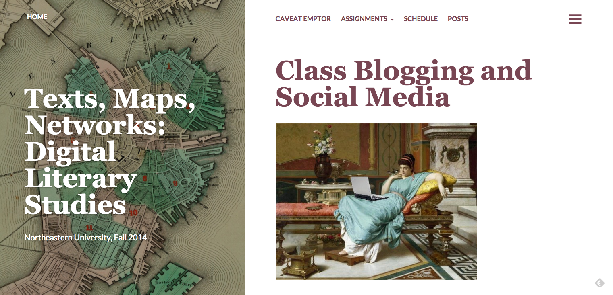
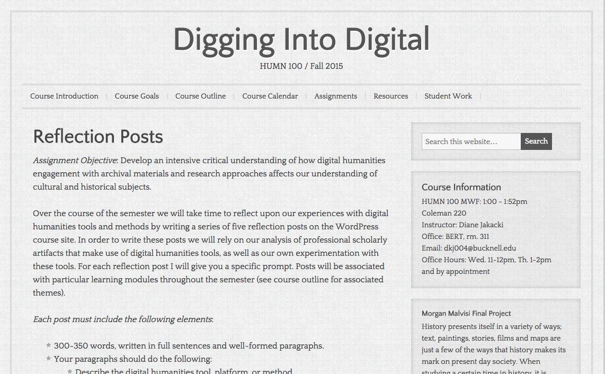
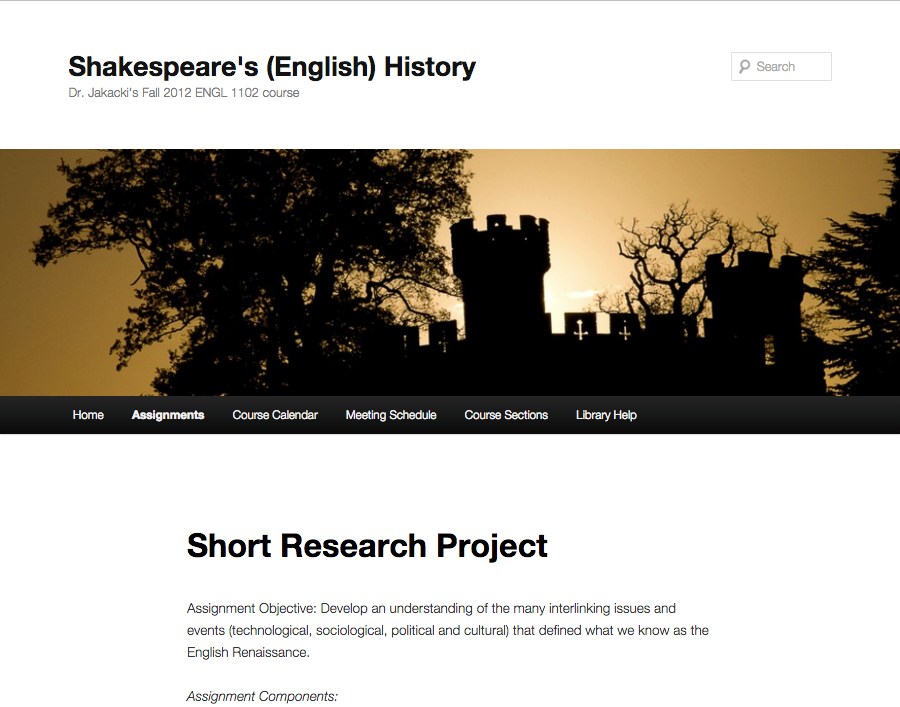
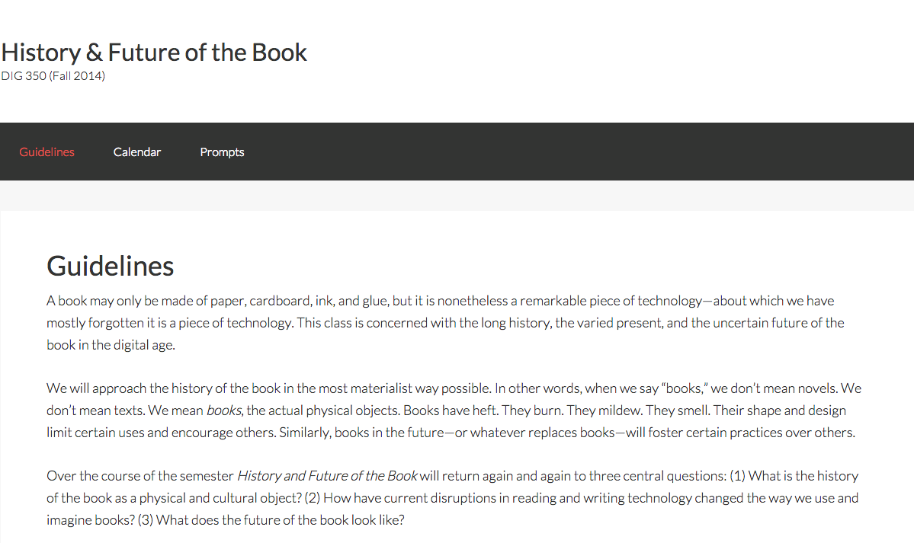
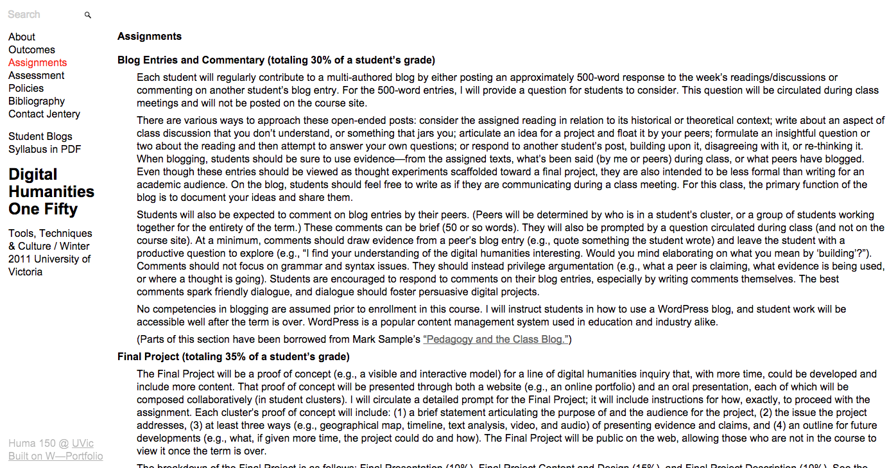

# Blogging

### Diane K. Jakacki

Bucknell University | [http://dianejakacki.net](http://dianejakacki.net)
---
##### Publication Status:
* unreviewed draft
* draft version undergoing editorial review
* **draft version undergoing peer-to-peer review**
* published 

--- 
## CURATORIAL STATEMENT

Blogging offers instructors rich, dynamic environments that challenge students to focus on process and audience, and to disrupt patterns and habits developed when writing more traditional essay forms. In first-year composition courses instructors can use blogging assignments to introduce students to critical thinking, argument, and analysis. In more advanced literary and cultural studies courses, blogs help students to engage with complex subject matter, enhancing reflection through collaborative writing. In communications and professional writing courses, students experiment with different rhetorical approaches, voice, and consider degrees of public and private discourse. The most robust of these assignments are scaffolded across the semester, reinforcing course objectives and establishing new learning paradigms; the drafting process changes and emphasis shifts from revise-and-submit to cumulative improvement, with more moments for instructors to point out to students when and how they improve.

Blogging assignments are challenging for instructors because they require more attention to design, implementation, and evaluation than traditional essay formats. Instructors must be specific about what is expected: definition of success must be clearly articulated, integration of an often unfamiliar format must be explained, and students' discomfort with writing in this mode must be managed. Students may have trouble adjusting to a content management system dashboard environment; therefore, the instructor may incorporate preparatory exercises that help students to master the mechanics of blog writing before the first formal post is assigned, thus ensuring that students can succeed in unfamiliar writing environments. Emphasis on prompt clarity is also important. A prompt may be intentionally vague or prescriptive: vagary can be helpful when the goal is for students to experiment with voice and form; specificity is valuable when an assignment calls for students to conform to a particular style.  

Straightforward blog assignments may suggest easily implemented substitutes for short print-and-submit essays, and some instructors experiment with low-risk blog assignments to gain confidence. But as instructors gain confidence they should try more creative approaches. Assignments that encourage students to think about voice can become assignments in which students create personae and write as characters; assignments in which students focus on design can be expanded to those in which students build their own sites. Boone Gorges and Ryan Cordell have employed this model, and illustrate ways to effectively pull individual student blogs into one central "hub" space to effect community. Gorges participates as a blog contributor in the hub site, using his posts to call attention to and contextualize individual student posts. His posts thus serve as guides for further student consideration of their own and other students' posts.

The instructor must think carefully about the type and degree of feedback they are able to provide to students. In large composition courses, instructors must provide meaningful qualitative assessment; a process-based blog assignment constituting multiple posts and comments is a challenge. Streamlining the review process helps the instructor to avoid  grading backlog that ultimately undermines the idea of developmental writing across the semester. Katy Crowther found a creative solution to the grading problem by incorporating a student editor component into her assignment. Crowther's students took turns serving as guest-editors, reading all posts and publishing an overview that tied them all together (“Putting Students to Work”; “Punking the Victorians”). Her students gained agency as well as insight into the assessment process, and she was able to let go of some  qualitative feedback.

Blogging environments offer instructors ways to help student authors consider audience and degrees of privacy and publicity. Students begin to experiment with style when they realize that their classmates are also their readers. Because blogs are traditionally public-facing and openly readable, instructors can use blogging assignments to address the benefits and potential pitfalls of accessibility. While platforms such as WordPress offer authors flexibility in terms of audience, an instructor who is new to blogging may opt for more conservative, restricted readership, perhaps expanding audience as students gain confidence. Students should also have a voice in whether and how their work is published beyond the classroom. Anonymization may be an option, and is particularly valuable when concerns about identity are a factor. Jacqueline Wernimont has written about online acts of violence perpetrated against students and instructors, and how this is often directed at women (Wernimont 2016). Instructors must design assignments responsibly, especially when encouraging students to identify themselves in their posts. Instructors should also be aware of institutional policies and safeguards regarding the protection of students (and themselves) in online and social media environments, and understand what options are available if violence affects students. 

The artifacts presented here offer a breadth of approach by instructors who encourage experimentation to students as they write and read. While the examples are all from humanities courses, the assignments are adaptable enough to be used more broadly in composition, literature, or media studies courses.

## CURATED ARTIFACTS

#### "Texts, Maps, Networks: Digital Literary"

* Artifact Type: Assignment
* Source URL: [http://f14tmn.ryancordell.org/assignments/class-blogging/](http://f14tmn.ryancordell.org/assignments/class-blogging/)
* Copy of the Artifact: Course site hosted by the University on the Wordpress platform. As of 2/21/2016 student work is publicly viewable, although several of the student sites have been taken down and some links lead to 404 errors.
* Creator and Affiliation: Ryan Cordell, Northeastern University

This assignment is distinctive in that it is built upon another, in which students are required to set up their own [website](Cordell http://bit.ly/1n68PaP) Cordell then collects site details and aggregates posts into the master course site. Students are expected to write at the end of each course module, posting and commenting upon classmates' posts at least three times. The title for each post appears on the course site and links to the relevant post on the student's site, which is also where comments are posted. The rubric is general and evaluation is unclear, but Cordell indicates that he will supply more detailed feedback upon student request. 

#### "Blogging about Duffy's Manuscripts" 

* Artifact Type: Assignment
* Source URL: [http://www.briancroxall.net/dh/assignments/blogging-about-duffys-manuscripts/](http://www.briancroxall.net/dh/assignments/blogging-about-duffys-manuscripts/)
* Copy of the Artifact: Blog hosted on Croxall's website on the Wordpress platform. As of 2/21/2016 student work is publicly viewable.
* Creator and Affiliation: Brian Croxall, Emory University

This artifact is one element of a larger blogging assignment. The two assigned posts focus on reflection of work done with poem manuscripts at Emory's rare books library (MARBL). Students choose two poems by Carol Duffy, go to MARBL to find the physical manuscript pages, and write about their experience working with manuscript copies of the poem and printed versions they have read for class. Students are free to write about anything that intrigues them. Croxall invites them to write more than two posts and proposes two choices
for adjusting grading of the overall blogging assignment if a student does so. On the course website Croxall gives an explanation about why he assigns blogs (Croxall 2011), and emphasizes the conversational nature of blogging. This straightforward assignment could be readily adapted for a literature course with special emphasis on the relationship between manuscript and print. 

#### "Thinking Goodly: Introduction to Ethics" 

* Artifact Type: Course site with blog comments and links
* Source URL: [https://boonebgorges.wordpress.com/2008/11/20/in-the-blogs-11202008/](https://boonebgorges.wordpress.com/2008/11/20/in-the-blogs-11202008/)
* Copy of the Artifact: Blog hosted by Gorges on a course-specific website on the Wordpress.com platform. As of 2/21/2016 only some student work is publicly viewable (several students have deleted their blogs).
* Creator and Affiliation: Boone Gorges, Hofstra University

While this assignment from 2009 is old by digital pedagogy standards, Gorges's use of the hub-and-spoke blogging structure offers an interesting approach to public writing. The mechanisms (prompt, commentary, and links to student posts) are still available, inline with other course assignments on the course site. Post and comment submission deadlines are staggered, giving students time to comment upon one another's work. Gorges reads a selection of posts twice weekly, and aggregates several posts into the course site (the twice weekly "In the blogs" posts), which he notes results in better reading and commenting on specific posts. It is unclear whether Gorges manages grading this way, or just models good posting. This is an ambitious assignment, and Gorges acknowledges that it is not for the faint of heart (Gorges 2009). 

#### "Digging into the Digital" 

* Artifact Type: Assignment and rubric
* Source URL: [http://diggingdigital.blogs.bucknell.edu/reflection-posts/](http://diggingdigital.blogs.bucknell.edu/reflection-posts/)
* Copy of the Artifact: Blog hosted by the University in the Wordpress platform. As of 2/21/2016 student work is publicly viewable.
* Creator and Affiliation: Diane Jakacki, Bucknell University

This semester-long assignment (five posts) is a reflection/project presentation exercise, reinforcing the course focus on digital humanities praxis using a set of archival materials. Students examine scholarly DH resources and read a selection of articles and essays about DH research and methodology, and then reflect upon that scholarly work in context with and embedded presentation of their own work that could not be accomplished through more traditional essay forms. Within their posts they also embed, link to, or include screenshots of the artifacts they produce for each module (story maps, timeline entries, data visualizations, digital edition). The assignment reinforces the idea that student work exists along a spectrum with work produced by established scholars. They experiment with voice and visual rhetoric while they discuss process and product. 

#### Title of Artifact: "Shakespeare's (English) Histories”

* Artifact Type: Assignment and rubric
* Source URL: [http://blogs.iac.gatech.edu/henriad/short-research-project/](http://blogs.iac.gatech.edu/henriad/short-research-project/)
* Copy of the Artifact: Course site hosted by the University in the Wordpress platform. As of 2/21/2016 the course site with assignment descriptions is publicly viewable; student work is private.
* Creator and Affiliation: Diane Jakacki, Georgia Institute of Technology

This is one of two blog assignments in the course and is related to a research project. It involves two written augmentations to the formal in-class presentation: 1) a published abstract for each student project, including scholarly sources and media to be used in presentation; 2) a platform for peer feedback. The draft abstract was reviewed by Jakacki and Georgia Tech subject librarian Sherri Brown for revision. At the end of each student's presentation all students employed the comment feature on the presenter's abstract to give immediate feedback. The abstract was marked in draft and revised phases; all students received a completion mark for each comment, and peer feedback was incorporated into the presenter's grade. This assignment uses the blog to bridge the gap between in-class and written work, and reinforces the importance of constructive peer review.

#### "Media, Materiality, and Archives" 

* Artifact Type: Syllabus
* Source URL: [http://blogs.iac.gatech.edu/archives16/syllabus/](http://blogs.iac.gatech.edu/archives16/syllabus/)
* Copy of the Artifact: Course site hosted by the University in the Wordpress platform. As fo 2/21/2016 student work is visible. 
* Creator and Affiliation: Lauren Klein, Georgia Institute of Technology

Klein's assignment demonstrates how blogs can form complex collaborative writing environments, with different writing tasks assigned over what she calls "cycles". 

Students are broken into four groups; each group has a different task each week of a cycle: they serve as First Readers, Respondents, or Searchers (the fourth group gets a week off). Klein outlines what these tasks consist of, and how each student's work will be assessed per cycle (there are two cycles of 12 possible points each). In reading student work, it appears that blog writing is rooted in weekly readings(11), however the prompts are available only via Georgia Tech's LMS and so not available for review. This is a complex assignment, one better suited for an instructor who has experience assigning collaborative online writing. Commitment to explaining different tasks would be crucial for student success for an assignment worth 24% of the course grade.

#### "Selfies, Snapchat, & Cyberbullies: Coming of Age Online" 

* Artifact Type: Assignment
* Source URL: [http://miriamposner.com/dh150w15/assignments/weekly-blog-posts/](http://miriamposner.com/dh150w15/assignments/weekly-blog-posts/)
* Copy of Artifact: Blog hosted on Posner's website on the Wordpress platform. As of 2/21/2016 student work is publicly viewable.
* Creator and Affiliation: Miriam Posner, UCLA

In this clear, straightforward weekly assignment students submit a 300-400 word blog post that brings course readings in line with media that students encounter in daily life. Posts are submitted early in the week in advance of class; Posner instructs students to include some form of media or link that refers to the media item the writer describes, with an explanation of how their experience with the thing relates to the reading. Students post two substantial comments on classmates' work. The rubric is simple but evaluation is intentionally vague: Posner explains what she expects with a link to examples of other students' posts from a previous course. The assignment is tied to her Contract Grading system. Posts apparently are marked as complete. This assignment would be easy to adapt to many courses, and the focus on student self-evaluation addresses concerns about granular feedback of many blog assignments.

#### "History & Future of the Book" 

* Artifact Type: Assignment
* Source URL: [http://sites.davidson.edu/dig350/guidelines/](http://sites.davidson.edu/dig350/guidelines/)
* Copy of Artifact: Blog hosted on University website on the Wordpress platform. As of 2/21/2016 student work is publicly viewable.
* Creator and Affiliation: Mark Sample, Davidson College

This is a straightforward blogging assignment, with ten 400-500 word posts over the semester. Prompts are simple and rooted in each week's reading. Posts are graded on a four point scale. Sample has developed this rubric over time; his approach to evaluation involves walking the class through examples of exceptional student work, giving periodic feedback via comments, and assigning a self-evaluation via "meta" post halfway through the term.

This type of assignment is easily adaptable to various course environments. The rubric and grading methodology is also one that an instructor new to blogging could adopt with confidence. One thing to consider about any blog, and to which Sample alludes, is that this type of assignment involves a significant amount of writing: ten posts are worth 20% of the grade: approximately 5,000 words over the course of the semester equals a 10-12 page essay. 

#### "Tools, Techniques & Culture" 

* Artifact type: Assignment
* Source URL: [http://jenteryteaches.com/2011/150/assignments/](http://jenteryteaches.com/2011/150/assignments/)
* Copy of Artifact: Blog hosted by Sayers on a Wordpress platform (unclear if this is hosted on the university's server). As of 2/21/2016 student work is password-protected.
* Creator and Affiliation: Jentery Sayers, University of Victoria

This assignment is included specifically because it keeps student work public and does not offer prompts. The assignment as outlined on the course site is clearly explained as belonging to the class and in many ways offline (prompts are circulated in class but not posted on the site, for example). Sayers explains that students will post and comment in group or clusters, so a very organic form of collaborative writing evolves over the semester. Post expectations are open-ended - Sayers emphasizes that there are different approaches to blogging, and that posts can be reflections upon reading or discussion and should make the writer in some way uncomfortable.

Entries and commentaries comprise a significant (30%) portion of the student grade, with three grades given over the course of the term: Sayers explains that each grade consists of a minimum of two blog entries and a comment.

#### "Virtually London: Literature and Laptops" 

* Artifact Type: Rubric
* Source URL: [https://hawksites.newpaltz.edu/virtuallylondon/grading-rubric/](https://hawksites.newpaltz.edu/virtuallylondon/grading-rubric/)
* Copy of Artifact: Blog hosted by the University in the Wordpress platform. As of 2/21/2016 student work is publicly viewable.
* Creator and Affiliation: Annie Swafford, SUNY New Paltz

There are two blogging assignments in this Literature course: one scaffolded across the semester and one related to the final mapping project. This annotation focuses on the scaffolded "Online Assignments." The blogging assignments are analytical in nature, and in aggregate constitute the largest component of the course grade (36%, or 4 pts. each for nine posts). Swafford includes step-by-step tutorials designed to help students learn how to compose in a blog interface, to acclimate to the blogging style and expectations. Each subsequent prompt offers context and explicit instructions about what the post should include.

The Blogging Rubric is clearly articulated: evaluation is on a four-point scale. Students are expected to comment on one another's posts, but commenting is not broken out in the rubric or given any kind of separate completion mark.

## RELATED MATERIALS

Croxall, Brian. "Assignments and Architecture." Video recording. Penn State Liberal Arts Scholarship and Technology Summit, 2014. 27 February 2016. [https://www.youtube.com/watch?v=xHAfQ9fEJiU](https://www.youtube.com/watch?v=xHAfQ9fEJiU).

Gorges, Boone. "Hub-and-Spoke Blogging with Lots of Students". 2009. Web. 27 February 2016. [https://teleogistic.net/2009/08/20/hub-and-spoke-blogging-with-lots-of-students/](https://teleogistic.net/2009/08/20/hub-and-spoke-blogging-with-lots-of-students/) 

McClurcken, Jeff and Julie Meloni. "'How Are You Going to Grade This?' Evaluating Classroom Blogs." Profhacker - Chronicle of Higher Education. 21 June 2010. 27 February 2016. [http://chronicle.com/blogs/profhacker/how-are-you-going-to-grade-this-evaluating-classroom-blogs/24935](http://chronicle.com/blogs/profhacker/how-are-you-going-to-grade-this-evaluating-classroom-blogs/24935) 

Sample, Mark. "Pedagogy and the Class Blog". samplereality.com August 14, 2009. Web. 27 February 2016. [http://www.samplereality.com/2009/08/14/pedagogy-and-the-class-blog/](http://www.samplereality.com/2009/08/14/pedagogy-and-the-class-blog/)

## WORKS CITED
Cordell, Ryan. "Texts, Maps, Networks: Digital Literary Studies." [http://f14tmn.ryancordell.org/](http://f14tmn.ryancordell.org/). Web. Accessed February 2016. 

Crowther, Kathryn. "Putting Students to Work: Guest Hosting a "Best Blog" Round-Up." TECHStyle. November 12, 2011. [http://techstyle.lmc.gatech.edu/putting-students-to-work-guest-hosting-a-best-blog-round-up/](http://techstyle.lmc.gatech.edu/putting-students-to-work-guest-hosting-a-best-blog-round-up/). Web. Accessed. 27 February 2016. 

---. "Punking the Victorians, Punking Pedagogy: Steampunk and Creative Assignments in the Composition Classroom." Journal of Victorian Culture Online. September 6, 2012. [http://blogs.tandf.co.uk/jvc/2012/09/06/punking-the-victorians-punking-pedagogy-steampunk-and-creative-assignments-in-the-composition-classroom/](http://blogs.tandf.co.uk/jvc/2012/09/06/punking-the-victorians-punking-pedagogy-steampunk-and-creative-assignments-in-the-composition-classroom/). Web. Accessed 27 February 2016. 

Croxall, Brian. "Introduction to Digital Humanities." [http://www.briancroxall.net/dh/](http://www.briancroxall.net/dh/). Web. Accessed 27 February 2016. 

---. "Assignments and Architecture." Penn State Liberal Arts Scholarship and Technology Summit, 2014. [https://www.youtube.com/watch?v=xHAfQ9fEJiU](https://www.youtube.com/watch?v=xHAfQ9fEJiU). Web. Accessed 27 February 2016. 

Gorges, Boone. "Thinking Goodly: Introduction to Ethics." [https://boonebgorges.wordpress.com/](https://boonebgorges.wordpress.com/). Web. Accessed 27 February 2016. 

---. "Hub-and-Spoke Blogging with Lots of Students". [https://teleogistic.net/2009/08/20/hub-and-spoke-blogging-with-lots-of-students/](https://teleogistic.net/2009/08/20/hub-and-spoke-blogging-with-lots-of-students/). Web. Accessed 27 February 2016. 

Jakacki, Diane. "Digging into the Digital." [http://diggingdigital.blogs.bucknell.edu/](http://diggingdigital.blogs.bucknell.edu/). Web. Accessed 27 February 2016. 

---. "Shakespeare's (English) Histories." [http://blogs.iac.gatech.edu/henriad/](http://blogs.iac.gatech.edu/henriad/). Web. Accessed 27 February 2016.

Klein, Lauren. "Media, Materiality, and Archives." [http://blogs.iac.gatech.edu/archives16/](http://blogs.iac.gatech.edu/archives16/). Web. Accessed 27 February 2016. 

McClurcken, Jeff and Julie Meloni. "'How Are You Going to Grade This?' Evaluating Classroom Blogs." Profhacker - Chronicle of Higher Education. 21 June 2010. [http://chronicle.com/blogs/profhacker/how-are-you-going-to-grade-this-evaluating-classroom-blogs/24935](http://chronicle.com/blogs/profhacker/how-are-you-going-to-grade-this-evaluating-classroom-blogs/24935). Web. Accessed 27 February 2016. 

Owens, Trevor. "The Public Course Blog: The Required Reading We Write Ourselves for the Course That Never Ends." Debates in the Digital Humanities. 2013. [http://dhdebates.gc.cuny.edu/debates/text/6](http://dhdebates.gc.cuny.edu/debates/text/6). Web. 27 February 2016. 

Posner, Miriam. "Selfies, Snapchat, & Cyberbullies: Coming of Age Online." [http://miriamposner.com/dh150w15/](http://miriamposner.com/dh150w15/). Web. Accessed 27 February 2016. 

Salter, Anastasia. "Re-evaluating the Risks of Public Scholarship." ProfHacker - The Chronicle of Higher Education. June 4, 2015. [http://chronicle.com/blogs/profhacker/re-evaluating-the-risks-of-public-scholarship/60229](http://chronicle.com/blogs/profhacker/re-evaluating-the-risks-of-public-scholarship/60229). Web. Accessed 27 February 2016. 

---. "Revisiting Your Learning Management System." Profhacker - The Chronicle of Higher Education. April 18, 2013. [http://chronicle.com/blogs/profhacker/revisiting-your-lms/48441](http://chronicle.com/blogs/profhacker/revisiting-your-lms/48441). Web. Accessed 27 February 2016. 

Sample, Mark. "History & Future of the Book." [http://sites.davidson.edu/dig350/](http://sites.davidson.edu/dig350/). Web. Accessed 27 February 2016. 

---. "A Better Blogging Assignment." ProfHacker - The Chronicle of Higher Education. July 3, 2012. [http://chronicle.com/blogs/profhacker/a-better-blogging-assignment/41127](http://chronicle.com/blogs/profhacker/a-better-blogging-assignment/41127). Web. Accessed 27 February 2016. 

---. "Pedagogy and the Class Blog". samplereality.com August 14, 2009. [http://www.samplereality.com/2009/08/14/pedagogy-and-the-class-blog/](http://www.samplereality.com/2009/08/14/pedagogy-and-the-class-blog/). Web. Accessed 27 February 2016. 

Sayers, Jentery. "Tools, Techniques & Culture." [http://jenteryteaches.com/2011/150/](http://jenteryteaches.com/2011/150/). Web. Accessed 27 February 2016. 

---. "Huma 150: Intro to Digital Humanities Fall 2011 (28 Students). jenterysayers.com. 2011. [http://www.jenterysayers.com/2011/150/](http://www.jenterysayers.com/2011/150/). Web. Accessed 27 February 2016. 

Schulman, Martha and Gwen Hyman. "In Defense of Essays." Inside Higher Ed. Feb. 19, 2016. [https://www.insidehighered.com/views/2016/02/19/colleges-should-invest-more-teaching-students-how-write-essay](https://www.insidehighered.com/views/2016/02/19/colleges-should-invest-more-teaching-students-how-write-essay). Web. Accessed 27 February 2016. 

Swafford, Annie. "Virtually London: Literature and Laptops." [https://hawksites.newpaltz.edu/virtuallylondon/](https://hawksites.newpaltz.edu/virtuallylondon/). Web.Accessed 27 February 2016.

Wernimont, Jacqueline. "Social Norms, Not Tech, Fuel Abuse." WWC Speech Project. September 8, 2015. [http://wmcspeechproject.com/2016/02/11/social-norms-not-tech-fuel-abuse/](http://wmcspeechproject.com/2016/02/11/social-norms-not-tech-fuel-abuse/). Web. Accessed 04 April 2016.
