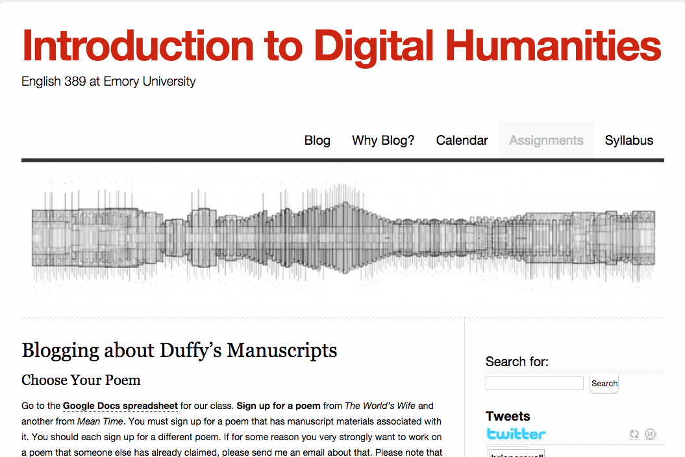
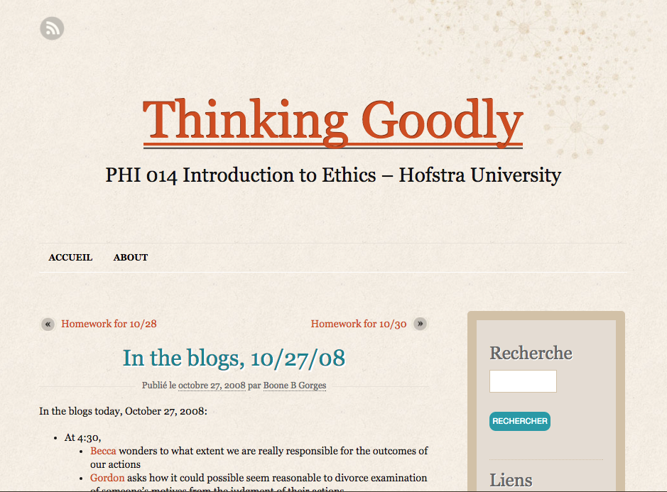
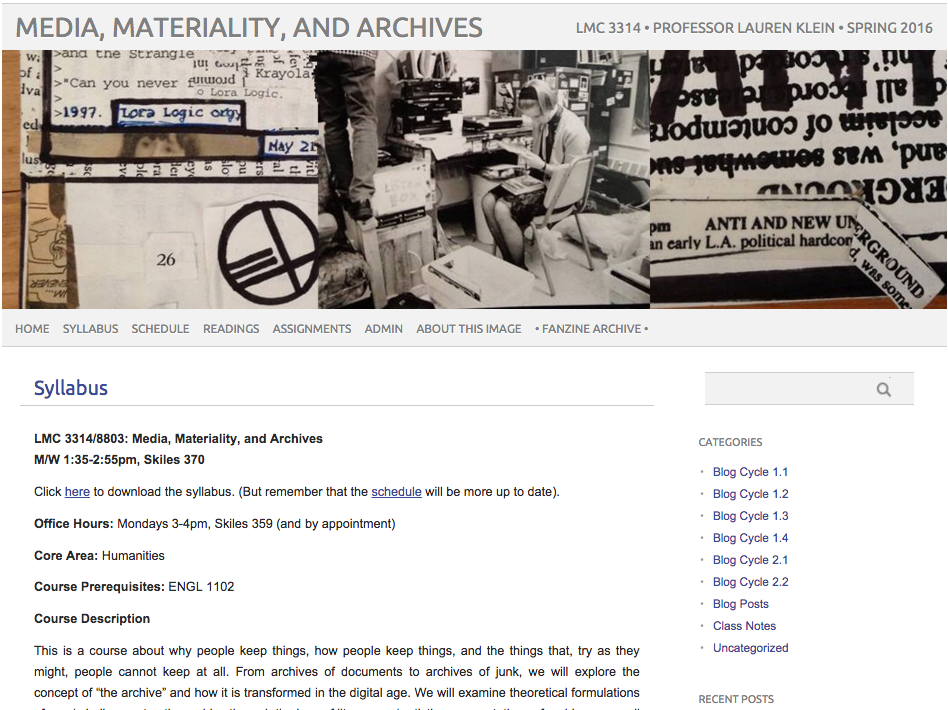
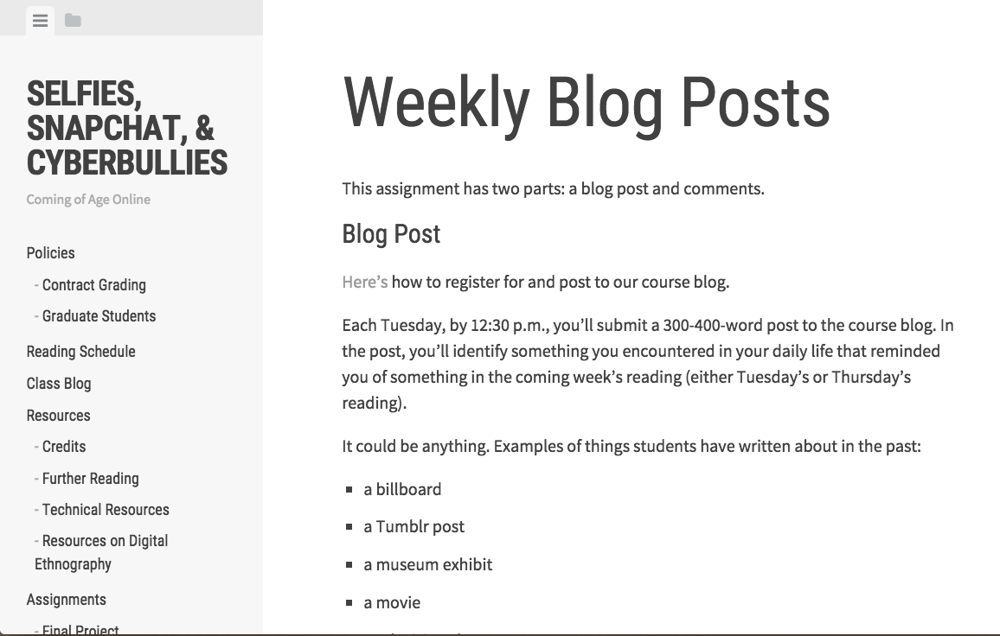
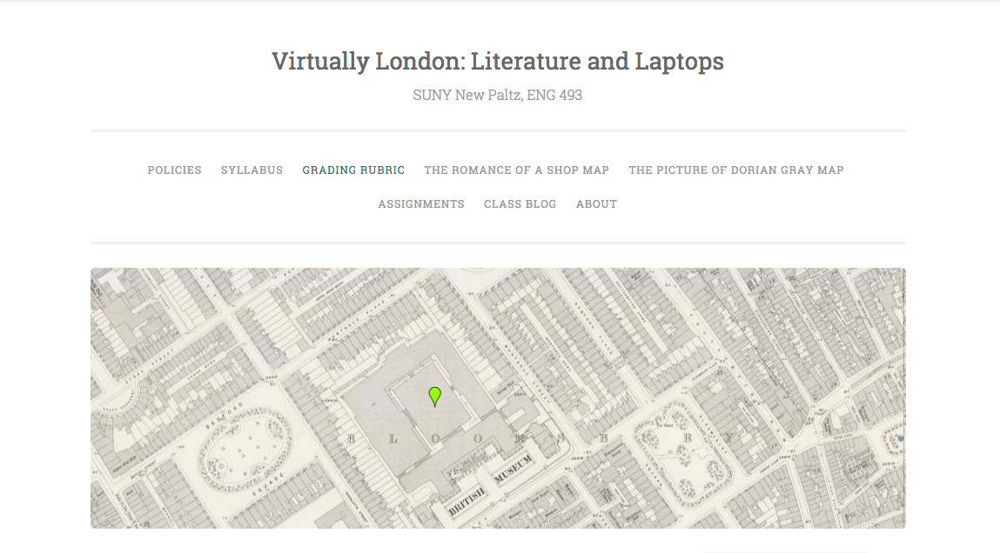

# Blogging

### Diane K. Jakacki

Bucknell University | [http://dianejakacki.net](http://dianejakacki.net)
---
##### Publication Status:
* unreviewed draft
* draft version undergoing editorial review
* **draft version undergoing peer-to-peer review** https://digitalpedagogy.commons.mla.org/
* published 
--- 
## CURATORIAL STATEMENT

Blogging offers instructors rich, dynamic writing environments that challenge students to focus on process and audience, to reframe the act of composing across media, and to disrupt patterns and habits developed when writing more traditional essay structures. 

From its earliest incarnations in 1980s internet forums and newsgroups, blogging has provided opportunities for self-expression and rhetorical experimentation in shared and public environments. As more professional publications and media outlets have adopted online content management systems we have changed how and who we read on screens, with authors from journalistic, political, and academic realms writing in modes that blur generic lines. Many of these writers continue to experiment with different forms of social media communication, joining in micro- and media rich blogging discourse, coming full-circle to the collaborative communication practices of those early affinity groups, engaging overtly as both writers and readers; authors and commenters.

Blogging in a class environment unsettles students: they are forced to experiment with a more personal and sometimes casual writing style, use the active voice, and emphasize their own opinions. Instructors can use blogging assignments to introduce students to critical thinking, argument, and analysis; to engage with complex suject matter, enhancing reflection through collaborative writing. Blogging environments offer ways to challenge student authors to consider degrees of privacy and publicity. Students begin to experiment with style when they realize that their classmates are also their readers, and that their readers may respond to what they write. Because blogs are traditionally public-facing and openly readable, instructors can use blogging assignments to address the benefits and potential pitfalls of writing in the public sphere. Most content and learning management systems do include privacy settings that can limit access to just the classroom.

Straightforward blog assignments may suggest easily implemented substitutes for short print-and-submit essays, and some instructors experiment with low-risk blog assignments to gain confidence. But as instructors gain confidence they should try more creative approaches. Assignments that encourage students to think about voice can become assignments in which students create personae and write as characters; assignments in which students focus on design can be expanded to those in which students build their own sites. The most robust of these assignments are scaffolded across the semester, reinforcing course objectives and establishing new learning paradigms; the drafting process changes and emphasis shifts from revise-and-submit to cumulative improvement, with more moments for instructors to point out to students when and how they improve. Boone Gorges and Ryan Cordell have employed this model, and illustrate ways to effectively pull individual student blogs into one central "hub" space to effect community. Gorges participates as a blog contributor in the hub site, using his posts to call attention to and contextualize individual student posts. 

The instructor must think carefully about the type and degree of feedback they are able to provide to students. Streamlining the review process helps the instructor to avoid grading backlog that ultimately undermines the idea of developmental writing across the semester. Mark Sample has developed a useful straightforward rubric that emphasizes expectation and avoids granular feedback ("Pedagogy and the Class Blog"). Katy Crowther found a creative solution to the grading problem by having students take turns serving as guest-editors, reading all posts and publishing an overview that tied them all together (“Putting Students to Work”; “Punking the Victorians”). Her students gained agency as well as insight into the assessment process.

As with other progressive forms of pedagogy involving technology, blogging assignments are challenging for instructors because they require more attention to design, implementation, and evaluation than traditional essay formats. Instructors must be specific about expectations for success; integration of an often unfamiliar format must be explained; and students' discomfort with writing in this mode must be managed. Instructors may consider incorporating preparatory exercises that help students to master the mechanics of blog writing before the first formal post is assigned. Emphasis on prompt clarity is also important. A prompt may be intentionally vague or prescriptive: vagary can be helpful when the goal is for students to experiment with voice and form; specificity is valuable when an assignment calls for students to conform to a particular style.  

Students should have a voice in whether and how their work is published beyond the classroom. Anonymization may be an option, and is particularly valuable when concerns about identity are a factor. Instructors must design assignments responsibly, especially when encouraging students to identify themselves in their posts. Instructors should also be aware of institutional policies and safeguards regarding the identification and protection of students in online and social media environments. 

The artifacts presented here offer a breadth of approaches to blogging as experimentatal and progressive forms of writing and reading. The assignments are adaptable to composition, humanities, and media studies courses at undergraduate and graduate levels.
 
## CURATED ARTIFACTS

#### "Social Media and Digital Collaborative Applications: Microblogging"
![screenshot]
* Artifact Type: Syllabus
* Source URL: [https://learntech.gmu.edu/assets/docs/syllabi/2017/syllabus_28003.pdf](https://learntech.gmu.edu/assets/docs/syllabi/2017/syllabus_28003.pdf)
* Copy of Artifact: Syllabus is in PDF format hosted on GMU website. As of 9/18/2017 the syllabus is accessible and downloadable.
* Creator and Affiliation: Karen Cooper, George Mason University

This graduate-level course challenges students to critique various microblogging applications as they compose in text- image- and video-oriented platforms. Offered for GMU's Instructional Design and Technology Program, the course focuses on preparing instructional technologists to use microblogging (Twitter, Instagram, and Snap Chat) effectively to support faculty in their own teaching.   

The syllabus outlines the structure of the course; the course materials and students' completed assignments (and reflection blogs) are secured behind the university's LMS. The assignment focus appears to be on preparation and posting to the microblogging platforms, but it is unclear whether the emphasis is on crafting posts or that students interact with classmates or other bloggers. 

These assignments could be adapted into a variety of undergraduate and graduate rhetoric and communication courses. Instructors might complicate the assignment by challenging students to craft multi-part "threads" or critiquing their experience interacting with otherwise unknown interlocutors.

#### "Texts, Maps, Networks: Digital Literary"

* Artifact Type: Assignment
* Source URL: [http://f14tmn.ryancordell.org/assignments/class-blogging/](http://f14tmn.ryancordell.org/assignments/class-blogging/)
* Copy of the Artifact: Course site hosted by the University on the Wordpress platform. As of 9/18/2017 student work is publicly viewable, although several of the student sites have been taken down and some links lead to 404 errors.
* Creator and Affiliation: Ryan Cordell, Northeastern University

This assignment is distinctive in that it is built upon another, in which students are required to set up their own [website](Cordell http://bit.ly/1n68PaP) Cordell then collects site details and aggregates posts into the master course site. Students are expected to write at the end of each course module, posting and commenting upon classmates' posts at least three times. The title for each post appears on the course site and links to the relevant post on the student's site, which is also where comments are posted. The rubric is general and evaluation is unclear, but Cordell indicates that he will supply more detailed feedback upon student request. 

#### "Blogging about Duffy's Manuscripts" 

* Artifact Type: Assignment
* Source URL: [http://www.briancroxall.net/dh/assignments/blogging-about-duffys-manuscripts/](http://www.briancroxall.net/dh/assignments/blogging-about-duffys-manuscripts/)
* Copy of the Artifact: Blog hosted on Croxall's website on the Wordpress platform. As of 9/18/2017 student work is publicly viewable.
* Creator and Affiliation: Brian Croxall, Emory University

This artifact is one element of a larger blogging assignment. The two assigned posts focus on reflection of work done with poem manuscripts at Emory's rare books library (MARBL). Students choose two poems by Carol Duffy, go to MARBL to find the physical manuscript pages, and write about their experience working with manuscript copies of the poem and printed versions they have read for class. Students are free to write about anything that intrigues them. Croxall invites them to write more than two posts and proposes two choices
for adjusting grading of the overall blogging assignment if a student does so. On the course website Croxall gives an explanation about why he assigns blogs (Croxall 2011), and emphasizes the conversational nature of blogging. This straightforward assignment could be readily adapted for a literature course with special emphasis on the relationship between manuscript and print. 

#### "Thinking Goodly: Introduction to Ethics" 

* Artifact Type: Course site with blog comments and links
* Source URL: [https://boonebgorges.wordpress.com/2008/11/20/in-the-blogs-11202008/](https://boonebgorges.wordpress.com/2008/11/20/in-the-blogs-11202008/)
* Copy of the Artifact: Blog hosted by Gorges on a course-specific website on the Wordpress.com platform. As of 9/18/2017 only some student work is publicly viewable (several students have deleted their blogs).
* Creator and Affiliation: Boone Gorges, Hofstra University

While this assignment from 2009 is old by digital pedagogy standards, Gorges's use of the hub-and-spoke blogging structure offers an interesting approach to public writing. The mechanisms (prompt, commentary, and links to student posts) are still available, inline with other course assignments on the course site. Post and comment submission deadlines are staggered, giving students time to comment upon one another's work. Gorges reads a selection of posts twice weekly, and aggregates several posts into the course site (the twice weekly "In the blogs" posts), which he notes results in better reading and commenting on specific posts. It is unclear whether Gorges manages grading this way, or just models good posting. This is an ambitious assignment, and Gorges acknowledges that it is not for the faint of heart (Gorges 2009). 

#### Title of Artifact: "Shakespeare's (English) Histories”

* Artifact Type: Assignment and rubric
* Source URL: [http://blogs.iac.gatech.edu/henriad/short-research-project/](http://blogs.iac.gatech.edu/henriad/short-research-project/)
* Copy of the Artifact: Course site hosted by the University in the Wordpress platform. As of 9/18/2017 the course site with assignment descriptions is publicly viewable; student work is private.
* Creator and Affiliation: Diane Jakacki, Georgia Institute of Technology

This is one of two blog assignments in the course and is related to a research project. It involves two written augmentations to the formal in-class presentation: 1) a published abstract for each student project, including scholarly sources and media to be used in presentation; 2) a platform for peer feedback. The draft abstract was reviewed by me and Georgia Tech subject librarian Sherri Brown for revision. At the end of each student's presentation all students employed the comment feature on the presenter's abstract to give immediate feedback. The abstract was marked in draft and revised phases; all students received a completion mark for each comment, and peer feedback was incorporated into the presenter's grade. This assignment uses the blog to bridge the gap between in-class and written work, and reinforces the importance of constructive peer review.

#### "Media, Materiality, and Archives" 

* Artifact Type: Syllabus
* Source URL: [http://blogs.iac.gatech.edu/archives16/syllabus/](http://blogs.iac.gatech.edu/archives16/syllabus/)
* Copy of the Artifact: Course site hosted by the University in the Wordpress platform. As fo 9/18/2017 student work is visible. 
* Creator and Affiliation: Lauren Klein, Georgia Institute of Technology

Klein's assignment demonstrates how blogs can form complex collaborative writing environments, with different writing tasks assigned over what she calls "cycles". 

Students are broken into four groups; each group has a different task each week of a cycle: they serve as First Readers, Respondents, or Searchers (the fourth group gets a week off). Klein outlines what these tasks consist of, and how each student's work will be assessed per cycle (there are two cycles of 12 possible points each). In reading student work, it appears that blog writing is rooted in weekly readings(11), however the prompts are available only via Georgia Tech's LMS and so not available for review. This is a complex assignment, one better suited for an instructor who has experience assigning collaborative online writing. Commitment to explaining different tasks would be crucial for student success for an assignment worth 24% of the course grade.

#### "The Art of Blogging"
![screenshot]
* Artifact type: Assignment
* Source URL: [https://my.vanderbilt.edu/artofblogging/cv/]
* Copy of Artifact: Website hosted on Vanderbilt WordPress platform. As of  9/18/2017 the assignment is accessible.
* Creator and Affiliation: Amanda Little, Vanderbilt University
Fall 2012

In this semester-long scaffolded assignment for a 200-level Non-Fiction Writing course students read and critique different professional blogs as they develop their own and read one another's on an ongoing basis. 

Over thirteen weeks students maintain their blogs with a series of freestyle and prescribed styles (e.g., "manifesto"). Students read the work of professional bloggers as well as essays on the history of blogging and how it has changed public discourse. For this iteration of the course Little scheduled a series of Skype sessions with blog authors to discuss particular subject matter, style, and professional writing. 

Little's prompts are exceptionally clear and comprehensive, explaining why as well as how assignments shold be developed. Blog posts collectively account for 50% of the course grade; a rubric is not included on the webpage.
This assignment would be a strong component of a course on life-writing or professional communication.

#### "Selfies, Snapchat, & Cyberbullies: Coming of Age Online" 

* Artifact Type: Assignment
* Source URL: [http://miriamposner.com/dh150w15/assignments/weekly-blog-posts/](http://miriamposner.com/dh150w15/assignments/weekly-blog-posts/)
* Copy of Artifact: Blog hosted on Posner's website on the Wordpress platform. As of 9/18/2017 student work is publicly viewable.
* Creator and Affiliation: Miriam Posner, UCLA

In this clear, straightforward weekly assignment students submit a 300-400 word blog post that brings course readings in line with media that students encounter in daily life. Posts are submitted early in the week in advance of class; Posner instructs students to include some form of media or link that refers to the media item the writer describes, with an explanation of how their experience with the thing relates to the reading. Students post two substantial comments on classmates' work. The rubric is simple but evaluation is intentionally vague: Posner explains what she expects with a link to examples of other students' posts from a previous course. The assignment is tied to her Contract Grading system. Posts apparently are marked as complete. This assignment would be easy to adapt to many courses, and the focus on student self-evaluation addresses concerns about granular feedback of many blog assignments.

#### "Tools, Techniques & Culture" 

* Artifact type: Assignment
* Source URL: [http://jenteryteaches.com/2011/150/assignments/](http://jenteryteaches.com/2011/150/assignments/)
* Copy of Artifact: Blog hosted by Sayers on a Wordpress platform (unclear if this is hosted on the university's server). As of 9/17/2017 student work is password-protected.
* Creator and Affiliation: Jentery Sayers, University of Victoria

This assignment is included specifically because it keeps student work public and does not offer prompts. The assignment as outlined on the course site is clearly explained as belonging to the class and in many ways offline (prompts are circulated in class but not posted on the site, for example). Sayers explains that students will post and comment in group or clusters, so a very organic form of collaborative writing evolves over the semester. Post expectations are open-ended - Sayers emphasizes that there are different approaches to blogging, and that posts can be reflections upon reading or discussion and should make the writer in some way uncomfortable.

Entries and commentaries comprise a significant (30%) portion of the student grade, with three grades given over the course of the term: Sayers explains that each grade consists of a minimum of two blog entries and a comment.

#### "Virtually London: Literature and Laptops" 

* Artifact Type: Rubric
* Source URL: [https://hawksites.newpaltz.edu/virtuallylondon/grading-rubric/](https://hawksites.newpaltz.edu/virtuallylondon/grading-rubric/)
* Copy of Artifact: Blog hosted by the University in the Wordpress platform. As of 9/18/2017 student work is publicly viewable.
* Creator and Affiliation: Annie Swafford, SUNY New Paltz

There are two blogging assignments in this Literature course: one scaffolded across the semester and one related to the final mapping project. This annotation focuses on the scaffolded "Online Assignments." The blogging assignments are analytical in nature, and in aggregate constitute the largest component of the course grade (36%, or 4 pts. each for nine posts). Swafford includes step-by-step tutorials designed to help students learn how to compose in a blog interface, to acclimate to the blogging style and expectations. Each subsequent prompt offers context and explicit instructions about what the post should include.

The Blogging Rubric is clearly articulated: evaluation is on a four-point scale. Students are expected to comment on one another's posts, but commenting is not broken out in the rubric or given any kind of separate completion mark.

## RELATED MATERIALS

Croxall, Brian. "Assignments and Architecture." [https://www.youtube.com/watch?v=xHAfQ9fEJiU](https://www.youtube.com/watch?v=xHAfQ9fEJiU)

Gorges, Boone. "Hub-and-Spoke Blogging with Lots of Students". [https://teleogistic.net/2009/08/20/hub-and-spoke-blogging-with-lots-of-students/](https://teleogistic.net/2009/08/20/hub-and-spoke-blogging-with-lots-of-students/) 

McClurcken, Jeff and Julie Meloni. "'How Are You Going to Grade This?' Evaluating Classroom Blogs." [http://chronicle.com/blogs/profhacker/how-are-you-going-to-grade-this-evaluating-classroom-blogs/24935](http://chronicle.com/blogs/profhacker/how-are-you-going-to-grade-this-evaluating-classroom-blogs/24935) 

Sample, Mark. "Pedagogy and the Class Blog." [http://www.samplereality.com/2009/08/14/pedagogy-and-the-class-blog/](http://www.samplereality.com/2009/08/14/pedagogy-and-the-class-blog/)

Wernimont, Jacqueline. "Social Norms, Not Tech, Fuel Abuse." [http://wmcspeechproject.com/2016/02/11/social-norms-not-tech-fuel-abuse/](http://wmcspeechproject.com/2016/02/11/social-norms-not-tech-fuel-abuse/)

## WORKS CITED
Cooper, Karen. "Social Media and Digital Collaborative Applications: Microblogging." [https://learntech.gmu.edu/assets/docs/syllabi/2017/syllabus_28003.pdf](https://learntech.gmu.edu/assets/docs/syllabi/2017/syllabus_28003.pdf). Web. Accessed 18 September 2017.

Cordell, Ryan. "Texts, Maps, Networks: Digital Literary Studies." [http://f14tmn.ryancordell.org/](http://f14tmn.ryancordell.org/). Web. Accessed 18 September 2017. 

Crowther, Kathryn. "Putting Students to Work: Guest Hosting a "Best Blog" Round-Up." TECHStyle. November 12, 2011. [http://techstyle.lmc.gatech.edu/putting-students-to-work-guest-hosting-a-best-blog-round-up/](http://techstyle.lmc.gatech.edu/putting-students-to-work-guest-hosting-a-best-blog-round-up/). Web. Accessed 18 September 2017. 

---. "Punking the Victorians, Punking Pedagogy: Steampunk and Creative Assignments in the Composition Classroom." Journal of Victorian Culture Online. September 6, 2012. [http://blogs.tandf.co.uk/jvc/2012/09/06/punking-the-victorians-punking-pedagogy-steampunk-and-creative-assignments-in-the-composition-classroom/](http://blogs.tandf.co.uk/jvc/2012/09/06/punking-the-victorians-punking-pedagogy-steampunk-and-creative-assignments-in-the-composition-classroom/). Web. Accessed 27 February 2016. 

Croxall, Brian. "Introduction to Digital Humanities." [http://www.briancroxall.net/dh/](http://www.briancroxall.net/dh/). Web. Accessed 18 September 2017. 

---. "Assignments and Architecture." Penn State Liberal Arts Scholarship and Technology Summit, 2014. [https://www.youtube.com/watch?v=xHAfQ9fEJiU](https://www.youtube.com/watch?v=xHAfQ9fEJiU). Web. Accessed 18 September 2017. 

Gorges, Boone. "Thinking Goodly: Introduction to Ethics." [https://boonebgorges.wordpress.com/](https://boonebgorges.wordpress.com/). Web. Accessed 18 September 2017. 

---. "Hub-and-Spoke Blogging with Lots of Students". [https://teleogistic.net/2009/08/20/hub-and-spoke-blogging-with-lots-of-students/](https://teleogistic.net/2009/08/20/hub-and-spoke-blogging-with-lots-of-students/). Web. Accessed 27 February 2016. 

Jakacki, Diane. "Shakespeare's (English) Histories." [http://blogs.iac.gatech.edu/henriad/](http://blogs.iac.gatech.edu/henriad/). Web. Accessed 18 September 2017.

Klein, Lauren. "Media, Materiality, and Archives." [http://blogs.iac.gatech.edu/archives16/](http://blogs.iac.gatech.edu/archives16/). Web. Accessed 18 September 2017. 

Little, Amanda. "ENGL. 200 Intermediate Non-Fiction Writing" [https://my.vanderbilt.edu/artofblogging/cv/]. Web. Accessed 18 September 2017.

McClurcken, Jeff and Julie Meloni. "'How Are You Going to Grade This?' Evaluating Classroom Blogs." Profhacker - Chronicle of Higher Education. 21 June 2010. [http://chronicle.com/blogs/profhacker/how-are-you-going-to-grade-this-evaluating-classroom-blogs/24935](http://chronicle.com/blogs/profhacker/how-are-you-going-to-grade-this-evaluating-classroom-blogs/24935). Web. Accessed 18 September 2017. 

Owens, Trevor. "The Public Course Blog: The Required Reading We Write Ourselves for the Course That Never Ends." Debates in the Digital Humanities. 2013. [http://dhdebates.gc.cuny.edu/debates/text/6](http://dhdebates.gc.cuny.edu/debates/text/6). Web. Accessed 18 September 2017. 

Posner, Miriam. "Selfies, Snapchat, & Cyberbullies: Coming of Age Online." [http://miriamposner.com/dh150w15/](http://miriamposner.com/dh150w15/). Web. Accessed 18 September 2017. 

Salter, Anastasia. "Re-evaluating the Risks of Public Scholarship." ProfHacker - The Chronicle of Higher Education. June 4, 2015. [http://chronicle.com/blogs/profhacker/re-evaluating-the-risks-of-public-scholarship/60229](http://chronicle.com/blogs/profhacker/re-evaluating-the-risks-of-public-scholarship/60229). Web. Accessed 18 September 2017. 

---. "Revisiting Your Learning Management System." Profhacker - The Chronicle of Higher Education. April 18, 2013. [http://chronicle.com/blogs/profhacker/revisiting-your-lms/48441](http://chronicle.com/blogs/profhacker/revisiting-your-lms/48441). Web. Accessed 18 September 2017. 

Sample, Mark. "A Better Blogging Assignment." ProfHacker - The Chronicle of Higher Education. July 3, 2012. [http://chronicle.com/blogs/profhacker/a-better-blogging-assignment/41127](http://chronicle.com/blogs/profhacker/a-better-blogging-assignment/41127). Web. Accessed 18 September 2017. 

---. "Pedagogy and the Class Blog". samplereality.com August 14, 2009. [http://www.samplereality.com/2009/08/14/pedagogy-and-the-class-blog/](http://www.samplereality.com/2009/08/14/pedagogy-and-the-class-blog/). Web. Accessed 18 September 2017. 

Sayers, Jentery. "Tools, Techniques & Culture." [http://jenteryteaches.com/2011/150/](http://jenteryteaches.com/2011/150/). Web. Accessed 18 September 2017. 

---. "Huma 150: Intro to Digital Humanities Fall 2011 (28 Students). jenterysayers.com. 2011. [http://jenteryteaches.com/2011/150/assignments/](http://jenteryteaches.com/2011/150/assignments/). Web. Accessed 18 September 2017. 

Schulman, Martha and Gwen Hyman. "In Defense of Essays." Inside Higher Ed. Feb. 19, 2016. [https://www.insidehighered.com/views/2016/02/19/colleges-should-invest-more-teaching-students-how-write-essay](https://www.insidehighered.com/views/2016/02/19/colleges-should-invest-more-teaching-students-how-write-essay). Web. Accessed 18 September 2017. 

Swafford, Annie. "Virtually London: Literature and Laptops." [https://hawksites.newpaltz.edu/virtuallylondon/](https://hawksites.newpaltz.edu/virtuallylondon/). Web. Accessed 18 September 2017.

Wernimont, Jacqueline. "Social Norms, Not Tech, Fuel Abuse." WWC Speech Project. September 8, 2015. [http://wmcspeechproject.com/2016/02/11/social-norms-not-tech-fuel-abuse/](http://wmcspeechproject.com/2016/02/11/social-norms-not-tech-fuel-abuse/). Web. Accessed 18 September 2017.

