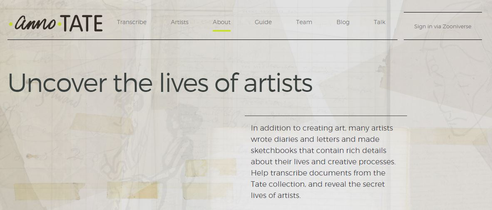
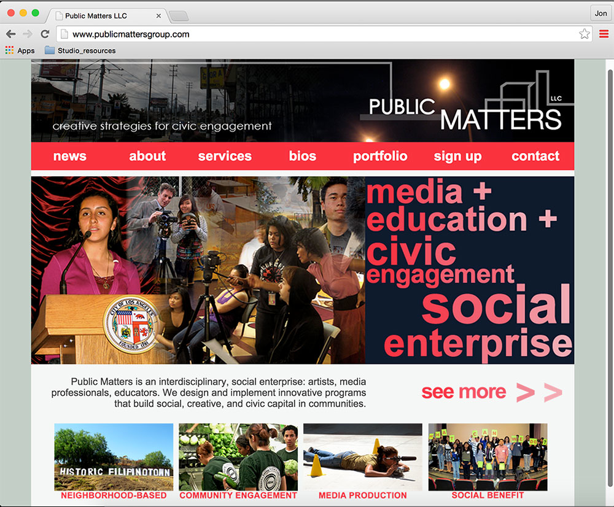
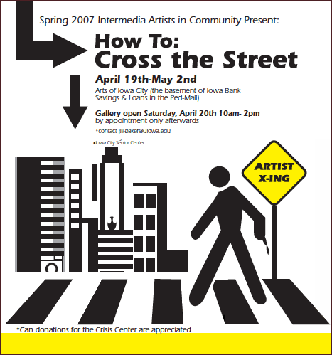

# Community (Draft)

### Bridget Draxler
St. Olaf College

---

##### Publication Status:

* unreviewed draft
* draft version undergoing editorial review
* **draft version undergoing peer-to-peer review https://digitalpedagogy.commons.mla.org/**
* published

--- 
 
## CURATORIAL STATEMENT

Community is a term that has suffered from its own niceness. In Keywords for American Cultural Studies, Miranda Joseph points out the problems with a term like “community”--a term that is too easily used without critical consideration. She frames the term at best as “nearly meaningless” in its overuse and at worst as a tool of manipulative persuasion in its empty signification of “a sense of belonging, understanding, caring, cooperation, equality.” 
 
When I introduce my undergraduate students to work like Joseph’s, they retaliate. They love to question and interrogate social norms and assumptions, but they are deeply uncomfortable with pushing back on the inherent goodness of concepts like community. And part of me can’t help but admire their well-articulated resistance, their commitment to identifying shared investment with those around them. While there is value in critical questions like Joseph’s, there is also something worth celebrating in the reverence that “community” inspires. 

As a humanities teacher, I want to give my students both the critical lens to identify the limitations, exclusions, and misapplications of “community” but also a sense of hope and commitment to others, whether in our classroom community, the broader local community, or the communities in which they will find themselves living and working in the future. I want to equip them to be critical yet committed citizens, aware of the potential for communities to either separate insiders from outsiders, or to find common ground between them. 

Digital spaces exacerbate this tension in the academy’s relationship to a term like “community.”  Digital tools can seem to undermine traditional notions of community, highlighting the term’s meaninglessness through the apparent detachment of virtual engagement.  The idea of “digital community” can seem like an oxymoron, with the fluidity, expansiveness, and disembodiment of online groups. But if digital tools are changing and questioning our understanding of what constitutes community, they are also giving us new ways of engaging with community, and new communities to engage with. 

The idea of community, in a digital age, is perhaps defined less by shared space than by shared values. We are members of geographically defined communities, but we also find ourselves part of online communities defined by our goals, interests, affiliations and hobbies, whether through an actively conversational listserve or a crowdsourced database of information or a role-play virtual reality game. The notion that community is something to actively and intentionally create, rather than something you’re born into, gives participants deeper agency and investment--a quality that is not exclusive to virtual communities but is certainly championed by them. And, joining communities by choice online can make us rethink, for better or worse, the communities we find ourselves in by default. 

The best online communities are, in many ways, extensions or enhancements of analog communities, developing local communities in ways otherwise not possible. In the same vein, many of the most compelling digital humanities projects are rooted in the values and best practices of civic engagement: collaboration, openness, active learning, and reciprocity. Both the digital humanities and civic engagement share commitment to community, and some of the most exciting work in community building happens at the intersection of these somewhat strange bedfellows. 

The artifacts below highlight this link between digital humanities and civic engagement, featuring local communities connected in new ways using digital technologies. They also offer ways of reframing academic communities or reimagining the value of humanities research for and with a broader community, creating scholarship that is not only public [see Jeff McClurken’s entry on [“Public”](https://digitalpedagogy.commons.mla.org/keywords/public) in this collection] but also collaborative, drawing on community expertise alongside academic research. They celebrate communities, even as they challenge communities to ask difficult questions about our relationships inside and between our communities. They illustrate how digital tools can bridge humanities research and public humanities through engagement with GLAM institutions (galleries, libraries, archives, and museums). They explore new movements like digital public history (Owens) or activist digital humanities (Koh). Most importantly, they model ways that digital tools allow humanities research to be community-driven and community-generated, undermining the categories of teacher vs. student and expert vs. public. 

For the twenty-first-century humanist, the community is not our audience but our collaborator. If it is the role of the humanist to interrogate a term like community, it is also our deeper calling to fortify concepts like community that point to our shared humanity. The stories we tell and the questions we ask as humanists, especially digital humanists, can help us to find new reasons and ways to invest in our communities. 

## CURATED ARTIFACTS

### 18th Connect

* Source URL: [http://www.18thconnect.org/](http://www.18thconnect.org/)
* Type: crowdsourced database
* Creator: Laura Mandell (Texas A&M)

18th Connect is a database of eighteenth-century texts driven by values of sharing and service. Along with features typical of online communities (discussions, groups) and scholarly communities (peer review, searchable archives), it offers scholars and advanced students an opportunity to receive plain and TEI-encoded copies of texts from ProQuest and Gale in exchange for correcting any OCR errors in these texts. 

In addition to widening the circle of scholars and readers who have access to eighteenth-century texts, 18th Connect is also opening new opportunities for students to work with archival sources and create digital publications. For instance, Danielle Spratt’s graduate students at California State University - Northridge created a digital scholarly edition of Sarah Fielding’s [The Countess of Dellwyn](http://thecountessofdellwyn.weebly.com/), which simultaneously invited students to engage in collaborative research within the classroom community and to contribute to scholarly work within the online community. The collaboratively annotated text is accessible for undergraduate students to read, or could provide a model for students to create their own digital scholarly editions of texts. 18thConnect hosts other peer-reviewed exhibits and texts, though the current database is largely uncorrected texts awaiting student or scholar edits. 

### Grinnell Beowulf

* Source URL: [https://digital.grinnell.edu/islandora/object/grinnell:3615](https://digital.grinnell.edu/islandora/object/grinnell:3615)
* Type: student project
* Creator: Grinnell College Assistant Professor of English Tim Arner, and students Eva Dawson ’14, Emily Johnson ’14, Jeanette Miller ’14, Logan Shearer ’14, Aniela Wendt ’14, and Kate Whitman ’14 

Engaging students in the task of translating and annotating Beowulf for modern readers, Tim Arner (Grinnell College) created a for-students, by-students teaching edition of the early English text. The digital text offers an example of how public digital humanities projects can reframe students as teachers, democratizing not only access to but production of knowledge online. 

In this way, students develop a sense of community not only with their co-editors but also with imagined, future peer readers of a text.

### The Passport Project
 

* Type: course
* Source URL: [http://thestudio.uiowa.edu/passport/](http://thestudio.uiowa.edu/passport/)
* Creator: Jon Winet, Professor of Art and Art History, The University of Iowa

The Passport Project is an innovative first-year course that asks students to blog about community events representing the arts, humanities, sciences, along with political events and performances in dance, theater, and music. Peer Mentors, recent graduates of the program, lead small group discussions. The course could be easily adapted to a variety of technological platforms and communities, and encourages students to identify, early on, not only as members of the campus community but also the broader local community.

### Intro to Public Arts & Humanities
 

* Type: syllabus/lesson plans
* Source URL: (insert PDF)
* Creator: Elizabeth Goodhue, UCLA

In Elizabeth Goodhue’s Intro to Public Arts & Humanities course, undergraduate students spend a week discussing the intersection of community engagement and digital humanities. Students begin by reading Jeffrey Schnapp et al.’s [“A Short Guide to Digital Humanities”](https://mitpress.mit.edu/sites/default/files/titles/content/9780262018470_Open_Access_Edition.pdf), emphasizing passages about how digital humanities redefines community and fosters a notion of “citizen scholars,” building on earlier readings like Gregory Jay’s [“The Engaged Humanities: Principles and Practices for Public Scholarship and Teaching”](http://jces.ua.edu/the-engaged-humanities-principles-and-practices-for-public-scholarship-and-teaching/). Goodhue also introduces students to a carefully curated list of scholarly projects that foreground the intersection of digital humanities and public humanities. The worksheet attached here, an adaptation of Brian Croxall’s [project evaluation assignment](http://www.briancroxall.net/dh/assignments/digital-humanities-project-evaluation/), guides small and large group discussion. 

### AnnoTate
 

* Type: citizen scholarship
* Source URL: [https://anno.tate.org.uk/?utm_source=Newsletter&utm_medium=Email&utm_campaign=TateLaunch#/](https://anno.tate.org.uk/?utm_source=Newsletter&utm_medium=Email&utm_campaign=TateLaunch#/)
* Creator: Tate Archive and Zooniverse 

While citizenship scholarship tends to skew to the sciences--amateur astronomers, botanists and meteorologists have been crowdsourcing data for years--digital archives are opening new opportunities for humanists to do the same. AnnoTate, a partnership between the Tate Archive and Zooniverse, is one such example. Volunteers transcribe diaries, letters and other manuscripts to make these archives searchable and accessible to new readers. 

By transcribing texts as citizen scholars, students learn important research skills like paleography and archival source analysis. At the same time, we offer them an opportunity to actively participate in a broader scholarly community, giving them new ways and reasons to advocate for the arts and humanities in public life. 

### HASTAC
 

* Type: online community
* Source URL: [http://www.hastac.org/](http://www.hastac.org/)
* Creator: Cathy Davidson and David Theo Goldberg (co-founders), Duke University and CUNY

HASTAC is an example of an online community in its best form, with a diverse and active readership. It has hosted some of the most exciting recent conversations about collaborations between educational institutions and GLAMs (galleries, libraries, archives and museums), partnerships that highlight the potential for reciprocity and student engagement in community-based digital humanities research and teaching. 

For more information on student involvement on HASTAC, see especially the HASTAC Scholars program, which has increasingly involved undergraduate student participants. While difficult to implement into an entire section of a course, the HASTAC Scholars program would be a good fit for one student or a small group of students to blog about digital humanities projects on their home campus. 

### Mapping the Republic of Letters
 

* Type: digital project/tool
* Source URL: [http://republicofletters.stanford.edu/](http://republicofletters.stanford.edu/)
* Creator: Humanities+Design at CESTA, Stanford University

Digital tools can not only help us engage with our own communities, but also help us to understand historical communities better. One of the best examples of this is Mapping the Republic of Letters, a Stanford project with numerous partners that contextualizes the intellectual network of key early modern thinkers. By identifying moments of exchange and influence, the tool reframes Western thought from a series of important figures to a rich intellectual community. The site includes [course descriptions](http://republicofletters.stanford.edu/teaching.html) of classes that have used or even contributed to the project. 

Following the examples here, students could use "network theory to analyze key individuals and key moments in intellectual history," contextualizing individual thinkers within a community of correspondence. 

### Our Marathon
  

* Type: digital project/tool
* Source URL: [http://marathon.neu.edu/](http://marathon.neu.edu/)
* Creator: Elizabeth Maddock Dillon and Ryan Cordell (Primary Investigators), Northeastern University [NOTE: This is a great example of how "project partners" might be more appropriate for these “community” projects than creator/affiliation... see the long list of staff plus the project partners here: http://marathon.neu.edu/about]

Our Marathon is a community-owned project that models the the collaborative and democratic potential of the digital humanities and civic engagement in enriching our communities. Developed in the wake of the Boston Marathon bombings of 2013, Our Marathon invites community contributors to share stories, images, and other media of their experiences. The crowd-sourced storytelling archive is intended explicitly as a tool for community healing, and a means of creating an organic, community-driven memorial. 

As a classroom tool, Our Marathon could be a fruitful “text” for a course on memory and memorialization, or a model for students to develop their own digital memorial for tragedies in their own communities.

### Public Matters
 
 
* Type: project hub
* Source URL: [http://www.publicmattersgroup.com/](http://www.publicmattersgroup.com/)
* Creator: Mike Blockstein

Public Matters is "an interdisciplinary, social enterprise" dedicated to designing and implementing "innovative programs that build social, creative, and civic capital in communities." By engaging various stakeholders to create "Neighborhood Narratives," and developing young leaders through the Urban Futures Lab https://www.youtube.com/watch?v=1HVZ3rX86M4], they offer a model of long-term, project-driven, mutually beneficial partnerships between institutions of higher education and local communities. Though based in L.A., Public Matters serves as a model for creating a networked hub of civic engagement activity that could be replicated in other communities and classrooms.
 
### Intermedia Artists in Community
 
 
* Type: course
* Source URL: none
* Creator: Jon Winet, The University of Iowa

Artists in Community is an interdisciplinary class centered on students participating in internships at Iowa City-Coralville|Johnson County non-profit organizations. The class is comprised of fieldwork and class seminars. Readings and discussion focus on ‘the artist as citizen,’ ‘the artist as activist,’ relational aesthetics, art in public and the challenges and opportunities of civic engagement in the Digital Age.

Artists in Community serves as a model of a discipline-specific community engagement project that capitalizes on digital technology and relationship building to create partnerships between students and non-profit agencies.
 
### Related Materials

“New Self-Guided Curriculum for Digitization.” Digital Public Library of America. [http://dp.la/info/2015/10/07/new-self-guided-curriculum-for-digitization/](http://dp.la/info/2015/10/07/new-self-guided-curriculum-for-digitization/)

The Digital Studio for the Public Arts & Humanities, The University of Iowa [http://thestudio.uiowa.edu/_wp/](http://thestudio.uiowa.edu/_wp/)

eCollaboration Worksheet (Ned Kock, Texas A&M) [https://docs.google.com/document/d/1J59ki10mKW4eLZoGpvrTbzkEnm0WPo236NdHap3rANk/edit](https://docs.google.com/document/d/1J59ki10mKW4eLZoGpvrTbzkEnm0WPo236NdHap3rANk/edit)

Daniel J. Cohen and Tom Scheinfeldt (editors), Hacking the Academy [http://hackingtheacademy.org/](http://hackingtheacademy.org/) A book that was crowdsourced in the course of one week, Hacking the Academy is itself an innovative example of authoring in community.

NITLE [http://www.nitle.org/](http://www.nitle.org/), which hosts Academic Commons [http://www.academiccommons.org/](http://www.academiccommons.org/), is (like HASTAC) another online community with a deep interest in the intersection of the digital humanities, pedagogy, and civic engagement, with particular focus on liberal arts education.

### Works Cited

Joseph, Miranda. “Community” in Keywords for American Cultural Studies. Ed. Bruce Burgett and Glenn Hendler. 

Koh, Adeline. “Getting Started in Activist Digital Humanities.” July 24, 2015. [http://www.adelinekoh.org/blog/2015/07/24/getting-started-in-activist-digital-humanities/ ](http://www.adelinekoh.org/blog/2015/07/24/getting-started-in-activist-digital-humanities/)

Owens, Trevor. “Becoming Digital Public Historians.” May 9, 2015. [http://www.trevorowens.org/2015/05/becoming-digital-public-historians/?utm_source=feedburner&utm_medium=feed&utm_campaign=Feed%3A+trevorowensblog+%28Trevor+Owens%29 ](http://www.trevorowens.org/2015/05/becoming-digital-public-historians/?utm_source=feedburner&utm_medium=feed&utm_campaign=Feed%3A+trevorowensblog+%28Trevor+Owens%29)

