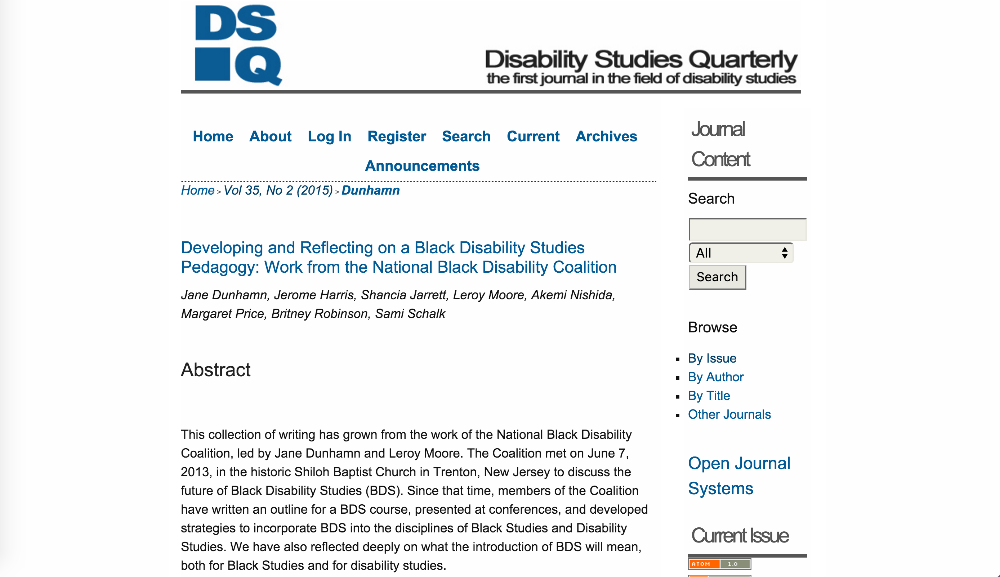
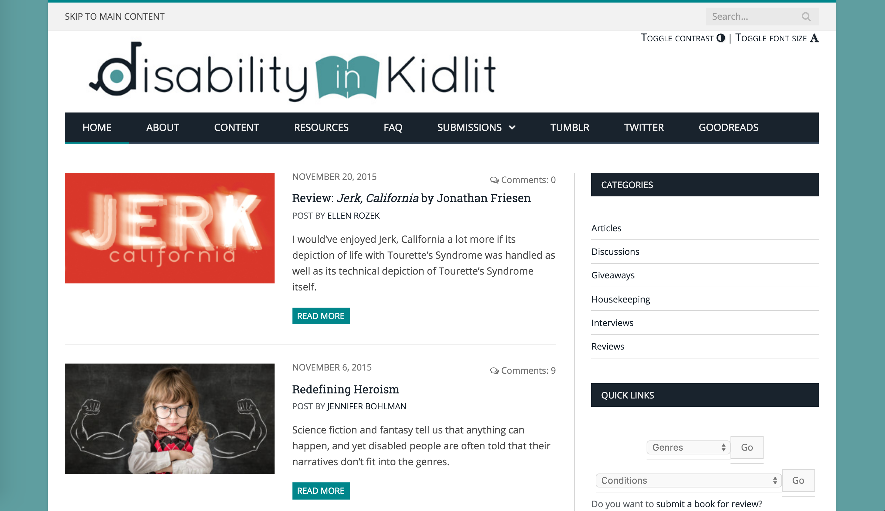
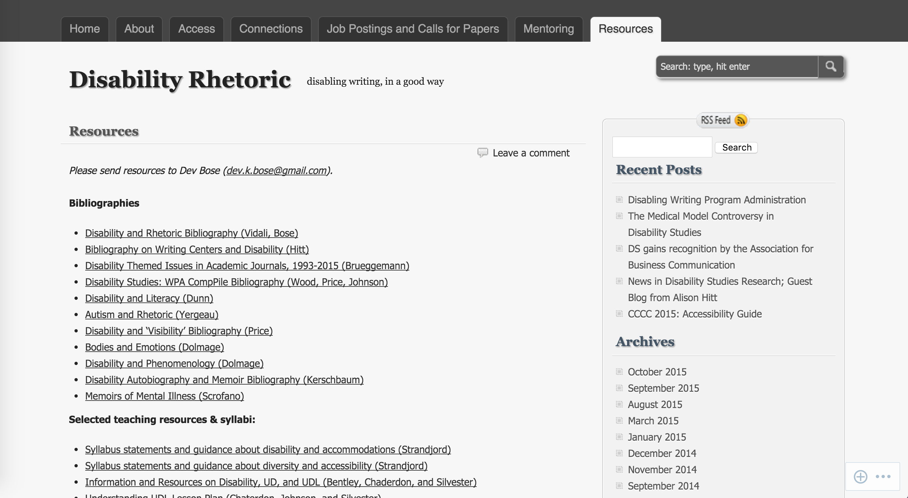
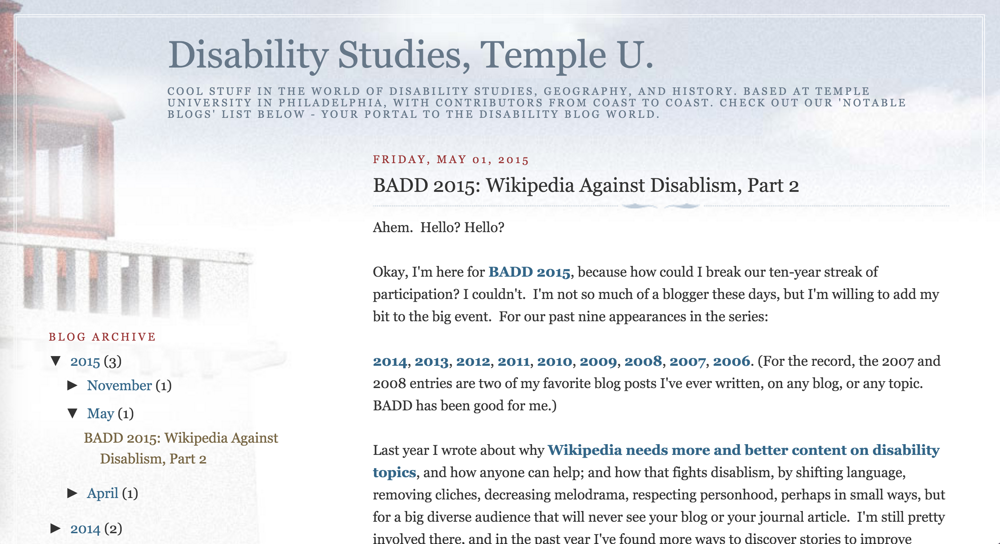
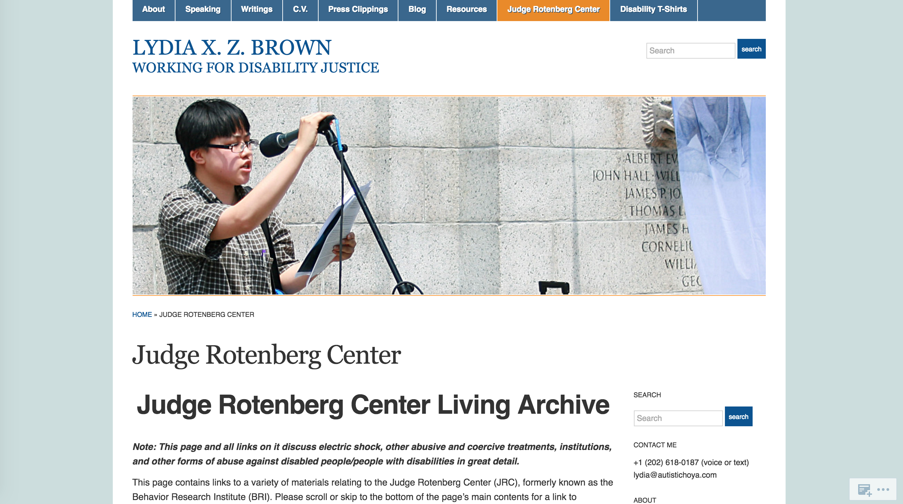
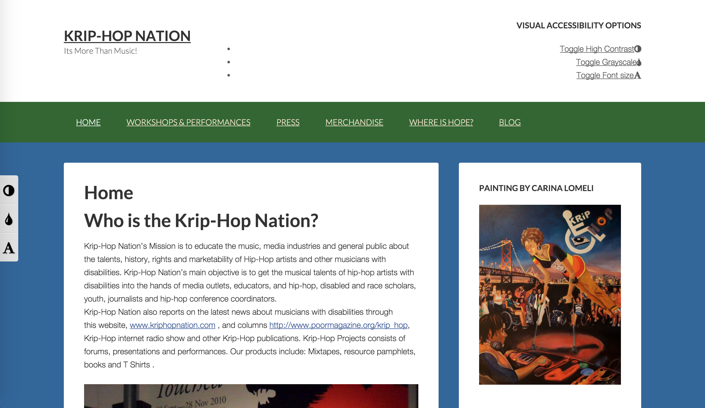
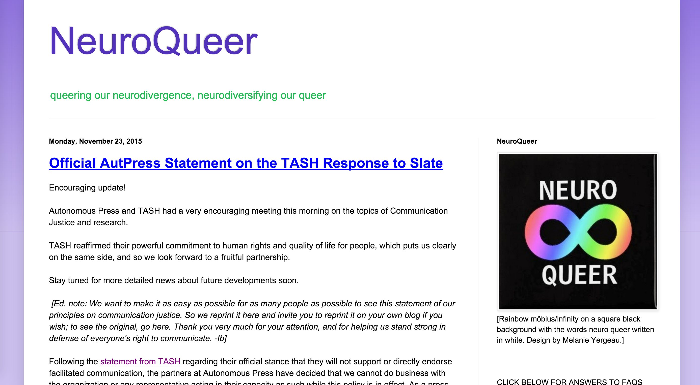
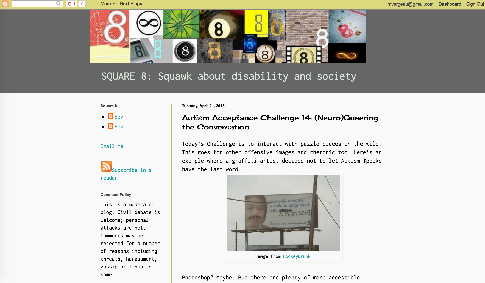
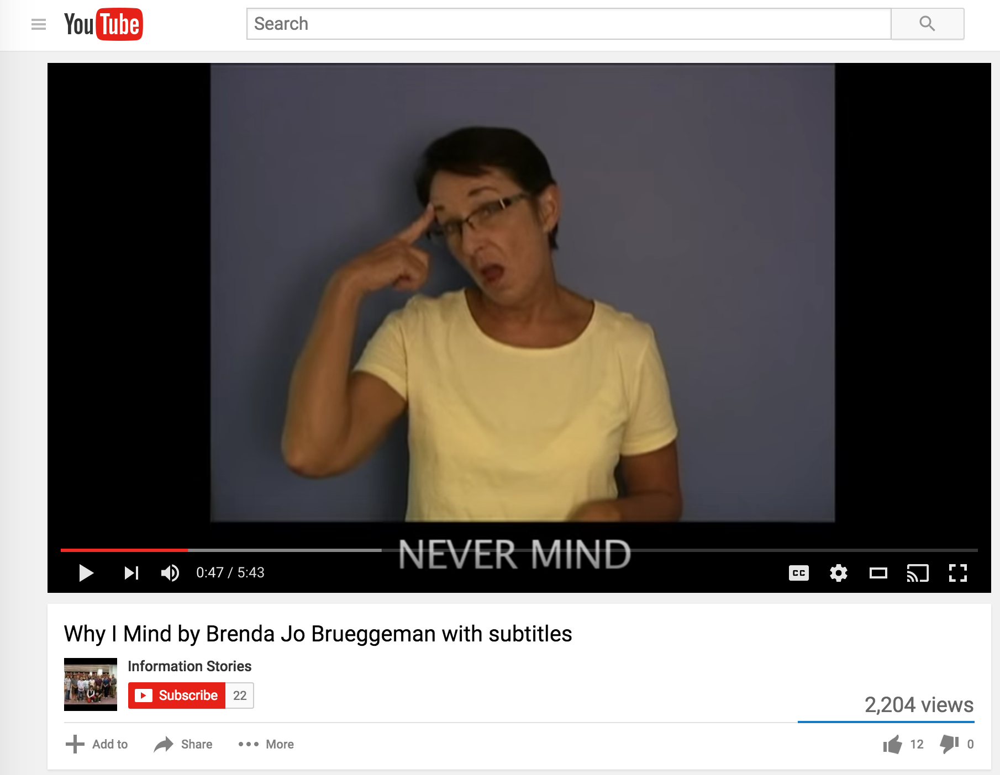

# DISABILITY (Draft) 

## Melanie Yergeau
University of Michigan | [http://kuiama.net](http://kuiama.net)

---

##### Publication Status:
* unreviewed draft 
* **draft version undergoing editorial review** 
* draft version undergoing peer-to-peer review 
* published

---

## CURATORIAL STATEMENT 

Many institutional statements on disability fixate on numbers. Numbers can be particularly alarmist artifacts. They call upon imagery of burden, worry, and distant hopes of rehabilitation. Numbers tell us that an increasing number of disabled students enroll in college every year. Numbers also tell us that disabled students face higher attrition rates than their non-disabled peers, and, even among those who graduate, disabled students face fewer employment prospects (Belch; Getzel and Thoma).

    JENTERY: I really like how you start with a response to numbers here (especially since digital pedagogy could easily go in that direction). How do you feel about the repetition of "number" in this part of your third sentence? "Numbers tell us that an increasing number..." Initially I read this gesture as intended repetition, but now I'm unsure and thought I'd confirm. 

Of course, as with any terministic screen, numbers hide things. Numbers do not reveal how many disabled faculty and staff work at colleges and universities, at least not reliably (Kerschbaum and Price). Numbers also suggest that upward of 90% of internet spaces remain inaccessible to users of adaptive technologies, and yet the very framing of certain technologies as "adaptive" obscures the extent and reaches of accessibility as a rhetorical and socio-technological problem (Oswal and Hewett). Even more, numbers indicate the dearth of resources available to disabled people on college campuses, wherein student services, digital media centers, libraries, and counseling services struggle to meet student demand. Yet, these numbers are partial and often encourage still more labor from those who are already most over-extended.

    JENTERY: Another compelling paragraph. Thank you! I especially appreciate the parenthetical references (which point readers to important further reading often ignored within most circles of digital pedagogy), Thanks, too, for this gesture at the end: "Yet, these numbers are partial and often encourage still more labor from those who are already most over-extended." 

If it were not already clear, this chapter holds some ambivalence toward numbers, central as they are to disability and curricula. This is not to say that the numbers are not true, or that the problems they intimate are not real or widely felt. Rather, numbers often redirect our attention toward alarmist renditions of disability. To rely on numbers as an exigency suggests that disability is only important when it impacts the non-disabled (i.e., disability could happen to any of us at any time). These are, of course, the struggles of many minoritarian discourses: How to make others *care*?

    JENTERY: I find the tension between care and numbers here incredibly persuasive. I wonder if parts of this paragraph repeat observations or assertions already made earlier in the chapter. For instance, see paragraph 1 above and then the third sentence of this paragraph: "numbers often redirect our attention toward alarmist renditions of disability." 

This particular curation examines disability's exigencies by means of topics that bristle against numbers, that locate their exigences not by means of disability's burden but disability's representation. Students who have taken disability studies courses frequently relate that it is hard to unsee disability, in the world writ large, after they have taken such a class. Attention to disability, whether in a class exercise or major assignment, has tremendous potential to reshape the ways in which students come to understand themselves and the world around them. In this regard, representation often holds a dual meaning in disability-oriented pedagogy. First, if we return to dreaded numbers, we might direct our thinking from "how many people have disabilities, and how do we help them?" to "where are all the disabled people, the supposed one-sixth of the population"? With the latter question, there is a move from *assisting* and *curing* toward *civil rights* and *agency*. We can ask this question in terms of self-representation, or how many disabled people are in a given room. We can also ask this question in terms of other-representation, or how non-disabled people affect representations of disability.

    JENTERY: This is wonderful. I like how it transitions into pedagogical issues, especially the shift to rights and agency. At this point in the chapter, I'm curious to see how the "digital" in "digital pedagogy" emerges as a focus, but I'll continue reading. 

These questions concerning representation have significantly evolved over the past twenty years. In 1998, Simi Linton famously claimed that humanistic fields were perhaps the most hospitable spaces for disability studies. Her argument, in effect, concerned the ways in which allied health fields -- in particular, medicine, psychology, and special education -- conceived disability purely as a phenomenon in need of fixing, as numbers that should inspire fear in us all. Over the past decade, disability studies has expanded beyond Linton's earlier framework. As Elizabeth Brewer and Brenda Brueggemann note in their survey of articles published in *Disability Studies Quarterly* between 2000-2012, the field has grown considerably more interdisciplinary, and considerably more mediated.

    JENTERY: In this paragraph, would you be willing to add a sentence or two about pedagogy, or to revise a bit along the lines of pedagogy? I'm just thinking of ways this paragraph could expand upon content in the previous paragraph, which is more explicitly about teaching and learning. That said, I really appreciate not only how you position technology (or digital work) within the framework of mediation (in the last sentence of this paragraph), but also how the next paragraph develops this thread.  

The mediation of disability studies has largely to with conflicting affordances and drawbacks of digital spaces for disability activism. But it also has to do with other questions about representation, not only about non-disabled people and ideologies of ability, but the ways in which disability studies and activism has represented itself. As many of the artifacts below contend, disability studies has been a concertedly white and classed project. As a white disabled academic, I write this sentence with no small irony. Disabled people of color are routinely erased from the narratives we tell about the field and its histories. As well, academic spaces are spaces of distinct class and educational privilege. As teachers, we need to consider the ways in which our classrooms recreate the dynamics that disability studies has long sought to dismantle: that of the distal researcher studying disabled subjects, without their consent in the subjects that concern them most.

    JENTERY: THANK YOU! (Of note, I see both "non-disabled" and "nondisabled" in this draft. I've edited occurrences of the latter into the former, but we don't have an editorial policy or preference on this. If you'd prefer to use "nondisabled" throughout, then please do. Thanks for your patience!)

In laying out the above, my hope is that those who are new to disability studies will not come to these artifacts with yet more trepidation. Rather, I hope that these dynamics, many of them painful, might inspire questions, hopes, ideas, and, as Jay Dolmage says, "places to start." Whose voices are we amplifying in the texts that we assign or analyze?

    JENTERY: Thanks again for this compelling statement, Melanie. My only thoughts for now (take them or leave them) is that: 1) readers may expect the final paragraph to describe, if only briefly, your rationale for selecting the artifacts below (including, e.g., their relation to disability studies as a white and classed project or to digital spaces for disability activism) and 2) readers may also wonder if the statement could focus more on pedagogy and practice, especially in terms of digital pedagogy. For instance, some of our audience may want to learn more about how, if at all, the pedagogy of disability studies differs from the digital pedagogy of disability studies. Let me know what you think! Also, I'll probably need a page number for Dolmage. Thanks again!

## CURATED ARTIFACTS 

### Developing and Reflecting on a Black Disability Studies Pedagogy

* Artifact type: Article 
* Source: [http://dsq-sds.org/article/view/4637/3933](http://dsq-sds.org/article/view/4637/3933)
* Creators: Jane Dunhamn, Jerome Harris, Shancia Jarrett, Leroy Moore, Akemi Nishida, Margaret Price, Britney Robinson, Sami Schalk

This article troubles disability studies and its elisions of Black disability, as well as African American and African diaspora studies. The article explores the contours of what Black Disability Studies (BDS) might mean both as a curricular agent and a discipline unto itself, while also resisting a definition or singular construction of BDS. The authors pose a series of meditations on their experiences as faculty, students, and activists in disability studies classes and the field writ large. The article concludes with an outline of a course themed on Black Disabled Experience, which includes learning objectives, core competencies, and a list of course readings. The authors note that these resources could be used in service of a stand-alone BDS course, but they could also be used in service of radically reimagining other courses.

    JENTERY: This is a wonderfully thorough description. Thank you! Here and elsewhere in this list, if you've used these artifacts in your own teaching and scholarship, then feel free to make recommendations (e.g., "X is useful for Y") or offer perspective (e.g., "I've found that Z").

### Disability in KidLit

* Artifact type: Reviews 
* Source: [http://disabilityinkidlit.com/](http://disabilityinkidlit.com/)
* Creators: Corinne Duyvis, Kayla Whaley, Natasha Razi, Yahong Chi, and Kody Keplinger

*Disability in KidLit* is a multi-authored site that examines representations of disability in young adult and children's literature. Importantly, as the editors note, the articles in *Disability and KidLit* privilege the perspectives of disabled people, and the call for submissions emphasizes that only disabled people can submit contributions to the site. The editorial call here diverges radically from most scholarship on disability and literature, emphasizing, in particular, that the site works to dispel the "problematic portrayals of disability" that tend to permeate young adult literature and other media representations. The website is vast, accessibly designed, and meticulously organized. Users can search for content according to grade level, genre, disability type, or assistive tool type. The website serves as a welcome resource to instructors in K12 and in college, as well as librarians.

    JENTERY: Thank you! Given the vastness of the site, feel free to add anything in particular you recommend to readers. Or, feel free to add a sentence about how instructors and librarians might use this material in practice (perhaps based on your own experience, if you wish).  

### Disability Rhetoric

* Artifact type: Teaching resource website
* Source: [http://disabilityrhetoric.com/](http://disabilityrhetoric.com/)
* Creators: Amy Vidali and Dev Bose, with Hilary Selznick, Tara Wood, and Dale Ireland

Created by Amy Vidali in 2009, *Disability Rhetoric* is a project of the Disability Standing Group at the Conference of College Composition and Communication (CCCC). Currently maintained by Dev Bose, *Disability Rhetoric* hosts a number of resources related to teaching and research in disability studies, including syllabi, bibliographies, job postings, and calls for papers. While the website's exigence emerges from the field of rhetoric and composition, the bibliographies and syllabi traverse remarkable breadth, moving across topics and fields such as phenomenology, queer studies, affect theory, design and digital studies, and feminism. Relatedly, the standing group also runs a (co)mentoring program for interested scholars at different stages in their careers, and visitors to the website can find blog posts written by emerging DS scholars on the DisRhet blog.

    JENTERY: This is great, and new to me! If you'd like to point audiences to anything in particular here, then feel free. For example, is any of the syllabi or bibliographies especially conducive to digital pedagogy and disability studies in the humanities? For teaching, prompts, and lesson plans, have you used any of them yourself?

### Disability Studies, Temple U.

* Artifact type: Blog 
* Source: [http://disstud.blogspot.com/](http://disstud.blogspot.com/)
* Creators: Penny Richards, Mike Dorn, and Carol Marfisi

The Disability Studies at Temple blog might be better termed a blog hub or blog conglomerate than a singular blog. For those wishing to delve into the digital world of disability activism, blogging spaces represent an important place to start, both historically and contemporarily. Boasting over a decade of work, the DS at Temple blog curates and hosts links to dozens of current and archived disability blogs, most of which are locatable on the seemingly never-ending sidebar. These blogs range considerably, both in terms of types of disability identities as well as in bloggers' relationships to disability (e.g., disabled person, parent, sibling, researcher). Of course, Disability Studies, Temple U. is a blog in its own right, and its contributors regularly weigh in on disability issues and participate in disability blog carnivals, such as the long-running [Blogging Against Disablism Day](http://blobolobolob.blogspot.co.uk/p/blogging-against-disablism-day-2016.html).

    JENTERY: Thanks! Have you used this resource in your own teaching? If so, any suggestions for using particular aspects of it? 

### Judge Rotenberg Center Living Archive 

* Artifact type: Archive 
* Source: [https://autistichoya.net/judge-rotenberg-center/](https://autistichoya.net/judge-rotenberg-center/)
* Creator: Lydia Brown

The Judge Rotenberg Center (JRC) is an institution that uses aversive contingent electric shock on its disabled students, many of whom are children. Located in Canton, MA, the JRC has been recipient of increased scrutiny for its shock devices, which the Center forces students to wear via backpack. As Lydia Brown notes, these devices are "intentionally designed to be more powerful and painful than a police taser," and the U.N. has declared JRC's practices as tantamount to torture. The JRC Living Archive, created and maintained by Brown, is an expansive repository that hosts a number of documents, including survivor testimonies, trial coverage documents, media reports, governmental memoranda, op-eds, and posters and ephemera from disability rights protests, among other resources. While the reading is disturbing and covers extremely violent content, the Archive can serve as a tremendous resource for those who work or teach on activism and human rights issues.

    JENTERY: Thank you. I appreciate how this description moves from historical context to project description to potential use in the classroom.  

### Krip-Hop Nation

* Artifact type: Organization 
* Source: [http://kriphopnation.com/](http://kriphopnation.com/)
* Creator: Leroy Moore

Krip-Hop Nation, founded by Leroy Moore in 2007, actively promotes the work and representation of disabled Hip-Hop artists. In particular, Krip-Hop Nation works to educate teachers and those in the media industry about disabled artists and disability music history (from the distant past to the immediate present), with a concerted focus on what Moore has termed AfroKrip performance. The Krip-Hop website is home to a prolific blog, in which Moore conducts interviews and writes on topics spanning African American Studies, poetry, police brutality, Black Disability Studies, and lyric analysis. The site likewise hosts videos of Krip-Hop performances, lectures, and campaigns that showcase a number of disabled artists. With its highly mediated web presence, Krip-Hop Nation provides extensive resources for those learning or teaching about disability, race, representation, performance, and/or poetry.

    JENTERY: Thanks for this resource as well! This is a perfect fit for the collection, and it intersects with various other keywords. Here, I'll just echo a remark I made earlier: feel free to offer suggestions/recommendations for using any particular component of this artifact in a course (based on your experiences and/or the experiences of others).

### Modes of Embodiment: MULTI MODE ACCESS

* Artifact type: Student-run conference website
* Source: [https://multimodeaccess.wordpress.com/](https://multimodeaccess.wordpress.com/)
* Creators: Aimi Hamraie and Informational Access Design Team at Vanderbilt University

A collaboration between Hamraie and their students, this website is a collaboratively organized conference developed as part of Hamraie's 2015 [Bionic Bodies, Cyborg Cultures](https://aimihamraie.wordpress.com/teaching/) course. Organized across modes, it provides material access through text, audio recordings, PowerPoint slides, and an active tweetstream. The conference site provides not only an example of an accessible website, but it likewise models robust collaborative pedagogy. Hamraie notes that Master's students organize and moderate the panels, taking communal responsibility for advertising and running the conference. As well, the conference routinely extends beyond the contours of the class. Community members attend sessions, and people external to Vanderbilt participate in the conversation via Twitter.

    JENTERY: Thank you! I especially appreciate how you elaborate on collaborative pedagogy in the second half of this description.  

### NeuroQueer

* Artifact type: Blog 
* Source: [http://neuroqueer.blogspot.com/](http://neuroqueer.blogspot.com/)
* Creators: Elizabeth J. (Ibby) Grace, Dani Ryskamp, Michael Monje Jr., and Nick Walker

*NeuroQueer* (NQ) is a multi-authored blog that publishes cross-genre work that spans disability and queer studies. A mashup of the words *neurologically queer*, the term neuroqueer signals an emerging movement that seeks to build coalitions among people who may variously identify as mad, neurodivergent, disabled, and/or queer. The NQ blog, in particular, prizes and embodies hybridity, seeking to reach activist and academic audiences alike. Contributors include emerging activist voices as well as established authors (novelists, poets, dramaturgs, and scholars), each seeking to push the bounds of disability culture and activism. Given the complexity and discursive breadth (queering?) of the blog, instructors might find the [introductory posts](http://neuroqueer.blogspot.com/2015/05/neuroqueer-introduction-by-nick-walker.html), linked from the sidebar, to be particularly generative starting points for class discussions.

    JENTERY: This is great! Thank you, Melanie. And thanks, too, for pointing readers to the introductory posts. Such gestures are especially friendly to people who are new to fields such as disability studies and digital pedagogy. 

### SQUARE 8: Squawk About Disability and Society

* Artifact type: Blog 
* Source URL: [http://aspergersquare8.blogspot.com/](http://aspergersquare8.blogspot.com/)
* Creator: Bev Harp

Even though it has not been updated since 2015, *SQUARE 8* represents among the most mediated and resourced examples of disability activism blogs. Run by Bev Harp, *SQUARE 8* has led a number of internet campaigns over the past decade, ranging from 2015's [Autism Acceptance Challenge](http://aspergersquare8.blogspot.com/search/label/Autism%20Acceptance%20Challenge) to 2010's [Late Intervention Campaign](http://aspergersquare8.blogspot.com/2010/02/late-interventions-contributions-from.html), the latter of which wryly targeted the curative and often child-centric focus of autism research. Readers of *SQUARE 8* may find its video posts useful in a variety of contexts, including conversations related to disability, gender, and professionalization more generally. Many of Harp's videos, such as "[Perseveration in the Workplace](http://aspergersquare8.blogspot.com/2010/02/perseveration-in-workplace.html)," deconstruct ableist and sexist notions of what it means to be collegial, punctual, interested, and professional.

    JENTERY: This is perfect. Thank you. And thanks again for pointing readers to particular material.   

### "Why I Mind" 

* Artifact type: Video 
* Source URLs: Video with subtitles: [https://www.youtube.com/watch?v=RoNR6EWT7D4](https://www.youtube.com/watch?v=RoNR6EWT7D4); video without subtitles: [https://www.youtube.com/watch?v=J4ak5HHcrnI](https://www.youtube.com/watch?v=J4ak5HHcrnI)
* Creator: Brenda Brueggemann

In this six-minute video, Brueggemann stories through the common refrain that deaf people face when asking others to repeat words and conversations: "never mind." Using a combination of audio narration, subtitles, visuals, and ASL, Brueggemann leads viewers through the story of Carl Dupree, a Gallaudet student who was killed by police while trying to sign. The screenshot featured here depicts Brueggemann's subtitled version of "Why I Mind," whereas the second linked URL directs to the uncaptioned version. When leading workshops on captioning and disability, Brueggemann typically asks viewers to watch both versions, paying close attention to the rhetorical affordances of the captioned video. As well, Brueggemann at times plays a third variant of the videos, using YouTube's auto-caption feature on the uncaptioned video. Auto-caption, on the whole, results in wildly inaccurate captions, but also, as Brueggemann notes, can generate a kind of found disability poetry.

    JENTERY: This artifact could be used in so many different courses and contexts, and it overlaps with many keywords in the collection. Your description is also anchored, with detail, in ways to teach and learn with the artifact, too. Thank you, Melanie! 

## RELATED MATERIALS
 
Dolmage, Jay. "Universal Design: Places to Start." [http://dsq-sds.org/article/view/4632/3946](http://dsq-sds.org/article/view/4632/3946)

Faust Films and Diane Wilkins. "Annie Dearest." [https://www.youtube.com/watch?v=MXNUN5OCZdY](https://www.youtube.com/watch?v=MXNUN5OCZdY)

Gosling, Ju. "I Want to Help the Handicapped." [http://ju90.co.uk/help/eng/help1.htm](http://ju90.co.uk/help/eng/help1.htm)

Rhett & Link. "CAPTION FAIL: Lady Gaga Putt-Putt Rally." [https://www.youtube.com/watch?v=hVNrkXM3TTI](https://www.youtube.com/watch?v=hVNrkXM3TTI)

Wood, Caitlin (ed.). Criptiques. https://criptiques.com/

## WORKS CITED

Belch, Holley A. "Retention and Students With Disabilities." *Journal of College Student Retention*, 6.1 (2004): 3-22. 

Brewer, Elizabeth, and Brenda Brueggemann. "The View from DSQ." *Disability Studies Quarterly*, 34.2 (2014): [http://dsq-sds.org/article/view/4258/3598](http://dsq-sds.org/article/view/4258/3598)

Brown, Lydia. "Judge Rotenberg Center Living Archive." [https://autistichoya.net/judge-rotenberg-center/](https://autistichoya.net/judge-rotenberg-center/)

Brueggemann, Brenda. "Why I Mind." [https://www.youtube.com/watch?v=RoNR6EWT7D4](https://www.youtube.com/watch?v=RoNR6EWT7D4)

Dunhamn, Jane, Jerome Harris, Shancia Jarrett, Leroy Moore, Akemi Nishida, Margaret Price, Britney Robinson, and Sami Schalk. "Developing and Reflecting on a Black Disability Studies Pedagogy: Work from the National Black Disability Coalition." *Disability Studies Quarterly*, 35.2 (2015). [http://dsq-sds.org/article/view/4637/3933](http://dsq-sds.org/article/view/4637/3933)

Duyvis, Corinne, Kayla Whaley, Natasha Razi, Yahong Chi, and Kody Keplinger, eds. *Disability in KidLit*. http://disabilityinkidlit.com/ 

Getzel, Elizabeth E., and Colleen A. Thoma. "Experiences of College Students With Disabilities and the Importance of Self-Determination in Higher Education Settings." *Career Development for Exceptional Individuals*, 31.2 (2008): 77-84. 

Grace, Elizabeth J. (Ibby), Dani Ryskamp, Michael Monje Jr., and Nick Walker, eds. *NeuroQueer*. [http://neuroqueer.blogspot.com/](http://neuroqueer.blogspot.com/)

Hamraie, Aimi, and Informational Access Design Team at Vanderbilt University. *Modes of Embodiment: MULTI MODE ACCESS*. [https://multimodeaccess.wordpress.com/](https://multimodeaccess.wordpress.com/)

Harp, Bev. *SQUARE 8: Squawk About Disability in Society*. [http://aspergersquare8.blogspot.com/](http://aspergersquare8.blogspot.com/)

Kerschbaum, Stephanie, and Margaret Price. "Flexibility and Its Discontents: Designing Accessible Spaces and Assignments." Lecture at the University of Michigan, Institute for the Humanities. September 2014.

Linton, Simi. *Claiming Disability: Knowledge and Identity*. New York: NYU P, 1998.

Moore, Leroy. *Krip-Hop Nation*. [http://kriphopnation.com/](http://kriphopnation.com/)

Oswal, Sushil K., and Beth L. Hewett. "Accessibility Challenges for Visually Impaired Students and Their Online Writing Instructors." *Rhetorical AccessAbility*. Ed. Lisa Meloncon. Amityville, NY: Baywood Press, 2011. 135-155.

Richards, Penny, Mike Dorn, and Carol Marfisi. *Disability Studies, Temple U*. [http://disstud.blogspot.com/](http://disstud.blogspot.com/)

Taylor, Julie L., and Marsha M. Seltzer. "Employment and Post-Secondary Educational Activities for Young Adults with Autism Spectrum Disorders During the Transition to Adulthood." *Journal of Autism and Developmental Disorders*, 41.5 (2011): 566-574.

Vidali, Amy, and Dev Bose, with Hilary Selznick, Tara Wood, and Dale Ireland. *Disability Rhetoric*. [http://disabilityrhetoric.com/](http://disabilityrhetoric.com/)
