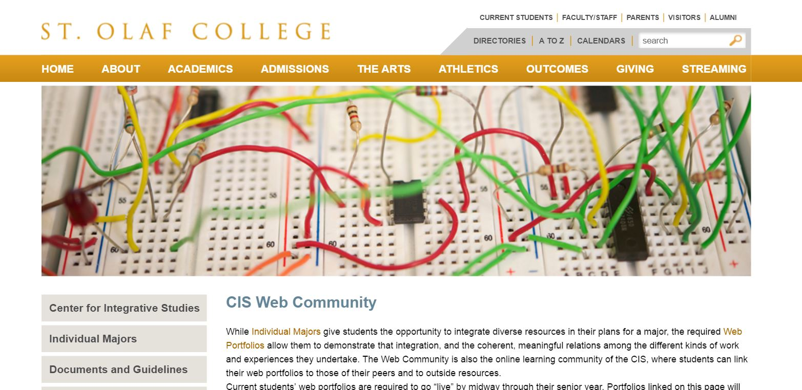
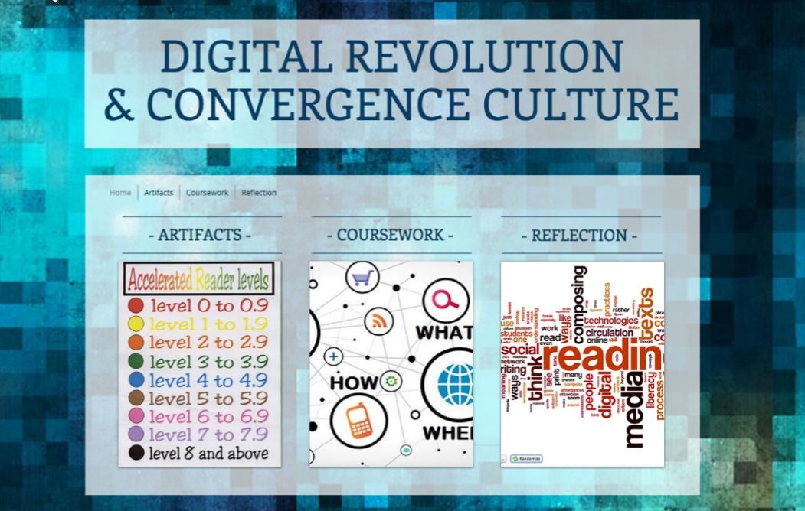
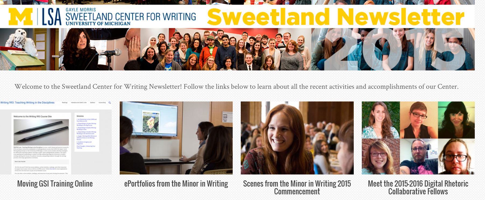
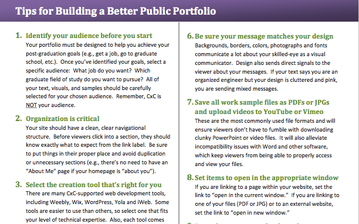
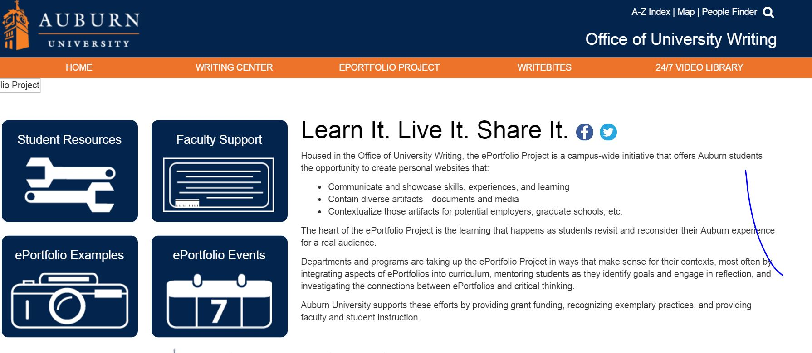
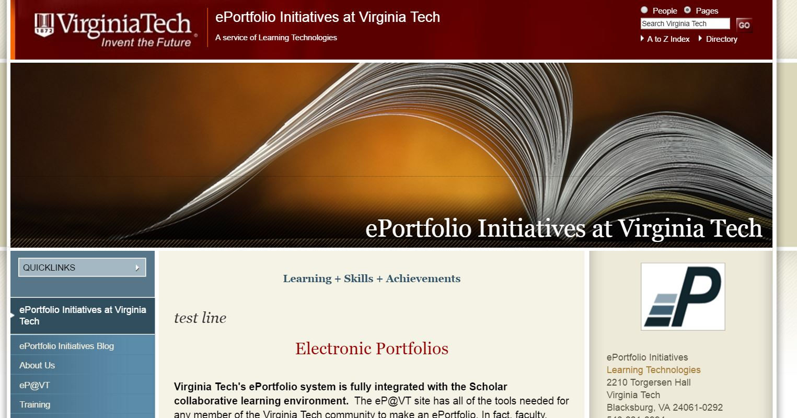
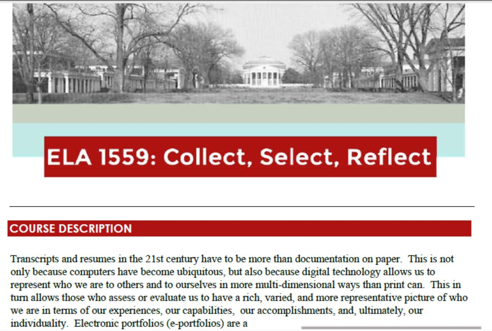
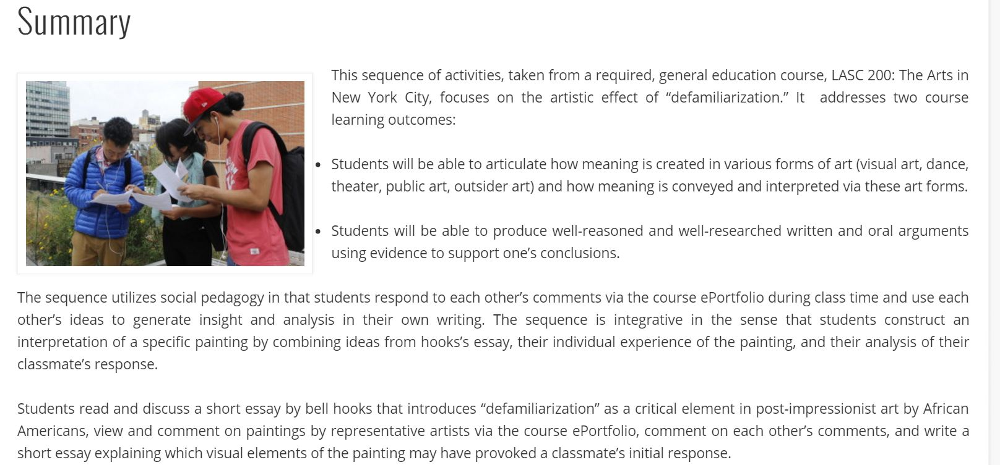
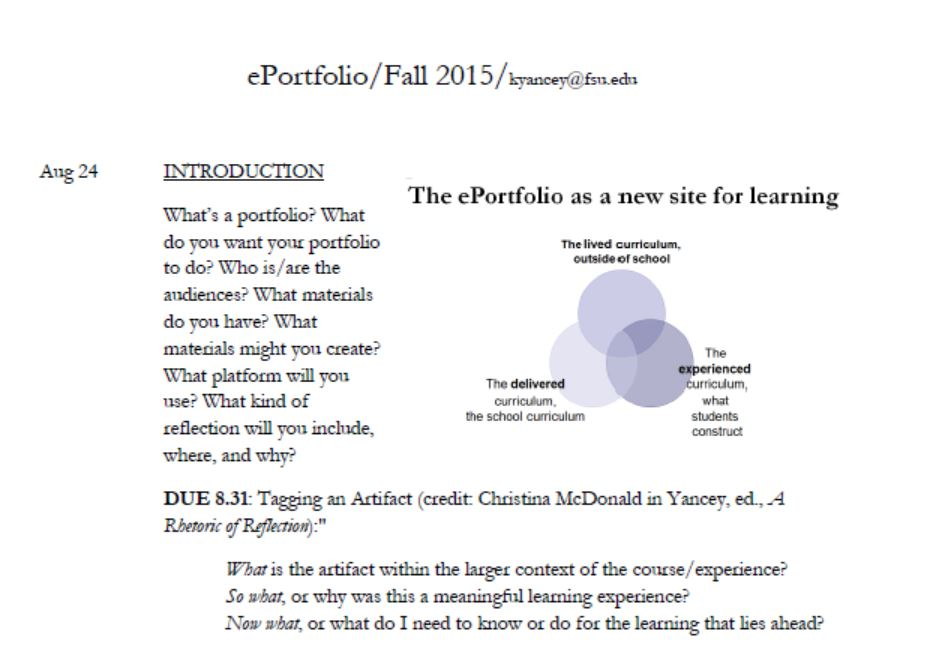

# EPORTFOLIO (Draft)

## AUTHOR: Kathleen Blake Yancey
Florida State University | [http://www.english.fsu.edu/faculty/kyancey.htm](http://www.english.fsu.edu/faculty/kyancey.htm)

---

### Publication Status:
* unreviewed draft
* draft version undergoing editorial review
* **draft version undergoing peer-to-peer review**
* published

--- 

## CURATORIAL STATEMENT

Electronic portfolios, collections of student work selected from a larger archive of work and contextualized by student reflection, began developing in the 1990s. In part, they developed from print portfolios that were so popular in the 1980s and 1990s, especially in writing programs. In part, they provided a response to the need to provide a different kind of host and structure for the new kinds of texts students were creating, among them slide shows, photo essays, videos, and audio podcasts. Thus, when faculty began assigning students to create multimedia texts, it felt both natural and necessary to migrate to electronic portfolios. 

Electronic portfolios, however, are both like and unlike portfolios in print. Both print and electronic portfolios (or ÒePortfoliosÓ)are alike as the result of collecting, selecting, and reflecting, and each is designed for a given purpose (for instance, development and/or achievement) and audience. Here, they begin to differ: the audience for print has typically been the teacher, for the electronic the teacher but external audiences as well, as its presence on the web would suggest. They also differ in terms of the genre they tend to instantiate. Print portfolios tend to operate much as a book with a narrative arc often oriented to developing competency or proficiency. In contrast, in addition to hosting a much wider array of texts and both internal and external links, "web-sensible" electronic portfolios tend to operate more as a gallery (Yancey 2004), with multiple spaces constituting a "network among the artifacts" (Purves). Likewise, the reader is positioned differently in the two kinds of portfolios, with the print reader able to read hypertextually but tending to read in a more linear fashion, as the author directs, and with the reader of the electronic portfolio reading hypertextually by definition. As Alan Purves succinctly noted, in that reviewing process, the reader of an electronic portfolio "may make a different web" (135).

Institutionally, ePortfolios in the United States are ubiquitous: a recent survey indicates that over 50% of United States institutions of higher education engage students in ePortfolio practices. Campuses are often interested in electronic portfolios for assessment purposes since the work that students include in an ePortfolio is considered to be authentic, keyed to student learning outcomes, and thus more helpful for curricular revision. 

A different model of portfolio, one more capacious and less governed by externally generated outcomes, is often used by faculty in their courses. Such faculty often start small, beginning with free website applications--such as WIX, Weebly, and GoogleSites--and student interest; and these two factors support advanced work in electronic portfolios as well. In both cases, students are encouraged to archive their work, including drafts, and to begin creating the shell of the portfolio early in the course so that any technological difficulties can be adequately addressed. In other words, faculty assigning electronic portfolios in their classrooms don't need a portfolio-specific platform (although there are many available). An important advantage of the free website application is that students have more freedom to design the specifics of their own portfolio, including choosing and designing color, visuals/themes, font style and size, and so on. Initially, faculty may find, depending on their curriculum, that students include only print documents; such portfolios tend to be first-generation ePortfolios. But to the extent that the curriculum includes other kinds of work, from blog posts to audiocasts, the electronic portfolio will become more richly multimodal, especially in cases where ePortfolio models are shared and students review each other's work.

Last, but perhaps most important, is reflection, which is identified by four characteristics:  

+ (1) It is a meaning-making process; 
+ (2) It is systematic, rigorous, and disciplined
+ (3) It occurs in community; and 
+ (4) It values the personal and intellectual (Rodgers 845). 

Electronic portfolios often are introduced by way of a reflective letter or essay contextualizing and introducing the contents, which provides students with the opportunity to provide a personal account of their own learning. To prepare for writing this text, students frequently engage in other kinds of reflective writing throughout the term so that reflection becomes both a habit of mind and a social practice: for example articulating prior knowledge situating their learning; synthesizing their learning within a course and connecting to learning in other contexts; and assessing how well they are doing in the course. In such cases, the learning from a given course or program can be reflectively integrated with learning from other contexts, with students speaking with authority as "agents of their own learning" (Yancey 1998). 

Both faculty and program leaders continue to design methods of assessing ePortfolios, but two resources provide useful places to begin: Yancey's ÒElectronic Portfolios and Writing Assessment: A Work in ProgressÓ contrasts a media-inflected set of criteria for ePortfolios with a media-blind set developed by the Association of American Colleges and Universities, while Danielle DeVoss and Heidi McKee's edited collection Digital Writing Assessment and Evaluation < http://ccdigitalpress.org/dwae/> showcase specific examples of ePortfolios and ways of reading and reviewing them.   

The artifacts begin with ePortfolios themselves, a very diverse set at the undergraduate level and one at the graduate level, and before considering several issues, contextualizing the ways instructors can invite students to create them.  

## CURATED ARTIFACTS 

### St Olaf Center for Integrative Learning Web Community

* Artifact Type: Undergraduate Student ePortfolios
* Source URL: http://wp.stolaf.edu/cis/web-community/
* Artifact Permissions: 
* Copy of the Artifact: 
* Creator and Affiliation: Multiple students at St. Olaf College

At St. Olaf College, undergraduate ePortfolios are housed at the Center for Integrative Studies (CIS), where students design their own majors, many of which operate at the intersection of two fields; thus, a student interested in scene design created a major emerging from the intersection of theater and architecture. Originally, the four criteria ePortfolios were to meet focused on four types of thinking: thinking in context, thinking in community, thinking integratively, and thinking reflectively. Once the CIS had worked with the ePortfolios for several years, however, faculty added three more criteria: focus, navigational design, and the visual, especially as appropriate to the content. The gallery of student ePortfolios hosted at the CIS site, which change as students graduate and a selection are archived for a longer period, displays highly creative portfolios and the majors they represent. Students find reviewing galleries of ePortfolios like this one, given its wide range of models, very helpful, both to define ePortfolios and to see many possibilities for design, contents, arrangement, and the visual. Likewise, a faculty-led review of such portfolios can clarify defining characteristics of ePortfolios, the kinds of artifacts and reflective texts they can include, and the multiple ways that students can incorporate their own interests into them. 

### Digital Revolution and Convergence Culture

* Artifact Type: Graduate Student ePortfolio
* Source URL: http://amb14m.wix.com/digirevo
* Artifact Permissions: 
* Copy of the Artifact: 
* Creator and Affiliation: Amanda Brooks, Florida State University

Amanda Brooks, an MA student at Florida State University from 2014-2016, created an ePortfolio for her Digital Revolution and Convergence Culture graduate class, which focuses on the relationships between literacy and technology and the changes in literacies motivated by digital technologies. Amanda divides her portfolio into three major sections. The first, artifacts, includes one artifact from inside the course and a second from outside the course, the latter allowing her to make a connection to other experience that only she can make. The second, coursework, draws on several class assignments, including a map of circulation. And the third, reflection, accounts for her learning through a definition of what she has identified as the major vocabulary of the course; thus, in this text, she synthesizes her learning. In sharing what she has learned, Amanda includes many kinds of artifacts--including print homework assignments, videos, and graphics--with a clear navigational system and a rhetorically effective visual design.

### ePortfolios: Core Activities & Basic Elements

* Artifact Type: ePortfolio instructions
* Source URL: https://lsa.umich.edu/content/dam/sweetland-assets/sweetland-documents/teachingresources/Supplement1_CoreActivitiesAndBasicElements.pdf
* Artifact Permissions: 
* Copy of the Artifact: 
* Creator and Affiliation: Gayle Sweetland Center, University of Michigan

The Sweetland Center hosts a minor in writing available to students across the curriculum; to support this minor, which requires an electronic portfolio, the Sweetland Center has developed a set of materials explaining the ePortfolio model for the minor, outlining reflective activities, and showcasing student work. This document-- "ePortfolios: Core Activities & Basic Elements"--explains three basic ePortfolio practices: (1) selection of artifacts; (2) evidence-based reflection; and (3) revision. In other words, addressing students, this guide points to some of the principal decisions that students will make in creating their portfolios; especially valuable for both faculty and students are the sections on interactive navigation for the ePortfolio and the role of visual design in it.

### Tips for Building a Better Public Portfolio

* Artifact Type: Instructions
* Source URL: https://sites01.lsu.edu/wp/cxc/files/2014/07/2014-DCHandbook_TipsBetterPort.pdf
* Artifact Permissions: 
* Copy of the Artifact: 
* Creator and Affiliation: Communication across the Curriculum Program, Louisiana State University

Louisiana State University offers a Distinguished Communicator (DC) certificate program: students in all majors have the opportunity to demonstrate their communicative proficiency in multiple modes, including the written, the oral, and the visual, and they create a culminating electronic portfolio as well. In addition to hosting a gallery of student ePortfolios, the Communication across the Curriculum site sponsoring the DC certificate offers several handouts that can guide students in creating ePortfolios. Among these is their "Tips for Building a Better Public Portfolio" identifying 11 tips. Distinctive in this handout are several features. First is attention to the value of a kind of print-correctness: Tip 11 advises students to "Proofread, and proofread again," observing that the correctness isn't a print-only standard. Second, and as important, is the tip sheet's attention to developing a web-sensible portfolio: recommendations include re-formatting documents for the web and including links. Likewise, students are cautioned about including too much information:  "Remember, this is a public site, so be safe and remove personal information such as your home address or cell phone number."

### ePortfolio Project: Reflective Writing

* Artifact Type: Instructions
* Source URL: http://wp.auburn.edu/writing/ePortfolio-project/
* Artifact Permissions: 
* Copy of the Artifact: 
* Creator and Affiliation: Auburn University ePortfolio Program, adapted from J. Driscoll

Auburn University offers an ePortfolio program oriented to employment for undergraduates and organized at the departmental level. Its website hosts a variety of resources, including materials on artifact selection and reflection and a set of student portfolios. This artifact is a guide for reflection, identifying the kinds of experiences and artifacts appropriate for reflection and asking students to think of them in a three-part heuristic. The first question--What?--asks students to define and analyze an artifact or experience; the second question--So what?--asks students to explain why the artifact or experience is important; and the last question--"Now what?--asks students to link the understanding articulated earlier with their sense of how they now might move forward. This heuristic has been used on other campuses, among them Virginia Military Institute and Florida State University; at the latter, an anecdotal finding is that stronger students use the past as a platform for thinking about the future, while weaker students focus solely on the past.

### eP Initiatives: Choosing an eP Platform

* Artifact Type: Assessment Rubric
* Source URL: https://atel.tlos.vt.edu/wp-content/uploads/2013/03/Technology_Handout_Students.pdf
* Artifact Permissions: 
* Copy of the Artifact: 
* Creator and Affiliation: Mark Zaldivar and Teggin Summers, Virginia Tech

Although electronic portfolios are pedagogical tools and not technologies, there's no question but that ePortfolios require some kind of platform. Often schools offer a platform inside a learning management system; Blackboard, for instance, has an ePortfolio tool. There are also ePortfolio-specific platforms, which institutions tend to adopt for assessment purposes and which are often designed as online assessment systems rather than spaces where ePortfolios can be created; that is, students upload work samples but are not invited to make the portfolios their own or to include extracurricular work. The individual faculty member who either doesn't have or want a system will find this guide helpful: it points to various free website editors and analyzes their affordances and limitations.

### ELA 1559: Collect, Select, and Reflect

* Artifact Type: Syllabus
* Source URL: 
* Artifact Permissions: 
* Copy of the Artifact: 
* Creator and Affiliation: Yitna Firdyiwek, University of Virginia

This one-credit course is available to undergraduate students at the University of Virginia. Initially taught as a free-standing elective course, "ELA 1559: Collect, Select, and Reflect" is now part of a suite of "Engaging the Liberal Arts" electives students can take as part of their undergraduate experience. Distinctive features of this course include the focus on portfolio-makingness through the creation of three separate portfolios-- a learning e-portfolio; a presentational e-portfolio; and an exploratory e-portfolio-- and the design of criteria for considering how to assess each.

### Social Pedagogy: Using Comment Streams to Analyze Visual Art Guttman Community College

* Artifact Type: Syllabus/teaching guidelines
* Source URL: http://c2l.mcnrc.org/wp-content/uploads/sites/8/2014/05/gcc-soc-practice-2.pdf* Artifact Permissions: 
* Copy of the Artifact: 
* Creator and Affiliation: Nate Mickelson, Guttman Community College

This portfolio is a course-based portfolio that all students contribute to; its purpose is to provide a site for students to analyze complex visual art, especially art intended to defamiliarize students from their common assumptions. The portfolio allows students to discuss the art they observe and to practice arguments that they will complete in a formal assignment that follows their use of the portfolio. In this sense, the portfolio provides a collaborative site of synthesis for three activities: responses to the art, responses by peers, and theoretical framing provided by the instructor. 

### Modern World History

* Artifact Type: Syllabus
* Source URL: * Artifact Permissions: 
* Copy of the Artifact: 
* Creator and Affiliation: Professor Getman-Eraso, Bronx Community College

The electronic portfolio in this general education class is the centerpiece of the class. Because many students in the course may be unfamiliar with ePortfolios, a definition is provided: "ePortfolios are online spaces for teachers and students to communicate, share, reflect and collaborate in and outside of the classroom. As a student, your ePortfolio is a way for you to show an audience (family, employer, school, teachers, fellow students) who you are and what you have accomplished. It is a way for you to express your identity and aspirations." Each week students write reflective essays that are included in the portfolio: topics for these short essays are included on the syllabus. Reflection in this model of ePortfolio is thus an iterative social practice. 

### The ePortfolio as a New Site for Learning 

* Artifact Type: Syllabus
* Source URL: * Artifact Permissions: 
* Copy of the Artifact: 
* Creator and Affiliation: Kathleen Blake Yancey, Florida State University

This one-credit pass/fail course is available to graduate students in Florida State University's Rhetoric and Composition program. Students enroll in the course to create one of many kinds of ePortfolios, among them: a career portfolio for a writing job after completing the MA; a career portfolio for an academic job after completing the PhD; a teaching-showcase portfolio to accompany an application for a teaching award; and an integrative learning portfolio as a site for documenting and reflecting upon various kinds of intellectual development. Distinctive features of this course include the development of two navigational structures, attention to visual design, and an extended peer review process.

## RELATED MATERIALS

Conference on College Composition and Communication. "CCCC Position Statement on Electronic Portfolios." http://www.ncte.org/cccc/resources/positions/electronicportfolios

FIPSE ePortfolio Project: LaGuardia Community College Lead PI. Catalyst for Learning: ePortfolio Resources and Research. http://c2l.mcnrc.org/ 

Final Reports. Inter/National Coalition for Electronic Portfolio Research. ncepr.org

Wills, Katherine V., and Richard Aaron Rice. ePortfolio Performance Support Systems: Constructing, Presenting, and Assessing Portfolios. Anderson, SC: Parlor Press, 2013. http://wac.colostate.edu/books/ePortfolios/.

Yancey, Kathleen Blake, ed. A Rhetoric of Reflection. Logan, UT: Utah State UP, 2016. Print.

## WORKS CITED

Auburn University. "ePortfolio Project: Reflective Writing." http://wp.auburn.edu/writing/ePortfolio-project/

Brooks, Amanda. Digital Revolution and Convergence Culture. amb14m.wix.com/digirevo 
Communication across the Curriculum, Louisiana State University. 

Tips for Building a Better Public Portfolio. https://sites01.lsu.edu/wp/cxc/files/2014/07/2014-DCHandbook_TipsBetterPort.pdf 

Conference on College Composition and Communication. "CCCC Position Statement on Electronic Portfolios." http://www.ncte.org/cccc/resources/positions/electronicportfolios

Dànielle DeVoss and Heidi, McKee, eds., Digital Writing Assessment and Evaluation. Computers and Composition Digital Press/Utah State UP, 2013.

FIPSE ePortfolio Project: LaGuardia Community College Lead PI. Catalyst for Learning: ePortfolio Resources and Research. http://c2l.mcnrc.org/ 

Final Reports. Inter/National Coalition for Electronic Portfolio Research. ncepr.org

Firdyiwek, Yitna. "ELA 1559: Collection, Selection, Reflection." Print.
Getman-Eraso, Jordi. "Modern World History." https://bcc-cuny.digication.com/HIS10Fall2014/ePortfolios

Mickelson, Nate. "Social Pedagogy: Using Comment Streams to Analyze Visual Art." Guttman Community College. http://c2l.mcnrc.org/wp-content/uploads/sites/8/2014/05/gcc-soc-practice-2.pdf

Purves, Alan C. ÒElectronic Portfolios.Ó Computers and Composition 13.2 (1996): 135-46. Print.

St Olaf College Center for Integrative Study. CIS Web Community. http://wp.stolaf.edu/cis/web-community/

Rodgers, Carol. "Defining Reflection: Another Look at John Dewey and Reflective Thinking." Teachers College Record 104. (2002): 842-66. Print.

Sweetland Center. TEACHING WITH EPORTFOLIOS: SUPPLEMENT 1 ePortfolios: Core Activities & Basic Elements https://lsa.umich.edu/content/dam/sweetland-assets/sweetland-documents/teachingresources/Supplement1_CoreActivitiesAndBasicElements.pdf

Wills, Katherine V., and Richard Aaron Rice. ePortfolio Performance Support Systems: Constructing, Presenting, and Assessing Portfolios. Anderson, SC: Parlor Press, 2013. http://wac.colostate.edu/books/ePortfolios/.

Yancey, Kathleen Blake. Reflection in the Writing Classroom. Logan, UT: Utah State UP, 1998. Print.

-----. ÒPostmodernism, Palimpsest, and Portfolios: Theoretical Issues in the Representation of Student Work.Ó College Composition and Communication. 55.4 (2004): 738–61. Print.

-----. “Electronic Portfolios and Writing Assessment: A Work in Progress.” In Paretti, Marie C. and Katrina Powell, eds. Assessment in Writing. Assessment in the Disciplines Series, Volume 4. Tallahassee: Association of Institutional Research, 2010: 183-205. 

-----. ePortfolio Fall 2015. Print.

-----, ed. A Rhetoric of Reflection. Logan, UT: Utah State UP, 2016. Print.

Zalidvar, Mark and Teggin Summers. "EP Initiatives: Choosing an eP Platform." https://atel.tlos.vt.edu/wp-content/uploads/2013/03/Technology_Handout_Students.pdf

