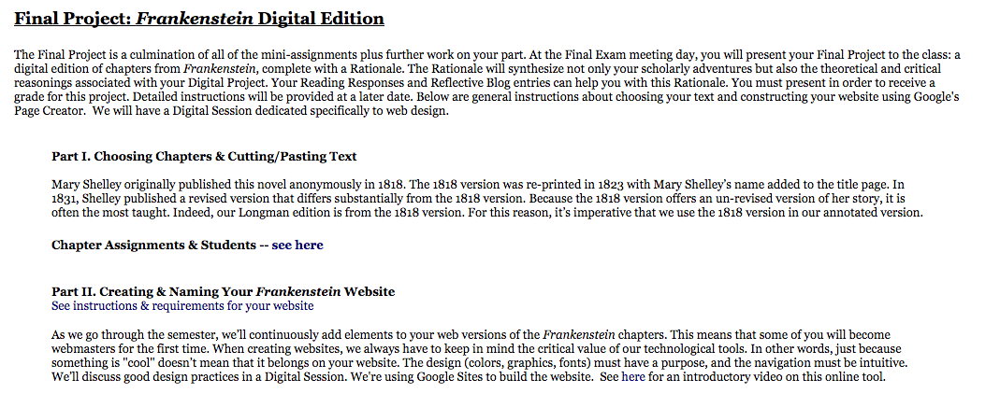
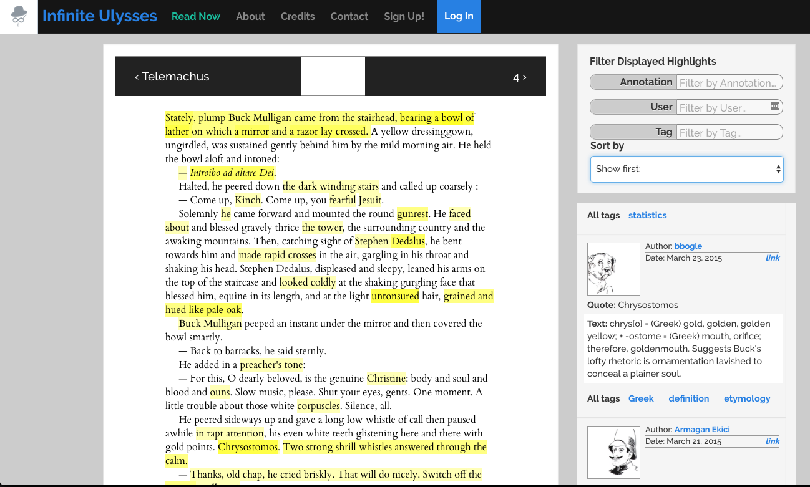
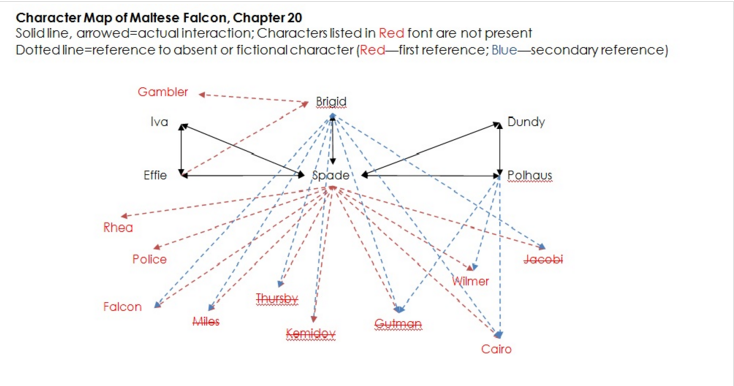
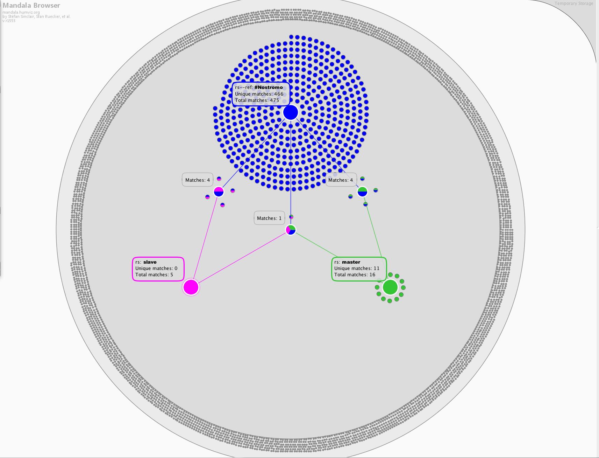
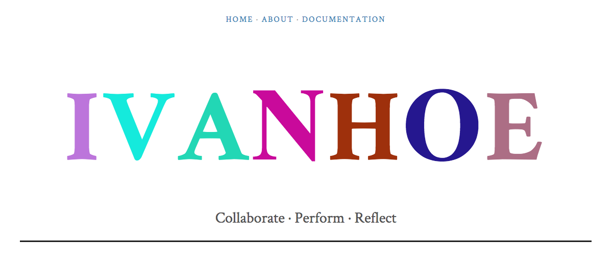
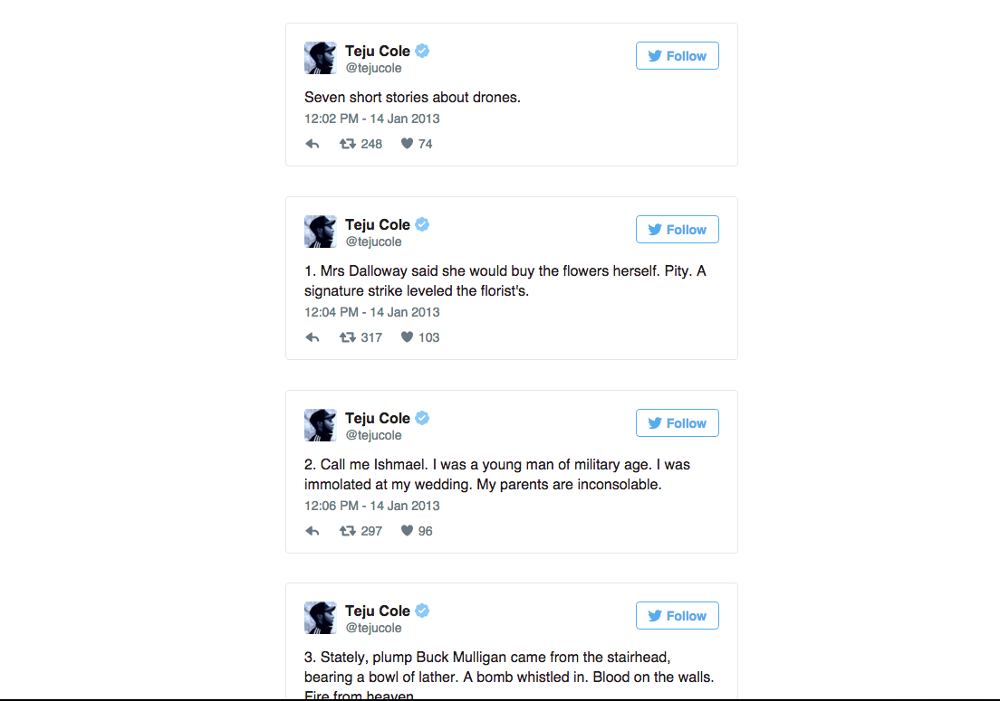
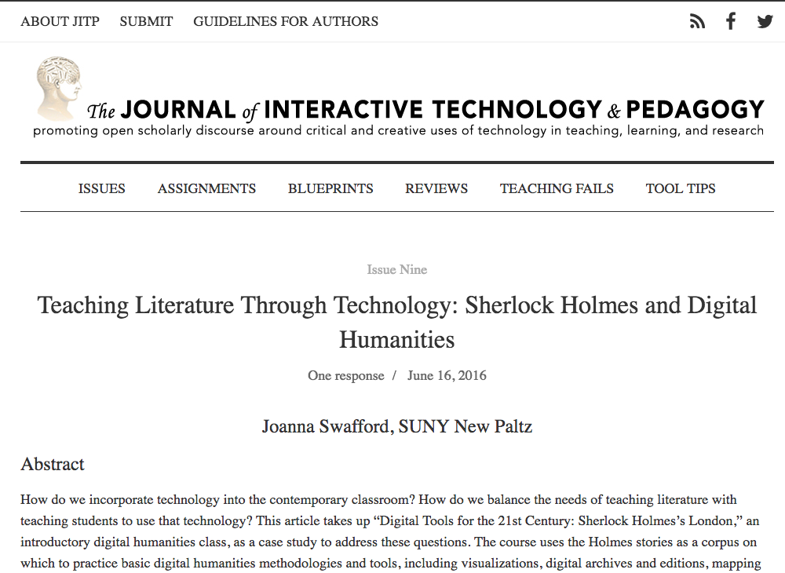
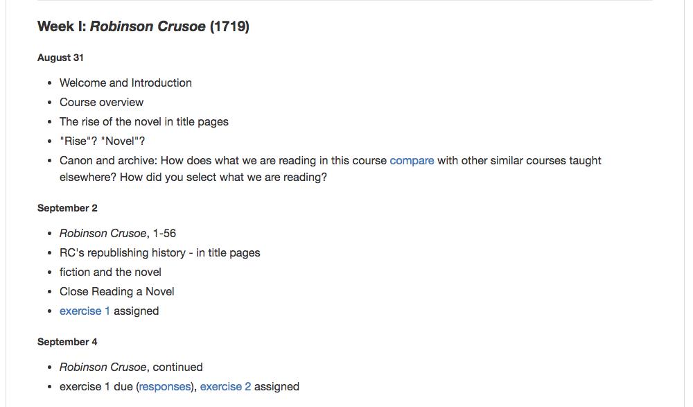
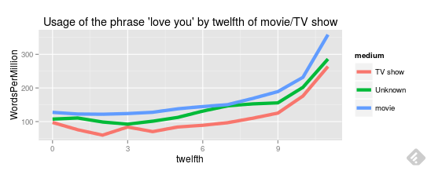
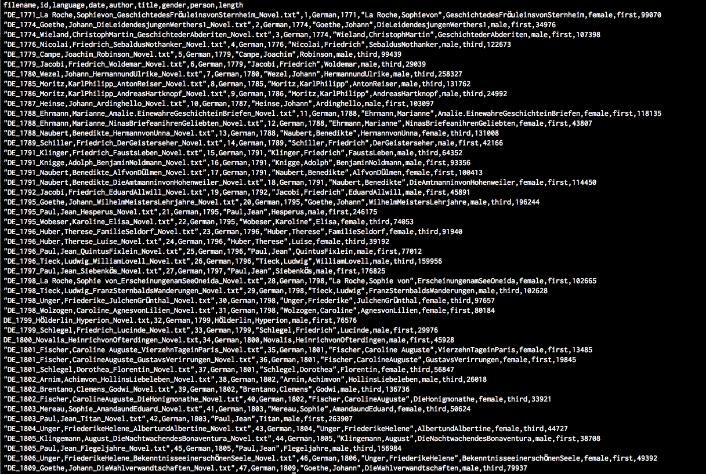

# FICTION

## Chris Forster
Syracuse University | http://www.cforster.com

---

##### Publication Status:
* unreviewed draft
* draft version undergoing editorial review
* **draft version undergoing peer-to-peer review**
* published

--- 

## CURATORIAL STATEMENT

In December of 1991, Art Spiegelman wrote to the editor of the *New York Times*. He was pleased that the second volume of his memoir *Maus* had appeared on December 8 "Best Seller List," but dismayed to discover it appeared under the *fiction* list. "If your list were divided into literature and nonliterature, I could gracefully accept the compliment as intended, but to the extent that 'fiction' indicates a work isn't factual, I feel a bit queasy," he insisted.

Similar ambiguities attend any attempt to put clear borders on the category *fiction*. This is, no doubt, in great part its power---that, as in *Maus*, comic mice can renarrate the Holocaust; or in Toni Morrison's *Beloved*, the real history of Margaret Garner can be refracted through what may appear to be a ghost story. Yet, if "fiction" were defined chiefly by its opposition to "truthfulness," teachers of fiction would be responsible for a range of materials broad enough to include not only novels and movies, but fables, fairy tales, and lies (to say nothing of statistics or political speeches).

Teaching fiction often means trying to understand this peculiar power: how does the fiction---the ostensibly "untrue"---nevertheless become powerful through its representations? In practice, this involves questions of narrative and plot, a sensitivity to form and style, and the histories (material and conceptual) of all of these terms. Why does a story feel like it has a sense of closure? When does it not? And what are the meanings---political and otherwise---of such closure? What are the devices by which we come to recognize and view a story from a particular perspective? How does a single work of fiction's participation in a genre shape our expectations and our understanding of the story? Moreover, studying fiction also invites reflection on *medium*; as the "same" story moves across genres---a process amply illustrated, for instance, by the many versions (dramatic, illustrated, filmed, etc) of Bram Stoker's *Dracula* which began appearing soon after its initial publication. Teaching of fiction, therefore, requires weaving together close attention to the histories and textures of particular works, with larger threads: longer political and social histories; the rise and fall of genres; and narrative structures broader than any single medium or genre.

Teaching questions of narrative, character, perspective, and medium is often made richer through the affordances of the digital. Online editions, distant reading, and similar resources, help articulate and make explicit processes that predate the digital. At the same time, the digital, as itself a form for new works of fiction, helps reveal the ways that works of fiction are shaped by, and reshape, the medium in which they appear. The items collected below attend to both the specificity of particular works, and larger trends by which such works are shaped. I have organized these resources roughly into two categories based on the scale of the object they address. Under `TEXTS` are resources that take as their organizing focus a single text. The digital editions---Katherine Harris's *Frankenstein* Digital Edition assignment and *Infinite Ulysses*---use the individual work as an occasion for gathering and rearranging the parts and pieces which make up the creation, publication, and reception of works of fiction. Such resources and assignments excavate the allusions and the histories (of text, gender, and nation) embedded within a work. IVANHOE, typically (though not necessarily) organized around a single work, invites its players into roles that are not so different from those of editors. Its players enter into a text to take it apart and piece together again, coming to understand it by remaking it. The other materials in this section focus on intratextual phenomena---character networks or the examination of the evolution of epithets, as methods for better understanding a text. They provide avenues less for connecting a single text to the larger forces and networks in which it participates, than for exposing the the complexities it contains.

The materials arranged under `GENRE` offer a look at narrative fiction at scales greater than the individual work. Perhaps the most unexpected item in this collection, Teju Cole's collection of tweets rewriting canonical novels, tackles the genre of literary fiction (the "classic") from the present. Other items in this list look to Sherlock Holmes stories, the history of the novel, or the structure of narrative itself (as reflected in TV and film). These resources all work not to reveal something larger than any single work can contain. Rather than sensitive us to the textures within a single work, they help to expose the conventions shared between works. This section also includes txtLAB's corpus of 450 novels, a set of novels ideal for larger scale analysis of fiction in the context of a class. (One can find an even larger corpus---or rather, its metadata---under **"Related Materials"**: data for roughly 32,000 works of fiction contained in [HathiTrust](https://www.hathitrust.org/). 

The list ranges from datasets, to games, to works of creative fiction. Some involve using digital tools to expand or complicate the traditional study of fiction, while others play with the form of fiction itself, helping us to understand works of fiction by making the genre strange and unfamiliar. Some of these resources are ready to use in the classroom, while others are offered as inspiration and demonstration of some of the opportunities afforded by the "digital" in for the study of fiction. Collected and presented here, they are meant to capture the wide range of things that one teaches when on teaches fiction.

## CURATED ARTIFACTS

### TEXT

#### *Frankenstein* Digital Edition Assignment

* URL: http://www.sjsu.edu/faculty/harris/TechnoRom_F09/Assignments.htm#FinalProj
* Type: Assignment
* Creator: [Katherine Harris](https://triproftri.wordpress.com/) (San José State University)

Katherine Harris's TechnoRomanticism class is structured around uses single large assignment---a digital edition of *Frankenstein*---to scaffold a semester's work. The assignment involves a number of skills, some broadly analytical others more specifically digital,  all grounded in the collaborative creation of a digital edition of a major text. The semester-spanning assignment provides a model that could be adapted to a variety of texts and contexts. It allows a single text to be the avenue through which a range of questions are asked, foregrounding questions of history---context, textual materiality, and medium---that treatments of "narrative" in the abstract might otherwise ignore.

#### Infinite Ulysses

* URL: http://www.infiniteulysses.com/
* Creator: [Amanda Visconti](http://literaturegeek.com/) http://www.amandavisconti.com/
* Type: Digital Edition
* License: Most of the data (the text of *Ulysses*, the annotations, other page data) are licensed [Creative Commons BY-NC-SA 3.0](https://creativecommons.org/licenses/by-nc-sa/3.0/us/). For details about the site's code, see its [github repository](https://github.com/amandavisconti/infinite-ulysses-public).

*Infinite Ulysses* is one of the most sophisticated online editions currently available. For readers of *Ulysses* it is a wonderful resource, both for teaching and reading. More broadly, however, *Infinite Ulysses* offers the best illustration of the potential and possibilities of collaborative reading and annotation, akin to what Alan Liu has described as "social reading." The range of materials that people use to annotate and enrich the collective, collaborative edition of *Ulysses* illustrates the ways that a single text can be enriched by cross-references, annotation, and contextual materials of various sorts.

#### Character Networks in Gephi (or Word, for the Low-Fi Lovers)

* Source URL: http://chuckrybak.com/characters-networks-in-gephi-or-word-for-the-low-fi-lovers/
* Type: Assignment
* Creator: [Chuck Rybak](http://chuckrybak.com/) (University of Wisconsin—Green Bay)

This assignment uses a single question---the relationship between a novel's characters---to both think about a novel, and to illustrate principles of digital textual analysis. It asks students to generate "data" from their reading, by *observing* and *noticing* when, and how, characters interact. The assignment takes this information and transforms it into a network visualization that itself provides a goad and inspiration for reflection on the work of literature. The result is an assignment that moves from the process of reading, to the collection and analysis of data, to reflection on its meaning. It is an ideal assignment for introducing such types of analysis. In asking students to generate the data by hand, it also helpfully illustrates [Johanna Drucker's suggestion that "all data is capta,"](http://www.digitalhumanities.org/dhq/vol/5/1/000091/000091.html) that is, constructed with a specific set of assumptions and uses.
 
In [a valuable discussion of the assignment](http://chuckrybak.com/teaching/dh-toe-dip-character-networks-in-gephi/) Rybak notes that the assignment was inspired by one of the Stanford Lit Lab's pamphlets on Hamlet and ["Network Theory, Plot Analysis"](http://litlab.stanford.edu/LiteraryLabPamphlet2.pdf)) and provides an illuminating account of its development. 

####  "Visualizing a Changing Nostromo"

* http://www.conradfirst.net/conrad/scholarship/authors/tanigawa
* Creator: [Katie Tanigawa](http://maker.uvic.ca/author/katie/) (University of Victoria)
* Type: Article

Tanigawa's article focuses on the epithets and appellations of a single character (the eponymous Nostromo) across three different textual versions of Conrad's novel. The result exploits textual markup technologies to combine an analysis of to the representation of character with a sensitivity to textual history. Tanigawa's analysis, which requires time-consuming [TEI](http://www.tei-c.org/index.xml) markup followed by visualization with the [Mandala browser](http://mandala.humviz.org/), is probably not feasible in most classroom contexts. However, the collation and analysis of how appellations change across a text (or versions of a text), and how such changes influence how we understand characters and their relationship within a work of fiction, could be explored in less labor-intensive ways, using tools like [word trees](https://www.jasondavies.com/wordtree/), simple term frequencies, other [text analysis tools](./textanalysis.md), or even manually. For another digital analysis of names in fiction see Dalen-Oskam.

#### IVANHOE

* URL: http://ivanhoe.scholarslab.org/
* Creator: [The Scholars Lab](http://scholarslab.org/) (University of Virginia)
* Type: Application / Game

Originally conceived in 2000-2001, the game of IVANHOE encourages players to treat literary texts or other works as a game of interpretation. It offers a loose framework of rules and conventions for transforming a text (or set of texts) into a role-playing game. While IVANHOE can be played with paper and pen, the Scholars Lab has recently released a new version of IVANHOE as a a WordPress plugin.

The goal of *IVANHOE*, Johanna Drucker explains, was to offer "a model digital environment for next-generation pedagogy and scholarship" (*SpecLab* 65). It is designed to "provoke critical modes of reading within literary studies." But it is also "a toy and a tool" (*SpecLab* 66). Of the items on this list, IVANHOE comes the closest to suggesting that the best way to understand the workings of fiction, are to create a work of fiction. A similar, but much smaller scale, assignment, "Role Playing *Dorian Gray*," is listed under **Related Materials**.

### GENRE

#### Teju Cole, "Seven Stories About Drones"

* Source URL: http://thenewinquiry.com/blogs/dtake/seven-short-stories-about-drones/
* Type: Text
* Creator: Teju Cole

Cole's "Seven Short Stories" rewrites the iconic opening of major novels (*Mrs. Dalloway*, *Things Fall Apart*, and others), upsetting their canonical force with the violence of the United States' 21st-century foreign policy. If the stories "deform" classic novels to highlight the violence of contemporary the "war on terror," they also exploit the limitations/affordances of Twitter. Each of the seven stories initially appeared as a tweet, limited to 140 characters. The *tweet*, as a narrative form, is explored elsewhere by Cole ("Hafiz" and "A Piece of the Wall"), as well as by Jennifer Egan in her techno-thriller in miniature "Black Box"; all these works invite discussion about the narrative form, and affordances, of tweet. Can one tell a whole story in a tweet? What sorts of stories are better suited to a tweet? What sorts of story resist it? How do these narrative affordances of the tweet contrast with those of the works Cole here rewrites? In this way, "Seven Stories About Drones" is valuable even in pedagogical contexts not focused on digital, or new media, literature. In considering questions of narrative form and genre, it may be worth noting that Cole's drone tweets are similar to his set of tweet-length fictions, inspired by the French newspaper genre *fait divers*, ["Small Fates"](http://www.tejucole.com/small-fates/). "Small Fates," like the *fait divers*, invite reflection on the relationship between medium and genre, on literature and politics, on canonicity and contemporary politics. (Cole's interview with Sarah Zhang offers valuable reflection on these works.)

#### Teaching Literature Through Technology: Sherlock Holmes and Digital Humanities

* Source URL: http://jitp.commons.gc.cuny.edu/teaching-literature-through-technology-sherlock-holmes-and-digital-humanities/
* Type: Article
* Creator: [Annie Swafford](https://annieswafford.wordpress.com/) (SUNY—New Paltz)

Detective fiction generally, and the Sherlock Holmes stories in particular, offer invaluable case studies for thinking about plots and narrative more broadly. Detective stories also provide a valuable opportunity to think about *genre*. (I begin my "Interpretation of Fiction" class with a number of detective stories; in addition to stories Edgar Allan Poe, Arthur Conan Doyle, and Agatha Christie, I recommend G. K. Chesterton's "The Hammer of God" and Jorge Luis Borges's "Death and the Compass" as stories which modify in informative ways the typical structure of the detective story.) They have also been the object of interesting reflection by critics including (to name, again, favorites from my own teaching) Franco Moretti and W. H. Auden.

In this article, Annie Swafford describes teaching a DH course centered around such stories. Swafford's class offers a rich set of digital labs that bring together the use of digital tools and reflection on the genre of detective fiction. The use of [word trees](https://www.jasondavies.com/wordtree/) to explore gender in the Holmes stories that Swafford describes is a particularly savvy way of bringing such analysis together with questions of gender, in a manner amenable to the classroom.

#### Rise of the Novel Syllabus

* Source URL: https://github.com/rbuurma/rise-2015/blob/master/rise_2015_syllabus.md
* Type: Syllabus
* Creator: [Rachel Sagner Buurma](http://rachelsagnerbuurma.org/) (Swarthmore College)

This syllabus integrates an exploration a variety of digital tools (including Named Entity Recognition, Digitization, [Voyant](https://voyant-tools.org/)) into a survey of the rise of the novel with a masterful selection of primary texts. The result is a syllabus that manages to simultaneously cover a key subject in literary history (the emergence, and growth, of the novel as a genre), while critically scrutinizing that very narrative, and providing introductions to a range of tools of approaches in the process. The tools, moreover, are not merely tacked on, but are integral to the examination of the "rise" of the novel the syllabus offers.

#### Typical TV Episodes: Visualizing Topics in Screen Time

* Source URL: http://sappingattention.blogspot.com/2014/12/typical-tv-episodes-visualizing-topics.html
* Type: Blog Post
* Creator: Ben Schmidt

This analysis of television and film narrative provides a model for thinking about the structure of plots more generally. Even without [the impressive database of film/tv scripts](http://movies.benschmidt.org/), or the sophisticated statistical tools Schmidt uses to analyze them, one can understand the basic questions about *plot* that motivate Schmidt's analysis. While Schmidt's analysis in this post quickly moves beyond phrases to examine more sophisticated measures of narrative, his observations about more simple measures (e.g. where does the phrase "I love you" tend to occur in films) can prove illuminating in highlighting the ways that particular words, phrases, or locations, reflect how plots are organized around certain tensions. While Schmidt's method by the end of this post (plotting the *principal components* of the *topics* extracted from topic modeling) is too advanced for almost any class not focused on computational approaches to literature, the broader questions of Schmidt's analysis---using words, phrases, or topics to examine and compare plots---can be valuably repurposed. Similar questions about how to analyze plot, and by what measures, are at stake in the debates about plot and sentiment discussed in Jocker's "Revealing Sentiment and Plot Arcs with the Syuzhet Package" and Swafford's "Why Syuzhet Doesn't Work and How We Know," listed under **Related Materials**.

#### txtLAB450

* Source URL: http://txtlab.org/?p=601
* Type: Dataset
* Creator: [txtLab](http://txtlab.org/) (McGill University)

If you're looking for the text of a particular work of fiction for analysis, your best bet is likely [Project Gutenberg](https://www.gutenberg.org/) or [The Oxford Text Archive](https://ota.ox.ac.uk/). If however you are looking for a curated dataset to examine *fiction* as a genre (meaning, here, essentially novels), the `.txtLab`'s txtLab450 offers "a multilingual data set of novels for teaching and research." Containing 150 novels in English, 151 novels in French, 151 novels in German, the dataset represents novels from the "long nineteenth century (1770-1930)." In addition, the dataset includes describing each novel according to year of publication, gender of author, and the narrative perspective (first or third person) in which the novel is written. Such metadata allows more interesting and subtle analysis than the text of the novels alone would. (For an example of how this data might be used, see Piper). A larger dataset, containing English Fiction from 1700 - 1899 drawn from the HathiTrust dataset, is listed below, under **Related Materials**.

## RELATED MATERIALS

### "Role Playing *Dorian Gray*"

Dierkes-Thrun, Petra. "Role Playing *Dorian Gray*." [http://wildedecadents.wordpress.com/2012/10/23/twitter-role-play-the-picture-of-dorian-gray-exercise-4/](http://wildedecadents.wordpress.com/2012/10/23/twitter-role-play-the-picture-of-dorian-gray-exercise-4/) 

Felluga, Dino. "Purdue Introduction to Narratology." [http://www.cla.purdue.edu/english/theory/narratology/](http://www.cla.purdue.edu/english/theory/narratology/)

Underwood, Ted and HathiTrust. "HathiTrust English Language Fiction, 1700-1899, Workset." [http://www.ideals.illinois.edu/handle/2142/45713](http://www.ideals.illinois.edu/handle/2142/45713)

Swafford, Annie. "Why Syuzhet Doesn't Work and How We Know." [http://annieswafford.wordpress.com/tag/sentiment-analysis/](http://annieswafford.wordpress.com/tag/sentiment-analysis/)

Jockers, Matthew. "Revealing Sentiment and Plot Arcs with the Syuzhet Package." [http://www.matthewjockers.net/2015/02/02/syuzhet/](http://www.matthewjockers.net/2015/02/02/syuzhet/)

## BIBLIOGRAPHY

* Auden, W. H. "The Guilty Vicarage." *The Critical Performance*. Ed. Stanley Edgar Hyman. Vintage Books, 1956, pp. 301-314.

* Cole, Teju. "A Piece of the Wall." Web. <https://twitter.com/tejucole/timelines/444262126954110977>

* ---. "Hafiz." Web. https://twitter.com/tejucole/timelines/437242785591078912?lang=en

* Dalen-Oskam, Karina van. "Names in Novels: An Experiment in Computational Stylistics." *Literary and Linguist Computing* (2013) 28 (2): 359-370 first published online March 9, 2012 doi:10.1093/llc/fqs007
<http://llc.oxfordjournals.org/content/28/2/359.abstract>

* Drucker, Johanna. "2.2 Ivanhoe." *SpecLab: Digital Aesthetics and Projects in Speculative Computing*. U of Chicago P, 2009,pp. 65-97.

* ---. "Humanities Approaches to Graphical Display." *Digital Humanities Quarterly*, vol. 5, no. 1, 2011. <http://www.digitalhumanities.org/dhq/vol/5/1/000091/000091.html>

* Egan, Jennifer. "Black Box." *New Yorker*. June 4 and 11, 2012. Web.  <http://www.newyorker.com/magazine/2012/06/04/black-box-2> 

* Liu, Alan. "From Reading to Social Computing." *Literary Studies in the Digital Age: An Evolving Anthology*. 2013, 
<https://dlsanthology.commons.mla.org/from-reading-to-social-computing/>

* McGann, Jerome. "Conclusion. Beginning Again and Again: 'The Ivanhoe Game.'" *Radiant Textuality: Literature After the World Wide Web*. Palgrave Macmillian, 2001, pp 209-231.

* Moretti, Franco. "The Slaughterhouse of Literature." *MLQ: Modern Language Quarterly*, vol. 6 no. 1, March 2000, pp. 207-227.

* ---. "Style Inc.: Reflections on Seven Thousand Titles (British Novels, 1740-1850." *Critical Inquiry*, vol. 36, no. 1, Autumn 2009, pp 134-158.

* "Kurt Vonnegut Diagrams the Shape of All Stories in a Master's Thesis Rejected by U. Chicago." <http://www.openculture.com/2014/02/kurt-vonnegut-masters-thesis-rejected-by-u-chicago.html>. 

* Piper, Andrew. "Novel Devotions: Conversional Reading, Computational Modeling, and the Modern Novel." *New Literary History*, vol. 46, no. 1, Winter 2015. pp 63-98.

* Spiegelman, Art. "A Problem of Taxonomy." *New York Times* Dec 29, 1991. ProQuest. Web.

* Zhang, Sarah. "Teju Cole on the 'Empathy Gap' and Tweeting Drone Strikes." *Mother Jones*. March 6, 2013. Web. http://www.motherjones.com/media/2013/03/teju-cole-interview-twitter-drones-small-fates
