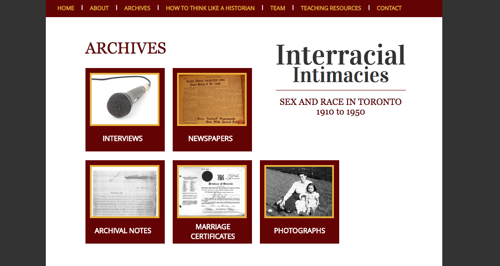
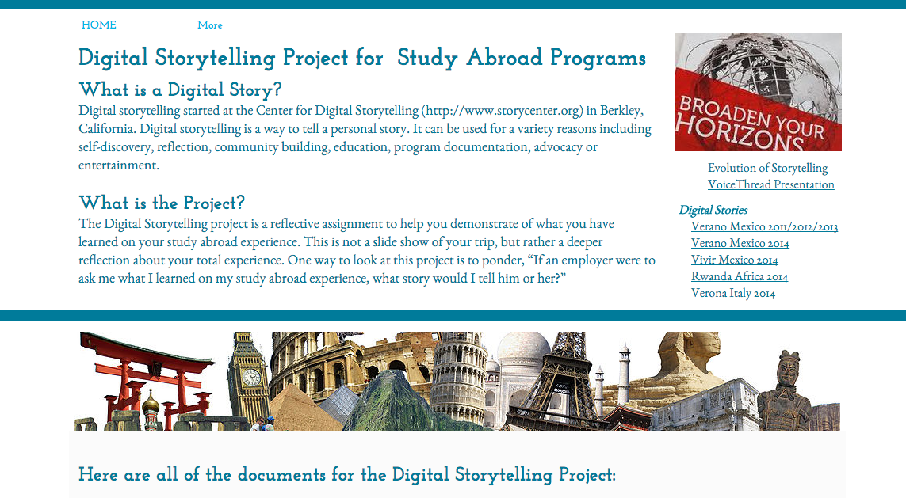
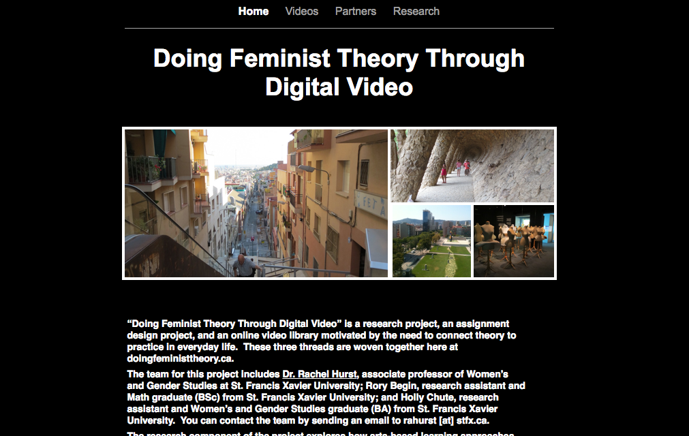
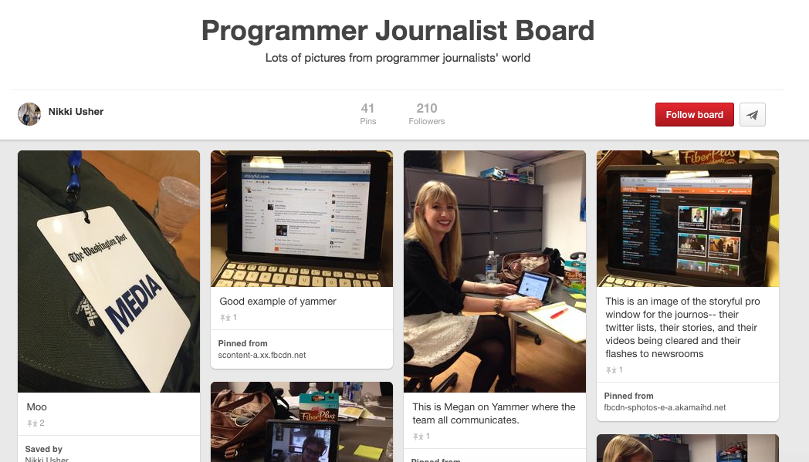
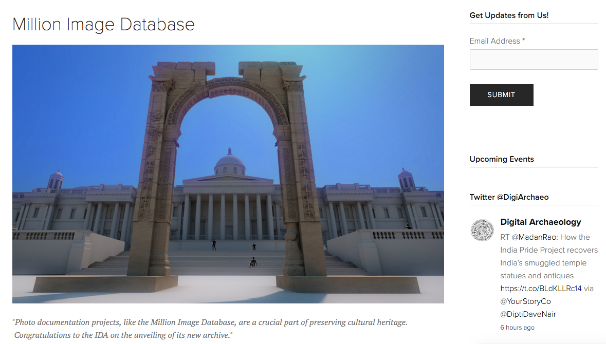
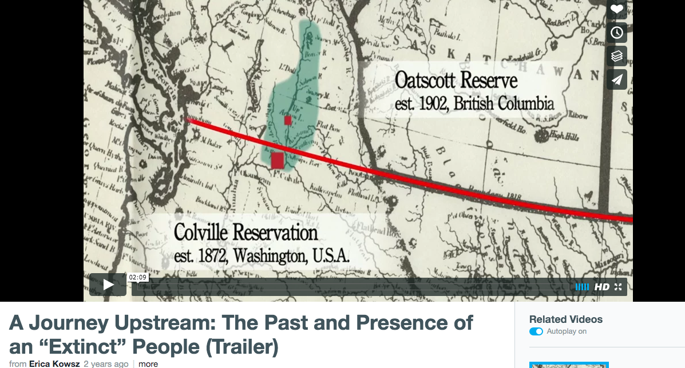
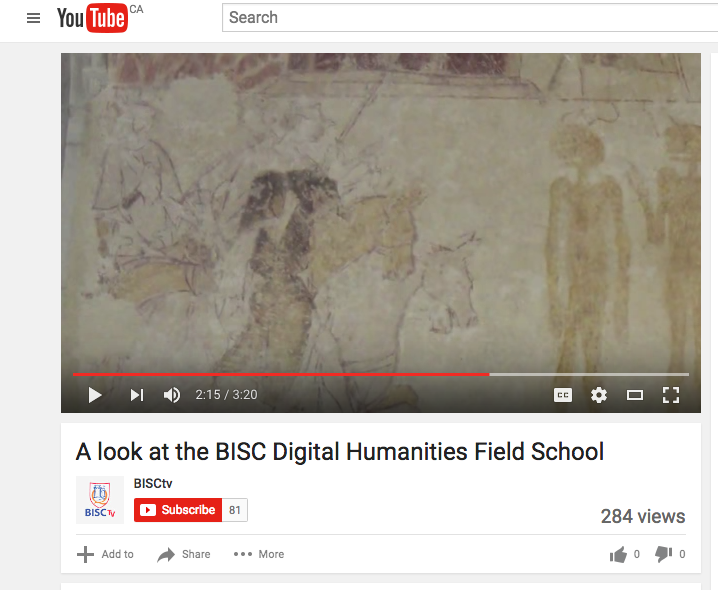
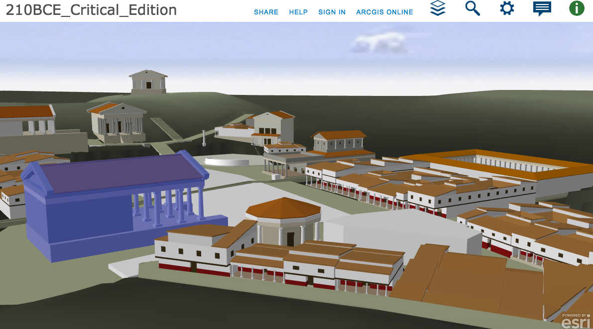
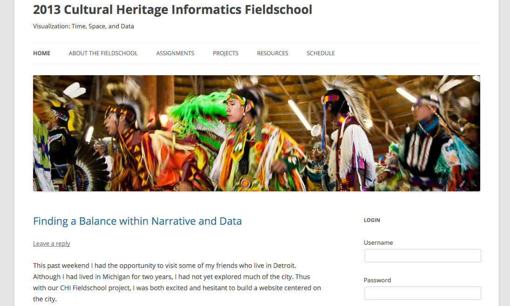

# Fieldwork
 
### Colette Colligan and Michelle Levy
Simon Fraser University

---

##### Publication Status:
* unreviewed draft
* draft version undergoing editorial review
* **draft version undergoing peer-to-peer review**
* published

---

## CURATORIAL STATEMENT

Fieldwork has been central to pedagogy in many scholarly disciplines. Archaeological digs, geographical surveys, and ethnographic interviews readily come to mind, but the proliferation of international general education and study abroad programs has also introduced new disciplines to fieldwork. Fieldwork as a pedagogical practice has two central components: learning by doing through an immersive encounter, and learning by traveling and dwelling in a spatially-demarcated field (Clifford). We think that digital culture, and the new methods and tools it introduces, are transforming the practice of fieldwork, for scholars and students alike.

Many of the digital artifacts we curate exemplify how fieldwork is undergoing a remediation of form, pushing the boundaries of academic inquiry and communication. As digital technology frees fieldwork from the traditional confines of a spatially demarcated “field,” it introduces new immersive and expressive forms of fieldwork practice and pedagogy. Among the curated artifacts are digital assignments and projects that allow students immersed in fieldwork (whether on-site or virtual) to experiment with creative forms of storytelling, such as blogging, video production, and scrap-booking, activities that can blur the boundaries between documentation and expression. These artifacts also leverage social media and digital connectivity to engage community groups and diverse publics in fieldwork, shifting towards more public-facing interactivity. Digital forms are changing the ways in which fieldwork can be taught, practiced, and communicated (Colligan, Levy, and Yoder; France and Welsh). Cultural critique combined with the exploration of diverse forms of expression and communication converge in the experimental and interactive forms of digital fieldwork exemplified by these artifacts. These new forms of fieldwork also revitalize questions about the rights over content collected in the field, the ethics of appropriation and representation, and the effects of technology on the objects of study (Karol Jan Borowiecki, Neil Forbes, Antonella Fresa), questions vital for teaching and learning a critical practice of digital fieldwork.

In adopting pedagogical practices that promote creativity and enable experimentation, the digital artifacts we gather also expand the limits of what counts as knowledge production in the humanities. Students script, direct, and shoot videos that demonstrate their engagement with community groups as well as their exploration of critical ideas relevant to a particular field. An emphasis remains on process as a necessary part of learning, reflective of the turn toward “making as a form of knowing” in digital humanities (Galey and Ruecker 407). As fieldwork shifts to the web and goes live more readily at earlier stages of collection and analysis, it is modeled for students as interactive, iterative, and ultimately as inquiry and discovery. This philosophy of making or building as a way of knowing prompts questions about the nature and purpose of the work that goes into fieldwork. Who is doing that work and under what conditions? Who is the researcher and who is the subject? And how will the digital reconstructions of field sites, media-making, and project-driven fieldwork produce knowledge? This process-based approach foregrounds the relationship between work and knowledge that is central to the project of fieldwork and can inform digital culture and the practice of digital humanities. This approach can bind us to empirical modes of “looking, collecting, and record-keeping” that have undergone powerful critique for their colonial legacies (Clifford; Hyndman; Mattern), but can also initiate reshaping of these practices. Further, feminist, critical race and postcolonial theories can impact digital fieldwork methods through their understanding of technologies as “skilled practices,” always in need of situatedness and contextualization (Haraway 587; Risam; Wernimont). 

As a pedagogical research practice, fieldwork already has a collaborative ethos similar to practices within Digital Humanities (Deegan and McCarty), but our artifacts show how digital fieldwork is rescaling these collaborations. Drawing on citizen science (Ratto and Boler; Mia Ridge) and the collaborative accomplishment of Wikipedia to engage communities from all over the world in the collection of data and the production of knowledge (Christian Vandendorpe), some of our artifacts address a wide and varied public, urging participation in field documentation and commentary. As the scale of fieldwork enlarges, so too is the role of researcher potentially democratized. Different social configurations emerge around these artifacts, whether a loosely connected network of citizen fieldworkers, a devoted network of Pinterest or social-media followers, or supportive kinship networks commenting on student fieldwork. The hierarchical roles of teacher and student, and researcher and subject can also be reconfigured through more open and networked models of fieldwork collaboration. At the same time, rapid shifts in the scale of fieldwork introduce the potential for ill-defined and unstable roles and networks, prompting the need for critical inquiry into the effects of this expansion of scale and digital inequalities (Massimo Ragnedda and Glenn W. Muschert). 

Finally, the digital fieldwork represented by our artifacts involve a critical rethinking of embodied site-specific inquiry and a resituation of knowledge. Fieldwork has traditionally been invested in attention to place as a source of meaning and knowledge: a researcher (or group of researchers) travels to a site and returns with data for analysis (Clifford). Digital fieldwork can, however, break down the perceived distance between field and home. It can do so through the virtual reconstruction of an archaeological site, which collapses the distinction between there and here, then and now, opening students to an immersive experience in a three-dimensional world. Data collection can be accelerated through simple and widely accessible mobile tools such as smartphones, with results that can be shared and disseminated almost immediately. Immersion can occur on-screen, and not physically on-site, through the use of screen-based technologies and virtual reconstructions. Both site-specific and screen-based fieldwork are highly mediated interactions, and both raise the spectre of exploitation and distortion as they complicate site-specific inquiry and the very notion of immersion. We cannot assume that the resituated knowledges afforded by digital technologies leads to a distance from gendered and colonialist fieldwork practices (Mattern), hence the ongoing need for cultural critique within pedagogical applications of new digital media (Liu; Wernimont).

The curatorial vision informing our selection of fieldwork artifacts presents this revitalization of fieldwork as a remediation of creative and critical practice (artifacts 1, 2, and 3), a turn toward process-driven models of knowledge production (artifacts 4 and 5), an engagement with open social research (artifacts 6 and 7), and a critical rethinking of site-specific inquiry (artifacts 8, 9, and 10). These categories come together, with some overlap, in our chosen artifacts.

## CURATED ARTIFACTS

#### Interracial Intimacies: Sex and Race in Toronto: 1920-1950

* Source: [http://interracialintimacies.org/how_to.html](http://interracialintimacies.org/how_to.html)
* Creators: Elise Chenier and Stacey Makortoff

Interracial Intimacies is an interactive website and pedagogical tool that follows a historian on her journey from research question to published article. With detailed descriptions narrating every step of the process, historian Elise Chenier describes the process of historical fieldwork for students. Chenier begins with a question on Lesbian Bar Culture in Toronto in the 1950s and ‘60s, and navigates the circuitous path—through oral interviews, archival collection, and analysis of primary sources such as maps, newspaper reports, census data, marriage certifications, and photographs—towards the final published paper on interracial relationships between men of Chinese Heritage and women of Non-Asian Heritage in Toronto between 1910 and 1950. An example of oral history as fieldwork, and a how-to guide for aspiring historians, the interactive site demonstrates to students the various twists and turns involved in historical inquiry: “The thing about oral history is you never really know what you are going to find out.”

#### Digital Storytelling Project for Study Abroad Programs

* Source: [http://www.melodybuckner.com/#!studyabroad/cx4z](http://www.melodybuckner.com/#!studyabroad/cx4z)
* Creator: Melody Buckner

This website outlines a student assignment for designing digital stories within study abroad programs. It brings a popular genre of personal storytelling, spearheaded by the Berkeley Centre of Digital Storytelling, to the field, situating the digital story as the capstone project. Drawing on the emotional power of this genre, it encourages self-expression, self-discovery, and interactive narrative within a reflective fieldwork practice. Instructional support is provided in the form of assignment timelines, grading rubrics, storytelling tips, sample digital stories, and suggested story-making platforms. It designs its assignment around VoiceThread, a free web-based storytelling platform that allows users to mix text, images, and audio-visual recordings with social media functionality to bring work in the field to larger networks of family, friends, and peers. While based on a six-week study abroad trip, the assignment could be adapted for shorter or longer periods. Other free digital storytelling platforms could also be incorporated into the assignment.

#### Sustainability Stories from the Field

* Source: [http://fieldschools.geog.uvic.ca](http://fieldschools.geog.uvic.ca)
* Creator: Cam Owens

This website showcases student digital fieldwork undertaken since 2012 during field courses centered on sustainability and run by the University of Victoria’s Department of Geography. Its purpose is to discuss and share “inspiring examples of sustainability, resilience, regeneration” relevant to local and international fieldwork. These examples find expression in a range of student digital stories, including short videos, travel blogs, and interactive maps on topics like the creation of biking networks in Victoria and urban efforts to battle climate change. What makes this website pedagogically useful is the curatorial vision it brings to digital fieldwork. Year by year, it compiles work by different students, at different stages of progress, and from different field courses, promoting a work-in-progress, team-based curatorial practice. Curation typically happens at one point; this website shows its integration in fieldwork, giving students a site for shared learning and expression, and instructors a model for collecting student fieldwork and giving value to it at various stages of development.

#### Doing Feminist Theory through Digital Video

* Source: [http://www.doingfeministtheory.ca/](http://www.doingfeministtheory.ca/)
* Creators: Rachel Hurst, Rory Begin, and Holly Chute

Students of a feminist theory course at St. Francis Xavier University were asked to consult with community groups in the field to create short, non-documentary digital videos (3-5 minutes in length) on a concept relevant to the study of feminist theory, such as decolonization, power, or sexual violence. “Inspired by the literatures on digital storytelling, participatory video, and creative feminist pedagogies,” students met with community groups and organizations and scripted and directed their documentaries with their community partners in mind. This detailed assignment sheet provides students with step-by-step instructions for every stage of the process: from conceptualizing and planning to strategies for meeting and working with community partners; from providing a curated list of videos students could use for inspiration to technical information about filming and editing. In addition to the assignment, the website includes research outcomes and links to the student videos produced in the course.

#### Why We Like Pinterest for Fieldwork

* Source: [https://socialmediacollective.org/2014/07/14/why-we-like-pinterest-for-fieldwork/](https://socialmediacollective.org/2014/07/14/why-we-like-pinterest-for-fieldwork/)
* Creators: Phil Howard and Nikki Usher

Developing an efficient data collection system during intensive fieldwork is challenging. Notes scribbled on paper and mistyped on devices are illegible or confusing, while photographs and videos quickly fill up cell phone storage. As data accumulates across platforms, it demands metadata to remain meaningful for inquiry and retrieval. This blog, produced by The Social Media Research Collective, proposes Pinterest as an in-field solution: an easy-to-use, web-based tool for storing, annotating, and sharing digital image artifacts collected during fieldwork. Available as a mobile app, Pinterest integrates the process of data capture and storage, allowing the user to retain rights over content. It is also linkable to social media feeds for immediate public sharing and presentation, or private sharing through closed boards. Batch downloads allow for migration to other platforms. As a digital image archive of fieldwork artifacts gathered on the go, it also allows for ongoing review of fieldwork observations and practices. In clear language and via links to Pinterest boards used for fieldwork, this blog post lays out the potential value of this digital platform for in-field gathering, sharing, and storing of images.

#### The Million Image Database

* Source: [http://www.millionimage.org.uk/](http://www.millionimage.org.uk/)
* Creators: The Institute for Digital Archaeology

The Million Image Database is an open-access web portal into photographic documentation of cultural heritage materials gathered from around the world, particularly from regions whose heritage is at risk. Inspired by the collaborative work of Wikipedia to assemble the world’s knowledge, the Institute of Digital Archaeology launched this open social fieldwork project in collaboration with UNESCO and other academic partners. With the mission of becoming a photographic storehouse of the world’s cultural heritage, the site gathers images of objects, architecture, and places to document and preserve “humanity’s history as represented by the things we build” for now and the future. By clicking on interactive maps, users can gain access, for example, to high-quality anaglyph images of sites such as Jebel Hafit Tombs in United Arab Emirates, which is rendered immersive by three-dimensional glasses. The database depends entirely on its user community: the Institute accepts all contributions via diverse communications channels and equips local  volunteer photographers from around the world with “lightweight, discreet, and easy-to-use 3D cameras.” It asserts no copyright over these images, and makes them available to exchange freely and without attribution. Though still in development, this database has the potential to become an important resource for digital heritage and virtual fieldwork as well as a teaching and learning platform for raising complex debates about citizen fieldwork, cultural rights and appropriation, and digital repatriation. 

#### A Journey Upstream: The Past and Presence of an “Extinct” People (Trailer)

* Source: [https://vimeo.com/78530205](https://vimeo.com/78530205)
* Creators: Directed and Produced by Erica Kowsz; Co-Produced by Nathan Goodale

This is a trailer for a documentary titled, “A Journey Upstream: The Past and Presence of an ‘Extinct’ People,” directed by archaeology graduate student, Erica Kowsz, and part of SEARCH, a multi-institutional archaeology, cultural heritage, and linguistics project. The project aims to document the history and continued presence of the Sinixt Nation in British Columbia, despite it having been pronounced “extinct” in 1956 by the Canadian Government. As an example of student digital fieldwork, the short video demonstrates the crucial role that technology brings to documentation, with interviews of the supposedly “extinct” members of Sinixt Nations. Although currently in the data collection stage, the video is an example of project staging, providing the public with some access to the historical context and aims of the project in advance of completion. The project also demonstrates how students use multimedia to create and disseminate archaeological and anthropological research. The video, reflecting a preliminary stage of research, does not address directly the complex issues of ownership and management of the documentary videos. 

#### A Look at the BISC Digital Humanities Field School

* Source: [https://youtu.be/PCSzXG536BU](https://youtu.be/PCSzXG536BU)
* Creators: BISCtv (Bader International Study Centre YouTube Channel)

In this promotional video, visiting fellow, Chris Jones, describes the Field School in Digital Humanities, offered in 2015, where students visit two medieval parish churches in Surrey containing historical objects that Jones is digitizing: a 1615 King James Bible and various medieval wall paintings. The aim of the field school is to investigate which digitizing technologies are appropriate for the artifacts. Jones advocates for site-specific research, to assess historical artifacts in the sites in which they would have been viewed and experienced and to also understand their social and material significance. With the wall paintings, for example, he notes that simply creating high-resolution digital photos may distort online users’ experience, as the paintings would have been viewed by candlelight and were obscured for reasons of censorship for much of their history. The need for site-specific sensitivity demands a fieldwork approach to the work of digital humanities. The video raises directly the question of the adequacy of digital photography and videography as a documentary tool, suggesting the need for contextualization through other media. 

#### Rome Lab

* Source: [http://www.arcgis.com/apps/CEWebViewer/viewer.html?3dWebScene=6bfc7de39700434bbc9c1df48fed8b52](http://www.arcgis.com/apps/CEWebViewer/viewer.html?3dWebScene=6bfc7de39700434bbc9c1df48fed8b52)
* Creators: Christopher Johanson

Using the analogy of a text-based critical edition, RomeLab recreates three critical editions of the Roman Forum, for 210 BCE, 160 BCE, and 44 BCE. Developed within ArcGIS online using ArcMap shapefiles in Esri CityEngine, the project virtually reconstructs the Roman Forum at historical moments within interactive, three-dimensional interfaces. The interface allows the user to navigate within the reconstruction and view it from different perspectives. A form of virtual fieldwork that reconstitutes an archaeological site, the researchers’ aim is to create “digital laboratories” where individuals can have a virtual world experience. These digital laboratories enable students and scholars to bring the field home, with digital technology enhancing what can be seen on site, opening up new spatial perspectives and virtually reconstructing buildings that no longer exist. A built-in comparison tool uses a split-screen function to visualize different possible reconstructions, where data sources are uncertain or conflicting. The tool can thus allow a screen-based fieldwork, as students and scholars can virtually reconstruct buildings in ways impossible on-site.

#### 2013 Cultural Heritage Informatics Fieldschool: Visualization: Time, Space, and Data

* Source: [http://anthropology.msu.edu/2013chifieldschool/](http://anthropology.msu.edu/2013chifieldschool/)
* Creators: Ethan Watrall

The 2013 Cultural Heritage Informatics Fieldschool website has everything instructors need for thinking about how fieldwork can happen locally in the digital age. Students build digital skills related to the field of cultural heritage, concentrating on visualizing cultural data and undertaking data-intensive fieldwork on a range of sites. In reconceptualizing fieldwork as a critical practice of “building as a way of knowing” rather than as a spatial practice of exotic displacement, the course (and the fieldschool entire) prioritizes the development of work on campus over going out into the field. It also explores distance as a condition of fieldwork knowledge, instead of localization. Instead of a team of student researchers leaving home for a six-week period at a foreign locale, the group comes together in an immersive and intensive work setting to engage in digital research around cultural heritage, using and aggregating existing large volumes of data for projects on, for example, “Endangered African Heritage.” The potential for cultural fieldwork to distance itself from its exoticist colonial legacies of travelling from the centre to the periphery and back to extract new knowledge thus emerges with digitally-oriented research practices, described in depth on this course site through course objectives, assignments, schedules, projects, and resource lists. 

## RELATED MATERIALS

Deegan, Marilyn and Willard McCarty, editors. *Collaborative Research in the Digital Humanities*. Routledge, 2012.

Ramsay, Stephen and Geoffrey Rockwell. “Developing Things: Notes toward an Epistemology of Building in the Digital Humanities.” *Debates in the Digital Humanities*, edited by Matthew K. Gold, University of Minnesota Press, 2012, pp. 75-84.

Sanjek, Roger and Susan W. Tratner, editors. *eFieldnotes: The Makings of Anthropology in the Digital World*. University of Pennsylvania Press, 2015.

Selfe, Cynthia L., editor. *Multimodal Composition: Resources for Teachers*. Hampton Press, 2007. 

Shabani Mligo, Elia. *Doing Effective Field Work: A Textbook For Students of Qualitative Field Research in High-Learning Institutions*. Wipf and Stock Publisher, 2013.

## WORKS CITED

“A Look at the BISC Digital Humanities Field School.” *YouTube*, uploaded by BISCtv, 18 Feb. 2014, [https://youtu.be/PCSzXG536BU](https://youtu.be/PCSzXG536BU).

Buckner, Melody. *Digital Storytelling Project for Study Abroad Programs*. University of Arizona, [http://www.melodybuckner.com/#!studyabroad/cx4z](http://www.melodybuckner.com/#!studyabroad/cx4z). Accessed 15 Aug. 2016.

Borowiecki, Karol J., Neil Forbes, and Antonella Fresa, editors. *Cultural Heritage in a Changing World*. Springer International Publishing, 2016.

Chenier, Elise and Stacey Makortoff. *Interracial Intimacies*. Simon Fraser University, [http://interracialintimacies.org/how_to.html](http://interracialintimacies.org/how_to.html). Accessed 15 Aug. 2016.

Clifford, James. *Routes: Travel and Translation in the Late Twentieth Century*. Harvard University Press, 1997.

Colligan, Colette, Michelle Levy and Paul Yoder, editors. “Study Abroad in the Lake District and Beyond.” *Romantic Circles Pedagogies* (Forthcoming 2016).

Galey, Alan and Stan Ruecker. “How a prototype argues.” *Literary and Linguistic Computing: Journal of the Association for Literary and Linguistic Computing and The Association for Computers and the Humanities*, vol. 25, no. 4, 2010, pp. 405-424. *Oxford Journals*, doi: 10.1093/llc/fqq021. Accessed 15 Aug. 2016.

Haraway, Donna. “Situated Knowledges: The Science Question in Feminism and the Privilege of Partial Perspective.” *Feminist Studies*, vol. 14, no. 3, 1988, pp. 575-600. *ProQuest*, [http://proxy.lib.sfu.ca/login?url=http://search.proquest.com.proxy.lib.sfu.ca/docview/1295968804?accountid=13800](http://proxy.lib.sfu.ca/login?url=http://search.proquest.com.proxy.lib.sfu.ca/docview/1295968804?accountid=13800). Accessed 15 Aug. 2016.

Howard, Phil and Nikki Usher. “Why We Like Pinterest for Fieldwork.” *Social Media Collective*, 14 Jul. 2014, [https://socialmediacollective.org/2014/07/14/why-we-like-pinterest-for-fieldwork/](https://socialmediacollective.org/2014/07/14/why-we-like-pinterest-for-fieldwork/). Accessed 15 Aug. 2016.

Hurst, Rachel, Rory Begin and Holly Chute. *Doing Feminist Theory Through Digital Video*. St. Francis Xavier University, [http://www.doingfeministtheory.ca/](http://www.doingfeministtheory.ca/). Accessed 15 Aug. 2016.

Hyndman, Jennifer. “The Field as Here and Now, Not There and Then.” *Geographical Review*, vol. 91, no. 1, 2001, pp. 262-272. *JSTOR*, [http://www.jstor.org.proxy.lib.sfu.ca/stable/3250827](http://www.jstor.org.proxy.lib.sfu.ca/stable/3250827). Accessed 15 Aug. 2016.

Johanson, Christopher. *RomeLab*. 21 Sept. 2015, [http://www.arcgis.com/apps/CEWebViewer/viewer.html?3dWebScene=6bfc7de39700434bbc9c1df48fed8b52](http://www.arcgis.com/apps/CEWebViewer/viewer.html?3dWebScene=6bfc7de39700434bbc9c1df48fed8b52). Accessed 15 Aug. 2016.

Kowsz, Erica and Nathan Goodale. “A Journey Upstream: The Past and Present of an “Extinct” People (Trailer).” *Vimeo*, uploaded by Erica Kowsz, 4 Nov. 2014, [https://vimeo.com/78530205](https://vimeo.com/78530205).

Liu, Alan. “Where is Cultural Criticism in the Digital Humanities?” *Debates in the Digital Humanities*, edited by Matthew K. Gold, University of Minnesota Press, 2012, pp. 490-510.

Mattern, Shannon. “Cloud and Field: On the resurgence of “field guides” in a networked age.” *Places Journal*, Aug. 2016, [https://placesjournal.org/article/cloud-and-field/](https://placesjournal.org/article/cloud-and-field/). Accessed 15 Aug. 2016.

Owens, Cam. *Sustainability Stories from the Field*. University of Victoria, 2014, [http://fieldschools.geog.uvic.ca](http://fieldschools.geog.uvic.ca). Accessed 15 Aug. 2016.

Ragnedda, Massimo and Glenn W. Muschert, editors. *The Digital Divide: The Internet and Social Inequality in International Perspective*. Routledge, 2013.

Ratto, Matt and Megan Boler, editors. *DIY Citizenship: Critical Making and Social Media*. MIT Press, 2014.

Ridge, Mia, editor. *Crowdsourcing our Cultural Heritage*. Routledge, 2014.

Risam, Roopika. “Beyond the Margins: Intersectionality and the Digital Humanities.” *Digital Humanities Quarterly*, vol. 9, no. 2, 2015. [http://www.digitalhumanities.org/dhq/vol/9/2/000208/000208.html](http://www.digitalhumanities.org/dhq/vol/9/2/000208/000208.html). Accessed 15 Aug. 2016.

*The Million Image Database*. The Institute for Digital Archaeology, [http://www.millionimage.org.uk/](http://www.millionimage.org.uk/). Accessed 15 Aug. 2016.

Vandendorpe, Christian. “Wikipedia and the Ecosystem of Knowledge.” *Scholarly and Research Communication*, vol. 6, no. 3, 2015, [http://src-online.ca/index.php/src/article/view/201](http://src-online.ca/index.php/src/article/view/201). Accessed 15 Aug. 2016.

Watrall, Ethan. *2013 Cultural Heritage Informatics Fieldschool*. Michigan State University, 2013, [http://anthropology.msu.edu/2013chifieldschool/](http://anthropology.msu.edu/2013chifieldschool/). Accessed 15 Aug. 2016.

Welsh, Katharine and Derek France. “Smartphones and Fieldwork.” *Geography*, vol. 97, no. 1, 2012, pp. 47-51. *JSTOR*, [http://www.jstor.org.proxy.lib.sfu.ca/stable/24412180](http://www.jstor.org.proxy.lib.sfu.ca/stable/24412180). Accessed 15 Aug. 2016.

Wernimont, Jacqueline. “Whence Feminism? Assessing Feminist Interventions in Digital Literary Archives.” *Digital Humanities Quarterly*, vol. 7, no. 1, 2013, [http://www.digitalhumanities.org/dhq/vol/7/1/000156/000156.html](http://www.digitalhumanities.org/dhq/vol/7/1/000156/000156.html). Accessed 15 Aug. 2016.
