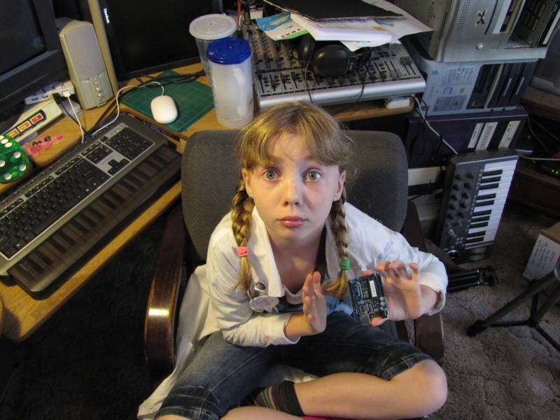
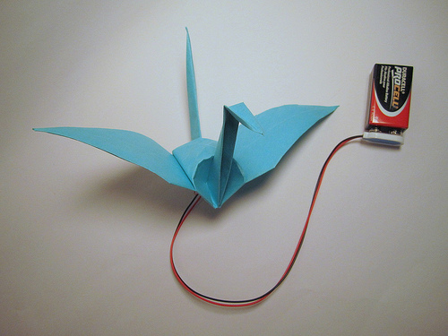
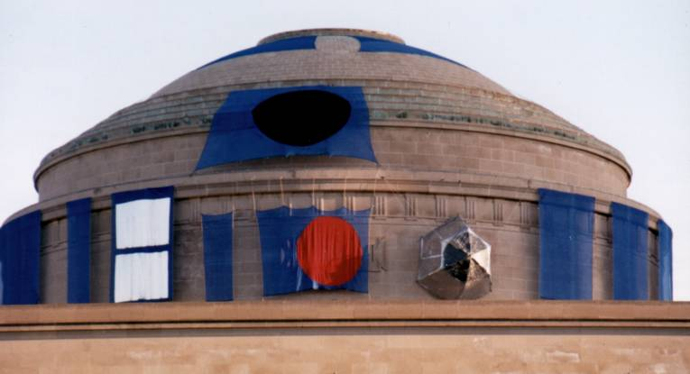
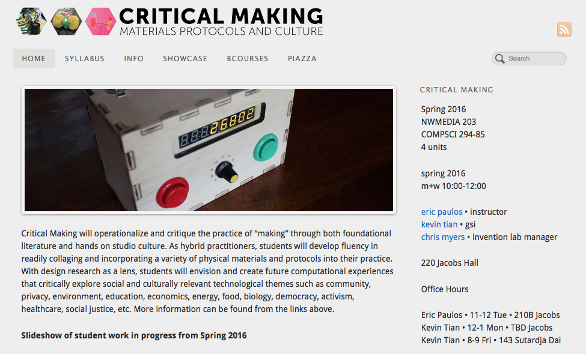
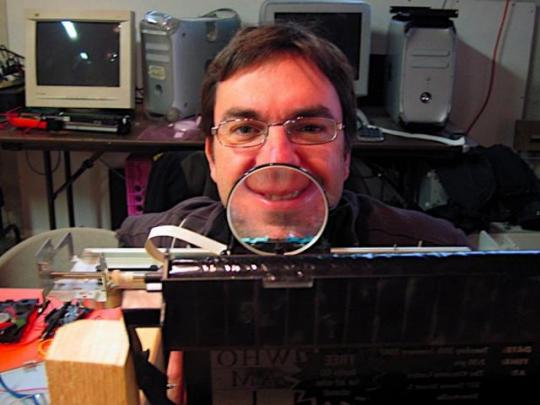
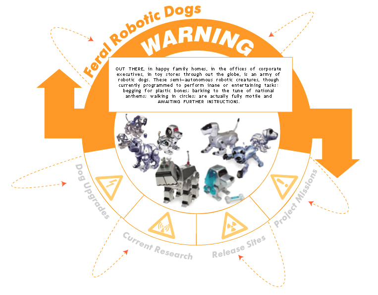
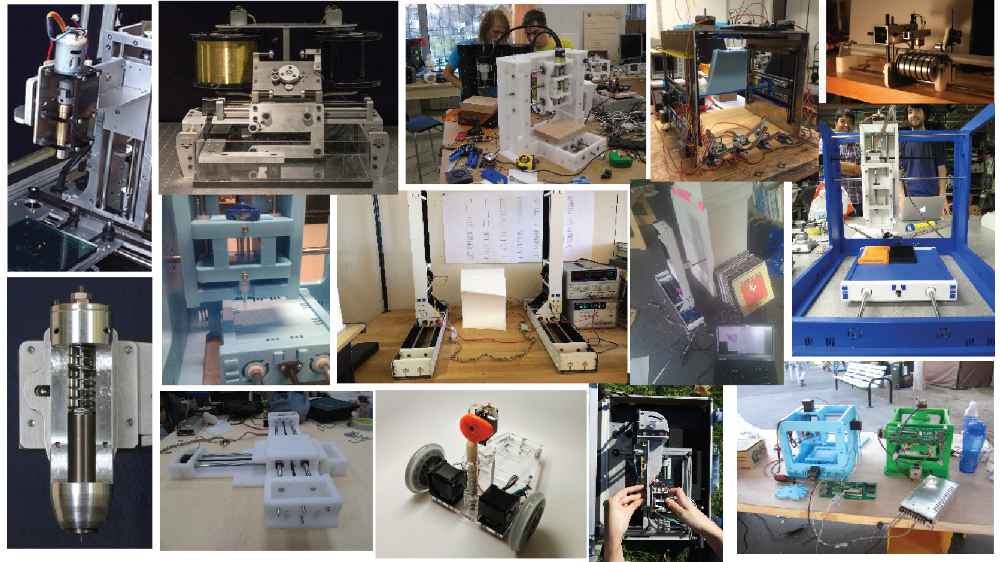
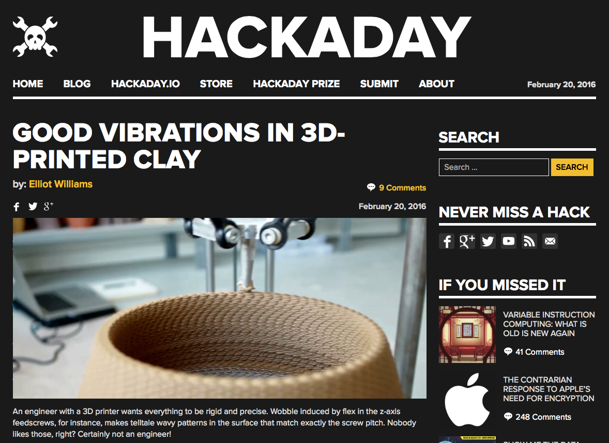
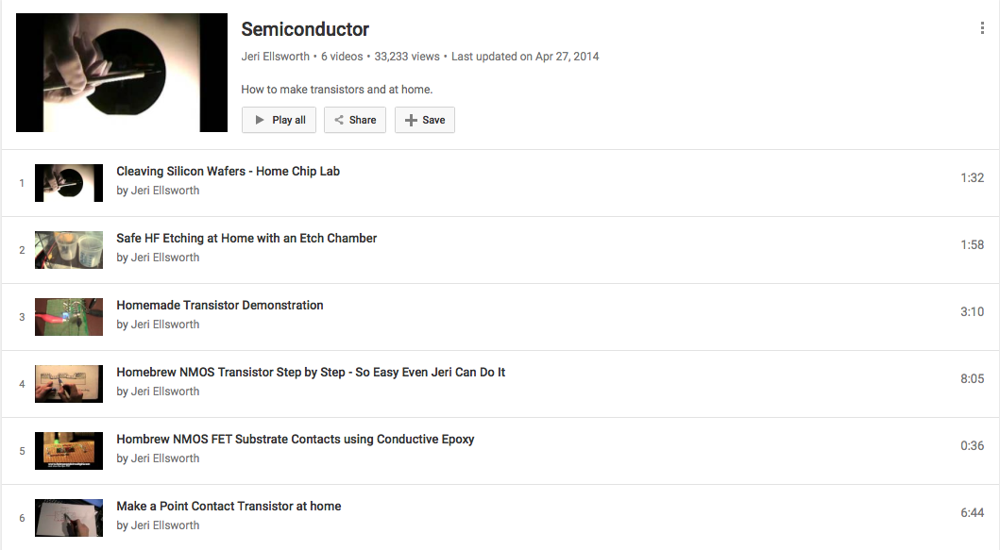

# HACKING (Draft)

## AUTHOR: William J. Turkel
University of Western Ontario | Department of History | [Website](http://williamjturkel.net)

---

##### Publication Status:
* unreviewed draft
* **draft version undergoing editorial review**
* draft version undergoing peer-to-peer review
* published 

--- 

## CURATORIAL STATEMENT

In his classic study of the hackers of the 1950s-70s (first published in 1984), Steven Levy writes that “they were lifelong disciples of a Hands-On Imperative” (31). According to Levy, the Hacker Ethic held that “access to computers—and anything else that might teach you about the way the world works—should be unlimited and total” (72). Here I use the term ‘hacking’ in Levy’s sense: as a kind of relentless curious tinkering in the face of constraint, censorship or lockdown. This is not an activity that is typically taught as a separate subject. If you search for syllabuses on hacking you only find courses on penetration testing for computer security. In its wider sense, hacking is a way of knowing, and a way of being, that is applicable in a variety of settings. My choices for teaching resources reflect both my own background and my current institutional context. I teach programming, desktop fabrication and physical computing to humanities students, often predominately women. Since programming is probably more familiar to most digital humanists than hardware hacking, I concentrate here on teaching hacking via the latter. Many of the resources could be used for a seminar on the history or anthropology of hacking, however, or adapted for use in a programming class.

The most important resource you bring to a classroom or workshop is your own willingness to hack. If you are a stickler for the rules, if you want to do everything by the book, if you are not happy going off on tangents of questionable value, if you can’t tolerate a fair amount of anarchy, then you probably should accept that whatever you are teaching, it is not hacking. On the other hand, if you see messiness as productive (Law), you like to improvise, you don’t mind failing in public, and you are comfortable with your students turning your course into a Rube Goldberg device halfway through the term, this is for you. The original hackers kept a file called [jargon.txt](http://www.dourish.com/goodies/jargon.html) where they recorded terms that were specific to their community. Here is an entry that gives some of the flavor:

> **FROBNICATE** v. To manipulate or adjust, to tweak. … Usage: FROB, TWIDDLE, and TWEAK sometimes connote points along a continuum. FROB connotes aimless manipulation; TWIDDLE connotes gross manipulation, often a coarse search for a proper setting; TWEAK connotes fine-tuning. If someone is turning a knob on an oscilloscope, then if he's carefully adjusting it he is probably tweaking it; if he is just turning it but looking at the screen he is probably twiddling it; but if he's just doing it because turning a knob is fun, he's frobbing it.

When you teach hacking, both you and the students are going be doing a fair bit of frobbing.

The practice of hacking has much in common with playing, doing science and making art. Like [Play](https://github.com/curateteaching/digitalpedagogy/blob/master/keywords/play.md), hacking is fun, process-oriented, and focused on discovery; it involves making and learning from mistakes. Hacking differs from play in that the stakes are often much higher. Institutions are usually invested in maintaining the status quo, constraints are designed to protect property rights, and no one likes to be made a fool of. It takes a degree of subtlety to generate the kind of disruption and innovation that disciplines and institutions claim to favor, without sanctioning illegal or unethical student behavior. Hacking also has much in common with scientific exploration,  and Robert Root-Bernstein's *Discovering* is useful for underlining the connections: many of the strategies he attributes to successful scientists also characterize successful hacks (e.g., "action creates results," "try many things," "learn from the masters," "revolutions follow the recognition of anomalies.") Much of Richard Feynman's autobiography is devoted to his pranks and hacks rather than the science he is known for; read critically it can be used to think about how habits of thought travel between domains. Hacking differs from scientific exploration in that the subject of inquiry is usually anthropogenic rather than natural, experiments are held to a different standard, and objectivity is not a key commitment of the practice. The work of many artists also exhibits a hackish sensibility. Good examples include Thomas Thwaites’ [Toaster Project](http://www.thetoasterproject.org), the ‘design noir’ of Dunne and Raby, the many pranks of Maurizio Cattelan, [Survival Research Laboratories](http://www.srl.org), Jean Tinguely’s méta-mécanique (Tomkins is very good for setting the scene) and, of course, Duchamp, hacker avant la lettre. Artistic practice can be playful, exploratory, tinkering, disruptive, transgressive, and so on, but it makes a big difference whether something is framed / received as hack or artwork.

The resources collected here showcase hacks and hacking, but they also foreground issues of access, interest, tools, materials and space. One of the most important decisions an instructor faces is the choice of platform: some hacking platforms seem to interest a much wider range of individuals than others. The most popular platform that I have found is music. Just about everyone seems to enjoy making their own simple musical instruments—Bart Hopkin’s *Making Musical Instruments with Kids* is a wonderful resource—-and this leads naturally into electronic musical experimentation (Collins). Off-the-shelf construction toys like LEGO and [littleBits](http://littlebits.cc) also make good hacking platforms. Another possibility is to use contraptions that are designed to teach scientific principles. Neil A. Downie has written a series of books with a number of fun projects that can serve as starting points for hacking.

Finding suitable spaces to hack can be difficult; when my colleagues and I first started we did most of our work off-campus in private workshops and hackerspaces. As you try to create a space for hacking in your own institution, you can draw on [hackerspace design patterns](https://wiki.hackerspaces.org/images/8/8e/Hacker-Space-Design-Patterns.pdf), on books which contain practical advice for furnishing and modifying environments, such as Scott Doorley and Scott Witthoft’s *Make Space*; and on works like Steven Johnson’s *Where Good Ideas Come From*, which focus on the institutional contexts where innovation flourishes. Using the lingo of disruptive innovation can be a form of social engineering in its own right, one that your own institution might be susceptible to.

Finally, a word about the term ‘hacker’. I try to avoid using it whenever possible, except for in a historical sense. It is very poor form to refer to yourself as a hacker (as it would be to refer to yourself as a ‘genius’), and you don’t become a hacker when a journalist calls you one. Some of the most interesting hacking today is being done by people who would find the label quite foreign; if you get caught up trying to decide who is in and who is out, you run the risk of missing what they’re up to.

## CURATED ARTIFACTS

These are roughly ordered from accessible to aspirational.

### “Sylvia’s Simple Arduino Projects.”

* Artifact Type: Video
* Source URL: <http://sylviashow.com/episodes/s1/e3/full/arduino>
* Artifact Permissions: Unknown
* Copy of Artifact: forthcoming
* Creator: [“Super-Awesome” Sylvia Todd](http://superawesomebook.com/sylvia/)

In this video, “Super-Awesome Sylvia” shows how to make two simple (but fun) projects with the Arduino, a small, inexpensive, open source microcontroller platform. One of the first challenges you face when teaching (with) hacking is convincing humanities students they can do it, too. Accessible role models are crucial here, and few university students are willing to tell you that they can’t do something after watching a ten-year old do it. Videos like this also give students permission to play, something many of them have not felt in a classroom since they were Sylvia’s age.

### “Electronic Origami Flapping Crane.”

* Artifact Type: Step-by-step Tutorial
* Source URL: <http://highlowtech.org/?p=1448>
* Artifact Permissions: Unknown
* Copy of Artifact: forthcoming
* Creator: [Leah Buechley](http://leahbuechley.com) and colleagues at the [High-Low Tech](http://highlowtech.org) research group, MIT Media Lab, 2009-14

In this project, the wings of an origami crane are made to flap with shape memory alloy. It is easily built by individuals or pairs in a classroom or workshop setting (taking approximately four hours) and is a lovely combination of new and old materials, ‘high’ and ‘low’ technologies, and aesthetics. Like the other tutorials on the High-Low Tech website, this one has broad appeal: it is intimately scaled and has a gentle quality that students may not associate with hacking. Having a hands-on, somewhat contemplative activity to occupy students often provides space for thoughtful conversations that are difficult to stage in a more self-conscious seminar setting.

### “IHTFP Gallery.”

* Artifact Type: Digital Archive
* Source URL: <http://hacks.mit.edu>
* Artifact Permissions: [Website](http://hacks.mit.edu/misc/copyright.html); [Photo credits](http://hacks.mit.edu/Hacks/by_year/1999/r2d2/additional_information.html#photocredits)
* Copy of Artifact: forthcoming
* Creator: [MIT](http:web.mit.edu)

This website is an online exhibition of hacks that have been produced at MIT over the years. There the word is usually used for "a clever, benign, and ‘ethical’ prank or practical joke, which is both challenging for the perpetrators and amusing to the MIT community (and sometimes even the rest of the world!)” The site provides a good starting point for discussions of the history and anthropology of hacking (use with Levy and Coleman), hacking as engineering (Izawa), and the ambivalence and liminality associated with the practice. As alum Michael Snively writes on the MIT admissions blog, “Sure MIT loves the aftermath of the hack, postering the admissions site and the MIT homepage with them whenever they happen, but MIT HATES hackers when they’re actually putting up a hack.”

### “The Tinkering Studio.”

* Artifact Type: Website
* Source URL: <http://tinkering.exploratorium.edu>
* Artifact Permissions: Copyright 2015 Exploratorium
* Copy of Artifact: forthcoming
* Creator: [Exploratorium](http://exploratorium.edu/)

The Exploratorium, San Francisco’s science museum, has always had a large workshop in the middle of its display space, so that generations of visitors could watch brilliant tinkerers wring profundity from assemblages of junk. The three volume *Exploratorium Cookbook* series, though expensive, is required reading for serious exhibit designer-builders. The latest iteration of this practice is the Tinkering Studio, which both supports museum R&D and allows visitors to participate in hands-on making. Have students explore the website, read K. C. Cole’s book about the origins and philosophy of the Exploratorium and try their hand at building one of the clever demos the Museum educators call ‘[snacks](http://www.exploratorium.edu/snacks/)’. I love the [condiment diver](http://www.exploratorium.edu/snacks/condiment-diver).

### “Critical Making: Materials, Protocols and Culture.”

* Artifact Type: Syllabus
* Source URL: <http://make.berkeley.edu>
* Artifact Permissions: Unknown
* Copy of Artifact: forthcoming
* Creator: [Eric Paulos](http://www.paulos.net/)

This is a good current syllabus (with supporting materials) on ‘critical making’, a reflexive practice that Ratto and Hockema describe as collapsing distinctions that are typically made between ‘making’ and ‘critical thinking’. It assumes a range of hands-on skills that design students are expected to have: construction with cardboard and foamcore, physical computing, digital fabrication, building simple mechanisms and basic electronics. I routinely teach a [similar course](http://williamjturkel.net/teaching/) on interactive exhibit design to humanities graduate students. I need to provide a bit more scaffolding in terms of help with programming, electronics, etc. but the coverage is similar. Getting appropriate space, tools and materials to mount such a course can be quite difficult (Sayers et al).

### “Hacking as a Way of Knowing (2009).”

* Artifact Type: Workshop Report
* Source URL: <http://williamjturkel.net/hackknow-hacking-as-a-way-of-knowing-2009/>
* Artifact Permissions: CC-BY-NA-SA
* Copy of Artifact: forthcoming
* Creator: [William J. Turkel](http://williamjturkel.net)

This is a report from the first public hacking workshop I organized. Many things went very well, but I made a number of mistakes, too, and I tend to emphasize those when I use this for teaching students how to host a workshop. Nothing gives your students permission to learn from failure like sharing your own missteps. My students, colleagues and I now offer many hacking workshops a year and each time we get some things right and find some ways to improve.

### “Feral Robotic Dogs.”

* Artifact Type: Elaborate Hack
* Source URL: <https://www.nyu.edu/projects/xdesign/feralrobots/>
* Artifact Permissions: Unknown
* Copy of Artifact: forthcoming
* Creator: [Natalie Jeremijenko](http://www.nataliejeremijenko.com)

Natalie Jeremijenko and her students hacked toy robots by adding chemical sensors and programming them to congregate where emissions were highest. Set loose in landfills, former gas plants, industrial waste dumping grounds, and nuclear waste facilities, the little robots drew a lot of attention. This project is a good example of how hacking can be used to support a cause by creating a mediagenic spectacle. Pair with Coleman, Greenberg and/or Olson to frame a discussion of the ethics and effectiveness of hacking and hacktivism.

### “How To Make (almost) Anything.”

* Artifact Type: Syllabus Collection
* Source URL: <http://fab.cba.mit.edu/classes/863.14/>
* Artifact Permissions: Unknown
* Copy of Artifact: forthcoming
* Creator: [MIT Center for Bits and Atoms](http://cba.mit.edu)

This site collects the syllabi and student projects for a course that was offered by the MIT Center for Bits and Atoms a number of years in a row. Unless you have access to a complete fab lab, most of the projects and techniques will be out of reach. Besides being quite inspirational, however, the site is very useful in demonstrating how the ability to make (almost) anything often comes down to the ability to make a machine to make something. In my teaching, I usually try to involve students in building at least one complicated kit each year. Over the years we have built a dozen 3D printers, an analog electronic computer and a laser scanner. Now we are branching out to new kinds of desktop fabrication devices, mechanical computers, book scanners, and other things we would like to have for our lab space.

### “Hackaday.”

* Artifact Type: Blog
* Source URL: <http://hackaday.com/blog/>
* Artifact Permissions: Copyright 2016 Hackaday
* Copy of Artifact: forthcoming
* Creator: [Hackaday.com](http://hackaday.com/)

The Hackaday blog posts links to a handful of interesting projects every day. Usually these are technically sweet, draw on a number of different skills to implement and teach some esoterica that might be put to use in another hack. Many of the projects are outside the abilities of most humanities students to implement by themselves, but with some guidance and support they might serve as or inspire a good term-length project. At the more accessible end of the spectrum are projects based on technologies like Arduino (e.g., “[Mechatronic Cat Ears for the Rest of Us](http://hackaday.com/2016/02/26/mechatronic-cat-ears-for-the-rest-of-us/)”). At the more aspirational end you can find things like [an electric wheelchair controlled with eye movements](https://hackaday.io/project/5426-eye-controlled-wheelchair) and [OpenBionics affordable prosthetic hands](https://hackaday.io/project/4745-openbionics-affordable-prosthetic-hands).

### “Semiconductor: How To Make Transistors and At Home.”

* Artifact Type: Virtuoso Hack
* Source URL: <https://www.youtube.com/playlist?list=PL5DCEA197C1C07A2D>
* Artifact Permissions: Unknown
* Copy of Artifact: forthcoming
* Creator: [Jeri Ellsworth](https://www.linkedin.com/in/jeriellsworth)

When students start hacking with more confidence, aspirational role models become more important than accessible ones. Jeri Ellsworth is a self-taught engineer who fabricated her own transistors in her kitchen. These videos take you behind the scenes, providing detailed explanations of what she did and why. The magnitude of her accomplishment is best appreciated by pairing a viewing of these videos with readings from Riordan and Hoddeson’s *Crystal Fire*, and perhaps Shurkin’s biography of Shockley and/or Hoddeson and Daitch’s biography of Bardeen.

## RELATED MATERIALS

Collins, Nicolas. *Handmade Electronic Music: The Art of Hardware Hacking*, 2nd ed. Routledge, 2009. Print. 

Doorley, Scott and Scott Witthoft. *Make Space: How to Set the Stage for Creative Collaboration.* Hoboken, NJ: Wiley, 2012. Print.

Johnson, Steven. *Where Good Ideas Come From: The Natural History of Innovation.* Riverhead Books, 2011. Print.

Root-Bernstein, Robert. *Discovering: Inventing and Solving Problems on the Frontiers of Scientific Knowledge.* Cambridge, MA: Harvard University Press, 1991. Print.

Sayers, Jentery, Devon Elliott, Kari Krauss, Bethany Nowviskie, and William J. Turkel. “Between Bits and Atoms: Physical Computing and Desktop Fabrication in the Humanities.” In *A New Companion to the Digital Humanities*, 2nd ed. Edited by Susan Schreibman, Ray Siemens and John Unsworth, 3-21. Wiley-Blackwell, 2016. Print.

## WORKS CITED

Bruman, Raymond and the Exploratorium Staff. *Exploratorium Cookbook I: A Construction Manual for Exploratorium Exhibits*, Revised ed. San Francisco, CA: Exploratorium, 2005. Print. 

Buechley, Leah, and High-Low Tech Research Group. “Electronic Origami Flapping Crane.” Web. 17 February 2016. <http://highlowtech.org/?p=1448>

Cole, K. C. *Something Incredibly Wonderful Happens: Frank Oppenheimer and the World He Made Up.* Boston: Houghton Mifflin Harcourt, 2009. Print.

Coleman, Gabriella. “The Anthropology of Hackers.” *The Atlantic.* 21 September 2010. Web. 20 February 2016. <http://www.theatlantic.com/technology/archive/2010/09/the-anthropology-of-hackers/63308/>

Coleman, Gabriella. *Hacker, Hoaxer, Whistleblower, Spy: The Many Faces of Anonymous.* Verso, 2014. Print.

Collins, Nicolas. *Handmade Electronic Music: The Art of Hardware Hacking*, 2nd ed. Routledge, 2009. Print. 

Doorley, Scott and Scott Witthoft. *Make Space: How to Set the Stage for Creative Collaboration.* Hoboken, NJ: Wiley, 2012. Print.

Downie, Neil A. *Vacuum Bazookas, Electric Rainbow Jelly, and 27 Other Saturday Science Projects.* Princeton University Press, 2001. Print.

Downie, Neil A. *Ink Sandwiches, Electric Worms, and 37 Other Experiments for Saturday Science.* Johns Hopkins University Press, 2003. Print.

Downie, Neil A. *Exploding Disk Cannons, Slimemobiles, and 32 Other Projects for Saturday Science.* Johns Hopkins University Press, 2006. Print.

Dunne, Anthony and Fiona Raby. *Design Noir: The Secret Life of Electronic Objects.* Birkhauser, 2001. Print.

Ellsworth, Jeri. “Semiconductor: How To Make Transistors and At Home.” 2014. Web. 20 February 2016. <https://www.youtube.com/playlist?list=PL5DCEA197C1C07A2D>

Exploratorium. “The Tinkering Studio.” 2015. Web. 20 February 2016. <http://tinkering.exploratorium.edu>

Feynman, Richard P. *Surely You’re Joking Mr. Feynman! Adventures of a Curious Character.* New York: W. W. Norton, 1997. Print.

Greenberg, Andy. *This Machine Kills Secrets: How WikiLeakers, Cyperpunks, and Hacktivists Aim to Free the World’s Information.* Dutton, 2012. Print.

Haas, Thorsten, Lars Weiler and Jens Ohlig. “Building a Hacker Space”. 2007. Web. 27 Feburary 2016. <https://wiki.hackerspaces.org/images/8/8e/Hacker-Space-Design-Patterns.pdf>

Hackaday.com. “Blog.” 2016. Web. 20 February 2016. <http://hackaday.com/blog/> 

Hipschman, Ron and the Exploratorium Staff. *Exploratorium Cookbook II: A Construction Manual for Exploratorium Exhibits*, Revised ed. San Francisco, CA: Exploratorium, 1983. Print. 

Hipschman, Ron and the Exploratorium Staff. *Exploratorium Cookbook III: A Construction Manual for Exploratorium Exhibits*, Revised ed. San Francisco, CA: Exploratorium, 1993. Print. 

Hoddeson, Lillian and Vicki Daitch. *True Genius: The Life and Science of John Bardeen.* National Academy Press, 2006. Print.

Hopkin, Bart. *Making Musical Instruments with Kids: 67 Easy Projects for Adults Working with Children.* See Sharp Press, 2009. Print.

Izawa, Eri. “Producing a Hack at MIT: Engineering in Action.” 1992/1996. Web. 20 February 2016. <http://hacks.mit.edu/Hacks/books/articles/engineering_in_action.html>

Jeremijenko, Natalie. “Feral Robotic Dogs.” 2005. Web. 20 February 2016. <https://www.nyu.edu/projects/xdesign/feralrobots/>

Johnson, Steven. *Where Good Ideas Come From: The Natural History of Innovation.* Riverhead Books, 2011. Print.

Law, John. *After Method: Mess in Social Science Research*. Routledge, 2004. Print.

Levy, Steven. *Hackers: Heroes of the Computer Revolution*, 25th anniversary edition. Sebastopol, CA: O’Reilly Media, 2010. Print.

MIT. “IHTFP Gallery.” Web. 20 February 2016. <http://hacks.mit.edu>

MIT Center for Bits and Atoms. “How To Make (almost) Anything.” 2014. Web. 20 February 2016. <http://fab.cba.mit.edu/classes/863.14/>

Olson, Parmy. *We Are Anonymous: Inside the Hacker World of LulzSec, Anonymous, and the Global Cyber Insurgency*. Little, Brown and Company, 2012. Print.

Paulos, Eric. “Critical Making: Materials, Protocols and Culture.” 2016. Web. 20 February 2016. <http://make.berkeley.edu>

Ratto, Matt and Stephen Hockema. “Flwr Pwr: Tending the Walled Garden.” In *Walled Garden*. Edited by A. Dekker and A. Wolfsberger, 51-62. Amsterdam: Virtueel Platform, 2009. Print.

Riordan, Michael and Lillian Hoddeson. *Crystal Fire: The Birth of the Information Age.* New York: W. W. Norton, 1997. Print.

Root-Bernstein, Robert. *Discovering: Inventing and Solving Problems on the Frontiers of Scientific Knowledge.* Cambridge, MA: Harvard University Press, 1991. Print.

Sayers, Jentery, Devon Elliott, Kari Krauss, Bethany Nowviskie, and William J. Turkel. “Between Bits and Atoms: Physical Computing and Desktop Fabrication in the Humanities.” In *A New Companion to the Digital Humanities*, 2nd ed. Edited by Susan Schreibman, Ray Siemens and John Unsworth, 3-21. Wiley-Blackwell, 2016. Print.

Shurkin, Joel N. *Broken Genius: The Rise and Fall of William Shockley, Creator of the Electronic Age*, 2nd ed. Palgrave Macmillan, 2006. Print.

Snively, Michael. “Hacking.” *MIT Admissions.* 7 June 2008. Web. 20 February 2016. <http://mitadmissions.org/blogs/entry/hacking>

Todd, Sylvia. “Sylvia’s Simple Arduino Projects.” August 2010. Web. 17 February 2016. <http://sylviashow.com/episodes/s1/e3/full/arduino>

Tomkins, Calvin. *The Bride and the Bachelors: Five Masters of the Avant-Garde.* Viking Press, 1968. Print.

Turkel, William J. “Hacking as a Way of Knowing.” 2009. Web. 20 February 2016. <http://williamjturkel.net/hackknow-hacking-as-a-way-of-knowing-2009/>
