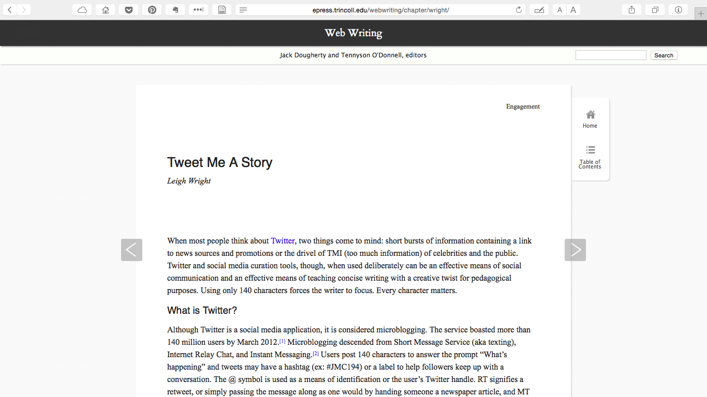
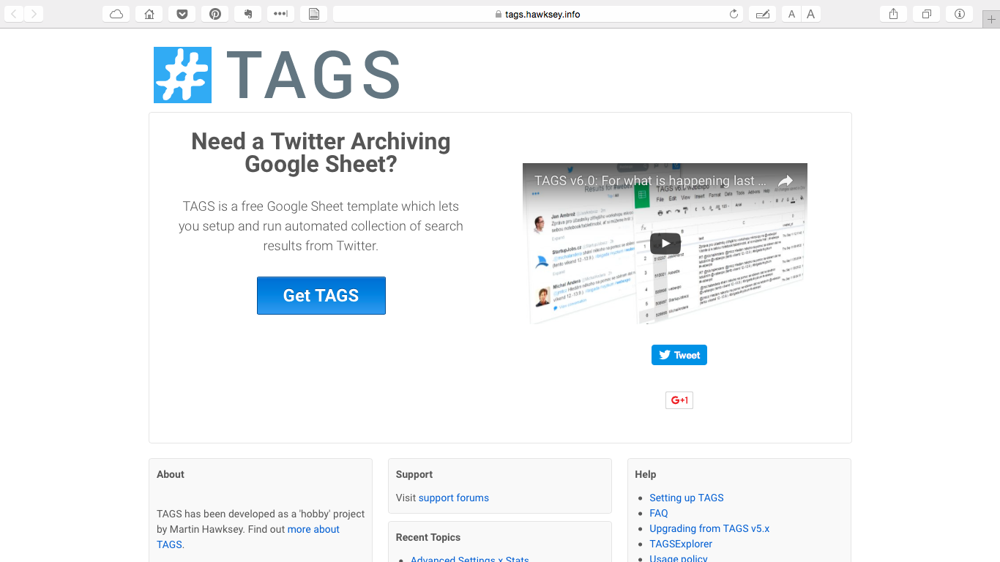
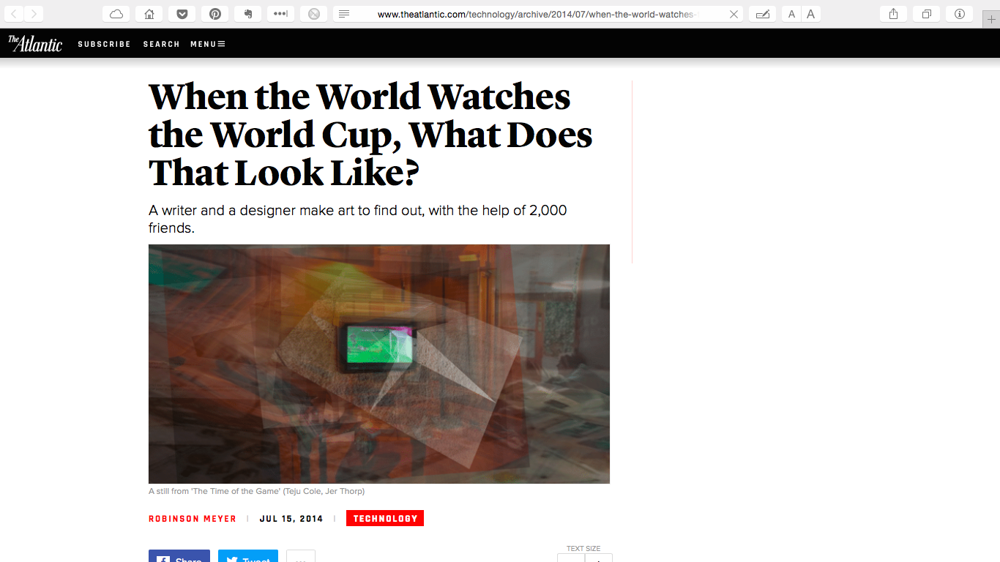
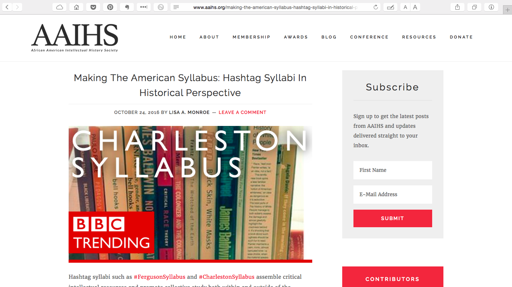
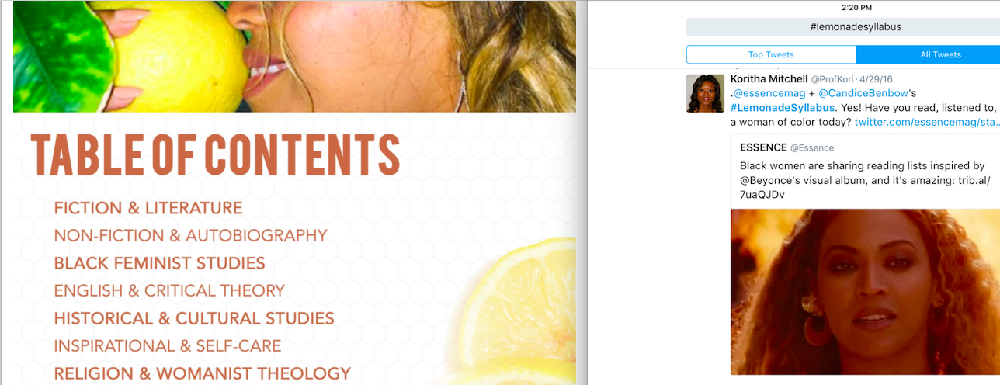
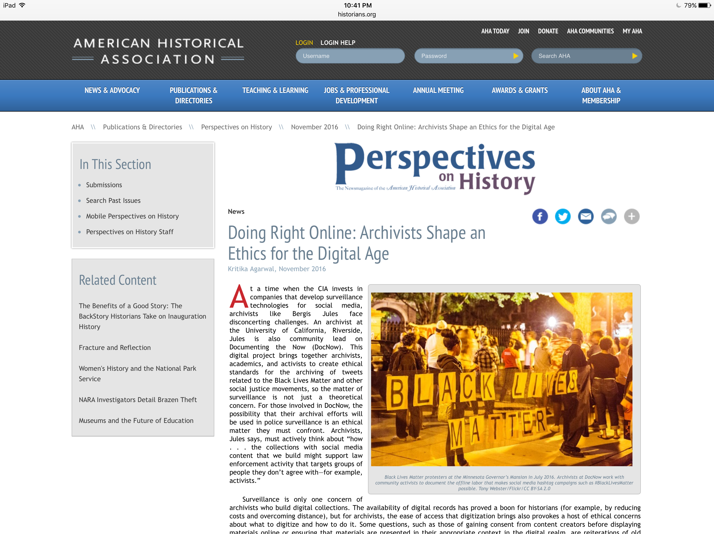
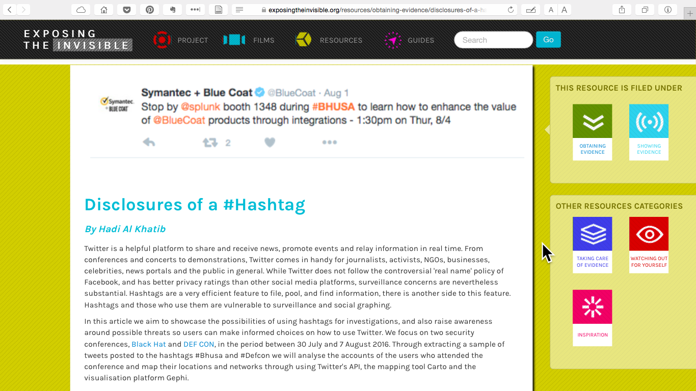

# Hashtag

### Marisa Parham

Professor of English, Amherst College & Director, Five College Digital Humanities | [http://mp285.com](http://mp285.com)

## CURATORIAL STATEMENT

Hashtags can be thought of in terms of what they “are” and also in terms of what they can be made to do or signify. Because they operate at an easily identifiable intersection between culture and technology, thinking about hashtags offers an accessible entry point for students interested in the digital humanities. In my classes, which tend to have mixtures of more technically-oriented students and die-hard, self-avowedly “non-technical,” humanities students, studying hashtags gives me a way to reorient more technical students toward thinking about the cultural construction of a technology. Working with hashtags also helps to demonstrate to less technically-inclined students how studying a technology can help them better articulate the stakes of the concerns they are trying to formulate via literary and cultural studies. In both cases, hashtags help educators elaborate relationships between forms and contents in new ways. 

The “hashtag,” a word or phrase preceded by a pound or hash sign, #, is a metadata mechanism common to social media platforms. The hashtag as it is used it today was created in response to a problem: Because content is constant—is being produced by large numbers of spatially dispersed people all across the day—social media timelines must by default stream continuously away from any given user’s use. The constant movement of the timeline meant that no user could easily focus in on specific content, which also made it difficult for users to engage extant or develop new communities. Every encounter, outside of direct address (an “at,” @username, mention or reply), was a matter of luck. 

As outlined in a set of 2007 blog posts, “Whispering Tweets” and “Groups for Twitter; or A Proposal for Twitter Tag Channels,” Twitter software developer Chris Messina looks for ways to balance the large-scale public-ness of Twitter against his desire to add a layer of on-demand access to specific content. In “Groups for Twitter,” Messina hits upon using “channels” as a way to hold on to the platform’s capacity to produce serendipitous user experience, while also allowing for moments of intentionality. By using hashtags to flag posts, users would be able to describe and index their posts into these channels, but without removing those posts from the shared public space of the network’s timeline. Hashtags thus introduced a “group-like functionality without violating the original premise of Twitter” (“Groups for Twitter”). 

With hashtags, more localized conversations can be sustained in plain sight of the whole, as it were, thus also meeting Messina’s desire for “simply having a better eavesdropping experience on Twitter” (“Groups for Twitter”). Further, because they are hyperlinked, hashtags allow a user to index a social media post by attaching to it a term or phrase that connects that post to other users’ posts. When a hashtag is clicked, temporally and spatially dispersed posts are brought into immediate content relation and literally onto the same page, despite the passage of time and the immense number of users sharing a given social network. In articulating self-conscious metadata creation as a dimension of the regular user experience, hashtags give users a way to make specific social media moments retrievable out of the otherwise vast nothing into which all social media acts otherwise potentially pass. 

Further, because hashtags are designed to be “folksonomic”—generated spontaneously by users instead of being dictated from a centralized site—the metadata users create itself expresses a feeling of the serendipitous, chaotic, and individual, even as it also enables users to engage a basic database storage and retrieval functionality. As Messina points out, the folksonomic “also enforces actual use in the wild of tags, since no evidence of a tag will exist without it first being used in conversation” (“Groups for Twitter”). 

Turning to some of the technical history of the hashtag is useful because it helps demonstrate how a mechanism can reflect an ethos, and how a technical implementation can itself come to structure other phenomena according to that ethos, in this case an ethos cultivated in IRC and other early chat and message board platform, platforms that preceded the graphical interface and thus resonate with computationally agile, low resource, text driven interaction, and that are also attached to larger ideas around openness and (non) property. In teaching, considering how hashtags structurally propagate a set of values can be used as an example of how mechanisms that seem “natural” or “simple,” “transparent,” nonetheless carry culture. 

Indeed, this idea of the folksonomic also helps clarify how hashtags do more than make knowledge retrievable; they also produce their own knowledge structures. Not only do they do this in their role as metadata, as data that describe and display information about other data, but also in how the act of producing a tag is as much generative as it is descriptive. (This is also evident in many of the ways users generate humor, pathos, or insight by invoking the hashtag’s descriptive, paratextual, or taxonomic functions in ways that contradict or short circuit the assumed “straight” value of a descriptive tag!) 

Attaching hashtags to social media utterances also increases the porosity between on and off-line environments, since other, non-social media, events can be also be keyed to the hashtag. Hashtags expand material frames of reference, thus allowing more increased integration between things that are happening on a specific social media platform, and things happening in other spaces. Examples of this porosity extend from events as simple as using a hashtag so that audiences can live-tweet along with TV show broadcasts or conference proceedings to the various ways hashtags have been deployed to educate, support, and organize social and political movements. In this way, hashtags reinforce extant publics or generate new, even sometimes fleeting, ones. Hashtags thus offer an example for how the digital also produces space, despite stereotypes many of hold regarding the relative reality of online experience.

Taken together—the database, the folksonomic, curation and coalescence, supporting or making publics, the private in plain view, the movement between digital and other kinds of spaces, the eavesdropping—one might see how working with hashtags opens up a broad spectrum of pedagogical possibilities. Studying hashtags also produces ways to watch various histories of the present unfold in real-time, which also brings important pedagogical research opportunities that bridge humanities work with that of other disciplines, for instance computational work. 

The artifacts collected below are presented in clusters. They are arranged this way to demonstrate how instructors might have students do very different kinds of work around the same set of materials by offering an array of pathways. The idea here is that breaking “hashtag studies” work down into smaller parts helps a class work efficiently through an otherwise complex set of approaches. 

## CURATED ARTIFACTS

### PRIMERS
 
_The materials in this section outline assignments that help instructors conceptualize using social media hashtags in a variety of instances, though there is some emphasis here on writing and cultural studies classrooms._

#### “Social Media, Campus Activism, and Free Speech” 

* Artifact Type: blog post
* Source URL: [http://2015trends.hackeducation.com/activism](http://2015trends.hackeducation.com/activism)
* Copy of the Artifact: 
* Creator and Affiliation: Audrey Watters

In this article Audrey Watters provides an excellent starting point for understanding how the hashtag fits into a much larger constellation of pedagogical concerns, in both formal and informal curricula, from problematizing surveillance as a teaching tool through contemporary debates around free speech on college campuses. This overview is important for instructors and students alike, as it also a subtle introduction to some of what is at stake in conducting scholarship and community engagement online and in public. It is particularly useful in classroom settings wherein the interest in social media hashtags is about “something else,” but instructors want students to be able to see a larger picture.

#### “Tweet Me a Story” 

* Artifact Type: Description of assignment ideas and execution paths
* Source URL: [http://epress.trincoll.edu/webwriting/chapter/wright/](http://epress.trincoll.edu/webwriting/chapter/wright/)
* Copy of the Artifact: 
* Creator and Affiliation: Leigh Wright (Murray State University)

In this article, Wright offers an in-depth and very practice-based overview of multiple ways hashtags can be used in the classroom, particularly Twitter (though many of her assignments could also be executed on Instagram). The assignments outlined here are pitched towards journalism, but they are equally valuable for other kinds of writing classrooms. This article is also especially useful because it hits on several aspects that make online writing pedagogically important, for instance moving between learning experiences based in the classroom and out, communicating with various kinds of audiences simultaneously, and also practical solutions for some of the complexities of curating student work across platforms, for instance deploying platforms like Storify. 

#### “Hashtag Analysis Project” 

* Artifact Type: Class assignment
* Source URL: [http://6344s15.quinnwarnick.com/hashtaganalysis/](http://6344s15.quinnwarnick.com/hashtaganalysis/)
* Copy of the Artifact:
* Creator and Affiliation: Quinn Warnick (Virginia Tech)
 
Warnick’s assignment is included here as an example of setting a class onto different pathways. It offers students guidance as to how to assess, collect, curate the hashtag materials with which they are working. This assignment is also useful because Warnick helps students understand how this work will be assessed, which is information that other instructors can reverse engineer to determine their own learning goals when asking this kind of work from students. As well, it should be noted that even though Warnick is giving student opportunities to do very different approaches, the assessment rubrics pull those different kinds of work back into a set of shared concerns—class members are working differently toward the same goal, and offers a good example of how multiple pathways can still result in a kind of pedagogical coherence. 

#### “TAGS” 

* Artifact Type: Primer
* Source URL: [https://tags.hawksey.info/get-tags/](https://tags.hawksey.info/get-tags/)
* Copy of the Artifact: 
* Creator and Affiliation: Martin Hawksey

TAGS is a small program that downloads Twitter data (tweets and their metadata, retrieved by hashtag) into a Google spreadsheet, offering a low-barrier entry point for class exercises in which students are asked to collect and curate hashtags. Also note that various syllabi featuring this software are included under the “About” tab, and resources for articulating concerns regarding the breadth of API access and search restriction are addressed throughout the site. It is also worth noting that other programs can also do this work, for instance this even simpler though slightly more limited IFTTT applet, or the more complex to learn but far more powerful twarc method developed by Ed Summers.

### MAKING COMMUNITIES 

_The materials collected here offers ways of thinking about how hashtags are used to collate and curate social media utterances, and how social media participation itself can be articulated to students as a kind of making in which a researcher is participating, rather than only imagining social media as a resource or an “object” of study. This perspective highlights how hashtags contribute both to the work of public discourse, and also to moments of community building._ 

#### “When the World Watches the World Cup, What Does That Look Like?” 

* Artifact Type: magazine article
* Source URL: [http://www.theatlantic.com/technology/archive/2014/07/when-the-world-watches-the-world-cup-what-does-it-look-like/374461/](http://www.theatlantic.com/technology/archive/2014/07/when-the-world-watches-the-world-cup-what-does-it-look-like/374461/)
* Copy of the Artifact: 
* Creator and Affiliation: Robinson Meyer

This article outlines “The Time of the Game” project, undertaken by author and cultural critic Teju Cole, data visualization artist, Jer Thorp, and developer Mario Klingemann. “The Time of the Game,” speaks to how hashtags produce, express, or elicit community across temporally and spatially dispersed people. The overall project becomes more pedagogically rich when paired with and introduced by this article, which links to all the constituent project parts. The creators also outline how the project was executed, from concept to hashtag to collection to dataset to interactive art, a theoretical and instrumental blueprint for students interested in creating crowd-sourced critical public arts or humanities projects. Taken together, the materials linked in this article also help instructors talk to students about what constitutes “data,” which is particularly important for thinking about working with sources that are not usually understood as computational, as is the case with kinds of materials often attached to hashtags.

#### “Making The American Syllabus: Hashtag Syllabi in Historical Perspective” 

* Artifact Type: blog post
* Source URL: [http://www.aaihs.org/making-the-american-syllabus-hashtag-syllabi-in-historical-perspective/](http://www.aaihs.org/making-the-american-syllabus-hashtag-syllabi-in-historical-perspective/)
* Copy of the Artifact: 
* Creator and Affiliation: Lisa A. Monroe

A “hashtag syllabus” is a crowd-sourced reading, viewing, and discussion list that arises in response to a social moment or event, and is collated using social media hashtags. Monroe’s article is useful both because it offers some annotation for and also links to a variety of hashtag syllabi curated in past years, for instance the #CharlestonSyllabus, #BaltimoreSyllabus, and #FergusonSyllabus, and also because it historicizes the hashtag syllabus in a larger intellectual tradition of community member driven scholarship. Much as hashtags can be used to help students work together and communicate outside the classroom, they can also be used to make the scholarly work of various communities active, visible, and accessible. 

#### “#LemonadeSyllabus” 

* Artifact Type: digital collection
* Source URL: [https://issuu.com/candicebenbow/docs/lemonade_syllabus_2016](https://issuu.com/candicebenbow/docs/lemonade_syllabus_2016)
* Copy of the Artifact: 
* Creator and Affiliation: Candice Marie Benbow 

The #LemonadeSyllabus is a bit different from the other hashtag syllabi in how it was created to be disseminated both online and on paper, which speaks to questions of access to digital materials, and also bespeaks the hashtag syllabus’ relationship to another historical form for creating intellectual publics—the pamphlet. The #LemonadeSyllabus is also unique insofar as its rationale not only focuses on bringing a variety of cultural materials—film, book, music—into conversation with Beyoncé Knowles-Carter’s visual album, _Lemonade_, but also encourages users to initiate their own creative acts as paths to scholarly engagement. In blurring the lines between public and private, “scholarly” and “creative,” the #LemonadeSyllabus highlights how crowd-sourced hashtag work can work to address intra-community diversity. 

### HISTORICIZING THE PRESENT

_The following materials offer a case study for how hashtag data offers a material basis for other kinds of community work and scholarship, for instance producing histories of people’s responses to contemporary events. This includes thinking about the ethical stakes of such work, particularly around matters of community property, surveillance, and sousveillance._ 

#### “Documenting the Now” 

* Artifact Type: website
* Source URL: [http://www.docnow.io](http://www.docnow.io)
* Copy of the Artifact:
* Creator and Affiliation: Documenting the Now Project

DocNow describes itself as both a tool and “a community developed around supporting the ethical collection, use, and preservation of social media content.” It is not only included here because of the work the group is doing, but also because DocNow’s organizational description itself offers a useful entry point for helping students to break habits of imagination that allow them to miss important connections between community activism, scholarship, and the digital tools that enable much of that work. Perusing this site also helps students see a model for how much digital humanities work is done by teams, with members bring different primary concerns and skillsets to the organizational table. Many of the tools and strategies outlined here are reflected in the other artifacts in this collection for instance hashtag collation software, or by hashtag syllabi—but DocNow demonstrates how all of these things might be fit together into a larger project. This provides a “real world” example for the kinds of skills they develop in smaller classroom assignments. 

#### “Doing Right Online: Archivists Shape an Ethics for the Digital Age”

* Artifact Type: article
* Source URL: [https://www.historians.org/publications-and-directories/perspectives-on-history/november-2016/doing-right-online-archivists-shape-an-ethics-for-the-digital-age](https://www.historians.org/publications-and-directories/perspectives-on-history/november-2016/doing-right-online-archivists-shape-an-ethics-for-the-digital-age)
* Copy of the Artifact:
* Creator and Affiliation: Kritika Agarwal (American Historical Association)

Here, Kritika Agarwal gives us an overview for thinking about the dangers attached to archiving community materials, while at the same time understanding how digital technologies also offer substantial scholarly and preservationist opportunities for those same communities. Even though hashtags index utterances that are technically public, once researchers begin using them as data, something shifts. Creators might not necessarily mean even “public” to mean the same as being recoverable and researchable, evidential. In a classroom content, Agarwal’s article can work as a primer on major issues, as it is useful both as a primary text for that conversation, and also because it points to the specific strategies that organizations (like the DocNow group, listed above) are using to address the conundrum of moving social media (and other kinds of “personal” texts) into a research context. 

#### “Disclosures of a Hashtag” 

* Artifact Type: article
* Source URL: [https://exposingtheinvisible.org/resources/obtaining-evidence/disclosures-of-a-hashtag](https://exposingtheinvisible.org/resources/obtaining-evidence/disclosures-of-a-hashtag)
* Copy of the Artifact:
* Creator and Affiliation: Hadi Al Khatib

“Disclosures of a Hashtag” is especially useful in a classroom context because in it Hadi Al Khatib gives a hands-on demonstration of accessible ways to access and work with social media hashtag data— but he does this with an eye also to demonstrating both the rhetorical dimension embedded in each kind of access point, as well as the implications for thinking about surveillance when working with social media. In offering a kind of discursive reverse-engineering, this article is important in the classroom because it takes the abstraction out of thinking about hashtag data, while also emphasizing the overarching relationship between software architecture and the content and analysis it makes possible.

## RELATED MATERIALS

Berlatsky, Noah. “Hashtag Activism Isn’t a Cop-Out.” _The Atlantic_. Jan 7, 2015.   [http://www.theatlantic.com/politics/archive/2015/01/not-just-hashtag-activism-why-social-media-matters-to-protestors/384215/](http://www.theatlantic.com/politics/archive/2015/01/not-just-hashtag-activism-why-social-media-matters-to-protestors/384215/)

Clark, Meredith D., Deen Freelon, and Charlton D. McIlwain. “Beyond the hashtags: #Ferguson, #Blacklivesmatter, and the online struggle for offline justice.” _Center for Media and Social Impact_. February 29, 2016. [http://cmsimpact.org/resource/beyond-hashtags-ferguson-blacklivesmatter-online-struggle-offline-justice/](http://cmsimpact.org/resource/beyond-hashtags-ferguson-blacklivesmatter-online-struggle-offline-justice/)

Cordell, Ryan. “How to Start Tweeting (and Why You Might Want To).” _The Chronicle of Higher Education._ August 11, 2010. [http://www.chronicle.com/blogs/profhacker/how-to-start-tweeting-and-why-you-might-want-to/26065](http://www.chronicle.com/blogs/profhacker/how-to-start-tweeting-and-why-you-might-want-to/26065)

Fallon, Jimmy & Justin Timberlake. “#Hashtag.” Sep 24, 2013. _The Tonight Show Starring Jimmy Fallon_. [https://www.youtube.com/watch?v=57dzaMaouXA](https://www.youtube.com/watch?v=57dzaMaouXA)

Parker, Ashley. “Hashtags, a New Way for Tweets: Cultural Studies.” _The New York Times_. June 10, 2010. [http://www.nytimes.com/2011/06/12/fashion/hashtags-a-new-way-for-tweets-cultural-studies.html](http://www.nytimes.com/2011/06/12/fashion/hashtags-a-new-way-for-tweets-cultural-studies.html)

## WORKS CITED

Agarwal, Kritika. “Doing Right Online: Archivists Shape an Ethics for the Digital Age.” _Perspectives on History_. November 2016. 

Al Khatib, Hadi. “Disclosures of a Hashtag | Exposing the Invisible.” Blog Post. Accessed November 14, 2016.

Benbow, Candice. “#LemonadeSyllabus.” May 6, 2016.

Documenting the Now Project. “Documenting the Now.” Accessed 3 November 2016.

Hawskey, Martin. “Get TAGS.” TAGS. Accessed october 24, 2016.

Messina, Chris. “Groups for Twitter; or A Proposal for Twitter Tag Channels.” Blog post. 26 Aug. 2007. 

———. “Whispering Tweets.” Blog post. 25 Aug. 2007.

Meyer, Robinson. “When the World Watches the World Cup, What Does That Look Like?” _The Atlantic_. 15 July 2014.

Monroe, Lisa A. “Making The American Syllabus: Hashtag Syllabi In Historical Perspective.” _African American Intellectual History Society_. October 24, 2016.

Warwick, Quinn. “Hashtag Analysis Project.” _Rhetoric in Digital Environments_. 

Watters, Audrey. “Top Ed-Tech Trends of 2015.” _Top Ed-Tech Trends of 2015_. 

Wright, Leigh. “Tweet Me A Story,” in _Web Writing: Why and How for Liberal Arts Teaching and Learning_. 2014.
