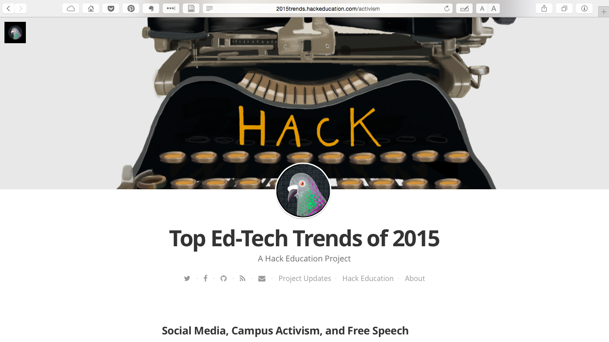
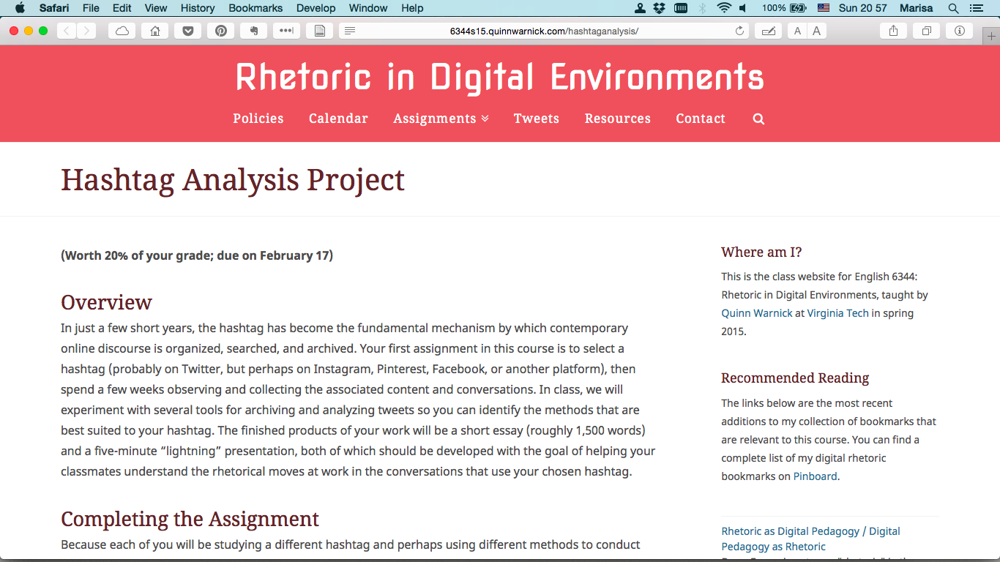
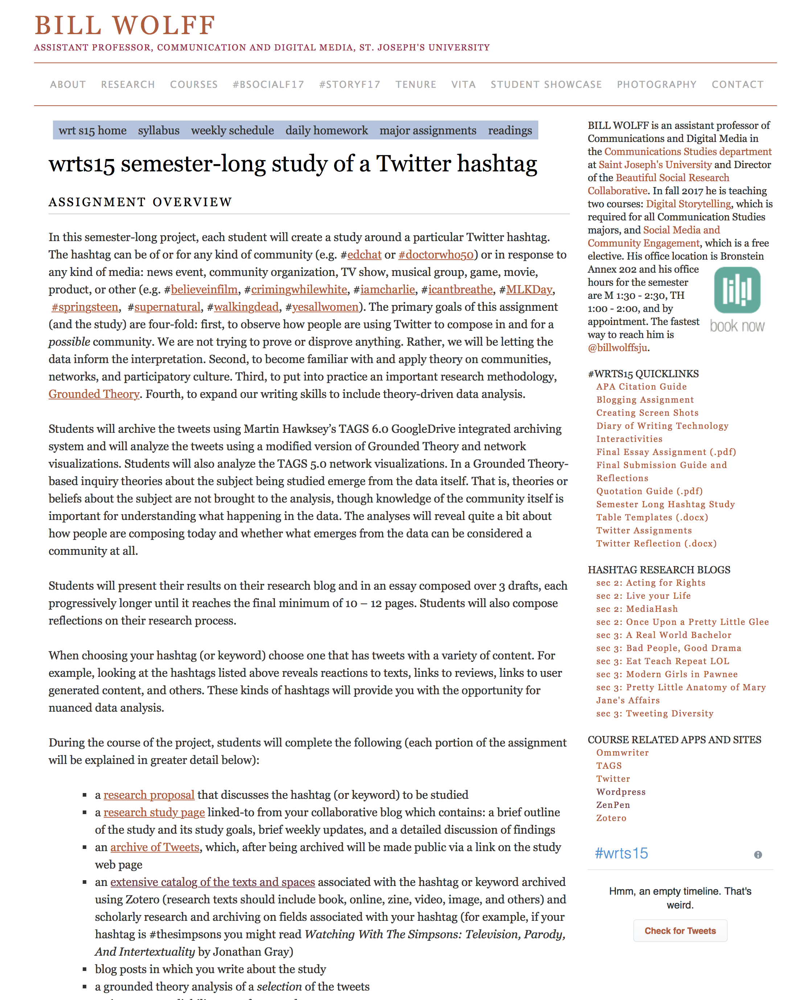
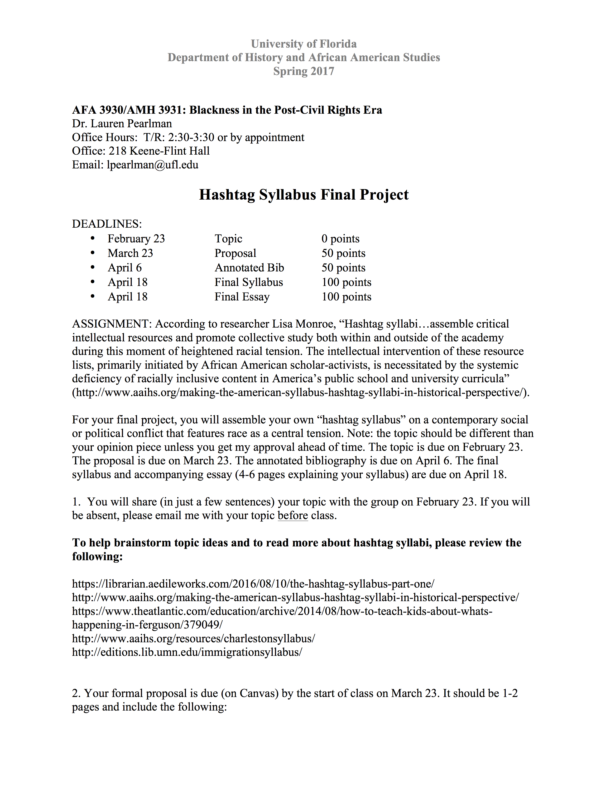
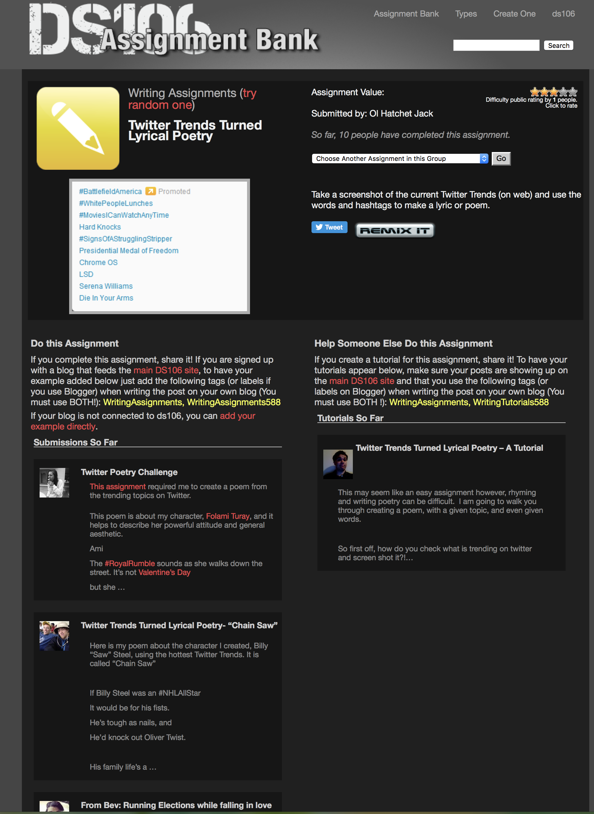
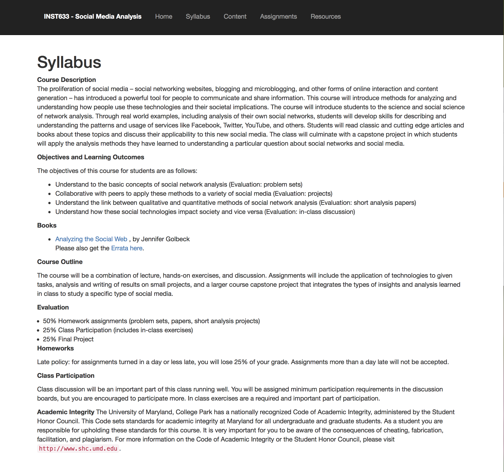
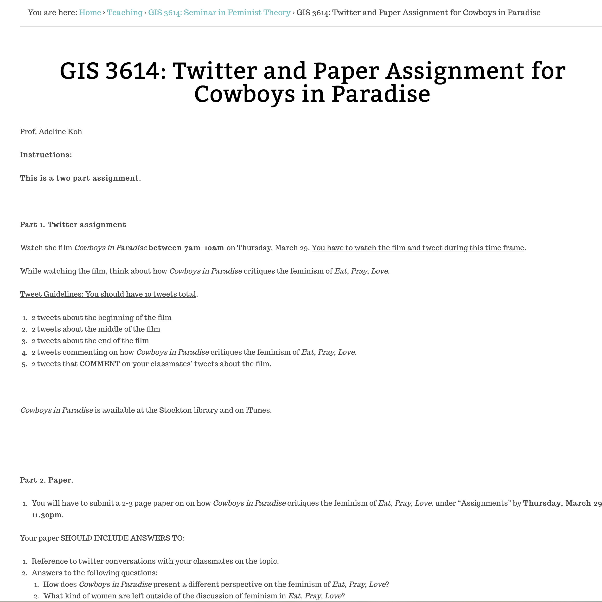

# Hashtag

### Marisa Parham

Professor of English, Amherst College & Director, Five College Digital Humanities | [http://mp285.com](http://mp285.com)

## CURATORIAL STATEMENT
Hashtags can be thought of in terms of what they “are” and also in terms of what they can be made to do or signify. Because they operate at an easily identifiable intersection between culture and technology, thinking about hashtags offers an accessible entry point for students interested in the digital humanities. In my classes, which tend to have mixtures of more technically-oriented students and die-hard, self-avowedly “non-technical,” humanities students, studying hashtags gives me a way to reorient more technical students toward thinking about the cultural construction of a technology. Working with hashtags also helps to demonstrate to less technically-inclined students how studying a technology can help them better articulate the stakes of the concerns they are trying to formulate via literary and cultural studies. In both cases, hashtags help educators elaborate relationships between forms and contents in new ways. 

The “hashtag,” a word or phrase preceded by a pound or hash sign, #, is a metadata mechanism common to social media platforms. The hashtag as it is used it today was created in response to a problem: Because content is constant—is being produced by large numbers of spatially dispersed people all across the day—social media timelines must by default stream continuously away from any given user’s use. The constant movement of the timeline meant that no user could easily focus in on specific content, which also made it difficult for users to engage extant or develop new communities. Every encounter, outside of direct address (an “at,” @username, mention or reply), was a matter of luck. 

As outlined in a set of 2007 blog posts, “Whispering Tweets” and “Groups for Twitter; or A Proposal for Twitter Tag Channels,” Twitter software developer Chris Messina describes looking for ways to balance the large-scale public-ness of Twitter against his desire to add a layer of on-demand access to specific content. In “Groups for Twitter,” Messina hits upon using “channels” as a way to hold on to the platform’s capacity to produce serendipitous user experience, while also allowing for moments of intentionality. By using hashtags to flag posts, users would be able to describe and index their posts into these channels, but without removing those posts from the shared public space of the network’s timeline. Hashtags thus allowed users to engage a “group-like functionality without violating the original premise of Twitter” (“Groups for Twitter”). 

With hashtags, more localized conversations can be sustained in plain sight of the whole, as it were, thus also meeting Messina’s desire for “simply having a better eavesdropping experience on Twitter” (“Groups for Twitter”). Further, because they are hyperlinked, hashtags allow a user to index a social media post by attaching to it a term or phrase that connects that post to other users’ posts. When a hashtag is clicked, temporally and spatially dispersed posts are brought into immediate content relation and literally onto the same page, despite the passage of time and the immense number of users sharing a given social network. In articulating self-conscious metadata creation as a dimension of the regular user experience, hashtags give users a way to make specific social media moments retrievable out of the otherwise vast nothing into which all social media acts otherwise potentially pass. 

Further, because hashtags are designed to be “folksonomic”—generated spontaneously by users instead of being dictated from a centralized site—the metadata users create itself expresses a feeling of the serendipitous, chaotic, and individual, even as it also enables users to engage a basic database storage and retrieval functionality. As Messina points out, the folksonomic “also enforces actual use in the wild of tags, since no evidence of a tag will exist without it first being used in conversation” (“Groups for Twitter”). 

Turning to some of the technical history of the hashtag is useful because it helps demonstrate how a mechanism can reflect an ethos, and how a technical implementation can itself come to structure other phenomena according to that ethos, in this case an ethos cultivated in IRC and other early chat and message board platform, platforms that preceded the graphical interface and thus resonate with computationally agile, low resource, text driven interaction, and that are also attached to larger ideas around openness and (non) property. In teaching, considering how hashtags structurally propagate a set of values can be used as an example of how mechanisms that seem “natural” or “simple,” “transparent,” nonetheless carry culture. 

Indeed, this idea of the folksonomic also helps clarify how hashtags do more than make knowledge retrievable; they also produce their own knowledge structures. Not only do they do this in their role as metadata, as data that describe and display information about other data, but also in how the act of producing a tag is as much generative as it is descriptive. (This is also evident in many of the ways users generate humor, pathos, or insight by invoking the hashtag’s descriptive, paratextual, or taxonomic functions in ways that contradict or short circuit the assumed “straight” value of a descriptive tag, for instance in Jimmy Fallon and Justin Timberlake's ["#Hashtag"](https://www.youtube.com/watch?v=57dzaMaouXA) skits.)

Attaching hashtags to social media utterances also increases the porosity between on and off-line environments, since other, non-social media, events can be also be keyed to the hashtag. Hashtags expand material frames of reference, thus allowing more increased integration between things that are happening on a specific social media platform, and things happening in other spaces. Examples of this porosity extend from events as simple as using a hashtag so that audiences can live-tweet along with TV show broadcasts or conference proceedings to the various ways hashtags have been deployed to educate, support, and organize social and political movements. In this way, hashtags reinforce extant publics or generate new, even sometimes fleeting, ones. Hashtags thus offer an example for how the digital also produces space, despite stereotypes many of hold regarding the relative reality of online experience. An excellent example of this concept is [“The Time of the Game”](http://www.theatlantic.com/technology/archive/2014/07/when-the-world-watches-the-world-cup-what-does-it-look-like/374461) project, undertaken by author and cultural critic Teju Cole, data visualization artist Jer Thorp, and developer Mario Klingemann. “The Time of the Game,” speaks to how hashtags produce, express, or elicit community across temporally and spatially dispersed people.  

Taken together—the database, the folksonomic, curation and coalescence, supporting or making publics, the private in plain view, the movement between digital and other kinds of spaces, the eavesdropping—one might see how working with hashtags opens up a broad spectrum of pedagogical possibilities. Studying hashtags also produces ways to watch various histories of the present unfold in real-time, which also brings important pedagogical research opportunities that bridge humanities work with that of other disciplines, for instance computational work. 

The materials below offer a case study for how hashtag data offers a material basis for other kinds of community work and scholarship, for instance producing histories of people’s responses to contemporary events. This includes thinking about the ethical stakes of such work, particularly around matters of community property, surveillance, and sousveillance. Indeed, as Dorothy Kim highlights in [“Rules for Twitter,”](http://www.digitalpedagogylab.com/hybridped/rules-twitter/) "Twitter is a very complex, organic, and mediated public space. There are many rules in relation to many kinds of public situations.“

## Curated Artifacts

#### “Social Media, Campus Activism, and Free Speech” 

* Artifact Type: blog post
* Source URL: [http://2015trends.hackeducation.com/activism](http://2015trends.hackeducation.com/activism)
* Copy of the Artifact: 
* Creator and Affiliation: Audrey Watters

Audrey Watters provides an excellent starting point for understanding how the hashtag fits into a much larger constellation of pedagogical concerns, in both formal and informal curricula, from problematizing surveillance as a teaching tool through contemporary debates around free speech on college campuses. This overview is important for instructors and students alike, subtly outlining the stakes attached to conducting scholarship and community engagement online. It is particularly useful in classroom settings wherein the interest in social media hashtags is about “something else,” but instructors want students to be able to see a larger picture.

#### “Hashtag Analysis Project” 

* Artifact Type: Class assignment
* Source URL: [http://6344s15.quinnwarnick.com/hashtaganalysis/](http://6344s15.quinnwarnick.com/hashtaganalysis/)
* Copy of the Artifact:
* Creator and Affiliation: Quinn Warnick (Virginia Tech)
 
Warnick’s assignment is included here as an example of setting a class onto different pathways, assessing, collecting, and curating materials. This assignment is also useful because Warnick helps students understand how this work will be assessed, which is information that other instructors can reverse engineer to determine their own learning goals. As well, it should be noted that even though Warnick is giving student opportunities to do very different approaches, the assessment rubrics pull those different kinds of work back into a set of shared concerns—class members are working differently toward the same goal. This assignment is a good example of how multiple pathways can still result in pedagogical coherence. 

#### “Semester Long Study with a Twitter Hashtag” 

* Artifact Type: research assignment
* Source URL: [http://williamwolff.org/courses/wrt-spring-2015/wrt-assignments-s15/wrts15-semester-long-study-of-a-twitter-hashtag/#texts](http://williamwolff.org/courses/wrt-spring-2015/wrt-assignments-s15/wrts15-semester-long-study-of-a-twitter-hashtag/#texts)
* Copy of the Artifact: 
* Creator and Affiliation: William Wolff (St. Josephs University)

The figure of the primary text rightfully dominates much of literary and cultural study. In the case of social media, contextualizing utterances is complicated by how hashtags are often denotive but also ephemeral, participatory, and cultural localized [signifyin'](https://en.wikipedia.org/wiki/Signifyin%27) acts. This is where data collection skills become useful. Wolff's assignment asks students to develop a hashtag corpus to understand "how people are using Twitter to compose in and for a _possible_ community," which requires them to zoom in on a hashtag's participatory context. This assignment uses Hawksey's [TAGS](https://tags.hawksey.info/get-tags/), a low-barrier entry point into data collection practices that can enrich humanities-based critique. As an important companion to this kind of work, Kritika Agarwal’s [“Doing Right Online: Archivists Shape an Ethics for the Digital Age”](https://www.historians.org/publications-and-directories/perspectives-on-history/november-2016/doing-right-online-archivists-shape-an-ethics-for-the-digital-age) highlights the dangers attached to archiving community materials, even as digital technologies also offer substantial scholarly and preservationist opportunities for those same communities. Even though hashtags index utterances that are technically public, once researchers begin using them as data, something shifts. Creators might not necessarily mean even “public” to mean the same as being recoverable and researchable, evidential. 

#### "#Syllabus Assignment for _Blackness in the Post-Civil Rights Era_” 

* Artifact Type: research assignment
* Source URL: https://github.com/mp285/MLA-hashtag/blob/master/Pearlman_Hashtag-Syllabus.pdf
* Copy of the Artifact: 
* Creator and Affiliation: Lauren Pearlman (University of Florida)

By asking her students to produce a "hashtag syllabus" over the course of a semester in [_Blackness in the Post-Civil Rights Era_](http://sites.clas.ufl.edu/history/files/2012/12/Pearlman-Black-Post-KeyIssues_UF_Spring2017.pdf), Lauren Perlman brings a powerful contemporary scholarly form into the classroom. As Lisa A. Monroe explains in ["Making the American Syllabus: Hashtag Syllabi in Historical Perspective,"](http://www.aaihs.org/making-the-american-syllabus-hashtag-syllabi-in-historical-perspective/) a hashtag syllabus is a crowd-sourced reading, viewing, and discussion list that arises in response to a social moment or event, collated using social media hashtags. Monroe also historicizes the hashtag syllabus in a larger intellectual tradition of community member driven scholarship. Indeed, much as hashtags help students collaborate and communicate outside the classroom, Pearlman's assignment demonstrates how student participation can help make the scholarly work of various communities more visible and accessible. Her assignment also offers links to a variety of recently curated hashtag syllabi and commentaries thereon, for instance the #CharlestonSyllabus, #immigrationsyllabus, and the #FergusonSyllabus.

#### “#LemonadeSyllabus” 

* Artifact Type: digital collection
* Source URL: [https://issuu.com/candicebenbow/docs/lemonade_syllabus_2016](https://issuu.com/candicebenbow/docs/lemonade_syllabus_2016)
* Copy of the Artifact: 
* Creator and Affiliation: Candice Marie Benbow 

The #LemonadeSyllabus is a bit different from the other hashtag syllabi in how it was created to be disseminated both online and on paper, which speaks to questions of access to digital materials, and also bespeaks the hashtag syllabus’ relationship to another historical form for creating intellectual publics—the pamphlet. The #LemonadeSyllabus is also unique insofar as its rationale not only focuses on bringing a variety of cultural materials—film, book, music—into conversation with Beyoncé Knowles-Carter’s visual album, _Lemonade_, but also encourages users to initiate their own creative acts as paths to scholarly engagement. In blurring the lines between public and private, “scholarly” and “creative,” the #LemonadeSyllabus highlights how crowd-sourced hashtag work can work to address intra-community diversity. The materials collected here offers ways of thinking about how hashtags are used to collate and curate social media utterances, and how social media participation itself can be articulated to students as a kind of making in which a researcher is participating, rather than only imagining social media as the raw material of study. This perspective highlights how hashtags contribute both to the work of public discourse, and also to moments of community building.

#### “Fake News Assignment” 

* Artifact Type: class assignment
* Source URL: [https://github.com/mp285/MLA-hashtag/blob/master/hashtag-kulak-plan.pdf](https://github.com/mp285/MLA-hashtag/blob/master/hashtag-kulak-plan.pdf)
* Copy of the Artifact:
* Creator and Affiliation: Andrew Kulak (Virginia Tech)

Following the 2016 presidential election in the United States, phenomena of "fake news" repeatedly grabbed national headlines. But as Andrew Kulak notes in ["Exploring the Rhetoric of Fake News through Twitter Hashtag Analysis,"](http://www.digitalrhetoriccollaborative.org/2017/03/22/exploring-the-rhetoric-of-fake-news-through-twitter-hashtag-analysis/), even as questions of what constitues truthful representation have always been complex, when comparing print and digital "we have had centuries to develop and teach critical print literacies such that truth claims could be identified and debated. Digital technology has complicated source analysis—even for so-called digital natives." Kulak’s [accompanying assignment](https://github.com/mp285/MLA-hashtag/blob/master/hashtag-kulak-slides.pdf) emphasizes both how to collect _and_ how to assess materials collected under a single hashtag. In addition to creating a database using TAGS, students use [Voyant](https://voyant-tools.org), which offers low barrier methods for computational textual analysis. Similar attention to detail can also be found in Toniesha Taylor's work with communications students. [Taylor’s assignment](https://github.com/mp285/MLA-hashtag/blob/master/Taylor_Coding-Content.pdf), for instance, asks students to work cooperatively to assess a hashtag corpus, which amplifies the social negotiation dimension of hashtag experience.

#### “Twitter Trends Turned Lyrical Poetry”

* Artifact Type: assignment
* Source URL: [http://assignments.ds106.us/assignments/twitter-trends-turned-lyrical-poetry/](http://assignments.ds106.us/assignments/twitter-trends-turned-lyrical-poetry/)
* Copy of the Artifact: 
* Creator and Affiliation: Todd Conaway (University of Washington-Bothell)

  This assignment by Todd Conaway, posted on [ds106](http://ds106.us), a [cMOOC](https://en.wikipedia.org/wiki/Massive_open_online_course#cMOOCs_and_xMOOCs), foregrounds the spirit of the folksonomic in an unexpected way. By asking students to focus on large collections of seemingly unconnected hashtags, this assignment uses literary formalism to bring coherence to fundamentally unruly content. [According to Conaway](https://olhatchetjack.wordpress.com/2012/05/29/hatchet-jack-gets-an-idea/), this assignment was inspired by [a playlist version](http://assignments.ds106.us/assignments/stories-written-in-windows-media-player/) version, also posted on ds106. In completing this kind of assignment, students can also begin conceptualizing some connections between aggregation, computation, and art, for instance using this assignment as a gateway to thinking about [procedurally generated poetry](https://motherboard.vice.com/en_us/article/vvbxxd/the-poem-that-passed-the-turing-test).

#### “Privacy Assignment” 

* Artifact Type: syllabus and assignment
* Source URL: [http://www.cs.umd.edu/~golbeck/INST633o/syllabus.shtml](http://www.cs.umd.edu/~golbeck/INST633o/syllabus.shtml)
* Copy of the Artifact: 
* Creator and Affiliation: Jennifer Golbeck (University of Maryland)

Jennifer Golbeck's [privacy assignment](https://github.com/mp285/MLA-hashtag/blob/master/Golbeck-Privacy-template.pdf) from her ["Social Media Analysis" course](http://www.cs.umd.edu/~golbeck/INST633o/syllabus.shtml) is a nice and simple assignment for priming students to talk about privacy and social media use. Golbeck's syllabus in general features numerous engaging and rigorous exercises that help students understand the technical network side of social media. This very straightforward (yet effective) assignment can be used to scaffold more complex exercises that ask students to dig more deeply into questions of privacy, participation, for instance as outlined in Hadi Al Khatib's ["Disclosures of a Hashtag."](https://exposingtheinvisible.org/resources/obtaining-evidence/disclosures-of-a-hashtag) "Disclosures" is especially useful in a classroom context, offering a hands-on demonstration of accessible ways to access and work with social media hashtag data, with an eye also to thinking about surveillance. In offering a kind of discursive reverse-engineering, Golbeck's privacy assignment followed by Al Khatib takes the abstraction out of thinking about hashtag data, while also emphasizing the overarching relationship between software architecture, privacy, and content analysis.

#### “#femtheory assignment” 

* Artifact Type: assignment
* Source URL: [http://www.adelinekoh.org/teaching/gis-3614-seminar-in-feminist-theory/gis-3614-twitter-and-paper-assignment-for-cowboys-in-paradise/](http://www.adelinekoh.org/teaching/gis-3614-seminar-in-feminist-theory/gis-3614-twitter-and-paper-assignment-for-cowboys-in-paradise/)
* Copy of the Artifact: 
* Creator and Affiliation: Adeline Koh (Stockton University)

As many educators have noted, hashtags are also useful for simply facilitating class conversation. As Adeline Koh recounts in [her narrative of asking students to livetweet assignments](http://www.adelinekoh.org/blog/2012/04/05/using-twitter-to-teach-feminist-theory-cowboys-in-paradise-and-international-feminism/), such work encourages students to connect with wider intellectual and creative communities. Based on teaching practices described by [Mark Sample](http://www.chronicle.com/blogs/profhacker/tracking-moves-on-the-classroom-backchannel-with-storify/37458) and [Jesse Stommel](http://www.jessestommel.com/twitter-pedagogy-in-140-characters-or-less/), Koh’s assignment lead to students discussing coursework with a filmmaker whose working on in class. 

#### “Tweet Me a Story” 

* Artifact Type: assignment ideas and execution paths
* Source URL: [http://epress.trincoll.edu/webwriting/chapter/wright/](http://epress.trincoll.edu/webwriting/chapter/wright/)
* Copy of the Artifact: 
* Creator and Affiliation: Leigh Wright (Murray State University)

Leigh Wright offers an in-depth and very practice-based overview of multiple ways hashtags can be used in the classroom, particularly Twitter (though many of her assignments could also be executed on Instagram). The assignments outlined here are pitched towards journalism, but they are equally valuable for other kinds of writing classrooms. This article is also especially useful because it hits on several aspects that make online writing pedagogically important, for instance moving between learning experiences based in the classroom and out, communicating with various kinds of audiences simultaneously, and also practical solutions for some of the complexities of curating student work across platforms, for instance deploying platforms like Storify. 

## RELATED MATERIALS

Berlatsky, Noah. “Hashtag Activism Isn’t a Cop-Out.” _The Atlantic_. Jan 7, 2015.   [http://www.theatlantic.com/politics/archive/2015/01/not-just-hashtag-activism-why-social-media-matters-to-protestors/384215/](http://www.theatlantic.com/politics/archive/2015/01/not-just-hashtag-activism-why-social-media-matters-to-protestors/384215/)

Clark, Meredith D., Deen Freelon, and Charlton D. McIlwain. “Beyond the hashtags: #Ferguson, #Blacklivesmatter, and the online struggle for offline justice.” _Center for Media and Social Impact_. February 29, 2016. [http://cmsimpact.org/resource/beyond-hashtags-ferguson-blacklivesmatter-online-struggle-offline-justice/](http://cmsimpact.org/resource/beyond-hashtags-ferguson-blacklivesmatter-online-struggle-offline-justice/)

Cordell, Ryan. “How to Start Tweeting (and Why You Might Want To).” _The Chronicle of Higher Education._ August 11, 2010. [http://www.chronicle.com/blogs/profhacker/how-to-start-tweeting-and-why-you-might-want-to/26065](http://www.chronicle.com/blogs/profhacker/how-to-start-tweeting-and-why-you-might-want-to/26065)

Harry, Sydette. “More Than the Message.” _Model View Culture_, [https://modelviewculture.com/pieces/more-than-the-message](https://modelviewculture.com/pieces/more-than-the-message). Accessed 4 Sept. 2017.

Parker, Ashley. “Hashtags, a New Way for Tweets: Cultural Studies.” _The New York Times_. June 10, 2010. [http://www.nytimes.com/2011/06/12/fashion/hashtags-a-new-way-for-tweets-cultural-studies.html](http://www.nytimes.com/2011/06/12/fashion/hashtags-a-new-way-for-tweets-cultural-studies.html).

## WORKS CITED  

Agarwal, Kritika. “Doing Right Online: Archivists Shape an Ethics for the Digital Age.” _Perspectives on History_. November 2016.[https://www.historians.org/publications-and-directories/perspectives-on-history/november-2016/doing-right-online-archivists-shape-an-ethics-for-the-digital-age](https://www.historians.org/publications-and-directories/perspectives-on-history/november-2016/doing-right-online-archivists-shape-an-ethics-for-the-digital-age)

Al Khatib, Hadi. “Disclosures of a Hashtag | Exposing the Invisible.” Blog Post. Accessed November 14, 2016. [https://exposingtheinvisible.org/resources/obtaining-evidence/disclosures-of-a-hashtag](https://exposingtheinvisible.org/resources/obtaining-evidence/disclosures-of-a-hashtag).

Benbow, Candice. “#LemonadeSyllabus.” May 6, 2016. [https://issuu.com/candicebenbow/docs/lemonade_syllabus_2016](https://issuu.com/candicebenbow/docs/lemonade_syllabus_2016)

Conaway, Todd. “Hatchet Jack Gets an Idea!” _Ol’ Hatchet Jack_, 29 May 2012, [https://olhatchetjack.wordpress.com/2012/05/29/hatchet-jack-gets-an-idea/](https://olhatchetjack.wordpress.com/2012/05/29/hatchet-jack-gets-an-idea/)

Kim, Dorothy. “The Rules of Twitter.” _Hybrid Pedagogy_, 4–4 Dec. 2014, [http://www.digitalpedagogylab.com/hybridped/rules-twitter/](http://www.digitalpedagogylab.com/hybridped/rules-twitter/)

Koh, Adeline. "Using Twitter To Teach Feminist Theory." Blog post. [http://www.adelinekoh.org/blog/2012/04/05/using-twitter-to-teach-feminist-theory-cowboys-in-paradise-and-international-feminism/](http://www.adelinekoh.org/blog/2012/04/05/using-twitter-to-teach-feminist-theory-cowboys-in-paradise-and-international-feminism/)

Kulak, Andrew. "Exploring the Rhetoric of Fake News through Twitter Hashtag Analysis." _Sweetland’s Digital Rhetoric Collaborative_. [http://www.digitalrhetoriccollaborative.org/2017/03/22/exploring-the-rhetoric-of-fake-news-through-twitter-hashtag-analysis/](http://www.digitalrhetoriccollaborative.org/2017/03/22/exploring-the-rhetoric-of-fake-news-through-twitter-hashtag-analysis/). 

Merchant, Brian. “The Poem That Passed the Turing Test.” _Motherboard_, 5 Feb. 2015, [https://motherboard.vice.com/en_us/article/vvbxxd/the-poem-that-passed-the-turing-test](https://motherboard.vice.com/en_us/article/vvbxxd/the-poem-that-passed-the-turing-test).

Messina, Chris. “Groups for Twitter; or A Proposal for Twitter Tag Channels.” Blog post. 26 Aug. 2007. [https://factoryjoe.com/2007/08/25/groups-for-twitter-or-a-proposal-for-twitter-tag-channels/](https://factoryjoe.com/2007/08/25/groups-for-twitter-or-a-proposal-for-twitter-tag-channels/).

———. “Whispering Tweets.” Blog post. 25 Aug. 2007.[https://factoryjoe.com/2007/08/25/whispering-tweets/](https://factoryjoe.com/2007/08/25/whispering-tweets/).

Meyer, Robinson. “When the World Watches the World Cup, What Does That Look Like?” _The Atlantic_. 15 July 2014.[https://www.theatlantic.com/technology/archive/2014/07/when-the-world-watches-the-world-cup-what-does-it-look-like/374461/](https://www.theatlantic.com/technology/archive/2014/07/when-the-world-watches-the-world-cup-what-does-it-look-like/374461/)

Monroe, Lisa A. “Making The American Syllabus: Hashtag Syllabi In Historical Perspective.” _African American Intellectual History Society_. October 24, 2016. [http://www.aaihs.org/making-the-american-syllabus-hashtag-syllabi-in-historical-perspective/](http://www.aaihs.org/making-the-american-syllabus-hashtag-syllabi-in-historical-perspective/)

Sample, Mark. “Tracking Moves on the Classroom Backchannel with Storify.” _The Chronicle of Higher Education Blogs: ProfHacker_, 1 Dec. 2011, [http://www.chronicle.com/blogs/profhacker/tracking-moves-on-the-classroom-backchannel-with-storify/37458](http://www.chronicle.com/blogs/profhacker/tracking-moves-on-the-classroom-backchannel-with-storify/37458).

Stommel, Jesse. “Twitter Pedagogy in 140 Characters or Less.” Blog post. 9 Apr. 2014, [http://www.jessestommel.com/twitter-pedagogy-in-140-characters-or-less/](http://www.jessestommel.com/twitter-pedagogy-in-140-characters-or-less/).

Warwick, Quinn. “Hashtag Analysis Project.” _Rhetoric in Digital Environments_. 

Watters, Audrey. “Top Ed-Tech Trends of 2015.” _Top Ed-Tech Trends of 2015_. 

Wright, Leigh. “Tweet Me A Story,” in _Web Writing: Why and How for Liberal Arts Teaching and Learning_. 2014.
