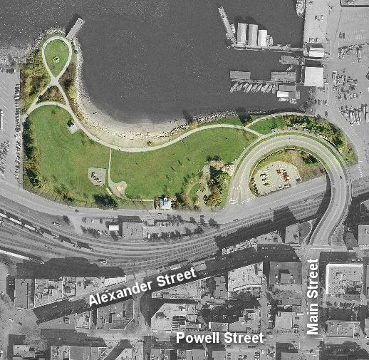
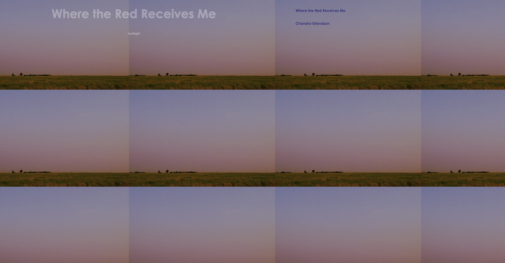
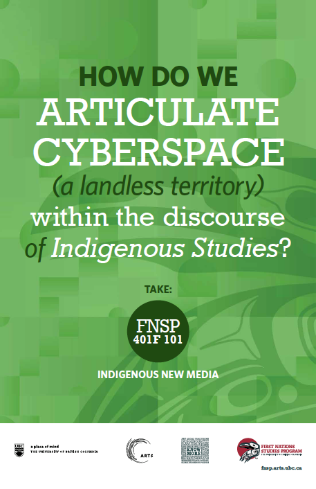
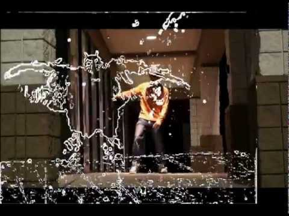
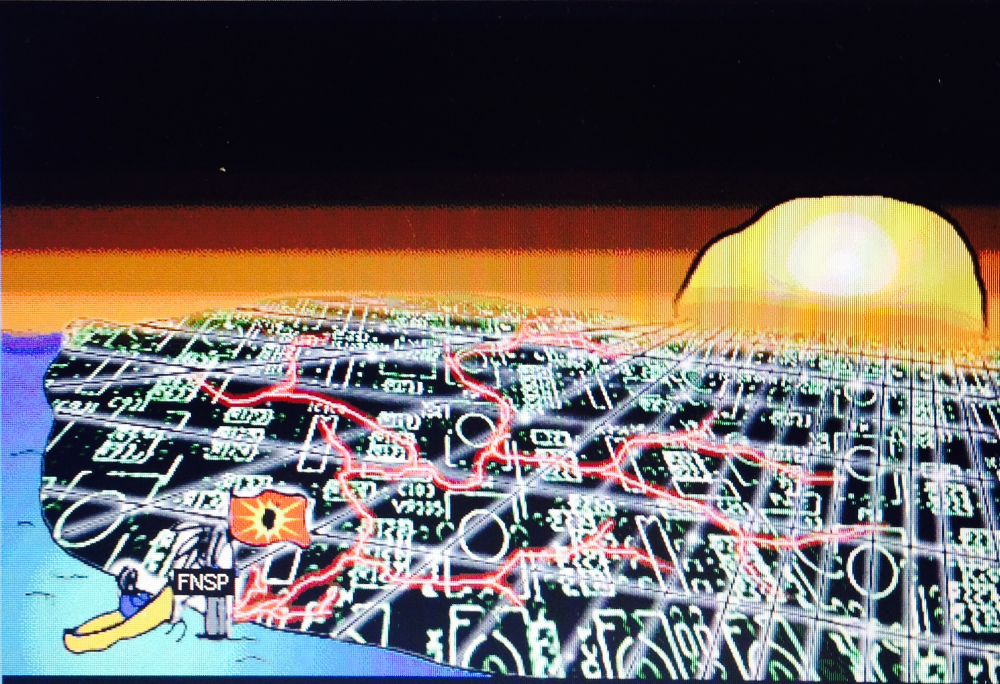
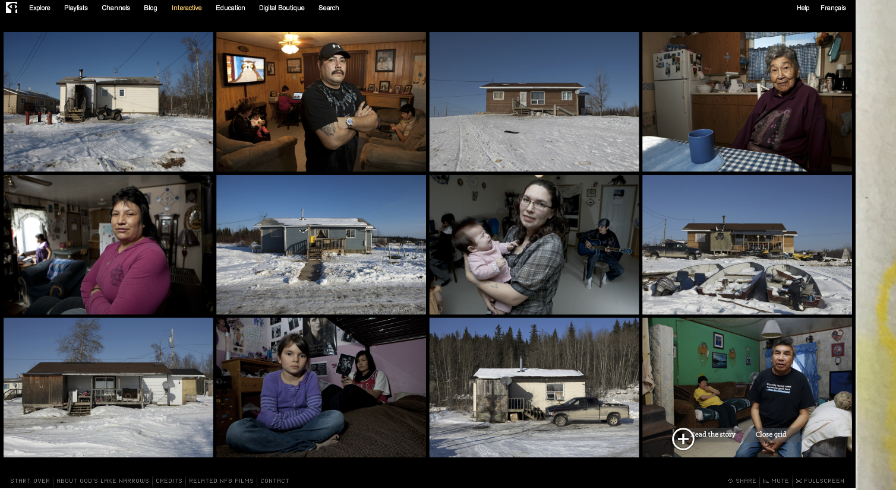

 
# Indigenous (Draft)
 
### David Gaertner 
University of British Columbia ([First Nations and Indigenous Studies Program](http://fnis.arts.ubc.ca))
 
### Karyn Recollet
University of Toronto ([Women and Gender Studies Institute](http://www.wgsi.utoronto.ca)) 
 
### with Elizabeth LaPensée
Michigan State University (Media & Information and Writing, Rhetoric, and American Cultures)
 
---
 
##### Publication Status:
* unreviewed draft
* draft version undergoing editorial review
* **draft version undergoing peer-to-peer review** 
* published
 
--- 
 
## CURATORIAL STATEMENT 
 
In the context of digital studies, we understand “Indigenous” in relation to Indigenous places, bodies, and futures. Traditionally framed as a “landless territory,” Western conceptions of cyberspace risk eliding the core principles of critical Indigenous studies, which are founded in place-based pedagogies. Evoking “Indigenous” in digital environments thus raises vital questions about our relationships to cosmologies, space, and lands. It also compels us to ask whether Indigenous lands and life can be repatriated through forms of creative intimacies formulated as cyber-justice. 

The pedagogical resources gathered here connect with “Indigenous” as an opportunity to:
 
* Conceive of new relationships to land and cyberspace through the digital,
* Envision new ways of conceptualizing land as multiscalar,
* Reconceive "extractivism" in digital spaces,
* Explore and critique the unique intimacies and connections available through cyberspace, and
* Reorient cyberspaces in relation to colonialism and Indigenous histories.
 
In the classroom, Indigenous perspectives on digital studies promote critical understandings of and engagement with the colonial foundations of media analysis and the “whiteness” (McPherson) of the field through critical analysis and place-based learning. Too often Indigenous peoples and knowledges are seen as mutually exclusive to modernity and technology. Our pedagogy pushes for nuanced understanding of “traditional innovation” (Glaskin), the crossroads at which Indigenous pasts, presents, and futures meet and expand into new worlds.
 
Engagement with Indigenous new media technologies also encourages students to find spaces of safety, love, and breath within an environment (the digital) that has traditionally been alienating and even hostile for Indigenous peoples, particularly Indigenous women and non-gender conforming peoples. We take seriously the possibility of radical decolonial love as proffered by Anishinaabe artist/activist/scholar, Leanne Simpson, as well as Cree scholars, Billy-Ray Belcourt and Kirsten Lindquist. Such love may have a glitching effect on the colonial machinery of technology. The glitch (Belcourt) provides spaces for rematriative sonic, visual, and embodied sovereignties and thus imagines, designs, and activates new futurisms that are anything but frontier spaces. 
 
#### Our Own Pedagogy
 
We have compiled these resources from both Indigenous and non-Indigenous engagements with Indigenous new media and Indigenous futurism. The pieces we have selected offer Indigenous critiques of settler colonial structuring, namely their erasures in a project of Indigenous dispossession. We begin with the idea that cyberspace and the digital are not Western phenomena. For instance, it is our belief that virtual reality is ancient; our elders have always worlded through space-time travel. Cyberspace has always existed for Indigenous people. Mohawk new media scholar, Steven Loft, argues that the fact "that hardware technology has made [cyberspace] accessible through a tactile regime in no way diminishes its power as a spiritual, cosmological, and mythical ‘realm’” (175). Additionally, Angela Haas has convincingly argued that Wampum is an early, Indigenous example of hypertext: “both Western and wampum hypertexts employ digital rhetoric to communicate non-linear information” (84), Hass writes. Understanding cyberspace as a notional environment that Indigenous peoples have conceptualized in parallel to Western technology provides new depth to understanding the limitations and possibilities of that space. Indigenous folks have enacted the traditional in the future by activating the “slipstream” as a platform or portal space to dream up new possibilities (Dillon; Jackson; Belcourt), where “imagining otherwise” (Crawley) is the glitch. The slipstream represents creases in space-time to produce radical constellatory genealogies and connectivities to land spaces. For example, relationships to human and non-human, the not yet and the already present, are activated within and through breath in LaPensée’s *Honour Water*. As an act of coming up for air, the breath itself is a worlding process, and such futuristically ancient activations have always been multiscalar. Radical relationality does this for digital pedagogy: it activates all that is underneath, above, and around. An Indigenous digital commons is a radical mapping exercise of love and futurity building.
 
#### Rationale and Criteria
 
We have selected the following resources according to four broad principles, which apply to our teaching and research:
 
First, we chose resources that were created by Indigenous artists, authors, programmers, and media makers, simply to highlight the cutting-edge work Indigenous media makers are doing and to push back against the persistent settler colonial notion that Indigeneity and digital technologies are incompatible. In this sense, we resist the word “artifact” in the way it connotes historical interest. The pieces we have chosen are all connected to living moments, places, peoples, and cultures, and they evoke continued conversation and the projection of Indigenous peoples and knowledges’ real and imagined futures.
 
Second, we wanted to include a range of projects that explore and expand the range of digital pedagogy, Indigenous new media, and Indigenous futurisms, including the multifarious ways in which these works connect users to places and bodies or ask them to engage in critical thinking about place and body. As such, we have included works that engage users visually, sonically, and haptically, blurring the distinctions between the digital and the analogue. 
 
Third, we included resources that both throw into relief the colonial implications of cyberspace, but also recast those spaces for Indigenous peoples to reimagine the possibilities of the digital and imagine Indigenous bodies in future worlds.
 
Finally, the examples we include all explore, in different ways, what we call kinstillatory relationalities: that is, the ways in which kinship is built, maintained, and folded across time and space to produce radical constellatory genealogies and connectivities to community and land spaces. We see cyberspace and digital pedagogy as possible extensions of kinship models developed on the land and developed by Indigenous scholars such as Daniel Heath Justice. Kinship, Justice writes, “is best thought of as a verb rather than a noun, because kinship, in most Indigenous contexts, is something that’s done more than something that simply is” (150). We see cyberspace as another plane for the work of kinship to be done on new scales of time and place providing new and powerful constellations of affinity and relationship.
 
## CURATED ARTIFACTS 
 
#### ALie Nation

 
* Source URL:  https://www.youtube.com/watch?v=WhlKs_3Srj0 
* Creator: A Tribe Called Red
 
ALie Nation is a site of activation from which students can begin to reflect on the complex relationships between Indigeneity, modernity, and digital space. The urban environment A Tribe Called Red captures, moves through, and writes over, is registered not simply as a space of oppression for Indigenous peoples (although that critique is nonetheless present), but of possible futures, in which modernity, and the gaze itself is captured from a top-down, Indigenous POV. We suggest that the poetics of its title A Lie Nation is, of course, an Alien nation, a society of immigrants convinced of their native belonging to stolen land. But the deeper lie may also be the Ally-Nation, a citizenry that loudly asserts its apologies and goodwill while leaving the colonial machinery to run unabated. Instructors inspired by this video might ask students to reflect on poetics of its title and the Jeremy Bentham inspired logo featured within it. What does “alienation” mean within the contexts of the digital? How are ATCR mobilizing those same spaces towards Indigenous resistance and resurgence? 
 
#### Ashes on the Water

 
* Source URL: http://neworldtheatre.com/portfolio-item/podplays/ 
* Creator: Quelemia Sparrow
 
Ashes on the Water is a podplay, a piece of interactive theatre that audiences download onto a smartphone and then listen to while walking on a particular piece of land. Ashes is set on Squamish territory in what is now known as CRAB PARK in Vancouver, British Columbia. It tells the story of the Women’s Paddle Song, which was written by Squamish people in 1886 as they rowed across the Burrard Inlet to rescue settlers fleeing Vancouver’s Great Fire. Instructor’s interested in this piece might ask students to consider the ways in which Sparrow’s work closes the gap between the digital and the material, or to consider the ways in which oral storytelling works as an augmentative technology. This piece is best experienced on the land itself, but for those not in Vancouver it stands as a story on its own. It can also be experienced from a distance using google maps or other mapping software.
 
#### Podcast Pedagogy 

 
* Source URL: https://rebadeguevara.wordpress.com/2015/12/31/podcast-pedagogy-stories-from-the-land/
* Creator: Reba De Guevera
 
“Podcast Pedagogy” is an example of a final blog post assignment written by an undergraduate student for FNIS 401F (Indigenous New Media and Digital Storytelling) taught at the University of British Columbia. In the post the author explore the relationships between land, storytelling, and digital technologies via a close reading of Anishinaabe media maker Ryan’s McMahon’s podcast Stories from the Land. The blog post is an excellent example of close reading practices as applied to podcasting and Indigenous storytelling and can be integrated into syllabi as a prompt for students writing on similar topics. Instructors might ask their students to reflect on the ways in which De Guevera incorporates land into a conversation about technology. 
 
#### Where the Red Receives Me

 
* Source URL: http://www.philome.la/chloerlendson/where-the-red-receives-me/play
* Creator: Chloe Erlendson
 
“Where the Red Receives Me” is a digital storytelling assignment written by an undergraduate student for Indigenous New Media, taught at the University of British Columbia. For this assignment, the student used Twine (interactive storytelling software, workshopped in class) to remediate a poem written by the student’s mother about her Métis identity. The story works well in classrooms as an example of the ways in which family and community stories can be shared and revitalized through digital media. “Where the Red Receives Me” is also a good example of the type of interactive storytelling that can be done using Twine in the classroom and the ways in which Indigenous storytelling and technology intercede.    
 
#### FNIS 454: Indigenous New Media and Digital Storytelling

 
* Source URL: https://novelalliances.com/2016/10/30/fnis-454-indigenous-new-media-and-digital-storytelling/
* Creator: David Gaertner
 
Rationale: FNIS 454 represents an entire upper-level course built around the intersections and divergences of critical Indigenous studies and new media/the digital humanities. The syllabus provides a number of primary and secondary sources as well as assignments and rationale. FNIS 454 (or portions thereof) can be used and adapted for courses on new media and the digital humanities contending with Indigenous studies, futurisms, and critical race studies. The syllabus also includes assignments, including blog post prompts and a new media design project adapted for the Indian Residential School History and Dialogue Centre at UBC.
 
#### Ay I Oh Stomp

 
* Source URL: https://www.youtube.com/watch?v=FS43pk8Yjos
* Creator: Skookum Sound System
 
Students are asked to produce sonic and/or visual maps, engaging the narratives of future relationships towards lands and territories, thus creating an artistic production which considers how we can activate (re)mapping to explore complex land histories. This assignment allows students to practice, in their own ways, creative intimacies with the spatial scales of land, bodies, and territories (water, land -terrestrial, or celestial). The video Ay I Oh Stomp, by Skookum Sound Systems can be read as a sonic map illuminating the time/space collapse mobilized through the remix. We ask students to create visual/sonic maps to explore the futuristic narratives of lands and territories through layering lands/ territories/ waters, or celestial maps remixed with recorded futurity narratives (this could take the form of spoken word poetry or other narrative devices). Students can read the text Gesturing Indigenous futurity through the remix (Recollet), considering, in particular, how mapping (visual, choreographic, spatial & sonic) carries potential as sites of reworlding through digitally remixed platforms.  

#### CyberPowWow

 
* Source URL: http://www.cyberpowwow.net/ 
* Creator: Skawennati
 
CyberPowWow was the first interactive, online, Indigenous art gallery running from 1997-2004. Using software from the Palace (early graphical chatroom platform owned and operated by Time Warner), Mohawk artist Skawennati curated artworks created by Indigenous artists in a linked, interactive space. Artists then convened in those spaces via avatars (also designed by Indigenous artists) to share and discuss the work. A large part of how CyberPowWow was imagined was in the performativity of the space: participants and their conversations were core to how the art and poetics of the piece functioned. In this sense, the gallery was an early instantiation of Web 2.0 thinking. CyberPowWow went dark in 2004, so it is no longer “live,” in the same sense, but students and teachers can still explore some of the visual and written pieces created for it in the curated link. Instructors should encourage students to engage the spaces in groups and encourage conversation in and around the artwork. Students should also be encouraged to visit the “library.” Texts in this space can be used to critically analyze the artwork. 
 
#### *God's Lake Narrows*

 
* Source URL: http://godslake.nfb.ca/#/godslake
* Creator: Kevin Lee Burton
 
*God's Lake Narrows* is an interactive website written and designed by Swampy Cree artist Kevin Lee Burton. The website is based on an installation piece that Burton originally conceived for the Urban Shaman Gallery in Winnipeg, Manitoba. Both the installation and the website were conceived as spaces to introduce non-Indigenous people, who would likely never visit IRL, to life on Burton’s reservation and thus disrupt many of the stereotypes about reservation life. What makes Burton’s work so provocative is how he uses technology to provide access to home, but also how he brings Internet and Indigenous protocols together to evoke hospitality and guesthood in that space. Teachers can use this piece to initiate conversation about the relationship between Indigenous land and cyberspace and Internet protocol and community protocol. Consider, for instance, how Burton uses geotagging to identify users and how he inverts the gaze (see in particular the “about” page).
 
#### *Honour Water*

 
* Source URL: http://www.honourwater.com/
* Creator: Elizabeth LaPensée
 
Elizabeth LaPansée’s Honour Song activates Anishinaabemowin songs gifted by Sharon Day, the Oshkii Giizhik Singers, and Elders. Repatriating Indigenous land and life as in-motion, in-migration - through the kinesthetic waves of water, Honour Song activates Indigenous intelligence through voicing forms of ‘sonic intimacies’ (Mark Campbell, 2015) between bodies and waters in digital space/time. Since water holds space underneath the gravel and concrete of the cities, Honour Song can be introduced to the students as an exercise of spatially-sonically mapping the oftentimes hidden (paved over, buried) underground waterways in citified Indigenous territories. Students are encouraged to research and travel to the portal sites of underground waterways in respective Indigenous territories, and build sonic intimacies through the act of singing water songs along with the app. Be mindful of how the body is being realigned/reoriented in relationship to the sound kinesthetic (how sounds shape space) produced through singing in Anishinaabemowin. Consider the ways in which sound shapes movements, flows and migrations throughout the cities- as gathering spaces. How might these flows (sonically, in relationship within the bodies of water) be acknowledging radical alterities? Who are the Indigenous stewards/ caretakers and those visioning futurities in the city within which you are living, and how might these original languages/ songs impact the futurities of water?
 
## RELATED MATERIALS
 
Aboriginal Territories in Cyberspace. http://www.abtec.org/ 
Loft, Steven and Kerry Swanson. *Coded Territories: Tracing Indigenous Pathways in New Media Art*. http://press.ucalgary.ca/books/9781552387061 
 
MacMahon, Ryan. *Stories From the Land* (podcast). http://www.indianandcowboy.com/stories-from-the-land-podcast/ 
 
Recollet, Karyn. "Gesturing Indigenous Futurities Through the Remix." *Dance Research Journal* 48.1. https://muse.jhu.edu/article/617353
 
Revolutions per Minute (RPM), "Indigenous Futurisms Mixtape," November 22, 2014, http://rpm.fm/music/download-indigenous-futurisms-mixtape/
 
## WORKS CITED
 
@spacendn and @culturite. Revolutions per Minute (RPM), “Indigenous Futurisms Mixtape,” November 22, 2014. http://rpm.fm/music/download-indigenous-futurisms-mixtape/ 
 
A Tribe Called Red. ALie Nation  Ft. John Trudell, Tanya Tagaq, Lido Pimienta & Northern Voice. Youtube, September 2, 2016. Web.
 
Belcourt, Billy-Ray. Nakinisowin. https://nakinisowin.wordpress.com
 
Burton, Kevin. *God’s Lake Narrows*. National Film Board of Canada, 2011. http://godslake.nfb.ca/#/godslake
 
Byrd, Jodi. “‘Do they not have rational souls?’: consolidation and sovereignty in digital new worlds.” *Settler Colonial Studies* 6.4 (2016). 423-437.

Campbell, Mark. “Sonic intimacies: On Djing Better Futures.” *Decolonization: Indigeneity, Education, and Society*. March, 25, 2015. 
 
Crawley, Ashon. “Otherwise Movements.” *The New Inquiry*, 2015. http://thenewinquiry.com/essays/otherwise-movements/

Deerchild, Rosanna. “Indigenous Game Designer CHallenges Stereotypes.” CBC Radio. March 6, 2016. Web. http://www.cbc.ca/radio/unreserved/unreserved-honours-the-strength-of-indigenous-women-1.3472826/indigenous-game-designer-challenges-stereotypes-1.3476519
 
De Guevera, Reba. “Podcast Pedagogy: Stories From the Land” Web. December 31, 2015. https://rebadeguevara.wordpress.com/2015/12/31/podcast-pedagogy-stories-from-the-land/
 
Dillon, Grace. *Walking the Clouds: An Anthology of Indigenous Science Fiction*. Tuscan: University of Arizona Press, 2012.

Erlendson, Chloe. Where the Red Receives Me. Web. 2014. http://www.philome.la/chloerlendson/where-the-red-receives-me/play
 
Gaertner, David. FNIS 454: Indigenous New Media and Digital Storytelling. Web. September 2016. https://novelalliances.com/2016/10/30/fnis-454-indigenous-new-media-and-digital-storytelling/
 
Glaskin, Katie. “Innovation and Ancestral Revelation: The Case of Dreams.” *Journal of the Royal Anthropological Institute* 11.2 (2009): 297-314.
 
Haas, M. Angela. “Wampum as Hypertext: An American Indian Intellectual Tradition of Multimedia Theory and Practice.” *Studies in American Indian Literatures* 19.4 (2007): 77-100
 
Jackson, Lisa. *Vistas: The Visit*. National Film Board of Canada (2009). 
 
Justice, Daniel Heath. “‘Go Away, Water!’ Kinship Criticism and the Decolonization Imperative.” *Reasoning Together: The Native Critics Collective*. Eds., Craig S. Womack, Daniel Heath Justice, Christopher B. Teuton. Norman: University of Oklahoma Press, 2008. 147-68. 
                                                                                                           
Johnson, Imani Kai.  “Music Meant to Make You Move: Considering the Aural Kinesthetic.” Blog post. Sounding Out. http://soundstudiesblog.com/2012/06/18/music-meant-to-make-you-move- considering-the-aural-kinesthetic/, 2012.                                             
LaPensée, Elizabeth. *Honor Water*. 2016. Ipad.

---. *We Sing for Healing*. Web. 2015. 

Loft, Steven. “Mediacosmology.” *Coded Territories: Tracing Indigenous Pathways in New Media Art*. Eds. Steven Loft and Kerry Swanson. Calgary: University of Calgary Press, 2014. 169-86.
 
Loft, Steven and Kerry Swanson, eds. *Coded Territories: Tracing Indigenous Pathways in New Media Art*. Calgary: University of Calgary Press, 2014. 
  
MacMahon, Ryan. *Stories from the Land*. Web. 2014-Present. http://www.indianandcowboy.com/stories-from-the-land-podcast/
 
McPherson, Tara. “Why are the Digital Humanities so White: Thinking the Histories of Race and Computation.” *Debates in the Digital Humanities*. Ed. Matthew K. Gold. Minneapolis: University of Minnesota Press, 2012.
 
Recollet, Karyn. “Gesturing Indigenous Futurities Through the Remix.” *Dance Research Journal* 48.1 (2016): 91-105.
 
Simpson, Leanne. *Islands of Decolonial Love*. Winnipeg: ARP, 2013.
 
Skawennati. CyberPowWow. Web (decommissioned). 1997-2004. Highlights available at http://www.cyberpowwow.net/ 

Skookum Sound System. 2012. “Ay I Oh Stomp & Operator” (ft. Deano & Amphibian14). https://www.youtube.com/watch?v=FS43pk8Yjos
  
Sparrow, Quelemia. *Ashes on the Water*. Neworld Theatre. Web. 2011. http://neworldtheatre.com/portfolio-item/podplays/
 
Tuck, Eve and Wayne Yang. “Decolonization is not a Metaphor.” *Decolonization: Indigeneity, Education & Society* 1.1 (2012). Web. http://decolonization.org/index.php/des/article/view/18630 
