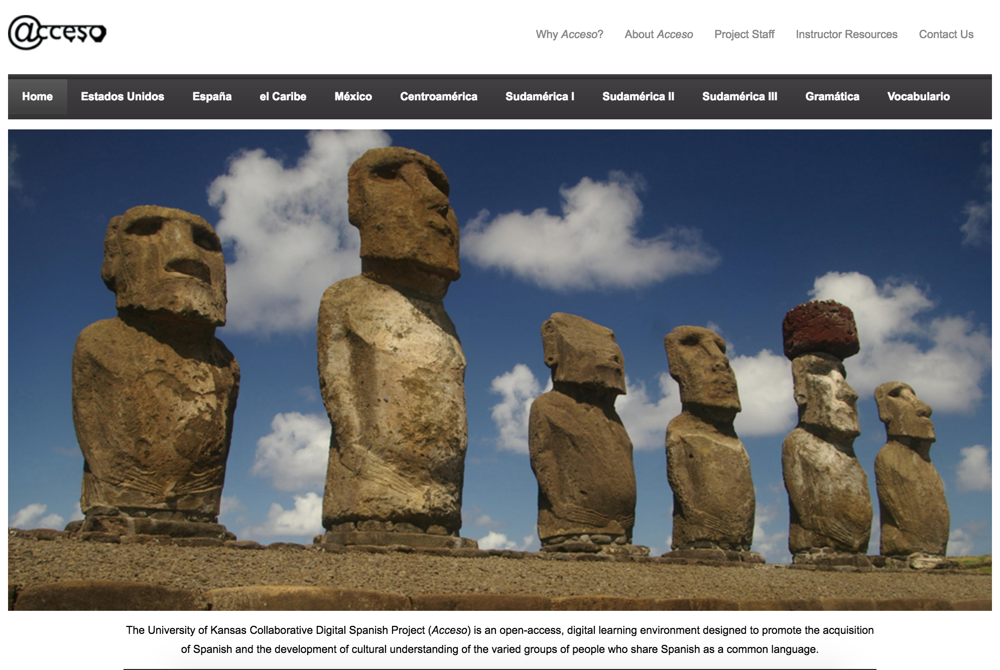
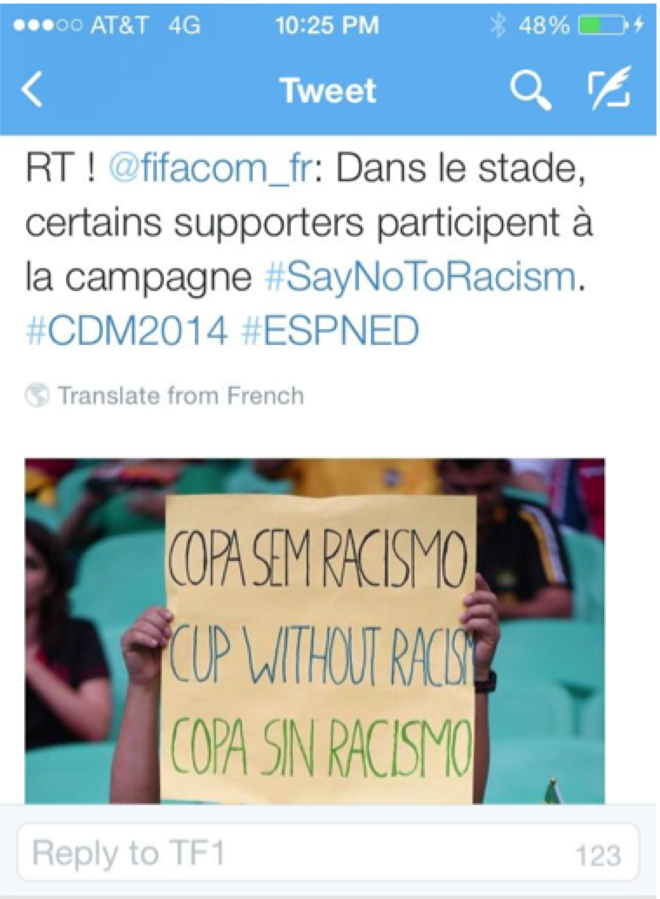
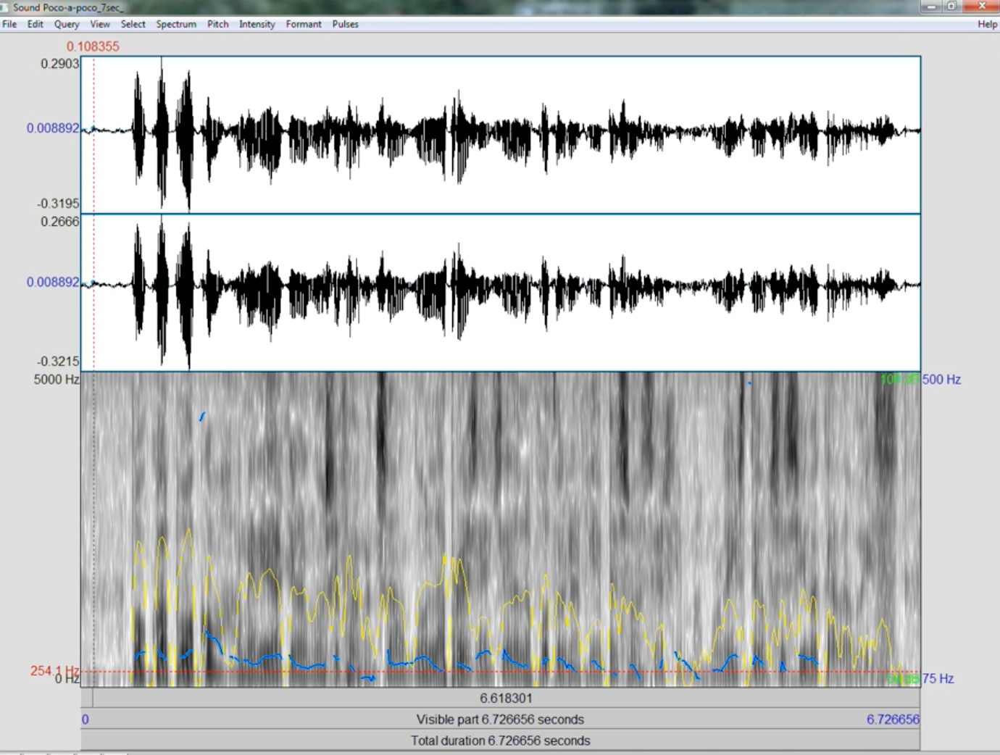
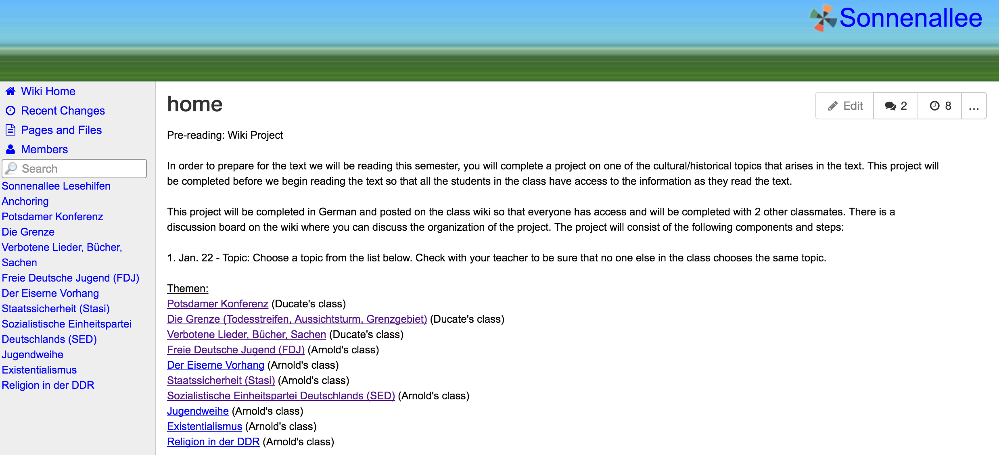
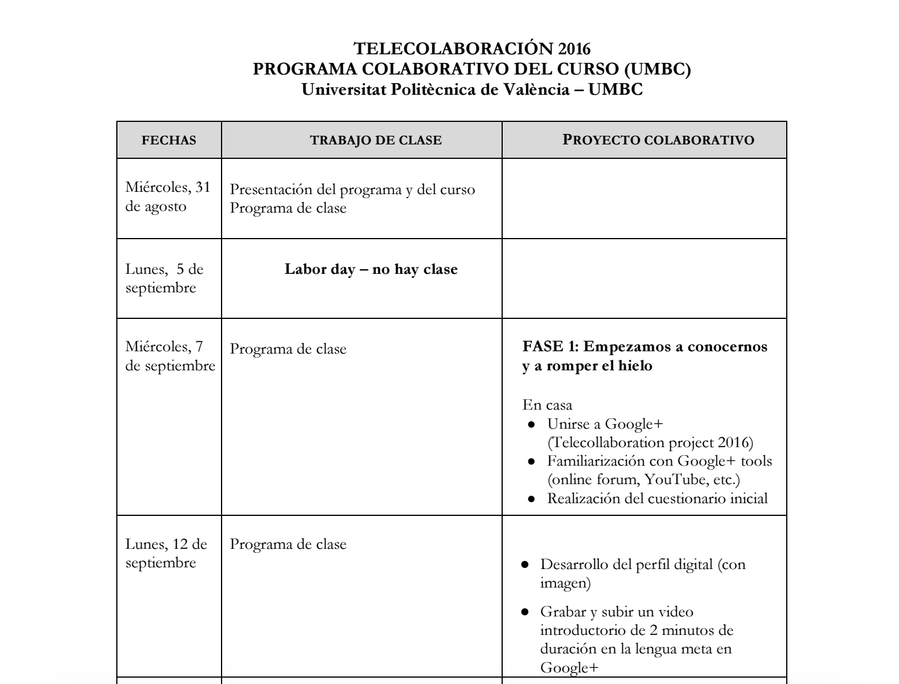

--- 
title: Digital Pedagogy in the Humanities
subtitle: Concepts, Models, and Experiments 
chapter: Language Learning
URL: keywords/language_learning.md
author: 
- family: Oskoz
  given: Ana
editor: 
- family: Davis
  given: Rebecca Frost
publisher: Modern Language Association
type: book
---
REBECCA: Editorial comments by Rebecca Frost Davis are included inline below following "REBECCA:" for each paragraph of feedback. I begin with overall feedback before the curatorial statement, then add more inline comments mostly following the paragraph to which the feedback applies.

# LANGUAGE LEARNING (Draft)

### Ana Oskoz
University of Maryland, Baltimore County (UMBC) | Website

---

##### Publication Status:
* unreviewed draft
* **draft version undergoing editorial review** 
* draft version undergoing peer-to-peer review 
* published

---
REBECCA: It is notable that in several of the examples you share, the social element moves beyond the classroom. You might highlight that theme. You might also more explicitly link back to the communicative aspects of language learning in your artifact annotations.

## CURATORIAL STATEMENT 

There is no question that today’s foreign language (FL) learning reflects the
increasing relevance of the development of students’ communicative competence
(Partnership for 21st Century Skills 2011). It is not about learning the
technical aspects of language, usually grammar, but about how to use the
language for communicative purposes. As such, in recent decades standards or
guidelines for FL learning, such as the pedagogical framework of the Standards
for Foreign Language Learning (National Standards) in the United States or the
European Reference Framework (European Commission) in Europe have emphasized
that language learning needs to move beyond the pure linguistic elements to
include “the sociolinguistic and cultural aspects of the language” (National
Standards 1). The European Commission, on its part, states that FL learning

	> is based on the ability to understand, express and interpret concepts, thoughts,
	> feelings, facts and opinions in both oral and written form
	> (listening, speaking, reading and writing) in an appropriate
	> range of societal and cultural contexts (in education and
	> training, work, home and leisure) according to one’s wants or
	> needs. Communication in foreign languages also calls for skills
	> such as mediation and intercultural understanding. (5)

Albeit using different terminology, both frameworks expect individuals to
achieve knowledge of vocabulary, functional grammar, and awareness of the main
types of verbal interaction and registers of language—to gain knowledge of
societal conventions and the cultural aspects and variability of languages;
become lifelong language learners; and have a positive attitude and appreciation
of cultural diversity, together with an interest and curiosity in languages and
intercultural communication.

Although technology has always played a pivotal role in language learning,
perhaps because “the rapid expansion of technologies into social, economic, and
cultural life has incredibly transformed communicative practices” (Lotherington
and Ronda 14), the integration of language learning and technology has
intensified in recent years. The gradual incorporation of new digital tools,
which has enhanced the capacity of students to become active agents of their own
language learning process, has enriched instructors’ teaching and students’
learning practices in ways that were unimaginable a decade ago. Digital social
tools such as wikis, blogs, and Twitter have expanded individuals’ reading and
writing practices, shifting them from being solitary practices to having a
strong social component. In addition, although not inherently unique to the
integration of social tools because it was already possible to combine text and
images in print media, in recent decades language learning has become a
multimodal endeavor in that different modes (textual, aural, visual) and
media—the technological means of inscription and production that shape the ways
by which messages are conveyed and accessed—are used to present and receive
information. The language learning possibilities, therefore, have changed
qualitatively. Yet, when integrating all these tools it is imperative to keep in
mind the communicative purposes of the different media, and not get sidetracked
by their novelty.

REBECCA: Could you break up the sentence beginning, "In Addition" above? It gets a bit complex.

The artifacts presented provide examples of meaningful implementations of
digital technology for language learning, including enhancing students’ writing,
reading, speaking, and listening skills; helping them in their cultural
understanding; aiding them in their comprehension of cross-cultural pragmatics;
and even developing their own identity as language learners. Most of the
selected tools are relatively accessible to instructors and students, and some
are free to use. These tools allow students to receive input and produce output
in the target language in a variety of formal and informal settings, either
individually or collaboratively. In using some of these tools, the instructors
or developers have a substantial role in content development, whereas in others
the learners are the active creators of knowledge. The following tools have been
selected because they provide learners with input that is similar to that found
in the target language classes. In other instances however, tools such as
Twitter, or social platforms such as Google + help learners familiarize
themselves with new modes of communication in the target language, and
facilitate informal learning, which is rarely a focus in higher education
classes. These artifacts range from an adapted syllabus, which presents the
breakdown of weekly activities in a telecollaborative encounter, to the
presentation of screencast software with which the instructor provides aural
feedback on his learners’ essays, or an article that describes the main steps
when developing a digital story. All these tools and projects enhance students’
language knowledge while developing their digital skills. 

REBECCA: Developing identities as language learners builds student agency.  Do you want to add another sentence explaining why it is important that they develop their digital skills?

## CURATED ARTIFACTS (ten artifacts, each with metadata, a screenshot, and a 150-word annotation)

### Acceso – Spanish

* Artifact Type: Webpage 
* Source URL:  [http://acceso.ku.edu](http://acceso.ku.edu) 
* Artifact Permissions: 
* Copy of the Artifact: 
* Creator and Affiliation: Amy E. Rossomondo (University of Kansas)

The Collaborative Digital Spanish Project Acceso, created at the University of
Kansas, is an open-access platform that is free to anyone with Internet access.
This platform, which is a complete, interactive curriculum for
intermediate-level learners of Spanish, includes videos and readings on current
topics, as well as grammar and vocabulary sections. More importantly, the six
categories (Apertura, Voces, Almanaques, Sucesos, Un paso más, and Perspectivas)
under each unit allow learners to enter the virtual Spanish-speaking world by
linking to sites that connect them with content read and seen by Spanish-native
speakers. These units also include interactive activities and comprehension
checks where learners can test their comprehension skills. Because of the
digital nature of Acceso, its content is always up-to-date and relevant. From a
pedagogical perspective, the curriculum is research-based and in line with
current best practices in foreign language teaching. Thus, it makes the most of
technological tools to enhance the students’ learning experience.

REBECCA: Entering the virtual Spanish-speaking world is an important point. This is an important point. Do you want to link it back to the communicative focus articulated at the beginning of your curatorial statement?

### Digital stories in the Language Classroom

* Artifact Type: Article 
* Source URL: [http://fltmag.com/digital-stories/](http://fltmag.com/digital-stories/) 
* Artifact Permissions: 
* Copy of the Artifact: 
* Creator and Affiliation: Polina Vinogradova (American University)

Digital stories, story lines that integrate text, images, and sounds in an
online environment are all increasingly used in the L2 classroom environment. 
In the submitted online article, Polina Vinogradova talks about the linguistic
and digital literacy benefits of digital storytelling. After pointing out the
seven elements of a successful digital story, the author provides examples of
how different instructors have implemented digital stories in their ESL and FL
classrooms. In terms of linguistic development (despite the more commonly
striking visual and oral modes) the written text is one of the foundations of
digital stories. The writing and rewriting of the short narrative (~250 words)
requires students to compose several drafts and receive feedback from both the
teacher and students (see the Implementation steps outlined). With regards to
digital literacy, students are required to master the use of digital story
software to successfully combine text, images, and sound to create a new
meaning.  The sample rubrics (see Appendix 2A and 2B) highlight the instructors’
relevant elements within the context of their classes.

REBECCA: Can you add a gloss for the abbreviation, L2? I think this is the first time you use it.

### eComma

* Artifact Type: website 
* Source URL: [https://ecomma.coerll.utexas.edu](https://ecomma.coerll.utexas.edu) 
* Artifact Permissions: 
* Copy of the Artifact: 
* Creator and Affiliation: Carl Blyth (The University of Texas at Austin)

eComma, a free software module that plugs into Drupal, is an open source content
management system that allows a group of users to (a) annotate the same text
together, and (b) share their annotations with each other which can be used
synchronously or asynchronously. When used in L2 sociolinguistic courses, or L2
reading courses, eComma learners “crowd source” their reading burdens at the
same time that they share their insights.  Carl Blyth, for example, asked his
learners to annotate a poem’s surreal non-sequiturs and juxtapositions. The
benefit of this tool is that it allows learners to not only post multiple
comments but also to reply to their classmates’ entries.  In a collaborative
effort, learners both read the text and each others’ comments, resulting in
nuanced and creative text analysis.

REBECCA: In your annotation, I think you are getting at the social learning allowed by this tool. Can you make that more explicit?

### Hashtag

* Artifact Type: Tweet
* Source URL: 
* Artifact Permissions: 
* Copy of the Artifact: 
* Creator and Affiliation:  Geraldine Blattner (Florida Atlantic University), Amanda Dalola (University of 
South Carolina), Lara Lomicka (University of South Carolina)

Twitter can be used as a tool to expose L2 learners to authentic and culturally
rich linguistic input, to aid them in their comprehension of cross-cultural
pragmatics, and to enhance their digital skills. In the example presented in
this artifact, Lara Lomicka asked her intermediate and advanced French learners
to use Twitter to learn about the structural and functional types of hashtags in
French. The instructor asked her students to join or log into their pre-existing
Twitter accounts, and select three personalities (from a list of pre-selected
French native speakers) to follow during 10 weeks. Each week, students analyzed
one tweet from each one of their personalities (for a total of three tweets per
week, 30 tweets in total). To analyze the tweets, learners answered questions
that addressed their recognition and understanding of hashtags, asking the
students to make sense of them in the context of the larger tweet.

REBECCA: Can you make explicit how this digital activity connects back to communicative competence? It is implicit.

### Identity text

* Artifact Type: digital story 
* Source URL:  	
* Artifact Permissions: (provided by creator)
* Copy of the Artifact: [files/language_leraning-Ester-Vizcaino-Zaera.mp4](files/language_leraning-Ester-Vizcaino-Zaera.mp4)
* Creator and Affiliation: María Dolores García-Pastor (Universitat de València)

Language learning identity texts, artifacts that illustrate language learners’
identity construction, might help learners strengthen their literacy engagement
or reject a negative identity that prevents them from learning the target
language. To obtain knowledge of the language learners, the instructor of an
advanced English class in Spain asked her students to develop a digital story in
which they presented themselves as language learners. With regard to content,
the students were required to offer a description of themselves as language
learners by providing an account of either their entire language learning
experience or a specific stage in their learning process. In addition to
including a “dramatic question” in their stories, they were asked to depict
their idiosyncrasies and include their learning styles and strategies. Because
they were expected to use video or photo-editing programs, these students also
developed their digital literacy.

REBECCA: This work around identity would build students' agency as learners.

### Nunca había sido tan feliz

* Artifact Type: image 
* Source URL: 
* Artifact Permissions: 
* Copy of the Artifact: 
* Creator and Affiliation: Neil Anderson (Texas Tech University)

Screencast software programs, such as Screencast-O-Matic, allow instructors to
record their comments on learners’ essays. In the example provided here, the
instructor gives feedback on the global (content, structure, and organization)
and local (grammar, vocabulary, and editing) aspects of learners’ essays.
Because learners tend to focus on the linguistic and local elements of an essay,
when using Screencast, the instructor first provides comments on content,
structure, and organization in order to emphasize that structure and content are
fundamental aspects of effective written communication. The instructor then
focuses on the number and type of errors in each sentence, addressing, for
example, whether an error occurs in the use of a verb (tense, aspect, mood) or
subject/verb agreement. A benefit of this software program is that the
instructor can use the cursor to hover over the area where the error is, or
indicate whether the error occurs at the beginning, middle, or end of a sentence
which helps learners see the error in context.

REBECCA: Can we get permission to use a copy of a screencast?  Why is this program important for language learning as opposed to some other discipline?

### Poco a poco

* Artifact Type: A short movie showing acoustic analysis software  
* Source URL: [https://ecomma.coerll.utexas.edu](https://ecomma.coerll.utexas.edu) 
* Artifact Permissions: (provided by creator) 
* Copy of the Artifact: [files/language_learning-poco-a-poco-in-praat-2.mp4](files/language_learning-poco-a-poco-in-praat-2.mp4)
* Creator and Affiliation: Gillian Lord (University of Florida) 

Learners’ pronunciation is often neglected in Spanish language classes.  Gillian
Lord uses podcasts to help her undergraduate learners in a phonetic class
develop their pronunciation.  In her classes, learners complete a series of
podcasts (either weekly or biweekly) to practice their speech and pronunciation
when reading short texts, speaking freely about a topic, or focusing on specific
consonants, vowels, or tongue twisters. In addition, learners provide comments
to each other or self-reflect on their pronunciation, adding a reflective
process to the listening task.  Learners appreciate receiving comments from
their peers, analyzing their own speech, and reflecting on their pronunciation.
The example presented is from one of the learners in her classes completing one
of the class readings.  Although the example provided is from a content class
focusing on Spanish phonetics, learners from different languages and language
levels could complete podcasts to practice their pronunciation and enunciation,
provide comments to one another, and reflect on their progress.

REBECCA: This artifact demonstrates more social learning. Are these podcasts publicly available with an intended public audience?

### Sonnenallee

* Artifact Type: website 
* Source URL: [http://sonnenallee.wikispaces.com/](http://sonnenallee.wikispaces.com/) 
* Artifact Permissions: 
* Copy of the Artifact: 
* Creator and Affiliation: Lara Ducate (University of South Caroline) and Nike Arnold (Portland State
University)

In the two German classes presented in the example, the instructors used the
wiki as a venue to conduct a pre-reading activity. The idea was that among all
the students, they would cover the topics required to understand the cultural
and historical context of the reading. To do so, in groups of three students
developed (in German) one of the cultural/historical topics that arose in the
text. As seen on the website, the instructors provided explicit instructions on
how and by when to initiate the research, write an outline (including
introduction, brief history of topic and the reading significance), and work on
the first and subsequent drafts.  The editing possibility of the wiki allows
students to help and correct each other’s errors. An additional benefit of wikis
is that students can discuss their project, and its structure and organization
by leaving posts in the discussion board feature on the wiki.

REBECCA: This annotation provides good details on the mechanics of this assignment but can you tie it back to the importance of this artifact? Why is this a good example of digital pedagogy?

### Telecollaboration

* Artifact Type: Syllabus 
* Source URL: [https://ecomma.coerll.utexas.edu](https://ecomma.coerll.utexas.edu) 
* Artifact Permissions: (provided by creator) 
* Copy of the Artifact: [files/language_learning-Collaborative_schedule.pdf](files/language_learning-Collaborative_schedule.pdf)
* Creator and Affiliation: Ana María Gimeno Sanz (Universitat Politècnica de València) 
and Ana Oskoz (University of Maryland, Baltimore County)

This syllabus belongs to a telecollaborative encounter between a third-year
Spanish class focusing on the history of Spain at the University of Maryland,
Baltimore County (UMBC) and an advanced English course at the Universitat
Politècnica de València (Spain) using Google Plus.  In this telecollaborative
encounter, six groups of students (each group counted with two students from the
US and two from Spain) discussed two cultural topics—immigration (in Spanish)
and nationalism (in English) from the perspective of the US and Spain in online
forum of Google Plus. After the two-week discussion, each group of students met
in Skype for half an hour to ask additional questions or clarify certain points
of the online written conversation. In pairs the students in the US and Spain
(in their own classes) wrote a “critical summary”, which would be the basis for
a PowerPoint to be uploaded to Google Plus. At the end of the semester, also in
pairs, students in each country completed a podcast based on one of the topics.

REBECCA: Again here you offer good details and an excellent example, but can you get to the larger point of why it is distinctive digital pedagogy.  You might comment on the communicative opportunities, the global collaboration, how collaboration drives deeper communication, etc.

### What’s happeNING?

* Artifact Type: forum 
* Source URL:  
* Artifact Permissions: provided by creator
* Copy of the Artifact: 
* Creator and Affiliation: Ana Brígido-Corachán (Universitat de València) and Mª Goretti Zaragoza-Ninet
(Universitat de València)

At the Universitat de València, two of the English instructors introduced
NING—an educational social network site, into their class English Language III. 
The purpose of introducing this platform was to (a) develop learners’
grammatical competence through a balanced practice of listening, writing, and
reading skills, and (b) enhance learners’ digital competency.  To develop
listening skills, learners and instructors uploaded audio material (songs and
videos), which allowed learners to expand vocabulary, expressions, and idioms
connected to the class content. To enhance their writing skills, learners
employed both the Blog space, focusing on formal, instructive and reflective
discourse, and the Forum, a free form social environment where learners exchange
information related to the class content. For the reading skills, instructors
uploaded information to the platform. However, this was quickly replaced by the
blog itself because this tool allowed learners to make comments, and therefore,
make the activity more interactive.  The inclusion and use of forums, videos,
hyperlinking, and even the development of a digital story helped learners to
develop their digital competency. 

## RELATED MATERIALS

Arnold, Nike, Lara Ducate, and Claudia Kost. “Collaborative Writing in Wikis:
Insights from Culture Project in German Class.” *The Next Generation: Social
Networking and Online Collaboration in Foreign Language Learning.* Ed. Lara
Lomicka and Gillian Lord. CALICO Monograph Series, Vol. 5. San Marcos: Texas
State UP, 2009. 115–44. Print. 

Blattner, Geraldine, Amanda Dalola, and Lara Lomicka. “Mind Your Hashtags: A
Sociopragamatic Study of Student Interpretations of French Native Speakers’
Tweets.” *Handbook of Research on Foreign Language Education in the Digital Age.*
Ed. Congcong Wang and Lisa Winstead. Hershey, PA: IGI Global, 2016. Print.

Brígido-Corachán, Anna, and María Goretti Zaragoza-Ninet. "What's Happening?
Expanding the Esl Classroom through Educational Social Network Sites." *Digital
Competence in Higher Education: An International Perspective.* Eds. Pérez Cañado,
María Luisa and Juan Ráez Padilla. Frankfurt am Main, Germany: Peter Lang, 2014.
52–72. Print. 

Elola, Idoia, and Ana Oskoz. “Supporting Second Language Writing
Using Multimodal Feedback.” *Foreign Language Annals* 49.1 (2016): 58–74. Print.

Lord, Gillian. “Podcasting Communities and Second Language Pronunciation.”
*Foreign Language Annals* 41.2 (2008): 364–79. Print.

## WORKS CITED

National Standards. *Standards for Foreign Language Learning in the 21st Century.*
3rd ed. Yonkers, NY: National Standards in Foreign Language Education Project,
2006. Print.

---. *Standards for Foreign Language Learning: Preparing for the 21st Century*
(Executive Summary). Yonkers, NY: American council on the teaching of foreing
languages, 1996. Print.

European Commission. “Key Competences for Lifelong Learning – A European
Framework.” *Lifelong Learning Programme.* British Council. 2007. Online.

Lotherington, Heather, and Natalia Ronda. "2b or Not 2b? From Pencil to
Multimodal Programing: New Frontiers in Communicative Competences." *Digital
Literacies in Foreign and Second Language Education.* Eds. Guikema, Janel Pettes
and Lawrence Williams. Vol. 10. San Marcos, TX: CALICO, 2014. 9–28. Print.

Partnership for 21st Century Skills. “P21 World Languages Map.” *21st Century
Skills Map.* ATCFL. (2011). Online.

Vinogradova, Polina. "Digital Stories in a Language Classroom: Engaging Students
through a Meaningful Multimodal Task." *The FLTMAG* (2014). Web.
