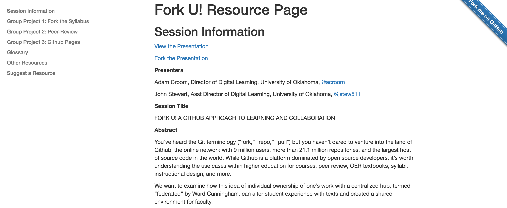
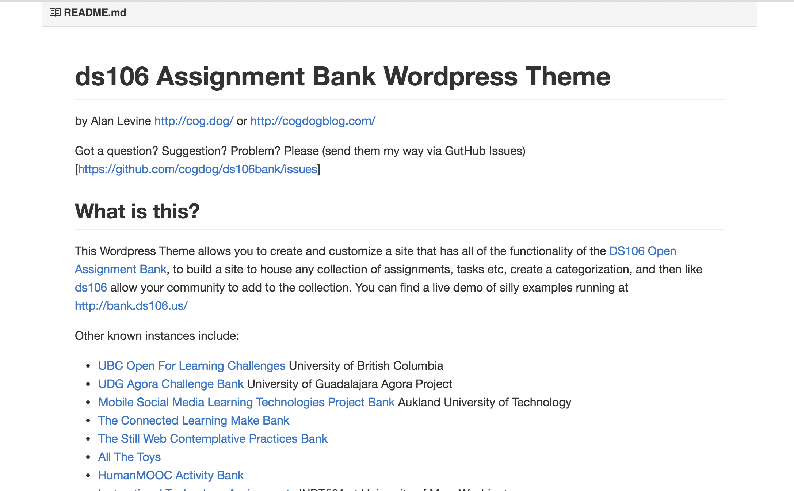
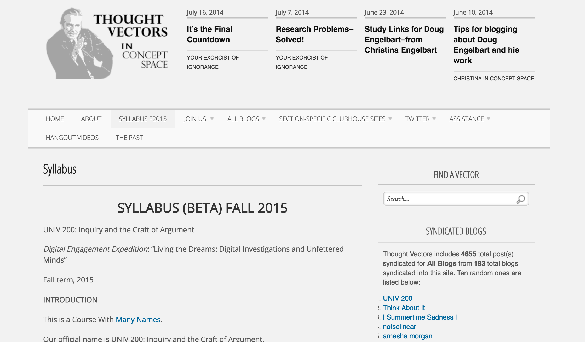
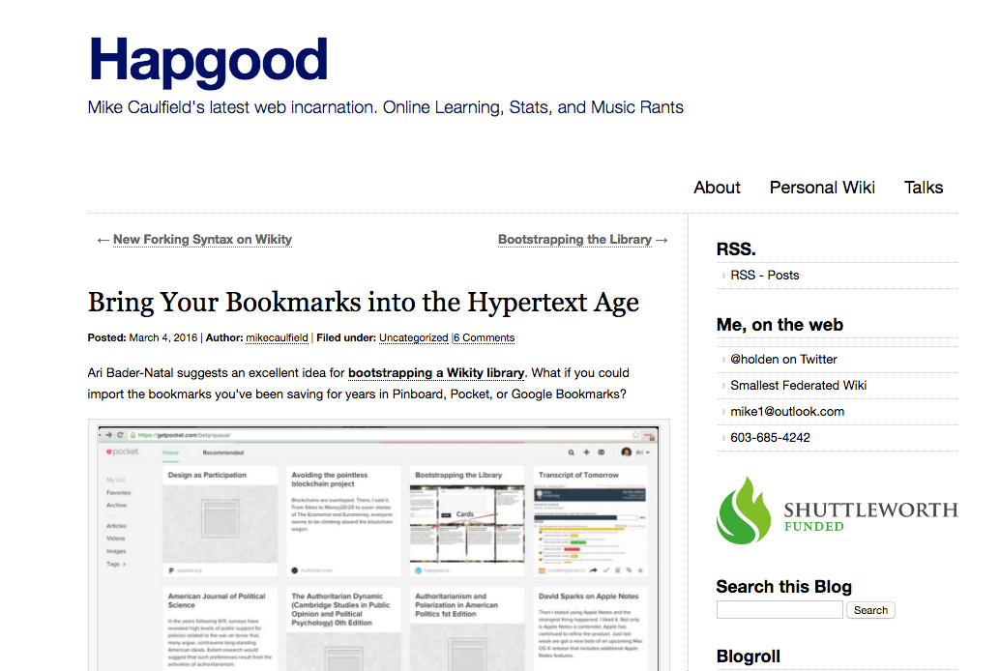
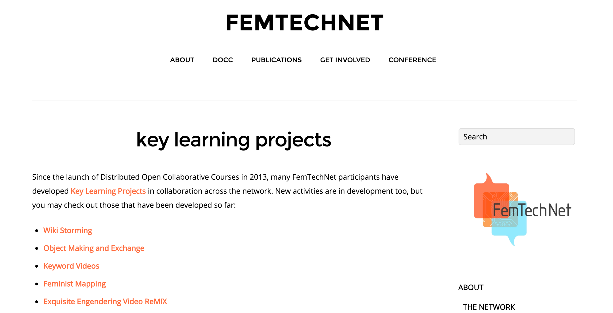
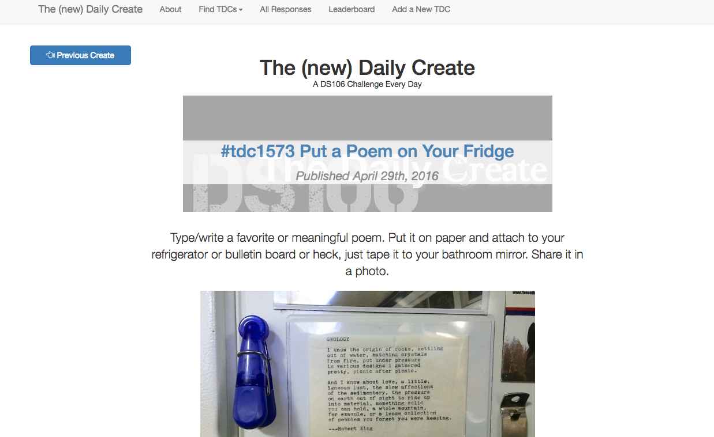
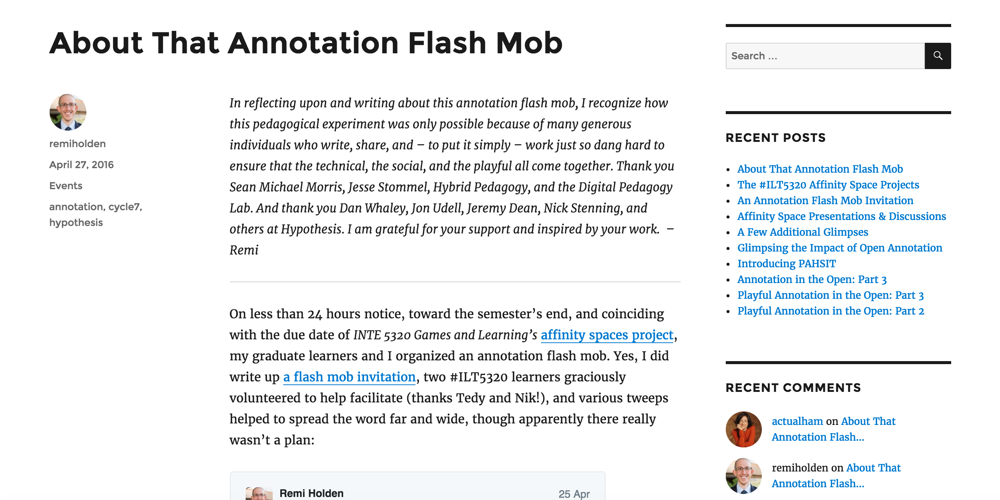

# Online

### Amy Collier
Middlebury College | [http://digitallearning.middcreate.net](http://digitallearning.middcreate.net)

---

##### Publication Status:
* unreviewed draft
* draft version undergoing editorial review
* **draft version undergoing peer-to-peer review**
* published 

--- 

## CURATORIAL STATEMENT

In higher education, the term “online” has become synonymous with eLearning-style training and MOOCs. This narrow view of online, with a focus on content delivery and automated assessment, is spread via higher education industry media, as in this recent quote from *Inside Higher Ed*: “Online education can offer personalized pathways through course content with short lecture videos and well-timed quizzes that help students retain knowledge…” (Straumsheim). This perspective values online learning for its efficiency, flexibility, and convenience, claiming the appeal of “anytime, anywhere” education (Richardson & Swan 69). It has also marginalized online learning and de-emphasized the characteristics that make it distinctive and exciting as a model of education (Pacansky-Brock). It’s no surprise when pundits and educators alike argue that online learning can never match the quality of face-to-face or even blended learning because, as Ian Lamont argues, “there [i]s almost no meaningful student/teacher or student/student interaction. To equate this type of online learning with a real-world classroom experience is a major stretch.”

To be fair, much online learning treats online spaces as containers, especially where institutions have adopted self-paced or templated models. Many educators reject this view and instead focus on how online can transform education and provide new reflections on what it means to be and learn online. Morris argues that the Learning Management System is a reflection of missed opportunities for online learning, saying “In a world that was just waking up to the Internet and the possibility of widely-networked culture, the LMS played to the lowest common denominator, creating a “classroom” that allowed learning — or something like learning — to happen behind tabs, in threaded discussions, and through automated quizzes. The LMS was not a creative decision, it was not pushing the capabilities of the Internet, it was settling for the least innovative classroom practice and repositioning that digitally.” Morgen and Rorabaugh note: “Significantly, most students haven’t been taught to think about how the natures of knowledge, authority, composition, and learning have changed/are changing. The Internet provides digital spaces and applications that are ripe for redefinition in ways that many educational structures have not reconciled.”  The message is clear: Online learning can be about more than content and quizzes; it can be an experience that unsettles transmission-based approaches and opens up emergent ways of learning in digital spaces. Ross and Collier add, “Those of us interested in emerging technologies and emerging practices would do well to resist constraints on thought and action wherever possible, because a key element of emerging technologies and emerging practices is their not-yetness…We need practices that acknowledge and work with complexity to help us stay open to what may be genuinely surprising about online learning and teaching intersecting with emerging technologies.” 

This collection of resources is shaped by the educators who have embraced online learning beyond content and beyond LMS-shaped learning. These resources, and the educators behind them, elevate new ways of thinking about online-ness and ask students to participate fully and critically in the online experience. They encompass some of the digital literacies considered essential for today’s teachers and learners, such as participation, network awareness, and collaboration (Rheingold, “Attention and other 21st century social media literacies”). According to Rheingold (ibid), we must address digital literacies if we want to positively impact the welfare of learners. Artifacts in this collection are divided into three focus areas: authorship, community/networked participation, and presence/embodiment. Though treated separately, some examples demonstrate the ways in which all three can be addressed in meaningful learning contexts.

### Authorship

Online authorship is not just writing in online spaces; authorship is creation and agency as part of participation in online networks and spaces. Implicit in the notion of authorship are the “language, methodology, and training” (Rheingold, NetSmart, 31) teachers and learners need to no longer consume what is online, but to author it. Too many technologies and models of online learning relegate the learner to a consumer role and give authorship rights only to the instructor (or sometimes, only to the designer of an online course). Examples in this section push back a plug-and-play view of online spaces and embrace the uncertainty and complexities of digital authorship, including questions raised by [public](https://github.com/curateteaching/digitalpedagogy/blob/master/keywords/public.md) authorship, sharing, and [remixing](https://github.com/curateteaching/digitalpedagogy/blob/master/keywords/remix.md).

### Community and networked participation

Perhaps the greatest, and often unrealized, opportunity for meaningful online learning is through connections to people and networks within and outside of a class. Students work in online “walled gardens,” such as Learning Management Systems, and are not encouraged to venture beyond those digital walls to connect to people and networks. Gardner Campbell (Networked Learning as Experiential Learning) argued, “we must add digitally mediated networked learning to Kuh’s [high impact practices] list, because the experience of building and participating within a digitally mediated network of discovery and collaboration is an increasingly necessary foundation for all other forms of experiential learning in a digital age. Moreover, the experience of building and participating within a digitally mediated network of discovery is itself a form of experiential learning…” Resources in this collection provide examples for intentional building and fostering of networks and communities as part of online learning.

### Presence/Embodiment

The third area this collection investigates is presence and embodiment. Siân Bayne (105) says, “The distanced, unstable relationship between body and subject with which we engage when we communicate online involves us in modes of identity formation and pedagogical relations which are very different from those which, as learners and teachers, we experience in the face to face classroom.” The lack of physical embodiment and co-presence may be most detrimental to online learners, as those can contribute to feelings that online learning lacks authenticity or veracity (Land 531). Land noted, “The notion that the visibility of the learner or teacher serves as an anchor of truthfulness or veracity (‘you can look your interlocutor in the eye’) might lead one to conclude that authenticity is dependent upon physical embodiment. It would follow from this line of reasoning, that lack of embodiment renders the cyber space, which is unquestionably a simulated environment, a ‘false’ environment.” Addressing embodiment and presence, particularly with activities and assessments that encourage students’ authentic selves to be present, can help to alleviate these concerns.

As expected, questions of embodiment and presence pervade the literature on online learning, highlighting concerns that online learning can create isolation and distance. The disembodied or absent online learner is characterized as a “lurker” and strategies for dealing with lurkers often devolve to compliance (number of logins, number of discussion posts, etc.). Research points to the importance of establishing social, cognitive, and teaching presence in online learning experiences, the integration of which is said to foster a Community of Inquiry (Garrison) among teachers and learners. Examples in this section explore or reimagine presence and provide a sense of eventness for online learning experiences.

## CURATED ARTIFACTS

### Authorship

#### Fork U! Resource Page

* Artifact type: Assignments, guide for learning and using Github
* Source URL: [http://oudiglearn.github.io/forku/](http://oudiglearn.github.io/forku/)
* Artifact permissions: CC-BY 4.0
* Creator and Affiliation: Adam Croom & John Stewart, University of Oklahoma

GitHub provides a unique platform for authorship, collaboration, and peer review. GitHub was originally created to allow software developers to share code, and it gained popularity because of how it allows users to “fork” files from other users. Forking a project allows users to copy code to their own GitHub account and make changes without affecting the original file. According to Schaeffer (Push, Pull, Fork: GitHub for Academics), a “‘forked’ project can be used as the basis for a new project, or can be used to work out new features that can be merged back into the original.” The Fork U! resource, assembled by Croom and Stewart for a presentation at the Online Learning Consortium’s Innovate conference, provides low-barrier and forkable activities instructors and/or students can complete. All of the resources on this site are forkable (i.e., they can be copied and reused). Any changes made to a “forked” copy do not impact the original “master” unless a pull request is accepted. GitHub provides a unique platform for exploring authorship with students, as it allows students to author their own projects, to allow sharing and discussion of copies of those projects, and to copy/edit resources authored by others. It would be interesting to see group projects authored via GitHub as a way of exploring collaboration and shared authorship. Other examples of resources on Github include this [Musicianship syllabus](http://kris.shaffermusic.com/musicianshipResources/), course materials for [Humanizing Technology](https://github.com/karlstolley/ht), assignments for [Fashioning Circuits](https://github.com/fashioning-circuits), and peer assessment activities for a course on [Reproducible Data](https://github.com/rdpeng/RepData_PeerAssessment1). 

#### ds106 Assignment Bank creator

* Artifact type: Github repository
* Source URL: [https://github.com/cogdog/ds106bank](https://github.com/cogdog/ds106bank)
* Artifact permissions: GNU General Public Licence
* Creator and Affiliation: Alan Levine

GitHub provides a unique platform for authorship, collaboration, and peer review. GitHub was originally created to allow software developers to share code, and it gained popularity because of how it allows users to “fork” files from other users. Forking a project allows users to copy code to their own GitHub account and make changes without affecting the original file. According to Schaeffer (Push, Pull, Fork: GitHub for Academics), a “‘forked’ project can be used as the basis for a new project, or can be used to work out new features that can be merged back into the original.” An Assignments Bank is a site in which teachers and learners can create and complete assignments related to a shared topic of interest or scholarship. Alan Levine’s Assignments Bank Github repository enables teachers and students to author their own Assignments Bank and build a community around the assignments they create. Examples of such communities, including [ds106](http://assignments.ds106.us/) and the [Connected Learning MOOC](http://clmoocmb.educatorinnovator.org/home/), are listed on Levine’s Github page. Creating an Assignments Bank allows members of a community to author opportunities for learning within their community and with others outside of their community. This allows communities to have agency over the ways members of the communities and outside networks participate together. Assignments Banks should be created outside of the LMS in order to make the work of the community visible and accessible to a broader network; Levine’s Assignment Bank GitHub repository is for a WordPress-based tool. 

#### ThoughtVectors in Concept Space syllabus

* Artifact type: Syllabus
* Source URL: [http://thoughtvectors.net/syllabus/](http://thoughtvectors.net/syllabus/)
* Artifact permissions: [LINK]
* Creator and Affiliation: Gardner Campbell, Virginia Commonwealth University

Thought Vectors, a course offered at Virginia Commonwealth University, gives each students their own space on the web in the model of [Domain of One’s Own](https://medium.com/bright/the-web-we-need-to-give-students-311d97713713#.y7hguujk3). Domain of One’s Own is an initiative based on the idea that every learner should have a domain on the web that they control, and upon which they can install tools they want to use as part of their digital identity and work. Domain of One’s Own was started at the University of Mary Washington in a move to encourage students to become “system administrators for their own digital lives” (Campbell, “A Personal Cyberinfrastructure). As Campbell (ibid) noted, “In building that personal cyberinfrastructure [through domain of one’s own], students not only would acquire crucial technical skills for their digital lives but also would engage in work that provides richly teachable moments ranging from multimodal writing to information science, knowledge management, bibliographic instruction, and social networking. Fascinating and important innovations would emerge as students are able to shape their own cognition, learning, expression, and reflection in a digital age, in a digital medium.” In [Thought Vectors](http://thoughtvectors.net/how-to-participate/), students participated in the course via their own domains and had agency over what they authored and how their creative works were shared. The Thought Vectors syllabus features a video from the course librarian, Jenny Stout, that helps students to think about the importance of sharing their ideas, through participation on the web, saying “we don’t really know what could happen…amazing things could happen.” 

#### Wikity: Bring your bookmarks into the digital age

* Artifact type: Blog post / guide for using Wikity (federated wiki) for bookmarking
* Source URL: [https://hapgood.us/2016/03/04/bring-your-bookmarks-into-the-hypertext-age/](https://hapgood.us/2016/03/04/bring-your-bookmarks-into-the-hypertext-age/)
* Artifact permissions: Wikity content is CC-BY-SA; blog post permissions [LINK]
* Creator and Affiliation: Mike Caulfield, Washington State University - Vancouver

Wikity is a federated wiki environment created by Mike Caulfield, and [his writings](https://hapgood.us/?s=wikity) about federated wikis are worth reading. In brief, Wikity allows users to write and maintain individually-controlled wiki pages and to make editable copies of others’ wiki pages. Caulfield notes that Wikity helps address issues we face with authorship on wikis and blogs, saying, “we want to build on the work of others and have others build on our work, but at the same time, local concerns make it too hard to release control of our own work…Wikity, inspired by recent work of Ward Cunningham, sees the answer to the problem as federation. Individual groups create, maintain, and extend wiki pages (or “cards’), but these cards are, through the magic of an API, forkable to other sites. If people fork your stuff and improve it in ways that support your local aim, you can fork it back. If they fork it and take it in an unrelated direction, well that’s OK too. This allows people to build on and contribute to the work of others while still preserving their local aims and unique insights.” In this blog post about wikity and bookmarking, Caulfield offers wikity as an alternative to bookmarking tools, which allow users to save references but lack hypertext capabilities. As Caulfield uses wikity to annotate resources, he is also able to connect those resources to other wikity “cards” on which he has authored other insights and reflections. Wikity could be used in an online course for students to create bookmarks and libraries of resources that are connected to resources written by others in their class and outside of their class. The ability to author and connect information about resources is a key feature of wikity and helpful for students to reflect, synthesize, and express their voice, rather than just saving bookmarks or parroting what others have said about a resource. Wikity can be installed as a theme on a WordPress installation.

### Community

#### clMOOC

* Artifact type: Online community and course
* Source URL: [http://clmooc.educatorinnovator.org/2015/](http://clmooc.educatorinnovator.org/2015/)
* Artifact permissions: CC-BY-SA 4.0
* Creator and Affiliation: Educator Innovator / National Writing Project

Many MOOCs—explicitly or implicitly—do not aim to foster community. Today’s MOOC tend to place content at the center of the learning experience, through video content, quizzes, and discussion forums aimed mostly at answering questions, rather than building community. But the first MOOCs, which started well before Coursera and EdX were established, focused on creating networks of learners that could be responsive to evolving interests and needs. These MOOCs demonstrated the power of connected learning, a movement that “is not simply a ‘technique’ for improving individual educational outcomes, but rather seeks to build communities and collective capacities for learning and opportunity…” (Ito et al., 8). Communities to which students connect, more than the instructor alone, can provide ongoing resources and can be a source of new connections as a learner develops areas of interest, inquiry, and work. This artifact shows how an online course can be designed to intentionally foster community and to help students to develop the skills and intentions to connect to various communities. Every activity, every design choice, centers on community. clMOOC makes explicit its goal of connected learning and provides ample opportunities for learners to connect. In particular, see examples of Twitter chats, Make Cycles, Blog Hub, Make Bank, and social tools. 

#### FemTechNet: Key Learning Projects

* Artifact type: Assignments
* Source URL: [http://femtechnet.org/get-involved/self-directed-learners/key-learning-project/](http://femtechnet.org/get-involved/self-directed-learners/key-learning-project/)
* Artifact permissions: [LINK]
* Creator and Affiliation: FemTechNet organizers

FemTechNet is a community that sponsors DoCCs—Distributed Open Collaborative Courses—which are explicitly created in response to MOOCs. While MOOCs generally do not focus on community building, DoCCs center on community building as a part of a feminist pedagogy orientation. The key learning projects are both the product of a community and an opportunity to create further community. The Community Participation via Blog Commenting project is a great model for giving learners skills and opportunities to engage with a professional community of their choosing. The project teaches students about intentionally participating in an online community and how preparation for engaging with that community (e.g., through formulating a rhetorical stance) can help them to connect to experts and to understand how communities work (and sometimes don’t work) in online settings. The assignments also help students to think through the threats to online professional communities (e.g., trolls) and how communities handle those threats. Additional key learning projects have been highlighted in this collection, including [the Situated Knowledges Map](https://digitalpedagogy.commons.mla.org/keywords/gender/), and the [Exquisite Engendering Remix](https://digitalpedagogy.commons.mla.org/keywords/remix/).

#### The Daily Connector

* Artifact type: Assignments
* Source URL: [https://dailyconnector.wordpress.com/](https://dailyconnector.wordpress.com/)
* Artifact permissions: [LINK]
* Creator and Affiliation: Connected Courses

Henry Jenkins et al. (5) describe participatory culture as a culture with low barriers to entry, support for the sharing of creations among community members, informal mentorship, and social connections that help community members to feel that their contributions are important. The Daily Connector provides activities and assignments that aim to grow connections between individuals in a course or across multiple courses, helping to foster connections that validate the contributions of members of the community. These activities encourage community building online as part of intentional daily practice and provide helpful strategies to help learners make those intentional connections. For example, the [Twitter Poetry](https://dailyconnector.wordpress.com/2015/02/04/ccourses-bonus-dailyconnect-twitter-poetry/) activity asks students to use the service Poetweet to create a poem from a connected colleague’s Twitter feed. This activity encourages students to look at the Twitter feeds of other students and view them as part of their community.

### Presence

#### Introduction to Still Photography syllabus

* Artifact type: Syllabus
* Source URL: [https://voicethread.com/myvoice/#thread/2610203](https://voicethread.com/myvoice/#thread/2610203)
* Artifact permissions: [LINK]
* Creator and Affiliation: Michelle Pacansky-Brock, California State University Channel Islands

In her excellent paper on embodiment in online learning, Sîan Bayne notes, “that, in cyberspace and elsewhere, mind and body are indivisible entities is not to prevent us from looking to new technological environments as spaces where the conventional constraints and significations of embodiment can be challenged and shifted. The challenge to learners and teachers in cyberspace is in devising creative pedagogical approaches which work with these new articulations.” The use of voice sharing technologies may help to combat the disengagement felt in disembodied online courses. Voice can provide a sense of embodiment in online courses, where embodied interactions may be limited to audio and video streams. Michelle Pacansky-Brock voice annotates her syllabus and assignments, and she provides feedback to students using voice. These annotated syllabus, assignments, and feedback she uses become a model for students on how to share their vocal presence with others in the course. Pacansky-Brock invites students to annotate course resources and assignments together, using VoiceThread, giving students a chance to embody their work with their voices. Pacansky-Brock also wrote a free ebook called [How to Humanize Your Online Class with VoiceThread](http://page.teachingwithoutwalls.com/ebook).

#### The Daily Create

* Artifact type: Assignments
* Source URL: [http://daily.ds106.us/](http://daily.ds106.us/)
* Artifact permissions: CC-0
* Creator and Affiliation: Alan Levine

Henry Jenkins et al. (5) describe participatory culture as a culture with low barriers to entry, support for the sharing of creations among community members, informal mentorship, and social connections that help community members to feel that their contributions are important. The Daily Create embodies all of these characteristics and, as it encourages a participatory culture, it helps faculty and students to remain actively engaged and present in a course. Daily Create activities are brief and have low barriers to entry; the key is to provide easy and interesting ways for students to remain engaged, thus contributing to the eventness of a course. The activities can minimize feelings of interpersonal distance by motivating continuous participation and by providing a hub that syndicates, or aggregates from various feeds, the contributions of participants in the course and allows them to see each other’s contributions. The [Paperback Paradise](http://daily.ds106.us/tdc1618/) Daily Create activity demonstrates how the activities can be open-ended enough to allow for students’ creativity and personal connections. Students are asked to select and alter an image from the web and to share their remixed creation via Twitter using a course hashtag. As students see the work of others (including their instructors and people outside of the course) being syndicated to The Daily Create site through the Twitter hashtag, they may recognize that their work is part of a community and that their presence in that community is important.

#### Annotation Flash Mob

* Artifact type: Blog post with links to assignment details
* Source URL: [https://gamesandlearning.wordpress.com/2016/04/27/about-that-annotation-flash-mob/](https://gamesandlearning.wordpress.com/2016/04/27/about-that-annotation-flash-mob/)
* Artifact permissions: [LINK]
* Creator and Affiliation: Remi Holden, CU Denver

Inspired by Sean Michael Morris’ [Teaching in our right minds: Critical Digital Pedagogy and the Response to the New](http://www.digitalpedagogylab.com/hybridped/teaching-in-our-right-minds/) Remi Holden organized an annotation flash mob in his course, where his students were already using hypothes.is for collaborative annotation. Holden’s blog post with instructions on how to participate in the flash mob [is here](https://gamesandlearning.wordpress.com/2016/04/24/an-annotation-flash-mob-invitation/). The annotation flash mob is a fascinating example of bringing eventness to the collaborative web. Several of Holden’s students and many individuals outside of the course jumped in to annotate Morris’ article. One participant’s comments captured the feeling of eventness, ““Love[d] getting to play in the digital annotation flashmob – I’m reminded of the frequently referenced analogy of the digital mimicking sandbox play.” 
More generally, instructors are using hypothes.is in their courses for collaborative annotation, as in this [example from Brian Watkins at Austin College](http://acdigitalpedagogy.org/category/hypothes-is/).

## RELATED MATERIALS

Campbell, Gardner. “A personal cyberinfrastructure.” *Educause Review*. vol. 44, no. 5 (September/October 2009): 58–59. Accessed 1 May 2016. [http://er.educause.edu/articles/2009/9/a-personal-cyberinfrastructure](http://er.educause.edu/articles/2009/9/a-personal-cyberinfrastructure)

Pacansky-Brock, Michelle. “Love letter to online learning.” 26 April 2016. [http://brocansky.com/2016/04/26/love-letter-to-online-learning/](http://brocansky.com/2016/04/26/love-letter-to-online-learning/)

Rheingold, Howard. *Net Smart: How to Thrive Online*. Cambridge: The MIT Press, 2014. 

Ross, Jen et al. “Manifesto for Online Teaching.” [https://onlineteachingmanifesto.wordpress.com/](https://onlineteachingmanifesto.wordpress.com/)

Stommel, Jesse. “Online learning: A Manifesto.” *Hybrid Pedagogy*. 3 December 2012. Accessed 1 May 2016. [http://www.digitalpedagogylab.com/hybridped/online-learning-a-manifesto/](http://www.digitalpedagogylab.com/hybridped/online-learning-a-manifesto/)

## WORKS CITED

Bayne, Siân. “The Embodiment of the Online Learner.” *Beyond the comfort zone: Proceedings of the 21st ASCILITE Conference*. (2004): pp. 105-115. Accessed 1 May 2016. [http://www.ascilite.org/conferences/perth04/procs/pdf/bayne.pdf](http://www.ascilite.org/conferences/perth04/procs/pdf/bayne.pdf)

Campbell, Gardner. “A personal cyberinfrastructure.” *Educause Review*. vol. 44, no. 5 (September/October 2009): 58–59. Accessed 1 May 2016. [http://er.educause.edu/articles/2009/9/a-personal-cyberinfrastructure](http://er.educause.edu/articles/2009/9/a-personal-cyberinfrastructure)

Campbell, Gardner. “Networked Learning as Experiential Learning.” *Educause Review*. 51, no. 1 (January/February 2016) Accessed 1 May 2016. [http://er.educause.edu/articles/2016/1/networked-learning-as-experiential-learning](http://er.educause.edu/articles/2016/1/networked-learning-as-experiential-learning)

Campbell, Gardner. “Thought Vectors in Concept Space: Syllabus.” Fall 2015. Accessed 1 May 2016. [http://thoughtvectors.net/syllabus/](http://thoughtvectors.net/syllabus/)

Caulfield, Mike. “Wikity: Bring your bookmarks into the digital age.” Hapgood. 4 March 2016. Accessed 1 May 2016. [https://hapgood.us/2016/03/04/bring-your-bookmarks-into-the-hypertext-age/](https://hapgood.us/2016/03/04/bring-your-bookmarks-into-the-hypertext-age/)

clMOOC. Accessed 1 May 2016. [http://clmooc.educatorinnovator.org/2015/](http://clmooc.educatorinnovator.org/2015/)

Connected Courses. “The Daily Connector.” Accessed 1 May 2016. [https://dailyconnector.wordpress.com/](https://dailyconnector.wordpress.com/)

Croom, Adam & John Stewart. “ForkU! Resource Page.” Accessed 1 May 2016. [http://oudiglearn.github.io/forku/](http://oudiglearn.github.io/forku/)

FemTechNet. “Key Learning Projects.” Accessed 1 May 2016. [http://femtechnet.org/get-involved/self-directed-learners/key-learning-project/\](http://femtechnet.org/get-involved/self-directed-learners/key-learning-project/\)

Garrison, D. R. “Online Community of Inquiry Review: Social, Cognitive, and Teaching Presence Issues.” *Journal of Asynchronous Learning Networks*, v11 n1 (2007): pp. 61-72. Accessed 1 May 2016. [http://onlinelearningconsortium.org/sites/default/files/v11n1_8garrison.pdf](http://onlinelearningconsortium.org/sites/default/files/v11n1_8garrison.pdf)

Holden, Remi. “About that Annotation Flash Mob.” 27 April 2016. Accessed 1 May 2016. [https://gamesandlearning.wordpress.com/2016/04/27/about-that-annotation-flash-mob/](https://gamesandlearning.wordpress.com/2016/04/27/about-that-annotation-flash-mob/)

Jenkins, Henry et al. “Confronting the Challenges of Participatory Culture: Media Education for the 21st Century.” MIT Press. 2009. Accessed 10 June 2016. [https://mitpress.mit.edu/sites/default/files/titles/free_download/9780262513623_Confronting_the_Challenges.pdf](https://mitpress.mit.edu/sites/default/files/titles/free_download/9780262513623_Confronting_the_Challenges.pdf)

Ito, Mizuko et al. “Connected Learning: An Agenda for Research and Design.” Connected Learning Research Network. 2012. Accessed 10 June 2016. [http://dmlhub.net/wp-content/uploads/files/Connected_Learning_report.pdf](http://dmlhub.net/wp-content/uploads/files/Connected_Learning_report.pdf)

Lamont, Ian. “My online math class review: Convenience gets an ‘A,’ but at what cost?” I, Lamont blog. 17 July 2010. Accessed 1 May 2016. [http://www.ilamont.com/2010/07/my-online-math-class-convenience-gets-a.html](http://www.ilamont.com/2010/07/my-online-math-class-convenience-gets-a.html)

Land, Ray. “Issues of embodiment and risk.” *Beyond the comfort zone: Proceedings of the 21st ASCILITE Conference*. (2004): pp. 105-115. Accessed 1 May 2016. [http://www.ascilite.org/conferences/perth04/procs/land.html](http://www.ascilite.org/conferences/perth04/procs/land.html)

Levine, Alan. “Assignment Bank Creator. Accessed 1 May 2016. [https://github.com/cogdog/ds106bank](https://github.com/cogdog/ds106bank)

Levine, Alan. “The Daily Create.” Accessed 1 May 2016. [http://daily.ds106.us/](http://daily.ds106.us/)

Morgen, Davis & Pete Rorabaugh. “Building community and critical literacies with the domain of one’s own incubator.” *Hybrid Pedagogy*. 28 January 2014. Accessed 12 June 2016. [http://www.digitalpedagogylab.com/hybridped/building-community-critical-literacies-domain-ones-incubator/](http://www.digitalpedagogylab.com/hybridped/building-community-critical-literacies-domain-ones-incubator/)

Morris, Sean Michael. “Decoding digital pedagogy, Pt. 1: Beyond the LMS.” *Hybrid Pedagogy*. 5 March 2013. Accessed 12 June 2016. [http://www.digitalpedagogylab.com/hybridped/decoding-digital-pedagogy-pt-1-beyond-the-lms/](http://www.digitalpedagogylab.com/hybridped/decoding-digital-pedagogy-pt-1-beyond-the-lms/)

Pacansky-Brock, Michelle. “Introduction to Still Photography syllabus.” Accessed 1 May 2016. [https://voicethread.com/myvoice/#thread/2610203](https://voicethread.com/myvoice/#thread/2610203)

Pacansky-Brock, Michelle. “Love Letter to Online Learning.” 26 April 2016. Accessed 1 May 2016. [http://brocansky.com/2016/04/26/love-letter-to-online-learning/](http://brocansky.com/2016/04/26/love-letter-to-online-learning/)

Rheingold, Howard. Attention, and other 21st-century social media literacies. *Educause Review*. vol. 45, no. 5 (September/October 2010): 14–24. Accessed 12 June 2016. [http://er.educause.edu/articles/2010/10/attention-and-other-21stcentury-social-media-literacies](http://er.educause.edu/articles/2010/10/attention-and-other-21stcentury-social-media-literacies)

Rheingold, Howard. *Net Smart: How to Thrive Online*. Cambridge: The MIT Press, 2014. 

Richardson, Jennifer & Karen Swan. “Examing Social Presence in Online Courses in Relation to Students’ Perceived Learning and Satisfaction.” *Journal of Asynchronous Learning Networks*, vol7, issue 1, 2003. [https://www.ideals.illinois.edu/bitstream/handle/2142/18713/RichardsonSwan%20JALN7%281%29.pdf?sequence=2](https://www.ideals.illinois.edu/bitstream/handle/2142/18713/RichardsonSwan%20JALN7%281%29.pdf?sequence=2)

Ross, Jen & Amy Collier. “Complexity, Mess, and Not-yetness: Teaching Online with Emerging Technologies.” In George Veletsianos (Ed.), *Emergence and Innovation in Digital Learning: Foundations and Applications.* May 2016. Accessed 12 June 2016. [http://www.aupress.ca/index.php/books/120258](http://www.aupress.ca/index.php/books/120258)

Ross, Jen et al. “Manifesto for Online Teaching.” Accessed 1 May 2016. [https://onlineteachingmanifesto.wordpress.com/](https://onlineteachingmanifesto.wordpress.com/)

Schaeffer, Kris. “Push, Pull, Fork: GitHub for Academics.” *Hybrid Pedagogy*. 26 May 2013. Accessed 12 June 2016. [http://www.digitalpedagogylab.com/hybridped/push-pull-fork-github-for-academics/](http://www.digitalpedagogylab.com/hybridped/push-pull-fork-github-for-academics/)

Stommel, Jesse. “Online learning: A Manifesto.” *Hybrid Pedagogy*. 3 December 2012. Accessed 1 May 2016. [http://www.digitalpedagogylab.com/hybridped/online-learning-a-manifesto/](http://www.digitalpedagogylab.com/hybridped/online-learning-a-manifesto/)

Straumsheim, Carl. “Love letter to Blended Learning.” *Inside Higher Ed*. 20 April 2016. Accessed 1 May 2016. [https://www.insidehighered.com/news/2016/04/20/mit-online-learning-report-notes-importance-teachers-instructional-designers](https://www.insidehighered.com/news/2016/04/20/mit-online-learning-report-notes-importance-teachers-instructional-designers)
