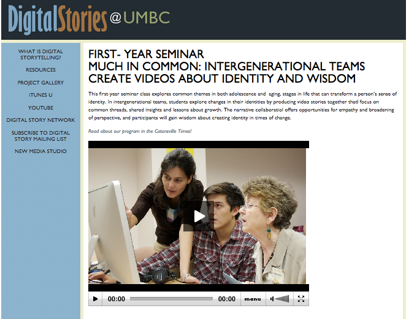
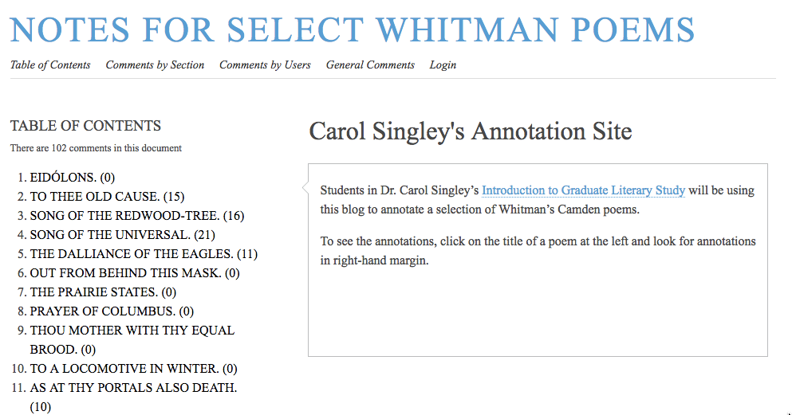
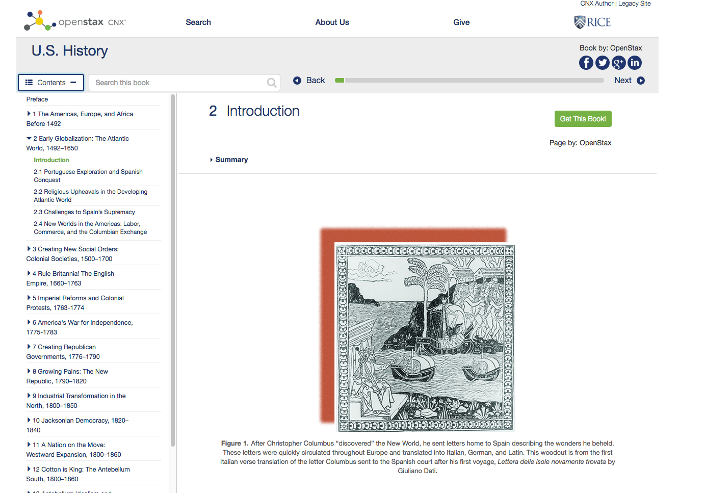
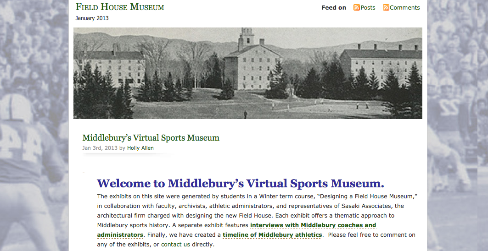
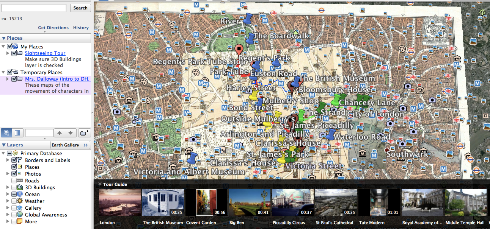
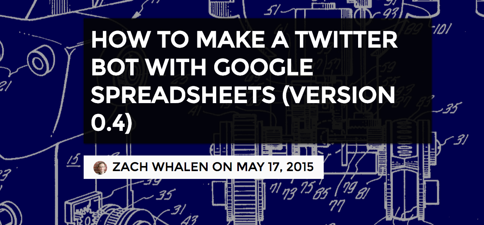

# Open

## Michael Roy
Middlebury College 
---

##### Publication Status:
* unreviewed draft
* draft version undergoing editorial review
* draft version undergoing peer-to-peer review
* **draft version undergoing MLA copyediting**
* awaiting pre-print copy
* published 

--- 

CURATORIAL STATEMENT 

While Open can mean a number of different things in different contexts, in the context of digital pedagogy, Open refers to a set of technical and legal arrangements that allow for the legal sharing, re-use, and modification of materials ranging  from text  to media to software. The underlying practice of sharing and fostering re-use has sparked movements ranging from the open source software movement, to the creative commons licensing scheme, to the open access movement. (See Hoffman, 2014.)  Open in this context is a foundational principle and practice that enables the larger movement within higher education and beyond to take back the internet from commercial interests that focus on monetizing attention and privatizing the academic commons for financial gain. In this light, choosing open digital pedagogy can be seen as a political choice, with the work of open digital pedagogy contributing to the reclaiming of the commons, and the creation an architecture and a set of practices, conventions, and laws that will support this more sustainable and democratic vision. To make sense of the diverse range of pedagogical options surrounding Open as a teaching strategy, here are some of the properties of Open in the context of digital pedagogy. 

* **Consumption versus contribution:** Some forms of digital pedagogy rely simply on using open resources, while others involve contributing to an open resource as part of the activity itself.

* **Content versus software:** Some forms of digital pedagogy focus activity on the use or creation of open content, while others depend on the use, creation, or modification of open source software.

* **Authoritative versus crowdsourced:** Open content as part of digital pedagogy falls along a spectrum from the highly authoritative to the massively crowdsourced. 

* **Fixed versus Rewriteable:** Licensing of open content and open software can provide a read-only version or  it can allow for copying, re-purposing, re-mixing, and redistribution. 

* **Big versus Small:** Creating, using, or contributing to open resources can be simple and straightforward, or it can involve massive commitments of time and access to significant technological resources. 

As Mark Edington writes, Open is a strategy. Individual choices to pursue an open strategy collectively contribute to a network that enables new forms of re-mixing, bricolage, collaboration, authorship, publication, and new forms of pedagogy. 

Open is not always possible, nor is it always desireable. Copyright and licensing prohibit certain types of open work. A need for student privacy can also argue for teaching behind a firewall.  In the classroom, issues of evaluation manifest themselves when evaluating student digital work, which requires new rubrics and new ways of identifying individual contributions to collective efforts.

The chosen artifacts illustrate a wide range of open applied to teaching practices. They bring to light both the promises but also the problems of open digital pedagogy.  Most focus on student-created works, highlighting ways in which writing for a broader public, and using a range of open platforms and formats, can support a new form of information literacy. Some exemplify contributions to larger works of scholarship that have a life beyond the confines of the specific classroom and semester. Some highlight ambitious efforts to customize open source software, or to build open textbooks, to address local pedagogical needs while also contributing to the commons.  Some are public artifacts that are used as texts while others are documents to which students contribute. Some are self-contained and some are contributions to larger works. Some are mostly text while others are multimedia. Some are clearly student exercises which a public audience might not find all that useful or interesting, while others are intended not as a classroom project but as a contribution to a publication

In looking through the chosen artifacts, consider to what extent being "open" comes at the expense of student learning and student privacy. Should students be forced to put their thoughts on-line for all to see? To what extent might these materials created when students are often  still quite young linger on-line for longer than they should?  (See Jeff McClurken’s entry on [Public](https://github.com/curateteaching/digitalpedagogy/blob/master/keywords/public.md))

Many proponents of open practices (open source, open access, open standards) favor these practices as a way to challenge the current market-based information economy. Are these interventions in favor of openness a way to re-orient a system dominated by market forces? Might forcing students to confront these complicated issues surrounding "open" in turn prepare them to think about the ramifications of their technology choices on their daily life, and on how technology impacts civil society? Does adopting Open in one’s teaching contribute to building a path that leads away from the “appification of everything” that creates walled-gardens of content that resist the creative linking, re-use, and bricolage that early versions of the web enabled? How much does the choice of Open in fact enact the change necessary for a digital pedagogy to flourish? 

## CURATED ARTIFACTS

#### Wikipedia Syllabus for Feminist Theory  
Screenshot: 
* Artifact Type: syllabus
* Source URL [https://en.wikipedia.org/w/index.php?title=Education_Program:Richard_Stockton_College_of_New_Jersey/GIS_3614_Feminist_Theory_(Fall_2014)) 
* Permissions:
* Creator and Affiliation: [Adeline Koh](http://adelinekoh.org/), Associate Professor of Literature at Richard Stockton College

As an example of having students contribute to an existing resource, Adeline Koh uses Wikipedia, the open source encyclopedia, as a platform for her students to create and curate entries for her feminist theory class. By challenging her students to do their work via editing wikipedia articles, Koh forces them to confront  questions about knowledge, power, authority, and standards. Wikipedia in turn [cautions](https://en.wikipedia.org/wiki/Wikipedia:Student_assignments) faculty that simply turning students loose to edit entries may do no good for the students, and no good for Wikipedia. In this case, students are learning through contributing their work to an open, crowd-sourced encyclopedia, contributing new material in a small, manageable, and yet meaningful way. 

#### Teaching Digital History: Collaborative Markup

* Artifact Type: teaching assignment
* Source URL: [http://wheatoncollege.edu/digital-history-project/teaching/) 
* Permissions:
* Creator and Affiliation: Kathryn Tomasek, Wheaton College 

This is an example of students contributing to a small open archive. To teach students archival and historical research, Kathryn Tomasek has her students digitize and markup historical documents, contributing to the creation of an open archive. Her students have a deep experience with a primary text, asking of it structural and lexical questions that provide the reader with the ability to identify patterns, and provide the student with a chance to make visible a history previously lost.  Unlike writing terms papers that only a professor will read, having students contribute to an open history archive allows students to learn how to write for a broader audience, as well as to learn about structuring data for use by the public, and the role of such work in the creation of a commons. 

#### First Year Seminar Digital Storytelling

* Artifact Type: syllabus
* Source URL: [https://drive.google.com/file/d/0B7N5fppR9qT_aU52T2p5MGl3RXh2WnRNSkZ4cHBqeWh6S0dr/view?usp=sharing)
* Permissions:
* Creator and Affiliation: William Shewbridge, University of Maryland, Baltimore County

Open writing (contributing to Wikipedia, contributing to open history projects) is but one of many options for challenging students to produce public scholarship. In this example, first-year seminar students at University of Maryland, Baltimore County, produced short documentary videos in the form of digital stories [shared via the web](http://stories.umbc.edu/fys.php). The "Much in Common," first-year seminar class explored common themes in both adolescence and aging, stages in life that can transform a person’s sense of identity. In intergenerational teams, undergraduates explore changes in their identities by producing video stories together that focus on common threads, shared insights and lessons about growth. Contributing to an open publication with an audience well beyond the professor, and creating video resources that in turn can be useful for subsequent scholars, forces students to consider a host of complex but important issues that the dominant mode of the closed classroom avoids. 

#### Annotating Walt Whitman’s Poetry

* Artifact Type: syllabus
* Source URL: [https://drive.google.com/file/d/0B7N5fppR9qT_aU52T2p5MGl3RXh2WnRNSkZ4cHBqeWh6S0dr/view?usp=sharing)
* Permissions:
* Creator and Affiliation: Carol Singley, Rutgers University  

An open source technology for enabling open peer review makes its way into the curriculum with this re-purposing of [CommentPress](http://futureofthebook.org/commentpress/) to empower students of Walt Whitman’s poems to [annotate his poems](http://notes.lookingforwhitman.org/2009/10/05/song-of-the-redwood-tree/). Part of the larger *Looking for Whitman* project, this assignment asks students to collaboratively annotate Whitman’s poems in full public view. This exemplifies both the power but also the perils of openness. How much should teachers insist that their students make public their thoughts and impressions? What does it mean when one’s not yet fully formed thoughts, once shared in the safety of the closed seminar room, become part of the web’s permanent record? And to what extent does current copyright law inhibit such open work on materials not in the public domain?  

#### Open Source History Textbook

* Artifact Type: syllabus
* Source URL: [https://docs.google.com/document/d/11NpiYRu54dTgN1_8ajpj5CKDS8MxfwOJD0CbmafeWCE/edit)
* Permissions:
* Creator and Affiliation: Max Paul Friedman, American University 

In order to provide flexibility for his teaching, and to save his students money, Friedman adopted the OpenStax [U.S. History Textbook](https://openstaxcollege.org/textbooks/us-history).  Open textbooks, often licensed in a way that allow for revision and remixing, represent a part of the broader Open Educational Resource movement, which envisions a universe of freely available modules that can be mixed and matched to suit the needs of a course and its students. They deliver savings to students, flexibility to instructors, and the chance to reclaim control over a portion of the academic publishing universe. While creating an open textbook is an example on the ‘large’ scale, requiring a significant investment of time, it is an increasingly relevant model that many institutions are trying to support in their efforts to shift the dial in the direction of a more open universe of educational resources, and to control costs for students. 

#### Map of Early Modern London

* Artifact Type: assignment
* Source URL: [https://mapoflondon.uvic.ca/docs/hogan_moeml_assignment_engl_325_fall_2014.pdf)
* Permissions:
* Creator and Affiliation: Sarah Hogan, Wake Forest University  

Sarah Hogan’s students contribute to  the open access "Map of Early Modern London" through a class assignment that is in her words “ a rare opportunity for undergraduates to engage in serious, knowledge-producing, interdisciplinary research; to collaboratively draft, fact-check, edit, and revise our writing; and to write for a public readership in a digital environment. As such, it will likely be an opportunity to practice the kind of scholarship and writing that many of you will go on to do after graduation.” The larger map project in its [mission](http://mapoflondon.uvic.ca/mission_statement.htm) makes clear that its commitment to open is deep, enabling and in fact enabled by this sort of work by Hogan’s students. 

#### Middlebury College Athletic History Gallery

* Artifact Type: syllabus
* Source URL: [http://sites.middlebury.edu/fieldhousemuseum/course-description-2/requirements/)
* Permissions:
* Creator and Affiliation: Holly Allen, Middlebury College 

Students in the Web Museum class curate collections of images covering a range of topics in American cultural history, from race, gender,  and education to  popular literature, and sports. They grapple with the complexities of finding and interpreting primary source materials, the challenges of how to structure multimedia, and learning to write for a general audience. The shift from writing for a teacher to writing for a broader audience requires students to change their rhetorical strategies. Requiring a multimodal presentation further amplifies the need for students to consider how to effectively use the medium of the web to present both materials and a thesis about those materials. As more primary source materials are on the open web, these sorts of assignments become easier to execute, since the work becomes more of discovery and curation, and less scanning.  

#### Student Generated Literary Maps

* Artifact Type: syllabus
* Source URL: [http://www.briancroxall.net/s15dh/assignments/building-a-map-of-mrs-dalloway/)
* Permissions:
* Creator and Affiliation: Brian Croxall, Brown University
 
Students in Brian Croxall’s "Introduction to Digital Humanities" read Virginia Woolf’s *Mrs. Dalloway*, and then work  in groups to map the movements of characters using Google Earth. The work is then shared to the world via a single google map that aggregates all of the maps. Since the course explicitly concerns itself with the question of how technology can influence the act of interpreting literary texts, students are also asked to reflect on the work of making these maps, and in what ways they were able to gain insights into the text through this sort of analysis. While the priority here is on the digital method and the insights it produces, the activity of openly sharing the syllabus and resulting data is a secondary but important benefit of moving work outside of the closed course management systems, allowing for these sorts of experimental practices to be visible to other teachers. Having the student-generated map data live inside the google map application allows for this data to be mixed and matched with other data from other sources. 

#### Open API TwitterBot

* Artifact Type: syllabus
* Source URL: [https://www.youtube.com/watch?v=WNUazuo2w0U)
* Permissions:
* Creator and Affiliation: Mark Sample, Davidson College

As part of an EdX MOOC on [Electronic Literature](https://www.edx.org/course/electronic-literature-davidsonx-d004x) , Mark Sample borrowed the method of [creating a twitterbot](http://www.zachwhalen.net/posts/how-to-make-a-twitter-bot-with-google-spreadsheets-version-04/) from Zach Whalen, which in turn relies on Twitter’s Open API. For Whalen, bots are "one way to do creative things in a networked digital context." By asking students to work within the re-mix architecture of open systems, Sample and Whalen expose students to the power, complexity, and possibility of joining together open systems and open data, and to share that work via these public channels. 

#### Wasting Time on the Internet

* Artifact Type: classroom activities
* Source URL: [https://docs.google.com/document/d/11O3xuBYBJfmZ-kq7HgulXFHjbmNabjKxQ3SIWRn87Cc/edit?usp=sharing)
* Permissions:
* Creator and Affiliation: Kenneth Goldsmith, University of Pennsylvania 

"[Wasting Time on the Internet](https://www.english.upenn.edu/courses/undergraduate/2015/spring/engl111.301)" starts with this basic premise: how do you make art out of the enormity of the web, the internet, and everything in between? What happens if you start with the premise that there will be no textbook, nothing you need to buy at the bookstore, nothing the library needs to license on your behalf, and you simply set students loose to do what they will, and make what they can? “Wasting Time on the Internet” depends on an open internet for the students to ramble through. As such, it is a [fascinating case study](http://www.slate.com/articles/arts/culturebox/2015/04/kenneth_goldsmith_and_penn_s_wasting_time_on_the_internet_course.html) in not just meeting students where they are, but pushing them to move beyond multitasking into a mode of pure distraction and play, all the while encouraging a level of self-awareness and reflection on what it means to create art in an age of information excess, and how the internet shapes what we know and who we are. 

RELATED MATERIALS

Brett D. Hirsch (ed.), Digital Humanities Pedagogy: Practices, Principles and Politics [http://www.openbookpublishers.com/product/161/digital-humanities-pedagogy--practices--principles-and-politics](http://www.openbookpublishers.com/product/161/digital-humanities-pedagogy--practices--principles-and-politics)

Lisa Spiro and Bryan Alexander, Open Education in the Liberal Arts: A NITLE Working Paper [https://infocult.files.wordpress.com/2011/01/open_education_working_paper_v2_april112012.pdf](https://infocult.files.wordpress.com/2011/01/open_education_working_paper_v2_april112012.pdf)

Michael Roy, The Open-Source Bazaar Makes Scholarship Available [http://mroy.web.wesleyan.edu/talks/nitle-chicago-nov04/chronicle.html](http://mroy.web.wesleyan.edu/talks/nitle-chicago-nov04/chronicle.html) 

Jesse Stommel (ed.) , Hybrid Pedagogy, [http://www.hybridpedagogy.com/](http://www.hybridpedagogy.com/) 

Yochai Benkler, The Wealth of Networks, [http://www.benkler.org/Benkler_Wealth_Of_Networks.pdf](http://www.benkler.org/Benkler_Wealth_Of_Networks.pdf) 

WORKS CITED

Allen, Holly. "The American Studies Web Museum at Middlebury College," n.d.

Conlin, Brian, "Charlestown Residents Impart Lessons of Transition to UMBC Students." *Baltimoresun.com*. Accessed May 11, 2015. http://www.baltimoresun.com/explore/baltimorecounty/news/ph-ca-at-umbc-charlestown-1221-20111218-story.html.

Edington, Mark D.W. "The Commons of Scholarly Communication: Beyond the Firm", Educause Review. January 12, 2015. 

Koh, Madeleine, "Education Program:  Richard Stockton College of New Jersey/GIS 3614 Feminist Theory (Fall 2014)." *Wikipedia, the Free Encyclopedia*. Accessed May 11, 2015. https://en.wikipedia.org/w/index.php?title=Education_Program:Richard_Stockton_College_of_New_Jersey/GIS_3614_Feminist_Theory_(Fall_2014)&action=purge.

Goldsmith, Kenneth. "Wasting Time on the Internet; ENGL 111.301." Penn Arts & Sciences, Department of English, n.d. https://www.english.upenn.edu/courses/undergraduate/2015/spring/engl111.301.

Hirsch, Brett D., ed. *Digital Humanities Pedagogy: Practices, Principles and Politics*. Open Book Publishers, 2012. http://www.openbookpublishers.com/product/161/digital-humanities-pedagogy--practices--principles-and-politics.

"Hybrid Pedagogy", http://www.hybridpedagogy.com/.” n.d. (Not sure how to cite an entire journal!) 

Koh, Adeline. "Integrating Wikipedia in Your Courses: Tips and Tricks." *The Chronicle of Higher Education Blogs: ProfHacker*, February 18, 2015. http://chronicle.com/blogs/profhacker/integrating-wikipedia-in-courses/59301?cid=wc&utm_source=wc&utm_medium=en.

Croxall, Brian, "Mapping Mrs. Dalloway." *Intro to DH*. Accessed May 11, 2015. http://www.briancroxall.net/s15dh/assignments/building-a-map-of-mrs-dalloway/.

Mitchell, Charlie, Dr. *An Open Source Theatre Textbook*. Accessed May 11, 2015. https://opensourcetheatretextbook.wordpress.com/.

"Moodle @ Middlebury," n.d. http://moodle.middlebury.edu/.

Spiro, Lisa and Alexander, Bryan. (2012). "Open Education in the Liberal Arts: A NITLE Working Paper." [http://hdl.handle.net/1911/79394](http://hdl.handle.net/1911/79394). 

Roy, Michael. "The Open-Source Bazaar Makes Scholarship Available." *The Chronicle of Higher Education*, (September 24, 2004). [http://m.chronicle.com/article/The-Open-Source-Bazaar-Makes/27523](http://m.chronicle.com/article/The-Open-Source-Bazaar-Makes/27523) 

"Notes for Select Whitman Poems: Song of the Redwood Tree." Accessed May 11, 2015. http://notes.lookingforwhitman.org/2009/10/05/song-of-the-redwood-tree/.

"Collaborative Research Assignment: Digitization as Pedagogy and Scholarly Collaboration",* Teaching – Digital History Project, Wheaton College.* February 5, 2012. http://wheatoncollege.edu/digital-history-project/teaching/.

Ferris, William, "The American South: Its Stories, Music, and Art - The University of North Carolina at Chapel Hill." *Coursera*. Accessed May 11, 2015. https://www.coursera.org/learn/the-south.

"First-year Seminar: Much In Common: Intergenerational Teams Create Videos About Identity and Wisdom" , *Digital Stories @ UMBC*, [http://stories.umbc.edu/fys.php](http://stories.umbc.edu/fys.php).

Hoffman, Starr, "OPEN SOURCE VS. OPEN ACCESS (VS. FREE)" Accessed September 15, 2017
[https://geekyartistlibrarian.wordpress.com/2014/06/26/open-source-vs-open-access-vs-free/](https://geekyartistlibrarian.wordpress.com/2014/06/26/open-source-vs-open-access-vs-free/) 

 

