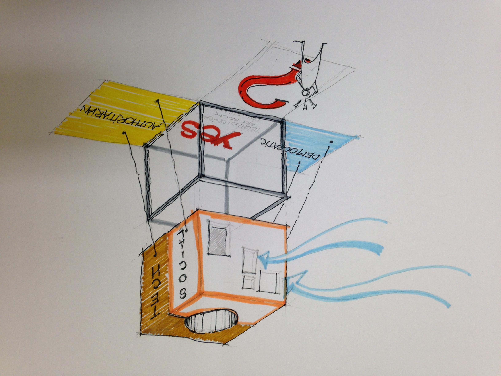
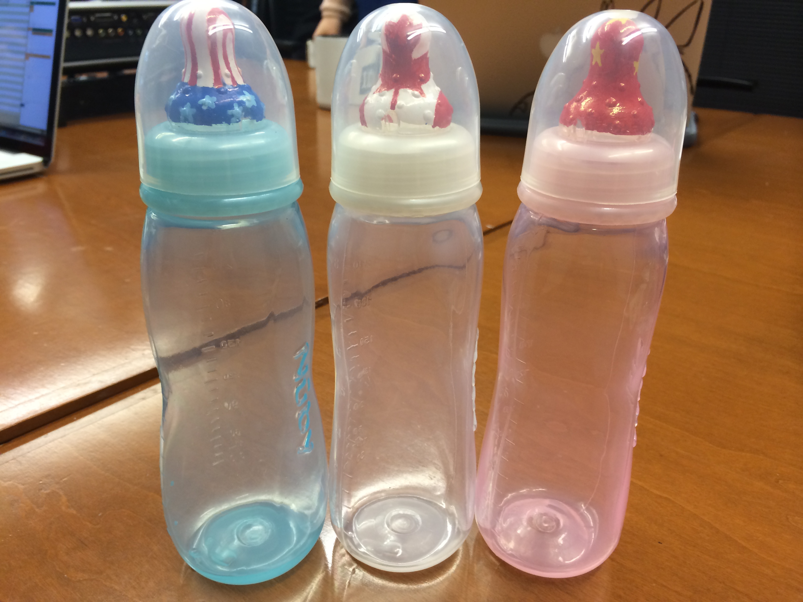
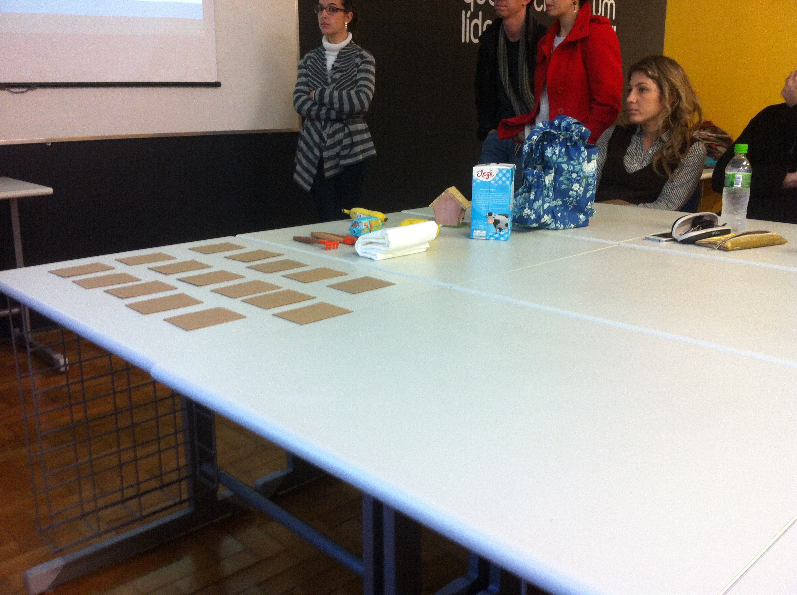
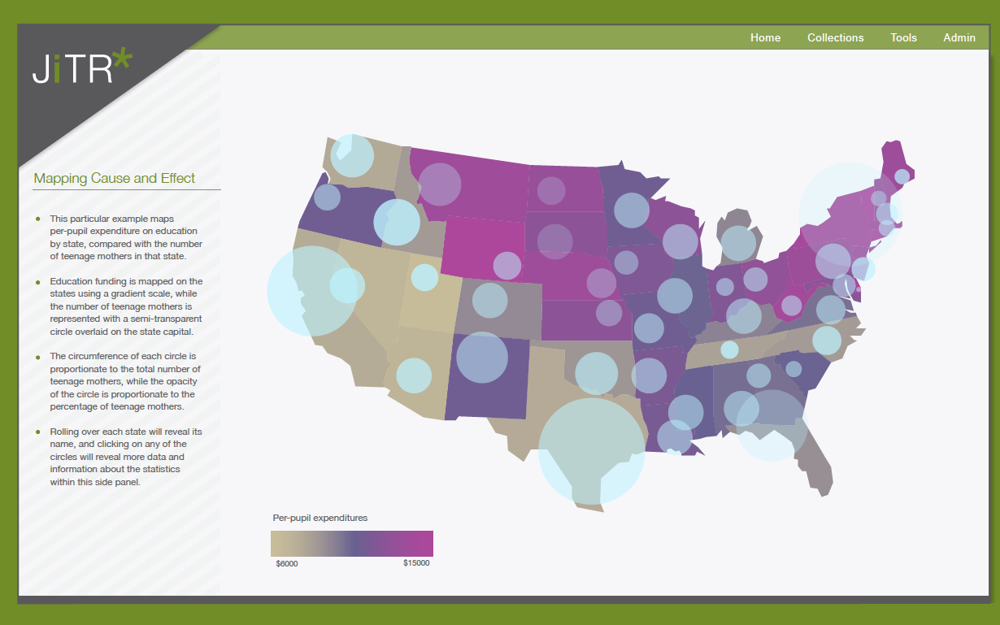
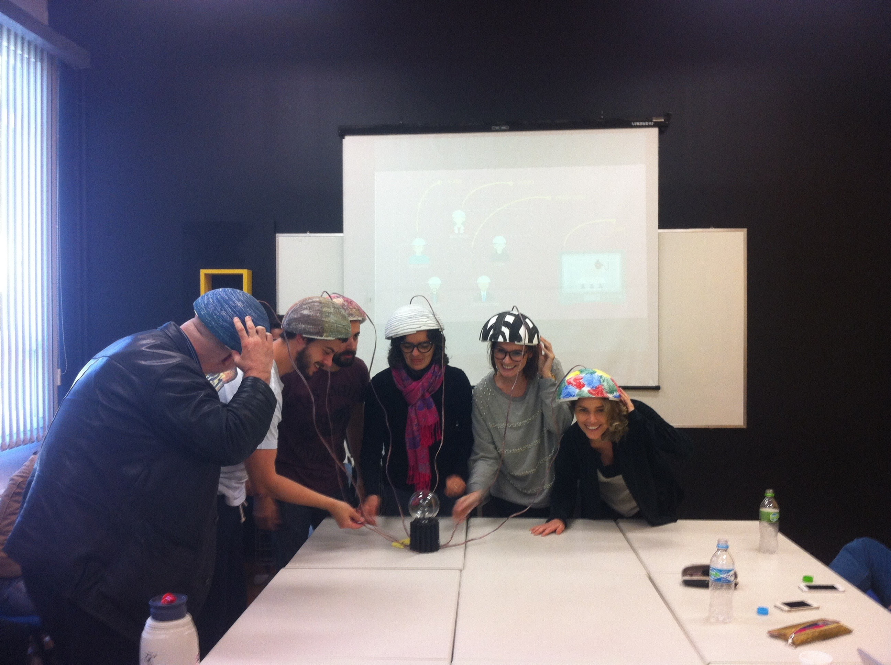
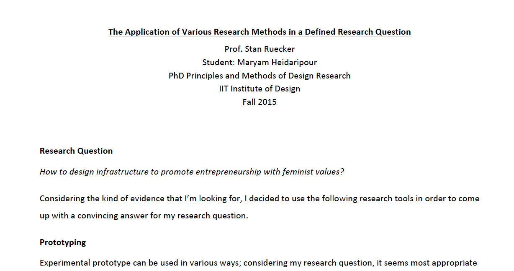
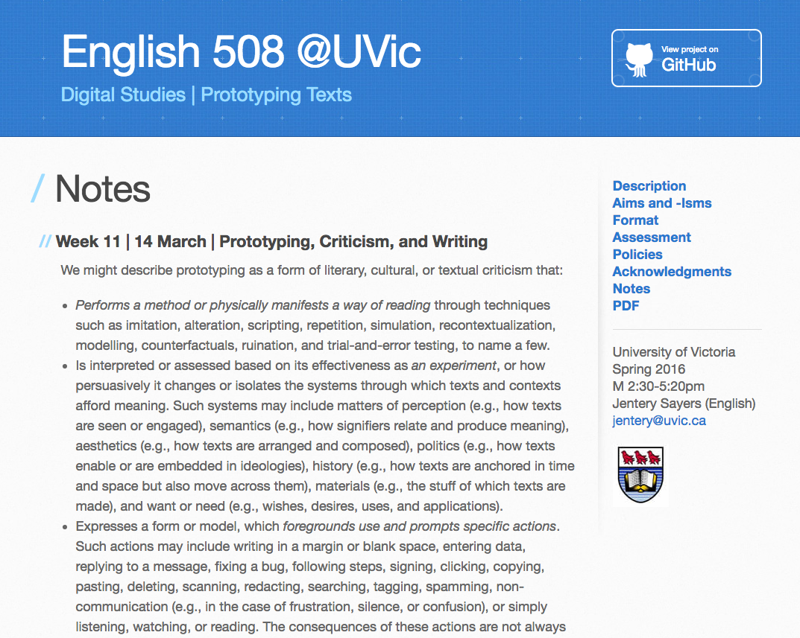

# PROTOTYPE

## Stan Ruecker ( [IIT Institute of Design](http://www.id.iit.edu)), Celso Scaletsky ([Unisinos](http://www.unisinos.br/design)), Guilherme Meyer ([Unisinos](http://www.unisinos.br/design)), Chiara Del Gaudio ([Unisinos](http://www.unisinos.br/design)), Piotr Michura ([Jan Matejko Academy of Fine Arts in Krakow](http://www.asp.krakow.pl)), and Gerry Derksen ([Winthrop University](http://www.winthrop.edu/cba/digitalinformationdesign/default.aspx?id=11776))

---

##### Publication Status:
* unreviewed draft
* **draft version undergoing editorial review**
* draft version undergoing peer-to-peer review
* published 

--- 

## CURATORIAL STATEMENT

# Why Students Need Prototypes: to engage with ideas 

Prototypes are provisional models of ideas that help us investigate, communicate, and remember specific aspects of those ideas. A prototype, like a design or a scenario, is a model of something that might exist in the future. The word "prototype" has two meanings: first, a prototype could be a template for copying; second, it could be an expression of some aspect of what might exist. For example, one series of physical prototypes might explore possible forms, while others might look at alternative finishes. One experience prototype might deal with what people will see, while another might focus on what they will hear. Computer scientists speak of horizontal vs vertical prototypes: the former shows all features, including those that cannot yet be used; the latter shows only some  features, but they are developed enough to try out. Many projects create T-shaped prototypes, where (on the crossbar of the T) everything is there at a superficial level, and some parts (the trunk of the T) work.

> MATT: can you explicate what you mean by "alternative finishes"? 
> Also, I'm not sure what "experience prototype" means; can you explain?
> Finally, the final sentence of this paragraph could use some minor rewriting for clarity, specificity, and style. What  do "everything," "superficial level," and "some parts" mean in this context?

Having students develop prototypes in the classroom is therefore a good way of having them engage with ideas. First, a prototype can be used for interrogating a concept. Second, it will involve a particular strategy for addressing the concept. This is important in its own right, but it is also useful for students who may not agree with the approach taken. Because they have seen one strategy, they can begin to think of others. Third, a prototype has specific details that can serve as topics for discussion. Fourth, as Dobson et al. (2015) point out, prototypes can also give us ideas about other concepts, because they start people thinking not just about the concept in front of them, but also adjacent ones.

> MATT: "Having students develop prototypes in the classroom is therefore a good way of having them engage with ideas." -- can you explicate this transition a bit? How does the last sentence in the previous paragraph lead logically into this one? 

Going further, we have argued (Ruecker and INKE 2015) that prototypes can be used for three different purposes, which are experiment, development, and provocation. They overlap a bit, but are distinct enough to provide some pins in the map. An experimental prototype is one created in order to get at ideas in the sense of concepts. For example, a researcher might be interested in the extent to which having a pre-assigned role in a game allows people to join more quickly in. To address this idea, one strategy would be to build a game where one version had pre-assigned roles, and another did not. By bringing in new players under both conditions and observing how long it takes them to get up to speed, the researcher might explore this research question.

> MATT: "get at ideas in the sense of concepts" is unclear
> MATT: please address the repetition of "researcher"/"research" in the final line 

By contrast, a development prototype for a game would be focused on ideas in the sense of attributes such as shape, color, materials, interactions, and so on. A development prototype is one in a series that will result in a polished version at the end (the template for copying). The rough drawings would get refined; the features would be formalized; there would need to be packaging and a catchy name and so on. None of those crucial issues for a development prototype are important for an experimental prototype, because the goals are different.

> MATT: "and so on" is a bit colloquial for this publication. Please revise.
> MATT: Can you take one more look at this to see whether you can better clarify the differences between experimental and developmental prototypes?

Finally, there are provocative prototypes (e.g. Mogensen 1992), which are intended to help people change their point of view, or perhaps even realize that they have one. Keywords related to provocative prototypes are speculative design, design fiction, and provotypes. In all of design, these activities are probably closest to the fine arts, while still remaining design. For example, Susana Soares has a series of laboratory glass diagnostic objects that incorporate living bees (http://www.susanasoares.com/index.php?id=56), since research has shown that they can be trained to smell a wide range of diseases at early stages.

> MATT: " In all of design" is a bit unclear/colloquial

Some people  might argue that all prototypes are part of a development process, and that the provocative ones are just closer to the beginning, followed by the experimental ones, and ending with the development ones. If that’s the case, and it could very well be, then not all projects involve all three kinds, nor should they.

# Why Graduate Students and Other Researchers Need Prototypes: to address research questions

In the sciences, researchers sometimes create a new research instrument (e.g. a neutrino microscope, which as far as we are aware has not yet been created) to try to learn more about the world insofar as it pre-exists to be studied. In the generative disciplines, however, the object of study does not yet exist to be examined, so the researchers have to first create it in some form. Most often, that form is a prototype.

> MATT: can you gloss "the generative disciplines" in a phrase offset by dashes?

What is interesting even beyond the generative disciplines, however, is that a new research question is something that does not yet exist. Although some people might argue that research questions are just waiting around to be discovered, in fact they need to be created.

For teachers or supervisors of graduate students who have to create research questions, prototypes offer a way of helping the students to more quickly focus. In this respect, a research question can be seen as a kind of generative knowledge, by which we mean that the goal of the prototype is to take some thinking that is not yet ready for prime time--perhaps just a topic idea, or a not-so-good question--and iterate it into a better one. More specifically, we've found that this exercise can help students bridge from a broad topic area into more specific detailed questions, which is something that many graduate students struggle to do.

> MATT: "ready for prime time" is a bit colloquial

In the case of experimental prototypes to help us create and iterate research questions, the features of the prototype should express or embody or reify specific aspects of the research question. Within this over-arching approach, we also need to decide how best to learn from the prototype once it exists. We have to date identified three possibilities:

> MATT: "In the case of experimental prototypes to help us create and iterate research questions" -- awk -- please rephrase

1. Prototype to be used by other people. 
  * We design a system and get a lot of people to try it, observe them, vary the parameters, try again. With each variation, we are modifying and hopefully improving the research questions.

2. Prototype as tool for thinking. 
  * We learn a lot about the topic just by designing the system and thinking about it once we have it in front of us.
  * We learn something further by observing one group using it.
  * We don’t even finish designing the system, but learn from the process of designing the first iterations.

3. Prototype as a model of the topic area. 
  * By creating a diagram or object that represents our understanding of a topic, we can begin to pinpoint areas of particular interest.

# Principles of Curation
Our goal in selecting these materials was to provide as wide a range as possible of examples where prototypes are used in the classroom, whether with undergraduate students (section 1) or graduate students (section 2). In addition, we looked for opportunities to show how prototypes can be useful for all kinds of students, and not just for students in design or other disciplines that are more familiar with the production of generative knowledge.

## CURATED ARTIFACTS

##  Assignments Primarily for Undergraduate Students

### "Prototypes as Steps Toward Production"

* Type: Assignment
* Copy of the artifact: 
* [http://interactives.artsrn.ualberta.ca/?page_id=145] (http://interactives.artsrn.ualberta.ca/?page_id=145)
* MA students in Humanities Computing, University of Alberta, Edmonton

When most people hear the word "prototype," this is the kind that comes to mind. The students are tasked with solving a problem, and create a series of prototypes that increasingly converge on a solution. The primary goal is to address the design brief, rather than inform a research question. 

However, there can be other goals as well. In this example, teams of incoming MA students in the University of Alberta HuCo program were asked before the first term began to create an augmented reality game (ARG). The goal of the assignment is to introduce them in a hands-on way to many of the concepts, technologies, and challenges that will be dealt with throughout their coursework. It is to whet their appetites, to provide context, for what they will soon learn in more depth.

They only have one week to work on the project, so the teams work quickly, creating early concept sketches and designs for prototypes of the games that they then iterate until they can be tried out. This photo shows the screen for a game to help new students learn about the campus.

# "Prototypes as Models of Article Content"

* Type: Assignment
* Copy of the artifact: 
* MDes students, Unisinos, Porto Alegre, Brazil

A prototype is a kind of model, and in this case the assignment is to create a prototype that models the contents of an academic article. The class will have previously read the paper; the content model is sketched or built in order to facilitate discussion. In this image, the students were discussing Winner's chapter "Do Artifacts Have Politics." They broke into small groups to do the exercise, then came back to the large group for each team to lead a discussion of the prototype they had created. 

This image shows a model where the reader is standing with the opening question in front of the argument, which is represented as a two-storied building. There is only one answer possible--yes--but the implications afterward vary. There are different aspects to politics, and at the second level, there are both technical and social dimensions. Finally, there are less substantial but still significant influences coming through the windows like breezes.

For some students, the models might look more like graphic facilitation, where conventional symbols such as boxes and arrows are combined with text and representations of people or settings; for other students, the models might be diagrams like mind maps that group the various topics; for still others, the models could be structured in a way that is emergent from the content.

# "Prototypes Responding to an Article"

* Type: Assignment
* Copy of the artifact: 
* Xinyue Zhou, MDes student, IIT Institute of Design, Chicago

For this assignment, students are asked to read a paper, then create a prototype that can help the class think about the implications of the topic. In this case, the students had read Langdon Winner's (1986) chapter "Do Artifacts Have Politics?" in The Whale and the Reactor, but any article will do. The exercise has several steps that can be spread over multiple weeks: (1) discuss the paper (2) generate sketches for at least 3 concepts (3) produce a prototype of the selected concept (4) revise the prototype based on feedback.

The "baby bottles" interrogate the idea of teaching children about national identity. It is an inevitable process, but how soon is too soon? The student originally placed the flags on the body of the bottle, but in her revision she moved them to the nipple, since it is more clearly about the child. Flags on the bottom of the bottle would be there for the parents to see. She used 3 different flags to encourage us to think about how these artifacts would be received in different countries.

# "Prototypes to Strengthen Empathy"

* Type: Assignment
* Copy of the artifact: 
* MDes students, Unisinos, Porto Alegre, Brazil

In this project, students are asked to design a prototype that will give its users an experience analogous to an actual experience, in order to gain additional understanding.

For this example, the students created a paper prototype consisting of a "memory game" where cards placed face down need to be paired with cards drawn from a pack.

This team was interested in the obstacles preventing children in under-resourced communities from getting to school. Pairs of cards included "have to look after my younger sibling", "need to get food," "have to earn money to support the family" and so on.

However, there was a card in the pack labeled "go to school" which had no partner in the cards that were face down on the table. Their idea was that the frustration experienced by the players as they were repeatedly confronted with obstacles but could never actually get to school would be instructive.

# "Prototyping Experience"

* Type: Assignment
* Copy of the artifact: 
* MDes students, IIT Institute of Design, Chicago

Although a prototype to help increase empathetic understanding is one form of experience prototype, it is not the only form. In this assignment, students were asked to design a positive experience for people interested in thinking about issues of sustainable innovation.

The game involved 2 teams, each given a brief about a sustainability project that they had to sell to stakeholders. My team had to pitch local production for McDonalds; the other team got new cell phones from Motorola that had readily serviceable parts. 

The stakeholders were randomly chosen: a child, a senior, parents, the c-suite, a lawyer. Finally, the teams had to use a mode of communication, determined by rolling the die: drawing, acting, singing, rapping. If the other team voted that the pitch was convincing, the presenters got to roll a different die to move their piece on the game board. Even choosing which team got to go first was fun—we did it by thumb wrestling.

# "Bringing Aspects of Research Prototyping into the Classroom"

* Type: Exercise
* Copy of the artifact: 
* [files/prototype--DH_structured_surface.pdf](files/prototype--DH_structured_surface.pdf)
* Milena Radzikowska 

Teaching an information design course to students in a communications program, Dr. Radzikowska at Mount Royal University in Calgary has integrated an exercise in the design of prototype information visualizations. The exercise is keyed to current research projects in the digital humanities. In this version of the syllabus, the students could choose between two DH experiments. The first was in structured surfaces, where a data visualization (like a map, for example) is used as the basis for an argument that is made by superimposing additional information (like pins into the map). The second was in attempting to accommodate big data on a wall-sized display.

##  Assignments Primarily for Graduate Students Doing a Thesis
# "Prototypes for Developing a Research Topic"

* Type: Assignment
* Copy of the artifact: 
* MDes students, Unisinos, Porto Alegre, Brazil

This exercise is for graduate students developing a thesis topic. They are asked to create a prototype whose features can help them think about specific aspects of the research question.

In this case, a student team was asked to design a prototype related to the question: "how can the interpretation of the user more clearly match the intention of the designer?"

Their response was that a design process that gave the designer more insight into the user's thinking would help. The prototype imagines telepathic communication among stakeholders, each of whom is wearing a different hat. 

Thinking about what this kind of mental contact would mean led the team to realize that the process is not about perfect knowledge of the user, but instead about negotiation.

# "Prototypes as Objects of Study"

* Type: Assignment
* Copy of the artifact: [files/prototype--4-research-tools.pdf](files/prototype--4-research-tools.pdf)
* Maryam Heidaripour, PhD student, IIT Institute of Design, Chicago

In the sciences and social sciences, researchers must occasionally design research instruments that will help them to investigate an existing object of study. For example, if we want to know about people's opinions, we can design an opinion survey. If we want to know about the ether, we design the Michelson-Morley experiment.

For many disciplines, however, the object of study does not yet exist--it is a possible future. In this assignment, PhD students are asked to design a set of research tools consisting of a prototype, pilot study, experimental design, and quasi-experimental design (which mines existing data for factors that would have been controlled had the researcher set up the original study).

# "Prototyping Texts"

* Type: Syllabus
* Copy of the artifact: 
* [http://jentery.github.io/508/notes.html](http://jentery.github.io/508/notes.html)

In his English 508 course at the University of Victoria, Jentery Sayers asks the students to go through a series of exercises in learning about text through deformation:
"Our aim, then, will not be to "prove" anything about literature and culture. It will not be build tools, reveal networks, learn some code, or share whiz-bang visualizations, either. It will be to design and make texts differently, to better understand their significance by not only refusing to take them at face value (a hermeneutic impulse) but also prototyping what else they could be (a design impulse)."

# "Science Fiction to Science Fabrication"

* Type: Syllabus
* Copy of the artifact: 
* [http://scifi2scifab.media.mit.edu/syllabus-3/] http://scifi2scifab.media.mit.edu/syllabus-3/)
* Sophia Brueckner and Dan Novy

A slightly more advanced version of the exercise of responding to an article with a prototype, this course (alternatively titled "pulp to prototype") has students respond to science fiction with a prototype. The students have a series of readings, some novels and some short stories, organized by topic (e.g. nanotech, cyborgs), and are asked to prototype some of the science fiction ideas.

## RELATED MATERIALS
The prototyping exercises we've described can be done in a variety of ways--as sketches on paper, with physical materials, as software, or using electronic hardware. Here we list some useful resources for software and hardware projects.

* https://balsamiq.com/
* https://marvelapp.com/
* http://d3js.org/
* https://www.makerbloks.com/en/
* http://littlebits.cc/bitcraft
* http://www.makeymakey.com/
* https://www.arduino.cc/
* https://www.raspberrypi.org/products/raspberry-pi-2-model-b/

## WORKS CITED
Dobson, Teresa M., Monica Brown, Dustin Grue, Ernesto Peña, Geoff Roeder, and the INKE Research Team (2015). The Interface Implications of Understanding Readers. Special Issue: The Future of Reading. Ed. Stan Ruecker. Interdisciplinary Science Reviews 40.1 (March).
Galey, Alan, Stan Ruecker, and the INKE Research Group. “How a Prototype Argues.” Literary and Linguistic Computing. 25(3). 2010.
Meyer, Guilherme, Chiara Del Gaudio, Stan Ruecker, Piotr Michura, and Celso Carnos Scaletsky (2016). ”Learning to Create Prototypes to Address Research Questions.” Proceedings of the International Conference on Educational Technology Research, Izmir, Turkey. Feb 11-13, 2016.
Mogensen, P., (1992). “Towards a Provotyping Approach in Systems Development,” Scandinavian Journal of Information Systems 4(1): Article 5.
Ruecker, Stan and the INKE Research Group. “A Brief Taxonomy of Prototypes for the Digital Humanities.” Scholarly and Research Communication. 6(2), 2015.
Scaletsky, Celso, Santosh Basapur, and Stan Ruecker. “The Generative Similarities of Designs, Prototypes, and Scenarios.” Proceedings of the 11th Annual Research and Development + Design Conference (P&D Design 2014).  Sept 29-Oct 12, 2014. Gramado, Brazil.
Winner, Langdon. (1986). “Do Artifacts Have Politics” In The Whale and the Reactor: A Search for Limits in an Age of High Technology. Chicago: University of Chicago Press.