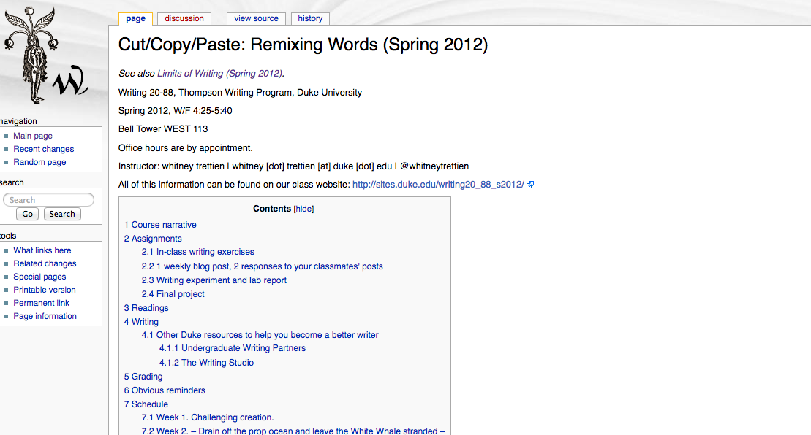
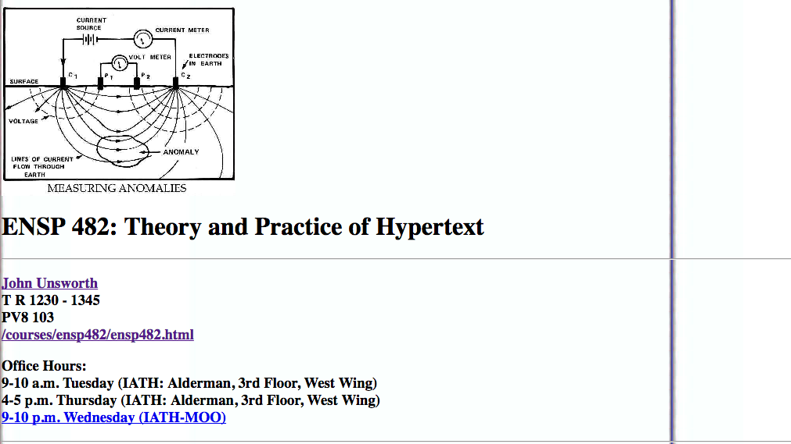
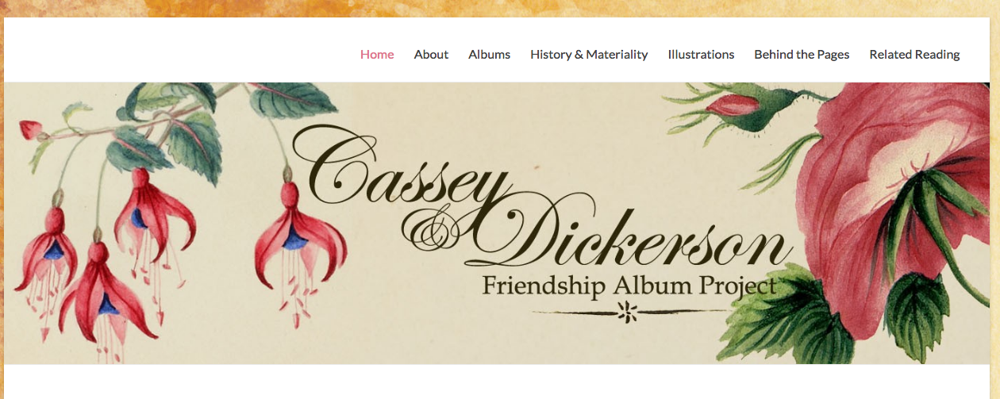
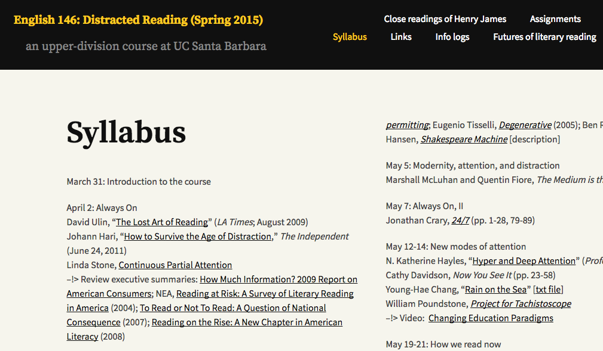
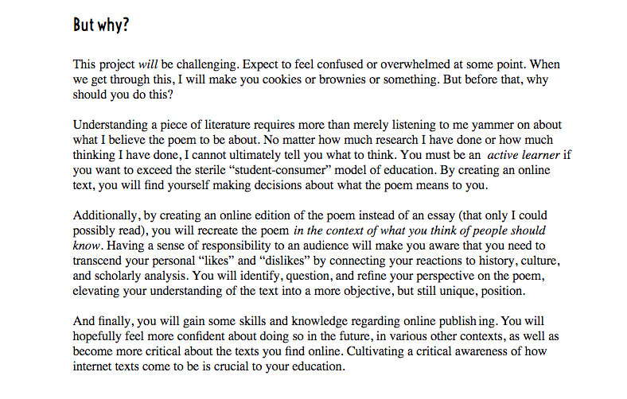
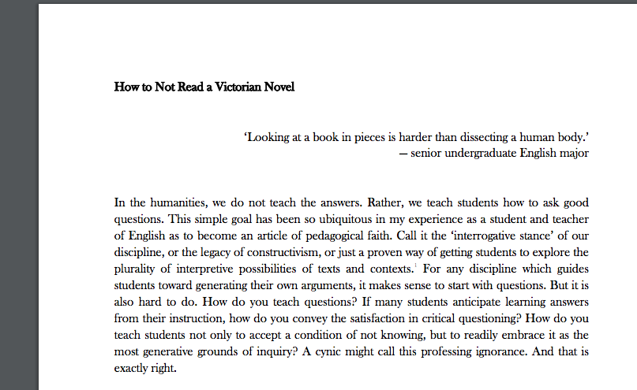

# READING (draft)

## Rachel Sagner Buurma
Department of English Literature | Swarthmore College | [Website](http://rachelsagnerbuurma.org/)

---

##### Publication Status:
* unreviewed draft
* draft version undergoing editorial review
* **draft version undergoing peer-to-peer review**
* published

---

#### Tags: text, reading, history, collaboration, classroom

---

## CURATORIAL STATEMENT

In the beginning, we learn to read; after we are literate, we read to learn. In this received wisdom of early childhood education, reading is only temporarily difficult, material, intractable; afterwards, it recedes into the background, becoming the transparent skill through which we access worlds of knowledge. But we are in fact always learning to read and always learning about reading as we encounter new languages, genres, and forms, and mediums.

How we learn about reading's past, present, and future seems especially important right now. Reading has been transformed by digital media and computation, by the computer screen and the e-reader--just as it was by the advent of machine printing, by the Gutenberg press, by advances in manuscript production, and by the shift from scroll to codex, as well as by social and historical changes in everything from the economics of book production to literacy and access to education. According to the most anxious reports, the advent of the screen is destroying our ability to read deeply, slowly, and linearly. "It is a cliché universally acknowledged," writes Rita Raley in the introduction to her "Distracted Reading" syllabus,

> that we (where “we” means, variously, the Twitter generation, the Millennial generation, participants in the Network Society) no longer read, or if we do read, we read poorly, with insufficient attention and affect. Reading, by which is meant literary reading, is said to be a “lost art” and certainly “at risk.” We multitask and thus cannot sustain the kind of focus and attention required for a long, complex narrative.

Of course, as students of reading hastily reply, we have always read discontinuously, extensively, and intermittently as often as we have read in long uninterrupted stretches and intensively. Accordingly, all of the syllabi and assignments featured and referenced here--nonlinear reading via hypertext, commonplacing in digital form, the digitalization of nineteenth-century marginalia--alight on our current moment in the history of reading as an opportunity to rethink reading's history. Each seeks to take the measure of the continuities and discontinuities between the codex's page and the page on the screen.

In *Book Was There: Reading in Electronic Times*,  Andrew Piper offers one compelling description of how we imagine this continually-ramifying difference between the book and the digital text:

> If books are essentially vertebral, contributing to our sense of human uniqueness that depends upon bodily uprightness, digital texts are more like invertebrates, subject to the laws of horizontal gene transfer and nonlocal regeneration. They, like jellyfish or hydra polyps, always elude our grasp in some fundamental sense. What this means for how we read -- and how we are taken hold of by what we read -- is still far from clear. (2-3)

The fundamental uncertainty over what it means to add the distributed electronic text to an ecosystem of literary reading  previously defined by the "vertebral," bounded book (not to mention the printed form, the magazine, the newspaper, the manuscript, and the typescript) leads to a new pedagogical challenge for teachers whose fundamental charge is to teach students "how to read": how do we begin to teach students to understand the relationship between page and screen if we have only begun to grasp it ourselves? Thinking about the power dynamics of reading in *Jane Austen and the Secret of Style*, D.A. Miller notes the dangers of "being read reading"(2). Reading in the digital age reduces none of these complications of reading's relation to identity and survival, but it raises yet another specter: the possibility that we are "being read" as data by machines as well as by humans.

Machine reading has a longer history than we sometimes assume. Work on the nineteenth- and twentieth-century history of [talking books](https://audiobookhistory.wordpress.com/author/mattrubery/) and [other reading machines](https://soundstudiesblog.com/2015/01/05/optophones-and-musical-print/) shows how [reading technologies developed to convert text into sound for blind readers](http://maker.uvic.ca/schema/) questioned assumptions about the nature of reading while also contributing to the development of machine reading technologies like optical character recognition (OCR). In the realm of literary interpretation as "reading," of course, Stephen Ramsay has famously emphasized the continuities between human and machine. For Ramsay, literary criticism already contains "elements of the algorithmic." Both machine and literary-critical reading have in common a tendency towards strict repetitive protocols:

>Any reading of a text that is not a recapitulation of that text relies on a heuristic of radical transformation. The critic who endeavors to put forth a “reading” puts forth not the text, but a new text in which the data has been paraphrased, elaborated, selected, truncated, and transduced. This basic property of critical methodology is evident not only in the act of “close reading” but also in the more ambitious project of thematic exegesis. In the classroom one encounters the professor instructing his or her students to turn to page 254, and then to page 16, and finally to page 400. They are told to consider just the male characters, or just the female ones, or to pay attention to the adjectives, the rhyme scheme, images of water, or the moment in which Nora Helmer confronts her husband... (*Reading Machines: Towards an Algorithmic Criticism*, 16)

Many of the assignments collected here show us this continuity in action. Whether they ask students to keep a commonplace book on a Pinterest board or teach close reading through Markdown encoding, each reveals how the protocols of historical readers and reading communities find affinities with or form the origins of computational or digital forms.

The study of reading's history spills outside traditional boundaries of discipline and department, and takes place in special collections library reading rooms and digital studies labs as well as classrooms. The course on the history of reading in the west from scroll and codex to the ebook and computer screen is a genre in its own right; examples are Ann Blair's [History of the Book and of Reading](http://sites.fas.harvard.edu/~hist1318/), Timothy Burke's [The History of Reading](http://blogs.swarthmore.edu/burke/syllabi/history-62-the-history-of-reading-spring-2012/), and Adrian Johns's [A History of Reading](http://home.uchicago.edu/~johns/historyofreading). But the pasts, presents, and futures of reading make their way into a much wider range of syllabi, appearing in classes on topics ranging from literature, book history, and digital humanities to user experience and web design, cognitive science, and library and information science. I should note that I have adhered fairly strictly the the "digital pedagogy" rubric here, thus omitting important history of reading assignments like Sarah Werner's ["Your book's early readers and users"](http://sarahwerner.net/FolgerBooks/wp-content/uploads/2015/06/Assign3-early_users.pdf) and materiality of reading assignments like Jeffrey Makala's ["Reading By Candlelight"](https://www.academia.edu/11406932/Ways_of_Reading_Assignment_SCHC_454) as well as crucial guides like [How to Read in College](https://blogs.swarthmore.edu/burke/permanent-features-advice-on-academia/how-to-read-in-college/) and [Methods for Studying Online Materials](http://english197s2015.pbworks.com/w/page/93938240/Required%20Texts#methods).

The following exercises, projects, and resources bring the continuities and disjunctions between print and digital forms to the fore, and ask students to interrogate cultural messages and social assumptions about reading--their own and others'--by historicizing reading, reflecting on their own modes of engaging with texts on and offline, and speculating on the futures of reading.  These assignments rise to the challenge of grappling with reading today by taking hold of one of the most longstanding, traditional aspects of humanities pedagogy: the classroom's role as a place where students and teachers both create *and* transmit new knowledge together. Just as digital technology and social media have given the collective aspects of reading a new visibility (if also a new ephemerality)--we can turn on social highlighting on our e-readers, comment on blog posts, or socially bookmark--so too has digital pedagogy brought a new kind of visibility to the longstanding practices through which students and teachers have created knowledge together in the classroom. Whether they imagine reading as distracted, discontinuous, materialized, black-boxed, close, distant, human, or mechanical, these assignments work to reveal that reading is social even when it feels most solitary. Whether we read alone in front of  a screen, aloud in a mosque, or silently in a crowded library, they show us, the practices of reading are always both material and collective.

## CURATED ARTIFACTS

### Topic: Discontinuous Reading

### Cut/Copy/Paste: Remixing Words

* Artifact Type: Syllabus
* Source URL: [http://whitneyannetrettien.com/whiki/index.php?title=Cut/Copy/Paste:_Remixing_Words_(Spring_2012)](http://whitneyannetrettien.com/whiki/index.php?title=Cut/Copy/Paste:_Remixing_Words_(Spring_2012))
* Artifact Permissions: CC BY-NC-SA 3.0
* Copy of the Artifact:
* Creator and Affiliation: [Whitney Ann Trettien](http://whitneyannetrettien.com/), University of North Carolina at Chapel Hill

Whitney Ann Trettien's "Cut/Copy/Paste: Remixing Words" (Duke University, Spring 2012) unsettles the apparent opposition between writing and reading, explaining to her students that "you cannot read the texts of this class without, in some sense, writing them, and we'll spend a good deal of time doing both in and out of class." Her syllabus traces the history of readers who have remixed old texts to create new experimental writing, inviting her students to from Latin cut-up poems to seventeenth-century German paper instruments to generative computer programs. Trettian's readings and exercises insistently emphasize the materiality of both page *and* screen, expertly preempting the inscription of a material/dematerialized divide between the printed and the digital book, an especially tricky aspect of digital pedagogy. The brief, specific exercises - including instructions to excerpt, extract, cut up, collage, and auto-generate writing via both human and machine - could be integrated into anything from a first-year writing class to an upper-level history of reading or literature class to help students think about the materiality of reading and writing.

### Theory and Practice of Hypertext

* Artifact Type: Syllabus
* Source URL: [http://www2.iath.virginia.edu/courses/ensp482/syllabus.html)](http://www2.iath.virginia.edu/courses/ensp482/syllabus.html)
* Artifact Permissions: contacting author, will update
* Copy of the Artifact:
* Creator and Affiliation: [John Unsworth](http://people.brandeis.edu/~unsworth/), Brandeis University

Hypertext was revelatory to scholars in the humanities because it held out the possibility of rendering visible the interconnected webs of citations scholars see when they read. Courses on hypertext genres proliferated in the 1980s and 1990s--from the several still (precariously) preserved online, it's likely that scores of these courses existed. John Unsworth's ENSP 482: Theory and Practice of Hypertext (University of Virginia, Spring 1999) introduces students to the possibilities of discontinuous, non-narrative, online reading and writing.  The course begins with a brief history and how-to, moves through hypertext classic texts, and includes several weeks of project-based work before finishing with an investigation of emerging hypertext genres (critical, creative, autobiographial). Searching for hypertext course syllabi provides a sharp reminder us of how badly preserved and quickly lost the artifacts of digital teaching often are, and of how important it is that we work to preserve and *contextualize* our digital pedagogy materials if we want them to be around for future students, teachers, and scholars.  Most citations or links to hypertext syllabi or assignments I could find were broken, and the student projects linked from course websites seem to have an even lower survival rate. Unsworth's syllabus offers a useful survey of hypertext theory and practice that would be a useful addition to courses on electronic literature, the history of narrative, or the introductory or history weeks of an intro to digital humanities class; it would make compelling reading for any methods of literary study class examining citation practices.

### The Commonplace Book Assignment

* Artifact Type: Assignment
* Source URL: [http://jitp.commons.gc.cuny.edu/the-commonplace-book-assignment/](http://jitp.commons.gc.cuny.edu/the-commonplace-book-assignment/)
* Artifact Permissions: CC BY-NC-SA 3.0 US
* Copy of the Artifact:
* Creator and Affiliation: [Vimala Pasupathi](https://vcpasupathi.wordpress.com/), Hofstra University

This assignment reimagines the short close reading paper as a commonplace book. Early modern readers often copied out passages from their reading into notebooks to make a personal repository of extracts for future reference. Vimala Pasupathi writes in her write-up of this assignment that  "it seems to me that there is no better way to teach students about the consumption of literary works and textual forms than to have them assemble their own Commonplace books."  Connecting early modern commonplacing to contemporary uses of Pinterest and Tumblr, Pasupathi asks students to create their own commonplace book by copying out weekly passages from the assigned Shakespeare play and writing paragraph-long close readings of each passage using in "a hard-copy diary of sorts, or on the web as a blog, Tumblr, or Pinterest page."  This assignment asks students to read work by Adam Hooks and Alan Jacobs on commonplace books. Another version of the assignment might also ask students to look first at [digitized commonplace books](http://ocp.hul.harvard.edu/reading/commonplace.html) like those in the "commonplace books" section of the online exhibit *Reading: Harvard Views of Readers, Readership, and Reading History* as examples. The assignment could be easily adapted to any class taking up questions of collection, quotation, or close reading, whether centered on early modern culture or not, though it gains extra meaning in the context of a class on modern reading practices. In an upper-level undergraduate or a graduate class, this assignment could scale all the way up to asking students to build and maintain a commonplace book of research or open research notebook on the model of [Whitney Ann Trettien's](http://whitneyannetrettien.com/whiki/index.php?title=Main_Page), [W. Caleb McDaniel's](http://wiki.wcaleb.rice.edu), or [Shawn Graham's](http://shawngraham.github.io/).

### Cassey Dickerson Friendship Album Project

* Artifact Type: Assignment
* Source URL: [http://lcpalbumproject.org/](http://lcpalbumproject.org/)
* Artifact Permissions: Creative Commons Attribution 4.0 International License
* Copy of the Artifact:
* Creator and Affiliation: [Cassey Dickerson Friendship Album Project Team](http://lcpalbumproject.org/?page_id=10), the Library Company, Swarthmore College, Bryn Mawr College, Rochester Institute of Technology, and Rutgers University

This site includes a collaboratively-created digital edition of the nineteenth-century friendship album of Amy Matilda Cassey, a prominent member of Philadelphia's black middle class. As the site notes, Cassey is a significant figure in part because she was was an active member of "the Philadelphia Female Antislavery Society, local black literary and debating societies, and other reform movements;" her album "is filled with calligraphed poems, inscriptions, essays sketches and watercolors which illuminate and further document the active and intimate connections of Philadelphia’s black leaders to a larger network of activists and reformers" including contributions from Sarah Mapps Douglass, Margaretta Forten, Frederick Douglass, William Lloyd Garrison, and Wendell Phillips. The extensive annotations on the Cassey album were created by the [Early African American Print Cultures class](http://lcpalbumproject.org/?page_id=173) of Swarthmore professor Lara Cohen in collaboration with Library Company’s Curator of African American History Krystal Appiah. The work of metadata creation, transcription, and annotation prompted the students to think in sustained ways about the remediations involved when the historical records of private reading and writing are transformed in order to allow, in the words of the students' unpublished research narrative, "public readerships to find significance in private networks." An example of project-based learning, the digitized, transcribed, and annotated albums could also form the basis of assignments on the history of reading, print circulation, and the digitization of archival materials. In addition to serving as a model for project-based work at the undergraduate level, this project could engage secondary school students. The [Abolition Seminar] includes [a lesson plan](http://www.abolitionseminar.org/wp-content/uploads/2015/09/Lesson-7-Exploring-African-American-Albums-COMPLETE.pdf) for middle and high school students asking then to explore the Cassey album and use it as as a model to create their own fictional album for a historical figure.

http://www.abolitionseminar.org/wp-content/uploads/2015/09/Lesson-7-Exploring-African-American-Albums-COMPLETE.pdf

### Topic: Distracted Reading

### Distracted Reading

* Artifact Type: Syllabus
* Source URL: [https://engl146dr.wordpress.com/](https://engl146dr.wordpress.com/)
* Artifact Permissions: contacting author, will update
* Copy of the Artifact:
* Creator and Affiliation: [Rita Raley](http://raley.english.ucsb.edu/), University of California - Santa Barbara

In this syllabus, Rita Raley asks students to reflect on a series of large questions about the present of reading. Contrasting the kind of reading we do when we consume information or entertain ourselves online with the purportedly deep, close reading demanded in the literature classroom, Raley asks:

> What are the different modes of reading and what is their relationship to different media environments? How do contemporary works of print and electronic literature both reflect and anticipate different modes of reading? What is the place of “close reading” – still the most important basic skill taught to English majors – in a complex media ecology that encourages skimming, browsing and watching? How can we meaningfully situate our own reading practices within that same media ecology? Is all reading now distracted reading and, if so, can we still speak of rigor?

Working through different aspects of debates over and discourse about contemporary reading practices as well as turning back to historicize earlier modes of attention to the page, Raley's syllabus models the transformation of a  binarized classroom battle over students' attachment to screens vs professorial desire for deep engagement with the printed text into a generative, collaborative pedagogical undertaking.  The syllabus offers a number of extractable clusters of readings that might fit into a more general history of reading, of the book, or of electronic literature syllabus. The syllabus might also make a compelling reference for students who want to know about the debates behind something like a syllabus's policy on the use of technology in the classroom.

### Topic: Historical Traces

### Book Traces

* Artifact Type: Assignment
* Source URL: [https://hawksites.newpaltz.edu/dhm293/online-assignment-3-book-traces/](https://hawksites.newpaltz.edu/dhm293/online-assignment-3-book-traces/)
* Artifact Permissions: contacting author, will update
* Copy of the Artifact:
* Creator and Affiliation: [Annie Swafford](https://annieswafford.wordpress.com/),  SUNY - New Paltz

In this assignment, undergraduates learn from and contribute to [Book Traces](http://www.booktraces.org/), a project that crowdsources records of marginalia from nineteenth-century books from the open stacks of libraries. It asks students to search the library catalog, locate physical books on the shelf, page through them to find marginalia, photographically document it, and finally write a short blog post explaining "what the traces have to do with the topic of the book and the pages on which they appear." The assignment also builds in an option for students who fail to find marginalia, directing them to"explain what search terms you used to find 19th century books, give some sample titles of books you looked at, and give some guesses about why books with your selected topic does not include any evidence of earlier readers." Connecting the digital library catalog with the book on the shelf and the process of digital documentation with the study of paleography, the assignment gives students a very concrete way to think about continuities and discontinuities between the annotation and documentation practices of nineteenth-century readers and their own. This assignment could be remixed or rethought to consider the traces in and of the digital facsimile, perhaps via [The Art of Google Books]http://theartofgooglebooks.tumblr.com), a Tumblr documenting the idiosyncratic materialities of facsimiles in Google Books, from the pressed flower and scribbled inscription to the library circulation slip and the hand of the scanning technician.

### Reading Experience Database UK (UK READ)

* Artifact Type: Database
* Source URL: [http://www.open.ac.uk/Arts/reading/UK/index.php](http://www.open.ac.uk/Arts/reading/UK/index.php)
* Artifact Permissions: open-access database
* Copy of the Artifact:
* Creator and Affiliation: [UK RED Project Team](http://www.open.ac.uk/Arts/RED/team.htm), The Open University

UK RED "is an open-access database housed at The Open University containing over 30,000 easily searchable records documenting the history of reading in Britain from 1450 to 1945. Evidence of reading presented in UK RED is drawn from published and unpublished sources as diverse as diaries, commonplace books, memoirs, sociological surveys, and criminal court and prison records." A mine of primary material with about reading including careful metadata about reader, author, text, and place, the growing UK RED database could be the basis for assignments comparing the reception history of a single text across time, tracking the reading of individual readers, or looking at many readers' responses to a single text.

### Infinite Ulysses

* Artifact Type: Database
* Source URL: [http://www.infiniteulysses.com/](http://www.infiniteulysses.com/)
* Artifact Permissions: CC BY-NC-SA 3.0
* Copy of the Artifact:
* Creator and Affiliation: [Amanda Visconti](http://www.amandavisconti.com), Purdue University

Scholars and students of the history of reading have disproved - over and over again - Benedict Anderson's famous description of reading as something that, despite its social function, takes place "in silent privacy, in the lair of the skull" (34-35). Digital platforms, tools, and practices have made reading's public effects and traces more accessible than ever, both by providing new ways for readers to intentionally capture and share comments and conversations (comment functions, annotation apps, social bookmarking, and article sharing) and by the sometimes less intentional and desirable capture of our reading histories by our web browsers. Amanda Visconti's  Infinite Ulysses - which began [as a dissertation](http://literaturegeek.com/tag/infinite-ulysses/) - offers the basis for many possible assignments in which students might help socially annotate Joyce's famously difficult book. But it also acts as a model for other possible annotation projects. Asking students to use hypothes.is to collectively annotate a course reading as Jack Dougherty does in his [How to annotate with Hypothes.is assignment](http://commons.trincoll.edu/cssp/seminar/annotate-with-hypothesis/), or designing [an assignment in which students create plain-text footnotes for a chapter of a contemporary novel](https://lauraheffernan.files.wordpress.com/2013/02/lit-4093-footnote-assignment.pdf) as Laura Heffernan does in her [21st-Century Literature](https://lauraheffernan.wordpress.com/teaching-2/) course are other ways one could capture the spirit of *Infinite Ulysses* in a lightweight assignment.

### Topic: Machine Reading and Human Reading

### Digital Markdown Edition of a Poem

* Artifact Type: Assignment
* Source URL: [https://www.academia.edu/5947912/Assignment_Markdown_Digital_Edition_of_a_Poem](https://www.academia.edu/5947912/Assignment_Markdown_Digital_Edition_of_a_Poem)
* Artifact Permissions: contacting author
* Copy of the Artifact:
* Creator and Affiliation: [Shawna Ross](http://www.shawnaross.com/),  Texas A & M University

Ross's digital edition assignment asks students to think about active reading. Students choose a poem from the class syllabus and create a full digital edition ready for online publication, including careful transcription of the poem, author biography, bibliography, introduction to the poem’s cultural and historical contexts, and at least fifteen word annotations. Asking students to "think beyond the word processor," Ross creates an additional layer of engagement by requiring that the text be Markdown-formatted, an aspect of the assignment that requires students to think about the relation between form and content in online writing. Revising this assignment to include more engagement with plain-text authoring conventions like Markdown could draw on parts of Programming Historian's [Sustainable Authorship in Plain Text using Pandoc and Markdown](http://programminghistorian.org/lessons/sustainable-authorship-in-plain-text-using-pandoc-and-markdown) tutorial by Dennis Tenen and Grant Wythoff. Another version of this exercise could use TEI encoding to engage students in a similar slow, active creation of an edited text and provoke some related meditations on textual encoding's relation to literary meaning and interpretation. Kate Singer's [Digital Close Reading: TEI for Teaching Poetic Vocabularies](http://jitp.commons.gc.cuny.edu/digital-close-reading-tei-for-teaching-poetic-vocabularies/) offers one good example. This assignment also suggests a flipped version: an exercise in which students would close read a marked-up text or even a snippet of code rather than using markup or encoding to close read.

### How to Not Read a Victorian Novel

* Artifact Type: Article
*Artifact Type: Assignment
* Source URL: [http://fsu.digital.flvc.org/islandora/object/fsu%3A207269](http://fsu.digital.flvc.org/islandora/object/fsu%3A207269)
* Artifact Permissions: ? in FSU Digital Repository - contacting author
* Copy of the Artifact:
* Creator and Affiliation: [Paul Fyfe](http://english.chass.ncsu.edu/faculty_staff/pcfyfe),  North Carolina State University

In this article, published in the *Journal of Victorian Culture* 16.1 (Spring 2011), Paul Fyfe outlines an assignment in which he uses ready-made and freely-available online text analysis and visualizations tools to teach students how to create and interpret models of the text of a single Victorian novel. Asking students to slowly and deliberately move through the steps of text selection, preparation, model creation, and interpretation, students slow down to close read, and engaging in "self-conscious reflections about the limits, contingencies, and opportunities of alternative modes of interpretation." The assignment could be adapted to any text-based humanities course, and works especially well to interrogate the apparent divide between close and distant reading and to open up questions of canon creation and readerly attention. The original assignment Fyfe describes in the article used the no longer supported [TAPoRware](http://taporware.ualberta.ca), but the [Voyant 2.0 tools](http://voyant-tools.org/) and would plug into this assignment just as well or better.

Of related interest is [How to NOT Read Hemingway](http://www.briancroxall.net/s15dh/assignments/how-to-not-read-hemingway/). Part of an Intro to DH class created and taught by [Bryan Croxall](www.briancroxall.net)(Brown University), this series of interconnected assignments builds on some of these concepts and extends them into the realm of copyrighted texts. Moving from print to pixel to text analysis, Croxall and his students create a machine-readable corpus of Hemingway's works by disbinding, scanning, OCR-ing, and cleaning Hemingways's ouvre before using Voyant to analyze them. Moving through the creation of the digital facsimile and the plain text, students gain a sense of how labor-intensive and interpretive the transition from human-readable to machine-readable along with a practical demonstration of the impact of copyright on scholarship. Croxall's documentation of multiple iterations of this course also suggest how one might build the collective work of corpus creation and analysis into a series of courses over time. (See MLA CORE for archival version of Croxall's [2014 Intro to DH syllabus](http://dx.doi.org/10.17613/M6M02G_ and [2015 Intro to DH syllabus](http://dx.doi.org/10.17613/M6G60J).

## RELATED MATERIALS

Jacobs, Alan.  *The Pleasures of Reading in an Age of Distraction*.

Piper, Andrew. *Book Was There: Reading in Electronic Times*.

Price, Leah. 2004. “Reading: The State of the Discipline.”

Sterne, Laurence. *Tristram Shandy*.

Werner, Sarah. "Where Material Book Culture Meets Digital Humanities." journalofdigitalhumanities.org/1-3/where-material-book-culture-meets-digital-humanities-by-sarah-werner/

## WORKS CITED

Anderson, Benedict. *Imagined Communities*.

Blair, Ann.  *History of the Book and of Reading.* Web. Accessed April 15, 2016.

Burke, Timothy.  "The History of Reading." Syllabus. *Easily Distracted*.  Spring 2012. Web. Accessed April 15, 2016.

Cassey Dickerson Friendship Album Project Team. *Cassey Dickerson Friendship Album Project*. http://lcpalbumproject.org/ Web. Accessed July 21, 2016.

Chan, Tiffany. "An Optophone Schema: From Text to Sound." http://maker.uvic.ca/schema/ Web. Accessed May 25, 2016.

Croxall, Brian. "How To Not Read Hemingway." *Intro to DH Eng 389, Emory University, Spring 2015*. www.briancroxall.net/s15dh/assignments/how-to-not-read-hemingway

Fyfe, Paul. "How to Not Read a Victorian Novel." *Journal of Victorian Culture* 16.1 (Spring 2011): 84-88.

Graham, Shawn. Open DH Lab Notebook. http://shawngraham.github.io/ Web. Accessed May 25, 2016.

Harvard University Library Open Collections Program. "Commonplace books" in *Reading: Harvard Views of Readers, Readership, and Reading History*.  Web. Accessed May 25, 2016.

Jacobs, Alan.  *The Pleasures of Reading in an Age of Distraction*. Oxford: Oxford University Press, 2011.

Johns, Adrian. *A History of Reading* syllabus. Web. Accessed April 15, 2016.

Makala, Jeffrey. "Ways of Reading Assignment SCHC 454: Reading By Candlelight." Web. Accessed May 25, 2016.

McDaniel, W. Caleb. Open notebook. http://wiki.wcaleb.rice.edu. Web. Accessed May 25, 2016.

Miller, D.A. *Jane Austen and the Secret of Style." Princeton: Princeton University Press, 2006.

Mills, Mara. "Octophones and Musical Print." https://soundstudiesblog.com/2015/01/05/optophones-and-musical-print/ Web. Accessed May 25, 2016.

Piper, Andrew. *Book Was There: Reading in Electronic Times*. Chicago: University of Chicago Press, 2012.

Pasupathi, Vimala. "The Commonplace Book Assignment.  *The Journal of Interactive Technology and Pedagogy.* March 11 , 2014. Web. Accessed May 25, 2016.

Price, Leah. 2004. “Reading: The State of the Discipline.” Book History 7: 303-320.

Raley, Rita. "Syllabus." *English 146: Distracted Reading (Spring 2015)*. Web.

Ramsay, Stephen. *Reading Machines: Toward an Algorithmic Criticism*. Urbana: U of Illinois Press, 2011.

RED Team. *The Reading Experience Database UK (UK READ)*. Web. Accessed May 25, 2016.

Ross, Shawna. "Markdown Digital Edition of a Poem." Web. *Shawna Ross Academia.edu*.  Web. Accessed May 25, 2016.

Rubery, Matt. Audiobook History. https://audiobookhistory.wordpress.com/. Web. Accessed July 24, 2016.

Singer, Kate.  "Digital Close Reading: TEI for Teaching Poetic Vocabularies." *The Journal of Interactive Technology and Pedagogy.* May 15, 2013. Web. Accessed May 25, 2016.

Sterne, Laurence. *Tristram Shandy*. Oxford: Oxford University Press, 2009.

Swafford, Annie. "Online Assignment 3: Book Traces." *Digital Tools for the 21st Century
Sherlock Holmes's London*. Web. Accessed May 25, 2016.

 TAPoRware. http://taporware.ualberta.ca Web. Accessed May 25, 2016.

Tenen, Dennis and Grant Wythoff. "Sustainable Authorship in Plain Text using Pandoc and Markdown." *Programming Historian.* Web. Accessed May 25, 2016.

Trettien, Whitney Ann. "Cut/Copy/Paste: Remixing Words." *Whitney Ann Trettien*. Spring 2012. Web. Accessed May 25, 2016.

Trettien, Whitney Ann. "Whiki." *Whitney Ann Trettien*. http://whitneyannetrettien.com/whiki/index.php?title=Main_Page. Web. Accessed May 25, 2016.

Unsworth, John. "ENSP 482: Theory and Practice of Hypertext syllabus. Spring 1999. *ENSP 482: Theory and Practice of Hypertext*.  Web. Accessed May 25. 2016.

Visconti, Amanda. *Infinite Ulysses*. Web. Accessed May 25, 2016.

Voyant 2.0. http://voyant-tools.org. Accessed May 25, 2016.

Werner, Sarah. "Where Material Book Culture Meets Digital Humanities." *The Journal of Digital Humanities* 1.3 (Summer 2012). http://journalofdigitalhumanities.org/1-3/where-material-book-culture-meets-digital-humanities-by-sarah-werner/

Werner, Sarah.  "Your book's early readers and users." *Wynken de Worde*. Web. Accessed May 25, 2016.

Wilson, Krissy. *The Art of Google Books*. Web. Accessed May 25, 2016.

