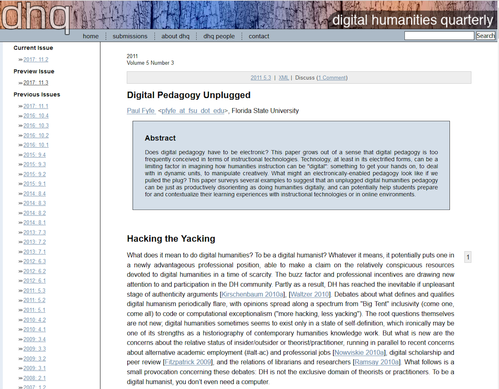
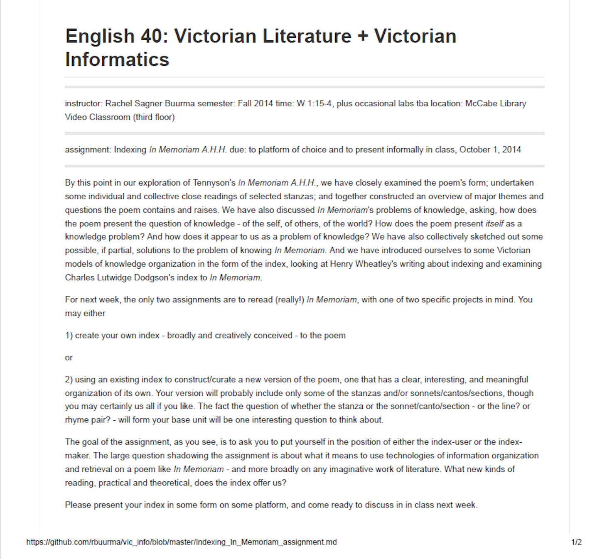
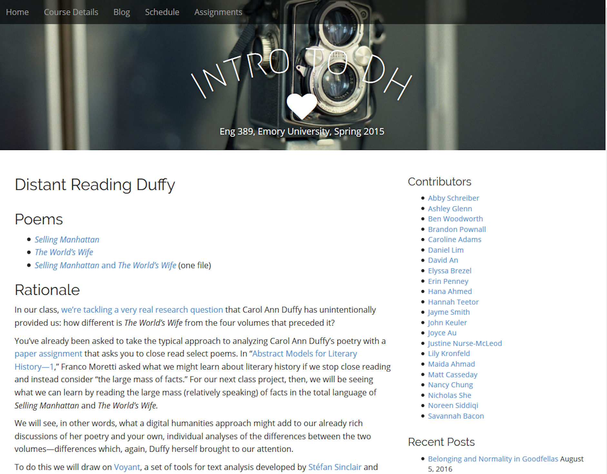
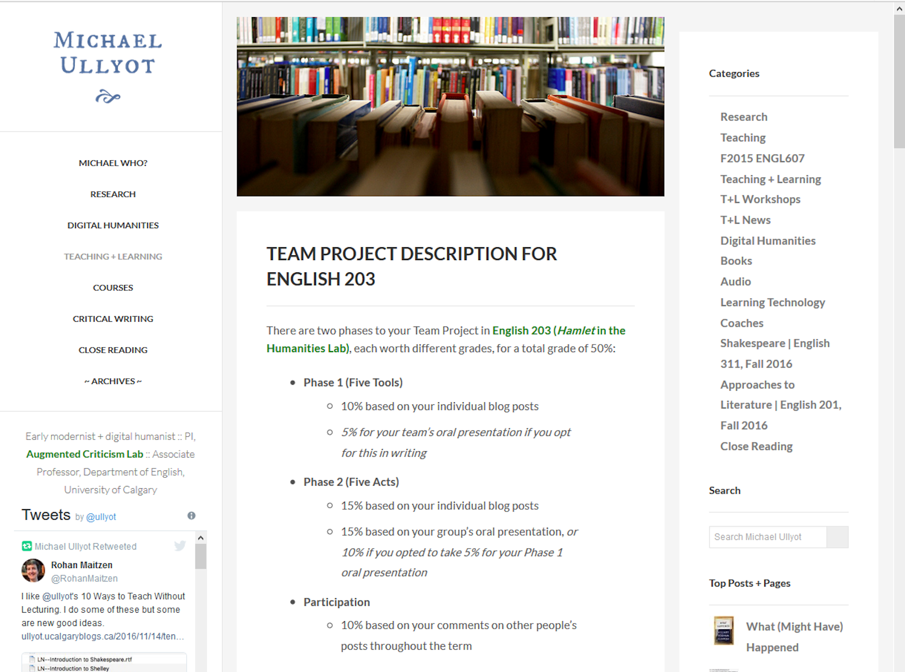
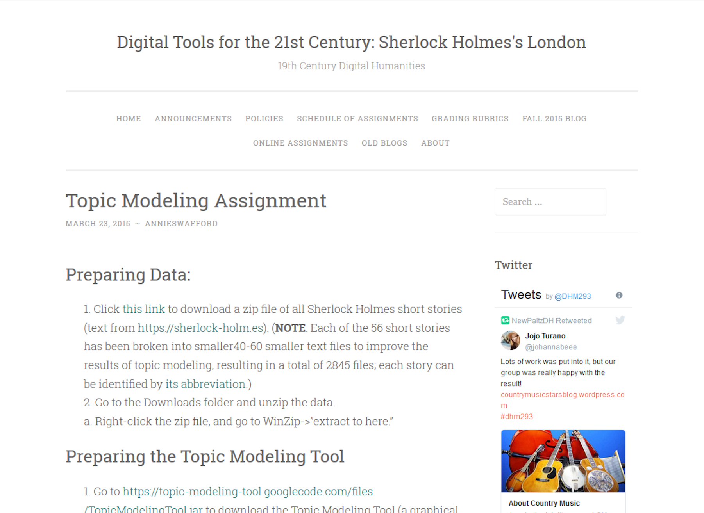
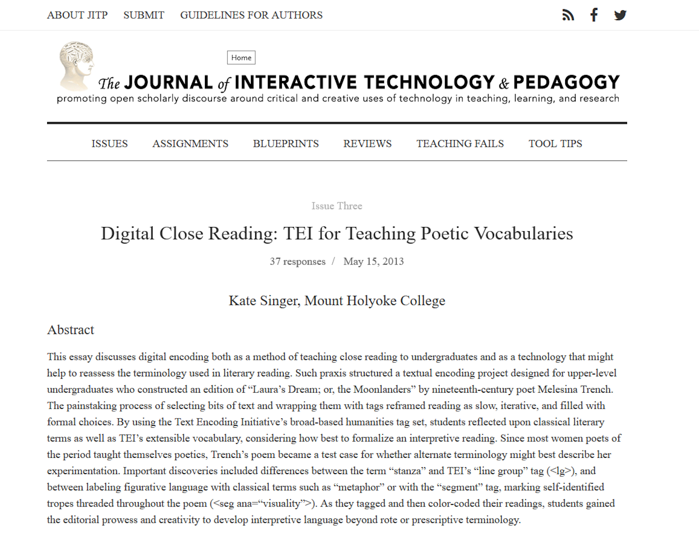
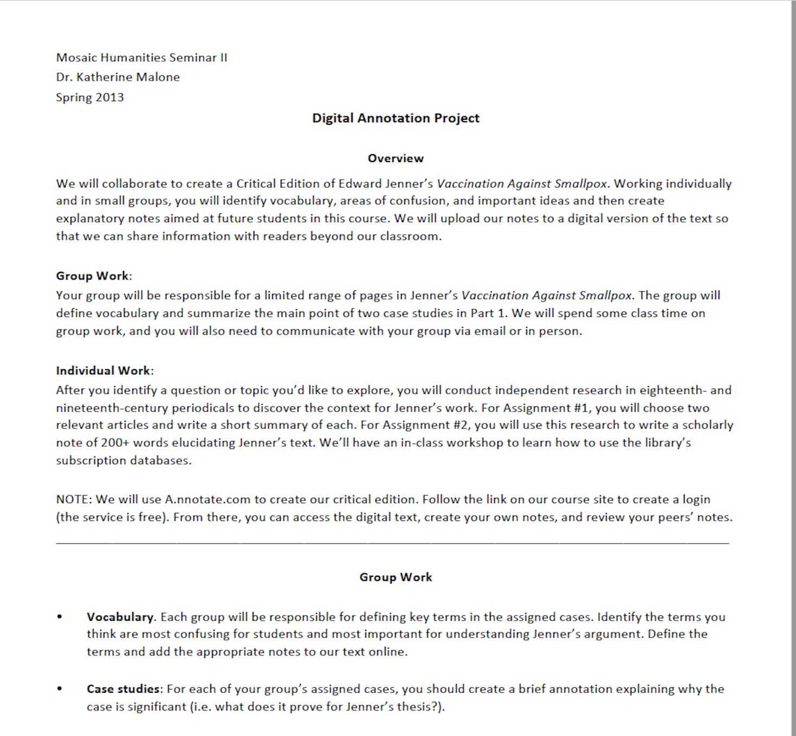
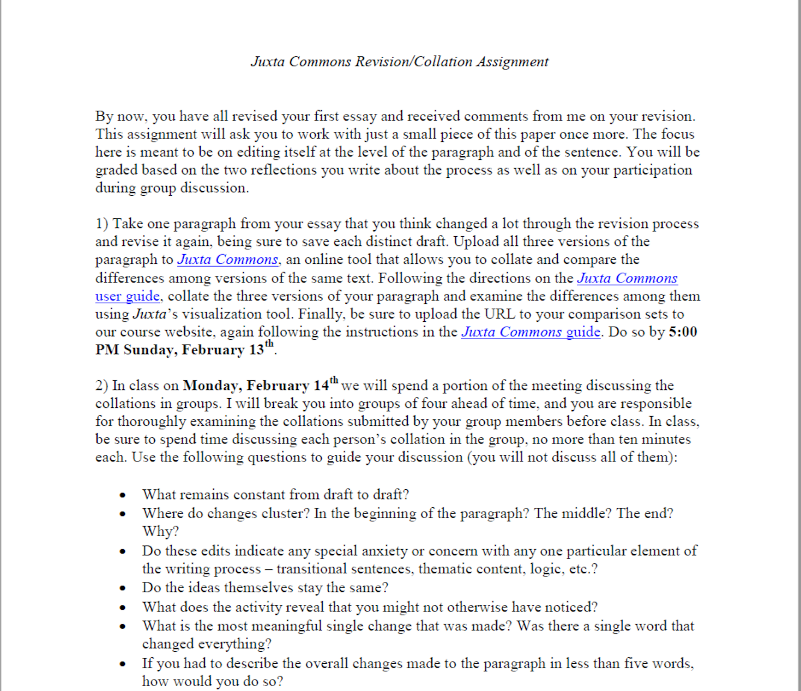
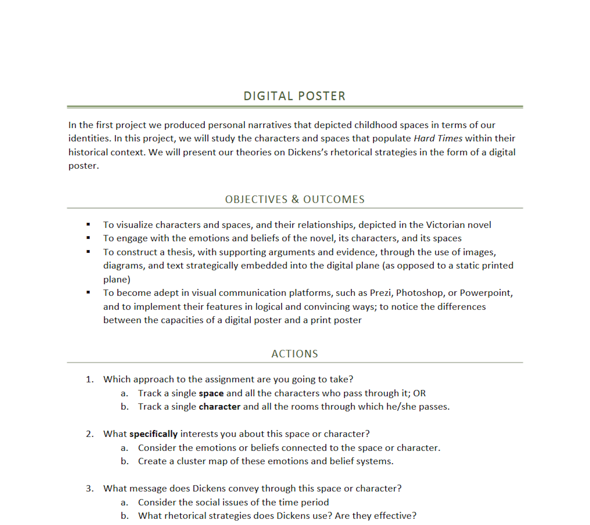
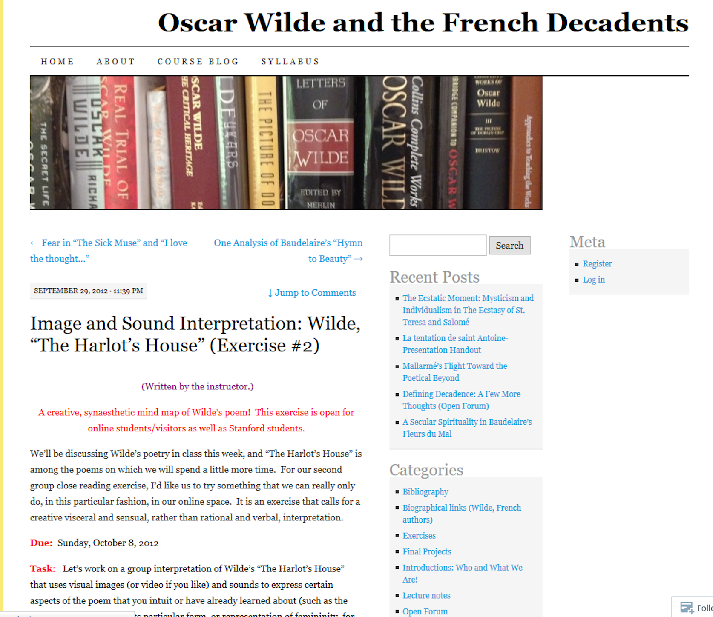

--- 
title: Digital Pedagogy in the Humanities
subtitle: Concepts, Models, and Experiments 
chapter: Text Analysis
URL: keywords/textanalysis.md
author: 
- family: Houston
  given: Natalie M.
editor: 
- family: Harris
  given: Katherine D.
publisher: Modern Language Association
type: book
---

# TEXT ANALYSIS

## Natalie M. Houston
Department of English | University of Massachusetts Lowell | [Website](http://nmhouston.com/)

---

##### Publication Status:
* unreviewed draft
* draft version undergoing editorial review
* draft version undergoing peer-to-peer review
* **draft version undergoing MLA copyediting**
* awaiting pre-print copy
* published 

---

### Cross-reference keywords: annotation, poetry, reading

---

## CURATORIAL STATEMENT

Text analysis is fundamental to humanities scholarship and teaching because readers are always already analyzing text, whether unconsciously or with intention. Readers analyze and understand aspects of a text's bibliographic and visual signification through paratextual, somatic, material, and institutional encounters with the text, long before reading a word. Readers analyze a text's linguistic codes of syntax and semantics through a variety of cultural, disciplinary, and subjective frameworks and filters. Regardless of the time period, language, or form of the text, or the questions that motivate our approach, humanists frequently: 

* select or collect texts in order to explore an hypothesis;
* look for patterns (of words, ideas, symbols, rhetorical or formal structures, etc) within an individual text and/or within sets of texts; 
* discover relationships (of development, dependence, seriality, association, intention, allusion, intertextuality, etc) between parts of texts, whole texts, or sets of texts;
* interpret the significance of these patterns, relationships, and texts; 
* develop arguments for the larger significance of these interpretations.

In humanities research, these steps are often iterative and recursive and are rarely labeled as hypothesis, data collection, experimentation, analysis, and argument. Instead, all of these things are called _reading_. This conflation of very different activities under one word has heightened recent debates between data driven approaches to large scale analysis, what Franco Moretti has termed distant reading, and the traditional formalist and hermeneutic approach called literary close reading (Moretti; Hayot). If reading is often hailed as a specific kind of pleasurable, human activity, the term _text analysis_ may seem in contrast to emphasize statistical approaches to quantifiable aspects of language (Hoover; Jockers 25). The specific disciplinary and institutional histories of computer-assisted text analysis, humanities computing, and computational linguistics variously intersect and diverge from those of literary studies more generally (Rockwell 209-212; Bonelli 14-20). 

But other scholars have argued that computational analysis merely makes explicit the codes and rules already embedded in the nature of textuality itself. Michael Witmore explains:

>I would argue that a text is a text because it is _massively addressable at different levels of scale_. Addressable here means that one can query a position within the text at a certain level of abstraction.

Such abstractions include words, characters, themes, or phrases within a particular text, but also the broader categories of form, genre, book or work. Witmore emphasizes that this is true of all texts, not merely those that have been recently digitized: "addressability as such: this is a condition rather than a technology, action, or event." Texts are, and have always been, open to multiple methods of analysis. Digitization and computational tools offer new ways to explore different levels of address:

* large scale digitization changes our access both to specific texts and to new quantities of texts;
* preparing texts to make them computationally tractable requires explicit methodological, theoretical, and hermeneutic decisions about the objects and outcomes of research;
* relational databases and full text search expand the kinds of research queries that can be pursued;
* new media forms and new interfaces transform how we understand and perform acts of reading;
* the widespread availability of computational power and storage offer new ways of curating, displaying, and using collections of texts for human or machine analysis;
* tools for data visualization and multimodal composition offer new ways of exploring texts and building arguments.

Not only might the objects of humanist study be seen as always addressable, but also its methods of analysis can be understood as already aligned with computation. Stephen Ramsay points out that "critical reading practices already contain elements of the algorithmic" because critical interpretation "relies on a heuristic of radical transformation. The critic . . . puts forth not the text, but a new text in which the data has been paraphrased, elaborated, selected, truncated, and transduced" (_Reading Machines_ 16). Digital technologies can be used to expand the scale of traditional methods (and thereby transform them) or to open entirely new modes and possibilities for text analysis. 

The artifacts presented here represent a broad spectrum of approaches to teaching text analysis, which are organized into four categories: rethinking the digital, text analysis tools and methods, textual editing as text analysis, and communicating text analysis digitally. These are assignments aimed at the undergraduate classroom, but many of them could be adapted for other levels. More specialized resources and syllabi for text analysis in courses involving programming languages can be found under Further Resources. 

### Rethinking the Digital

#### Digital Pedagogy Unplugged

* Artifact Type: article
* Source URL: http://www.digitalhumanities.org/dhq/vol/5/3/000106/000106.html
* Artifact Permissions: CC BY-NC-ND
* Copy of the Artifact: 
* Creator and Affiliation: Paul Fyfe (North Carolina State University)

Fyfe provocatively asks, "Can there be a digital pedagogy without computers?" and offers several examples of assignments that treat "the 'digital' in the non-electronic senses of that word: something to get your hands on, to deal with in dynamic units, to manipulate creatively." Rethinking digital pedagogy in this way not only allows students and instructors with varied access to electronic technologies to explore new kinds of assignments, but it also creates useful linkages between thinking about the materiality of print artifacts and that of digital texts. For example, Fyfe imagines a curatorial assignment where students gather, remix, and analyze physical artifacts rather than images on a screen. Such assignments could be scaffolded with digital assignments that use computational tools to emphasize shared methodological and theoretical principles. 

#### Indexing _In Memoriam_ Assignment

* Artifact Type: assignment
* Source URL: https://github.com/rbuurma/vic_info/blob/master/Indexing_In_Memoriam_assignment.md
* Artifact Permissions:
* Copy of the Artifact: 
* Creator and Affiliation: Rachel Sagner Buurma (Swarthmore College)

The origin of humanities computing is usually dated to 1949, when Father Roberto Busa began working with IBM computers to produce a concordance to the works of St Thomas Aquinas (Hockey). Of course, concordances and indexes long predate electronic computers, and, as Geoffrey Rockwell suggests, are premised upon hermeneutical assumptions of coherence and generative rule-bound procedures (Rockwell 211). The index is thus another example of "digital" or "hands-on" technology that expands beyond the electronic. Buurma's assignment asks students to create an index to Tennyson's _In Memoriam_ or to use an existing index to create a new edition of the poem, foregrounding how informational technologies like the index create, constrain, or complicate the interpretation of literary works.  

### Text Analysis Tools and Methods

#### Distant Reading Duffy

* Artifact Type: assignment
* Source URL: http://www.briancroxall.net/s15dh/assignments/distant-reading-duffy/
* Artifact Permissions:
* Copy of the Artifact:
* Creator and Affiliation: Brian Croxall (Brigham Young University)

This assignment in using the [Voyant](http://voyant-tools.org/) online suite of tools for text analysis foregrounds the difference between traditional close reading approaches to a small number of texts and distant reading of a larger set of texts. In presenting the assignment, Croxall emphasizes the ludic tradition in text analysis, reminding students that they are "operating here under the principle of experimentation that has guided our class" (cf. McGann and Samuels, Rockwell, and Ramsay "Hermeneutics"). This experimental attitude is important in introducing students to tools that help them see textual patterns in new ways. This assignment also asks students to contribute to the work of transcribing the texts for digital analysis. Making the labor of text preparation and cleaning evident to students demystifies the processes of text analysis and opens up conversations about textual transmission more generally. 

#### Team Project Description for English 203 (_Hamlet_ in the Humanities Lab)

* Artifact Type: assignment
* Source URL: http://ullyot.ucalgaryblogs.ca/2012/01/12/team-project-description-for-english-203/
* Artifact Permissions:
* Copy of the Artifact
* Creator and Affiliation: Michael Ullyot (University of Calgary)

This assignment sets up a two-phase group project in which students first learn one of five text analysis tools ([WordHoard](http://wordhoard.northwestern.edu/userman/index.html), [Tapor](http://www.tapor.ca/), [WordSeer](http://wordseer.berkeley.edu/), [Voyeur](http://voyant-tools.org/), and [Monk](http://monk.library.illinois.edu/)) by applying it to one scene of _Hamlet_. In the second phase, the teams are re-formed to include students with expertise in each of the five tools, and each team is assigned an act of the play to analyze. By transforming students into experts who contribute specific knowledge to the team's project, Ullyot's assignment helps them develop their skills by teaching each other. In a related [paper](http://ullyot.ucalgaryblogs.ca/2012/04/05/teaching-hamlet-in-the-humanities-lab/), Ullyot suggests that: "Openness about our own learning through algorithmic processes models this openness for our students."

#### Topic Modeling Assignment 

* Artifact Type: two part assignment
* Source URL: https://sherlockholmeslondondh.wordpress.com/2015/03/23/topic-modeling-assignment/
https://sherlockholmeslondondh.wordpress.com/2015/03/27/topic-modeling-part-2-graphing-the-results/
* Artifact Permissions:
* Copy of the Artifact
* Creator and Affiliation: Joanna Swafford (Tufts University)

As Elijah Meeks and Scott Weingart suggest in their introduction to a special issue of _Journal of Digital Humanities_, "Topic modeling could stand in as a synecdoche of digital humanities" because of its algorithmic complexity and potential obscurity. Swafford's two-part topic modeling assignment for undergraduates makes it accessible by giving a clear explanation of the several steps required to prepare textual data, import it into the graphical user interface tool for MALLET, and explore the results. This assignment requires students to try the topic modeling process with different parameters and to assess the results of their experiments. This assignment helps students learn a specific method of text analysis as well as skills in visualizing and interpreting its results in relation to the historical and literary topics of the course. 

### Textual Editing as Text Analysis

#### Digital Close Reading: TEI for Teaching Poetic Vocabularies

* Artifact Type: article
* Source URL: http://jitp.commons.gc.cuny.edu/digital-close-reading-tei-for-teaching-poetic-vocabularies/
* Artifact Permissions: CC BY-NC-SA
* Copy of the Artifact
* Creator and Affiliation: Kate Singer (Mt. Holyoke College) 

Singer's article examines the utility of the TEI (Text Encoding Initiative) XML markup protocols as a method for analyzing and describing poetic texts, focusing on her experience teaching TEI encoding to an undergraduate senior seminar. Singer presents text encoding not merely as a means to producing an end result, such as a digital edition, but as "a dynamic, hands-on method for self-conscious, unhurried reading" that encourages debates about critical interpretation. Her essay includes discussion not only of the pedagogical approach and assignments she used, but also of student papers written after completing the encoding unit. As Singer suggests, to teach methods like TEI encoding can serve two purposes, equipping students with practical project based skills as well as exposing the interpretive choices that are at the heart of textual editing and text encoding.

#### Digital Annotation Project

* Artifact Type: assignment
* Source URL: NA
* Artifact Permissions:
* Copy of the Artifact: [files/textanalysis-Malone-Annotation-Assignment.pdf](files/textanalysis-Malone-Annotation-Assignment.pdf)
* Creator and Affiliation: Katherine Malone (South Dakota State University)

This sequence of interrelated assignments guides students to work individually and in groups to create a critical edition of a text for use by future classes of their peers. Students define key terms to be annotated, research topics in digitized eighteenth- and nineteenth-century periodicals, and add research-based annotations to the text using [A.nnotate.com](http://a.nnotate.com/). Exposing students to primary research with digitized materials deepens the context for their understanding of the text. Asking students to participate in the process of annotating a text in a collaborative digital environment reveals the research and editorial decisions that lie behind any classroom text. This clearly structured assignment could be adapted for a wide variety of literary or historical texts or for use with other annotation tools.  

#### Juxta Commons Revision/Collation Assignment

* Artifact Type: assignment
* Source URL: NA
* Artifact Permissions:
* Copy of the Artifact [files/textanalysis-Walsh-Juxta-Commons-Assignment.pdf](files/textanalysis-Walsh-Juxta-Commons-Assignment.pdf)
* Creator and Affiliation: Brandon Walsh (Washington and Lee University)

Text analysis tools can be useful for the process of composition as well. In this assignment, and in a related MLA talk [published on his blog](http://walshbr.com/blog/2015/01/17/collation/), Walsh repurposes the scholarly method of collation, the comparing of multiple copies or witnesses of a text, for the teaching of writing. Walsh's assignment teaches students to use Juxta Commons, an online collation tool, to compare multiple drafts of one paragraph from their own essay in order to examine how specific changes alter the writing's focus or tone. On his blog, Walsh also describes an exercise in which students each write out a new version of a draft sentence in a shared Google Document. These assignments make visible the many different choices available to writers, encouraging students "to internalize the practice of collation and reflect on the interpretive possibilities offered by such differences." 

### Communicating Text Analysis Digitally

#### Digital Poster on _Hard Times_

* Artifact Type: assignment
* Source URL: http://www.leeannhunter.com/wp-content/uploads/2011/10/DigitalPoster.pdf
* Artifact Permissions:
* Copy of the Artifact: [files/textanalysis-Hunter-Digital-Poster.pdf](files/textanalysis-Hunter-Digital-Poster.pdf)
* Creator and Affiliation: Leeann Hunter (Washington State University)

The digital environment offers new ways for students to communicate their analytic arguments about texts. By requiring students to create a digital poster to present their arguments about Dickens's rhetorical strategies in the novel, Hunter asks them to reflect on the different affordances of the digital medium as compared with a print poster. Sequencing the poster assignment with drafts and peer review sessions encourages students to see it as a form for argument as they would traditional essays. Because the results of computational text analysis are often best presented in graphs, the digital poster assignment could be usefully combined with other text analysis assignments included in this section. 

#### Image and Sound Interpretation: Wilde, "The Harlot's House"

* Artifact Type: assignment
* Source URL: https://wildedecadents.wordpress.com/2012/09/29/image-and-sound-interpretation-wilde-the-harlots-house-exercise-2/
* Artifact Permissions:
* Copy of the Artifact
* Creator and Affiliation: Petra Dierkes-Thrun (Stanford University)

This assignment requires students to use multimedia digital technologies to communicate their analyses of a literary text in sensory and associative terms, rather than in rational, linear forms of argument. By including terms like "visceral," "sensual," and "intuit" in the assignment, Dierkes-Thrun signals that such subjective responses constitute a powerful component of text analysis. This project invokes image, video, and sound as primary modes of interpretation, rather than as supplements to a written text. Having students (and website visitors outside the class) contribute multimedia responses to a particular poem transforms the course blog into a collaborative intertextual display which can then itself become the object of further investigation and analysis. 

 

## RELATED MATERIALS

Fyfe, Paul. "How to Not Read a Victorian Novel." _Journal of Victorian Culture_ vol. 16, no. 1, Spring 2011, pp. 84-88.

Jockers, Matthew. _Text Analysis with R for Students of Literature_. Cham, Switzerland: Springer, 2014. 

Selected Syllabi for Courses Including Computational Text Analysis. [files/text-analysis-syllabi.md](files/text-analysis-syllabi.md)

Sinclair, St&eacute;fan and Geoffrey Rockwell. "Teaching Computer-Assisted Text Analysis." _Digital Humanities Pedagogy: Practices, Principles and Politics_, edited by Brett D. Hirsch, Open Book Publishers, 2012. Kindle file.

Weingart, Scott. "Topic Modeling for Humanists: A Guided Tour." _The Scottbot Irregular_. 25 July 2012. www.scottbot.net/HIAL/index.html@p=19113.html. Accessed 30 Mar. 2015.

## WORKS CITED

Bonelli, Elena Tognini. "Theoretical overview of the evolution of corpus linguistics." _The Routledge Handbook of Corpus Linguistics_. London: Routledge, 2010. 

Buurma, Rachel Sagner. "Indexing _In Memoriam_ Assignment." 13 Nov. 2014. github.com/rbuurma/vic_info/blob/master/Indexing_In_Memoriam_assignment.md. Accessed 30 Mar. 2015.

Croxall, Brian. "Distant Reading Duffy." _Intro to DH Engl 389 Emory University Spring 2015_. www.briancroxall.net/s15dh/assignments/distant-reading-duffy/. Accessed 30 Mar. 2015.

Dierkes-Thrun, Petra. "Image and Sound Interpretation: Wilde, "The Harlot's House." Course assignment. Oscar Wilde and the French Decadents. Stanford University. 29 September 2012. https://wildedecadents.wordpress.com/2012/09/29/image-and-sound-interpretation-wilde-the-harlots-house-exercise-2/. Accessed 30 Mar. 2015.   

Fyfe, Paul. "Digital Pedagogy Unplugged." _Digital Humanities Quarterly (DHQ)_ 5.3 (2011). www.digitalhumanities.org/dhq/vol/5/3/000106/000106.html. Accessed 30 Mar. 2015.

Fyfe, Paul. "How to Not Read a Victorian Novel." _Journal of Victorian Culture_ vol. 16, no. 1, Spring 2011, pp. 84-88.

Hayot, Eric. "A Hundred Flowers." _Reading Graphs, Maps, and Trees: Responses to Franco Moretti_, edited by Jonathan Goodwin and John Holbo. Parlor Press, 2011. 64-70.

Hockey, Susan. "The History of Humanities Computing." _A Companion to Digital Humanities_. Ed. Susan Schreibman, Ray Siemens, and John Unsworth. Oxford: Blackwell, 2004. Online edition. www.digitalhumanities.org/companion/. Accessed 30 March 2015.

Hoover, David L. "Textual Analysis." _Literary Studies in the Digital Age: An Evolving Anthology_. Modern Language Association. dlsanthology.mla.hcommons.org/textual-analysis/. Accessed 30 March 2015.

Hunter, Leeann. "Digital Poster." Assignment handout. Architecture and Design in Victorian Literature. Georgia Institute of Technology. Atlanta. Spring 2011. http://www.leeannhunter.com/wp-content/uploads/2011/10/DigitalPoster.pdf. Accessed 30 March 2015.    

Malone, Katherine. "Digital Annotation Project." Assignment handout. Mosaic Humanities Seminar, Temple University. Philadelphia. Spring 2013. 

Jockers, Matthew. _Macroanalysis: Digital Methods & Literary History_. Urbana: U of Illinois P, 2013. 

McGann, Jerome and Lisa Samuels. "Deformance and Interpretation." _New Literary History_ vol. 30, no. 1, Winter 1999, pp. 25-56.

Meeks, Elijah and Scott B. Weingart. "The Digital Humanities Contribution to Topic Modeling." _Journal of Digital Humanities_ vol. 2, no. 1, Winter 2012, http://journalofdigitalhumanities.org/2-1/dh-contribution-to-topic-modeling/. Accessed 30 Mar. 2015. 

Moretti, Franco. _Distant Reading_. London: Verso, 2013. 

Ramsay, Stephen. "The Hermeneutics of Screwing Around; or What You Do with a Million Books." _Pastplay: Teaching and Learning History with Technology_.  Ann Arbor, MI: U of Michigan P, 2014. 111-120. dx.doi.org/10.3998/dh.12544152.0001.001. Accessed 30 Mar. 2015.

Ramsay, Stephen. _Reading Machines: Toward an Algorithmic Criticism_. Urbana: U of Illinois P, 2011. 

Rockwell, Geoffrey. "What is Text Analysis, Really?" _Literary and Linguistic Computing_ vol. 18, no. 2, 2003, pp. 209-219. 

Singer, Kate. "Digital Close Reading: TEI for Teaching Poetic Vocabularies." _The Journal of Interactive Technology and Pedagogy_, vol. 3, 2013, jitp.commons.gc.cuny.edu/digital-close-reading-tei-for-teaching-poetic-vocabularies/. Accessed 30 Mar. 2015.

Swafford, Joanna. "Topic Modeling Assignment" _Digital Tools for the 21st Century: Sherlock Holmes's London_, 23 March 2015, sherlockholmeslondondh.wordpress.com/2015/03/23/topic-modeling-assignment/. Accessed 30 Mar. 2015. 

Swafford, Joanna. "Topic Modeling Part 2: Graphing the Results." _Digital Tools for the 21st Century: Sherlock Holmes's London_. 27 March 2015. sherlockholmeslondondh.wordpress.com/2015/03/27/topic-modeling-part-2-graphing-the-results/. Accessed 30 Mar. 2015.  

Ullyot, Michael. "Team Project Description for English 203." _Michael Ullyot_, ullyot.ucalgaryblogs.ca/2012/01/12/team-project-description-for-english-203/. Accessed 30 Mar. 2015.  

Ullyot, Michael. "Teaching _Hamlet_ in the Humanities Lab." Renaissance Society of America, 23 March 2012, _Michael Ullyot_,ullyot.ucalgaryblogs.ca/2012/04/05/teaching-hamlet-in-the-humanities-lab/. Accessed 30 Mar. 2015. 

Walsh, Brandon. "Collation and Writing Pedagogy." _Brandon Walsh_, 17 Jan. 2015, http://walshbr.com/blog/2015/01/17/collation/.  Accessed 30 Mar. 2015.

Witmore, Michael. "Text: A Massively Addressable Object." _Debates in the Digital Humanities_, edited by Matthew K. Gold, Open access edition, http://dhdebates.gc.cuny.edu/debates/text/28. Accessed 30 Mar. 2015.
