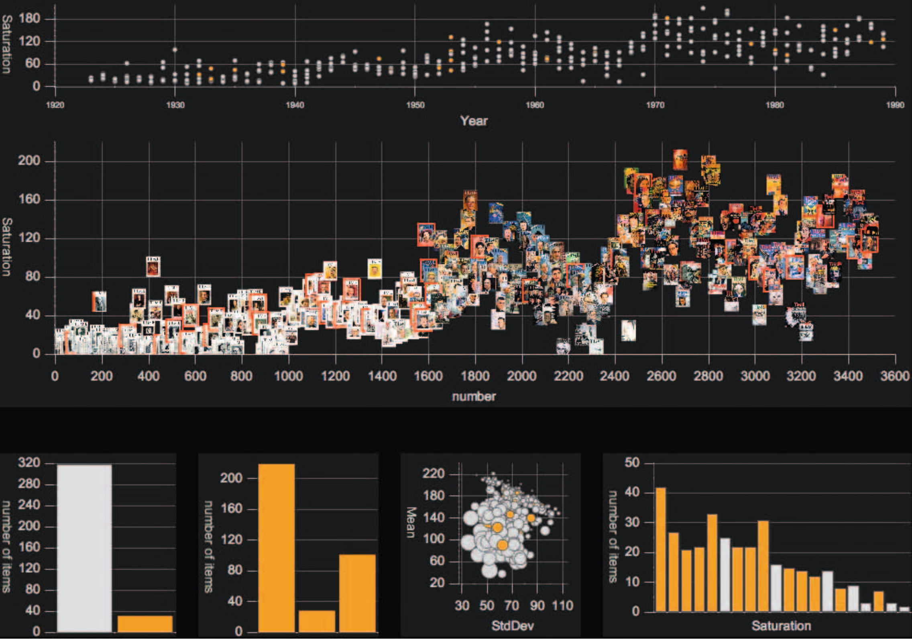
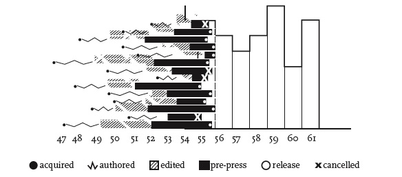
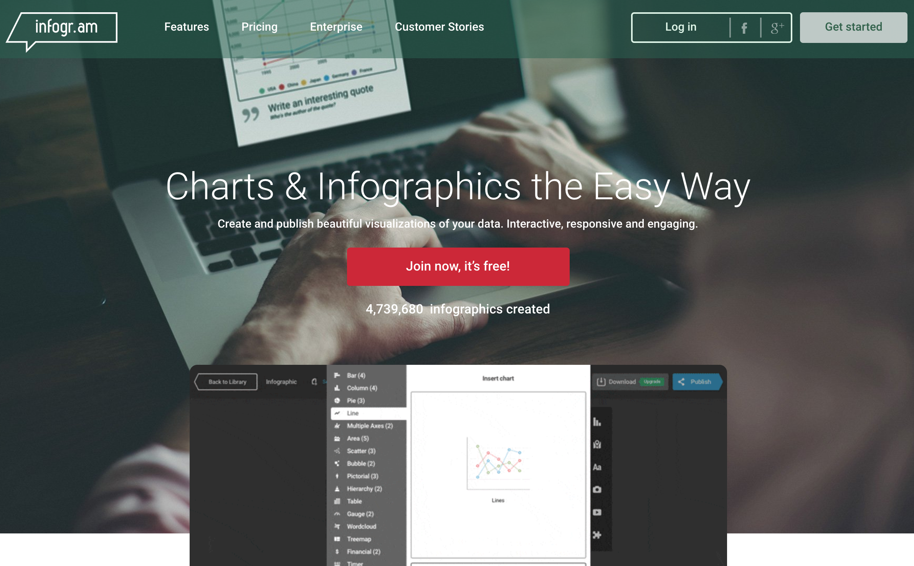
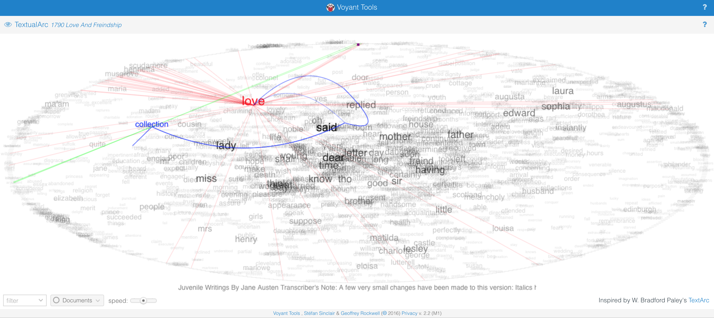
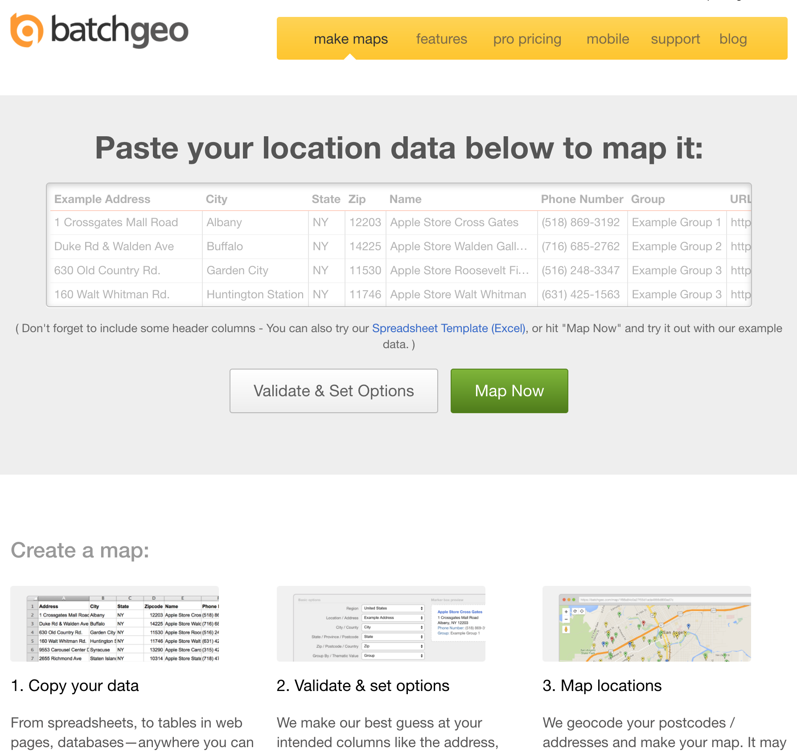

# Visualization

### Stéfan Sinclair

McGill University | [stefansinclair.name](http://stefansinclair.name)

### Geoffrey Rockwell

University of Alberta | [geoffreyrockwell.com](http://geoffreyrockwell.com) 

## CURATORIAL STATEMENT

Although for many humanities disciplines (literature, history, philosophy, etc.) text tends to be the dominant currency for apprehending and expressing knowledge, data visualizations have a long history and much to offer, particularly when the amount of text exceeds what can be reasonably read and represented by more traditional means. As is argued in two of the artifacts below (“Information Visualization for Humanities Scholars” and “Humanities Approaches to Graphical Display”), interactive visualizations can be a valuable way of interpreting evidence and sharing those interpretations. Further, sharing interactive visualizations allows other to explore evidence and come to their own conclusions.

Given the proliferation of visualizations in online media, especially for exploring big data, it has become important to teach students to treat them critically. One way to do that is to have students fiddle with different types of visualization and reflect on the graphical features and how they might reflect evidence or not. Having students then create their own visualizations is an effective way of encouraging them to leverage their humanities training in the interpretation of a variety of contemporary issues, from the environment to various social inequalities. Visualizations are an eminently shareable form of communication and students can be empowered to communicate through visualizations, sharing results via social media.

In a pedagogical context visualization can be approached with four related sets of questions:

1. **Presence**: Where do we see visualizations? What are they designed to communicate? Who is designing them and for what audience?
2. **Literacy**: How can we read visualizations? How can we be better informed and more critical consumers of visualizations? What are visualizations showing us and what are they hiding? What features are based on the evidence and what come from the designer? What are some of the common pitfalls of visualizations?
3. **Rhetoric**: How can we communicate effectively with visualizations? Can we imagine new ways of using visualization in humanistic interpretation? 
4. **Visual Traditions**: What is the history of different genres of visualization? Where do types of visualization like the bar chart come from? How do traditions of interpretation influence how visualizations are read?

The first set of questions is designed to make students aware of the variety of visualizations they encounter in everyday life from HUDs (Heads Up Displays) in a videogame to business graphics on news sites. There are lots of web sites with examples (see Related Sites for galleries), but also books with reproductions of interesting visualizations like Tufte’s *The Visual Display of Quantitative Information* (1983). 

The second and third sets of questions, how we read (literacy) and how we express (rhetoric) can be taught symbiotically. We can better understand visualizations when we’ve had the experience of creating them and in modelling visualizations we can better understand what other designers were trying to do. That’s why it's effective to design the teaching of data visualization in a cross-over pattern: emphasize theoretical work and exploration of existing data visualizations early on while ramping-up creative practice as the term progresses.

The last set of questions have to do with thinking about visualizations as humanists and asking critical questions about how they can be interpreted. Students should be encouraged to think about visualizations not as objective representations of data, but as ways of making knowledge. Thinking about visualization as a way of interpreting (in the dual sense of interpreting evidence and also creating interpretations) leads to thinking about traditions of visual knowledge production. Students should be encouraged to ask about the conventions of types of visualizations like a social network graphs and how they have been adapted. When labeled nodes are connected with lines in a network graph, what are the conventions for reading into the graph? When the network is a geneaology of emperors how do we know how to read the generations? Johanna Drucker’s *Graphesis* is a good introduction to the critical understanding of visual knowledge production. Depending on how much time is available there is an essay form of [*Graphesis* from 2010](https://journals.tdl.org/paj/index.php/paj/article/view/4/50) and a later more developed [book from 2014](http://www.hup.harvard.edu/catalog.php?isbn=9780674724938).

### Heuristics for Teaching Visualization

**Graphical Features:** An important part of learning to read and create visualizations is to understand what graphical features like colour, orientation, or location mean. For example, in a word cloud, does the colour of words mean something about the text or is it an aesthetic selection of the programmer? One can start a workshop by showing simple visualizations and asking students to identify the features used and then guess at how the visualization uses them to show meaning. This can lead to a discussion of what one could do with graphical features and what graphical features are best suited for representing what types of evidence. See Bertin’s *Semiology of Graphics* (2010) for an influential discussion of the types of variables from size, position, colour, shape, orientation and texture.

**Progression:** One way to teach a practice based stream where students use visualizations is to progress from using relatively simple tools (like [Infogr.am](https://infogr.am/) and [Voyant](https://voyant-tools.org) to adapting the data, code and styling of [D3 visualizations](https://d3js.org/), using [RAW](http://raw.densitydesign.org/) as a bridge. 

**Questions:** Some questions that provide a context for discussion include:

* Can a visualization stand alone or does it need a text to contextualize it? 
* How is text graphical? How is an outline or a list a visualization?
* What does interactivity add? How is a serious game a visualization?
* Does a visualization have to be beautiful to communicate?
* Do visualizations represent a truth about some phenomenon or do they model something?
* What is it difficult to show with a visualization? How can visualizations mislead readers?

## CURATED ARTIFACTS 

The curated artifacts below are grouped into two categories:

1. *Concepts & Foundations*: these are resources that provide a theoretical and historical grounding for visualization, particularly in a humanistic context.
1. *Tools for Creating Visualizations*: these are user-friendly web-based tools that facilitate experimentation with visualizing data.

The sequential organization of artefacts into these two categories should not discourage liberal interweaving of them, where concepts are introduced and reinforced through experimentation with the tools. Proficiency with visualization — as consumers or as creators — is best accomplished through a symbiosis of theory and practice.

### Concepts & Foundations

#### “What is Visualization?”

* Artifact Type: Open access online journal article
* Source: [https://publishup.uni-potsdam.de/opus4-ubp/files/5047/digarec06_S116_156.pdf](https://publishup.uni-potsdam.de/opus4-ubp/files/5047/digarec06_S116_156.pdf)
* Creator and Affiliation: Lev Manovich (CUNY)

This article provides a useful on-ramp for defining some aspects of information visualization, or *infovis* as it is commonly abbreviated. Manovich situates infovis in relation to other fields such as scientific visualization and information design, while also recognizing that the distinctions are sometimes fuzzy. Two core principles of information visualization are discussed in more depth: 1) *reduction* (ignoring details of individual items in favour of representing patterns from a subset of characteristics); and 2) *spaciality* (using variables such as position, size, shape, and movement). Manovich argues that the explosive development of computer graphics during the past two decades has enabled visualization without reduction, or what he calls “direct” or “media” visualization: items individual items are represented in some recognizable form instead of abstract representations like dots on a graph.

This article helpfully compiles several well-known and rather sophisticated visualizations that use data from various domains. While the examples may be inspiring they may also be intimidating. A useful preliminary exercise is to ask students to begin considering how their objects of study (digital texts, musical scores, collection of images, etc.) might produce data: what can be counted, compared, associated and otherwise represented? Students can then be asked to navigate through several galleries of visualizations (see “Related Materials”) and identify 5 examples of visualizations that might fit their data (without worrying for now about the practicalities of actually producing or representing the data).
 
#### “Humanities Approaches to Graphical Display”

* Artifact Type: Open access online journal article
* Source: [http://www.digitalhumanities.org/dhq/vol/5/1/000091/000091.html](http://www.digitalhumanities.org/dhq/vol/5/1/000091/000091.html)
* Creator and Affiliation: Johanna Drucker (UCLA)

Johanna Drucker’s article is an excellent way of framing epistemological issues of visualization in the humanities. She urges us to rethink the notion of *data* as what is given and instead think of *capta* as what is taken and constructed. Drucker argues that this move will lead us to forms of graphical expression that are more nuanced and truer to humanistic perspectives on knowledge. By providing examples of how to reconceptualize visualizations such as bar charts, timelines, and maps, Drucker shows how every aspect of visualization is subject to interpretation, even though most visualizations mask the uncertainty and the decision-making processes.

In discussing this article it may be useful to provide some philosophical context for subjectivity and epistemology. While wanting to avoid an over-simplified binary, Drucker does distinguish between empirical *sciences* and interpretive *humanities*: it is well worth having students explore how they understand these two cultures of knowledge (see Snow).

Drucker's article is effective in pointing out two important moments in working with visualizations, each of which can have an associated exercise:

1. *Gathering Data/Capta*: we make choices (consciously or not) about what data are gathered and how they are expressed as values. Students might be asked to gather (or even invent) data about some aspect of student life (such as the frequency of weekly visits to coffee shops by various measures like academic major), noting some of the choices and nuances along the way.
1. *Representation*: choices are made about how to represent data. Students might be asked to create a couple of hand-drawn sketches, a first one that is more conventional (such as a simple bar chart) and a second one that expresses more of the nuance and subjectivity of the data.

#### “Information Visualization for Humanities Scholars”

* Artifact Type: Open access online journal article
* Source URL: [https://dlsanthology.commons.mla.org/information-visualization-for-humanities-scholars/](https://dlsanthology.commons.mla.org/information-visualization-for-humanities-scholars/)
* Creator and Affiliation: Stéfan Sinclair, Stan Ruecker, and Milena Radzikowska

This article explores information visualization for the specific purposes of humanities scholarship. Given that the humanities value original and persuasive arguments, the value of individual visualizations can be assessed by determining how well they promote the proliferation of perspectives. This is partly why interactive interfaces can be so enriching for humanities scholarship: they’re conducive to exploration and co-creation. Based largely on the authors’ visualization prototyping work, the article reviews a range of visualization archetypes including 1) Browsing by Grouping; 2) Revealing Features; Time and Space; Typographic Form; and Interactive Glyphs.

A core argument of the article is that interactive visualizations can be more conducive to humanistic exploration and argumentation than static visualizations. Students can be asked to consider that argument in the context of different phases of scholarship, from initial research  through to analysis and synthesis that lead to conference presentations and publications in different media. How well do current modes of humanities scholarship support visualization?

#### “The Ethics of Visualization”

* Artifact Type: Video
* Source URL: [https://www.youtube.com/watch?v=tL7amXznq4A](https://www.youtube.com/watch?v=tL7amXznq4A)
* Creator and Affiliation: Chris Alen Sula

This is a video of a talk given by Chris Alen Sula that starts with a brief but useful history of visualization.  He makes the point that ethics aren’t often addressed in discussions of visualization, especially in the academic context. Sula proposes that useful groundwork for an ethics of visualization can be provided by 1) speech act theory, 2) role-based morality, and most powerfully 3) general ethics frameworks. The talk unpacks each of these and provides several useful perspectives for thinking about the ethics of visualization, particularly in the context of the Digital Humanities.

Sula's video provides a welcome (and relatively rare) reminder of ethical dimensions to visualization work, for the digital humanities and beyond. A productive exercise is to have students watch the video in advance and then to form into small groups to compare notes about ethical issues raised by Sula. Students might be asked to further reflect on who bears ethical responsibility, from creators to sonsumers of visualizations. Why are such questions important for a visually-oriented digital society?

#### “Visualizing Information for Advocacy”

* Artifact Type: Open access book
* Source: [http://visualisingadvocacy.org/getbook](http://visualisingadvocacy.org/getbook)
* Creators: Maya Indira Ganesh, Stephanie Hankey, Tom Longley and Marek Tuszynski

This freely available [open access book](http://visualisingadvocacy.org/getbook) focuses on the potential of visualization for advocacy and intervention through well-planned projects (and it builds nicely on the previous artefact on ethics and visualization). In particular, the book discusses visual rhetoric and — based on several case studies — guides the reader through the stages of a project from getting an idea and constructing a dataset to developing a visualization and disseminating it. Though the book may not place as much emphasis on interpretation as Drucker's article, it does insist on creativity, rhetoric, and audiences. It also bridges visual information design and activism in ways that will resonate with anyone interested in the public humanities.

The book has a rich companion website that provides a wide range of resources from guidance on [working with data](http://visualisingadvocacy.org/working-data) to a list of [visualization tools](http://visualisingadvocacy.org/resources/visualisationtools).

The book's final chapter is entitled "Putting it into Practice" and provides a framework that students can use as they imagine and plan a hypothetical advocacy campaign with visualization. In particular, students are asked to answer the following questions, though it is important to emphasize the purpose of trying to answer the questions rather than getting bogged down by practical considerations:

1. What is the aim?
1. What is the benchmark you are trying to reach?
1. Who will get you there?
1. How are you going to do it?
1. How will you implement the visual campaign?

#### “Studies in Communication and Culture: Data”

* Artifact Type: Course syllabus
* Source URL: [http://lkleincourses.lmc.gatech.edu/data13/schedule/](http://lkleincourses.lmc.gatech.edu/data13/schedule/)
* Creator and Affiliation: Lauren Klein (Georgia Tech)

Though not solely on visualization, Lauren Klein’s syllabus touches on a many essential topics related to uses of data in the digital humanities. Several topics explore the relationship between facts and data, there’s an overview of major kinds of visualization, and she addresses cultural and social issues that arise from data (from art to surveillance). Elsewhere Klein has also explored the way the history of visualization has been presented and possible alternative histories (see for instance her [talk to the 3DH project](https://lecture2go.uni-hamburg.de/l2go/-/get/v/19629) where she examines the [Speculative Designs project](http://dhlab.lmc.gatech.edu/speculative-designs/) which is recovering the work of Elizabeth Peabody).

Interspersed with the academic readings of the syllabus are several excerpts of fiction, such as *Minority Report*, *The Matrix*, and *Gattaca*. Students might be asked to reflect, with specific examples, on how data visualization depicted in popular culture might influence how we consider visualization for research and teaching in the humanities.

### Tools for Creating Visualizations

#### “Infogr.am”

* Artifact Type: Web application
* Source URL: [https://infogr.am/](https://infogr.am/)
* Creator and Affiliation: Infogr.am

Infogr.am is a web-based application that makes it relatively easy to experiment with creating interactive charts and infographics that can be published or embedded in another web page. There are over 35 chart types, including the usual suspects (bar, line, pie, scatter, bubble, wordcloud, treemap, candlestick, etc.). Not in particular the pictorial charts for infographics. There’s also powerful mapping functionality that geocodes named locations (a place like “Montreal” is converted to latitude and longitude coordinates).

Infographics can be introduced by discussing the rhetorical style of [“The Humanities Matter!” infographic](http://4humanities.org/2013/07/the-humanities-matter-infographic/), followed by asking students to experiment with storytelling in Infogr.am using several different charts and maps, on a topic of their choice. The free version of Infogr.am is usually sufficient for the purposes of creating simple infographics.

#### “RAW”

* Artifact Type: Web application
* Source URL: [http://raw.densitydesign.org/](http://raw.densitydesign.org/)
* Creator and Affiliation: DensityDesign Lab (Giorgio Caviglia, Giorgio Uboldi, Matteo Azzi, Michele Mauri)

RAW says in its tagline that it is “The missing link between spreadsheets and vector graphics”. It may not be the only missing link out there, but it certainly is powerful and user-friendly. Students can choose from one of the sample datasets (cars, movies, music, cocktails), or copy and paste data from their own spreadsheet. Next students can choose from one of 16 interesting chart types and customize which data column should be used for structure, colour, size and other chart dimensions.

RAW provides ample opportunity for students to think about the nature and format of different datasets, the rhetorical baggage of different genres of visualization, and how different visualizations with different options can show the same data very differently. RAW is also an excellent on-ramp for [web-based D3 visualizations](https://d3js.org/).

#### “Voyant Tools”

* Artifact Type: Web application
* Source URL: [https://voyant-tools.org](https://voyant-tools.org)
* Creator and Affiliation: Stéfan Sinclair & Geoffrey Rockwell

Voyant Tools is a web-based text analysis and visualization environment. One of its strengths is in moving quickly from one or more text documents to a wide variety of tools and visualizations for interpretation. Some of the visualizations are more common (like the [Cirrus](https://voyant-tools.org/docs/#!/guide/cirrus) word cloud or the [Trends](https://voyant-tools.org/docs/#!/guide/trends) line chart of terms) while others are more unusual and playful (like [Knots](http://voyant-tools.org/docs/#!/guide/knots) or [TextualArc](https://voyant-tools.org/docs/#!/guide/textualarc) inspired by the classic [TextArc](https://textarc.org/) by Bradford Paley).

Voyant Tools can suggest ways of visualizing data when you start with unstructured text (i.e. not tabular data). Students can be asked to skim through the [full list of tools](https://voyant-tools.org/docs/#!/guide/tools) and then to explore Voyant with a corpus of their own essays to see if they can discover unsuspected characteristics of their writing.  It also can be used to show how different visualizations can interact in different views that combine tools. Finally, Voyant can export interactive panels that can then be embedded in online essays if you want students to use visualizations in the context of a essay. Examples can be found in [*Hermeneutica* (2016)](http://hermeneuti.ca). 

#### BatchGeo

* Artifact Type: Web application
* Source URL: [https://batchgeo.com/](https://batchgeo.com/)

BatchGeo is a user-friendly and free resource for experimenting with mapping geographical data. The user can add tabular data (by uploading a spreadsheet or pasting rows into a box), define relevant columns and generate an interactive map. One of the more useful features of BatchGeo is that it tries to automatically resolve addresses and locations to geographical coordinates (though it’s worth pointing out the limitations of such automation and the potential for ambiguity and errors). Generated maps can be shared by URL and embedded in web pages. Students could be encouraged to look for local sources of [open data](https://en.wikipedia.org/wiki/Open_data) or search through one of many dataset portals such as [Datahub](https://datahub.io/).

## RELATED MATERIALS

Below is a list of visualization galleries. Having students travel through the galleries is a good way of familiarizing them with the variety of data visualizations out there (even if the vast majority have little to do with humanities scholarship). Students can be asked to compile an annotated set of their favourites, which can often be a source of inspiration for their own work.

* [Milestones in the History of Thematic Cartography, Statistical Graphics and Data Visualization](http://www.datavis.ca/milestones/)
* [Datavisualization.ch](http://selection.datavisualization.ch/)
* [D3 Gallery](https://github.com/d3/d3/wiki/Gallery)
* [Information Aesthetics](http://infosthetics.com/)
* [Information is Beautiful](http://www.informationisbeautiful.net/)
* [Visual Complexity](http://www.visualcomplexity.com/vc/)

## WORKS CITED

Bertin, J. (2010). Semiology of Graphics: Diagrams, Networks, Maps. [Reprint from Esri Press](http://www.esri.com/news/releases/10_4qtr/bertin.html).

Drucker, J. (2010). “Graphesis: Visual Knowledge Production and Representation.” Poetess Archive Journal. 2:1. [PDF Available](https://journals.tdl.org/paj/index.php/paj/article/view/4/50). 

Drucker, J. (2014). “Graphesis: Visual Forms of Knowledge Production.” [Harvard University Press](http://www.hup.harvard.edu/catalog.php?isbn=9780674724938). 

Manovich, L. (2001). "What is Visualization." Diagrec Series. 6. [PDF Available](https://publishup.uni-potsdam.de/opus4-ubp/frontdoor/deliver/index/docId/5047/file/digarec06_S116_156.pdf).

Rockwell, G. and S. Sinclair (2016). *Hermeneutica: Computer-Assisted Interpretation in the Humanities*. MIT Press. [See also *Hermeneutica* web site.](http://hermeneuti.ca)

Tufte, E. (1983). The Visual Display of Quantitative Information. Cheshire, CT, Graphics Press. [See also Tufte’s web site.](https://www.edwardtufte.com/tufte/)
